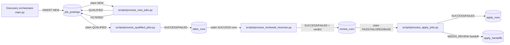

# Architecture

## System architecture overview

The system is a staged, SQLite-backed automation pipeline:
1) discovery ingests jobs from Greenhouse, Workday/Apify, and JobSpy boards;
2) gate worker classifies NEW rows into QUALIFIED or FILTERED;
3) tailor worker generates one-page tailored resumes for QUALIFIED rows;
4) review worker evaluates tailored outputs vs base resume artifacts;
5) apply worker runs browser automation and records human-review handoffs by default (`main.py:524-656`, `scripts/process_new_jobs.py:231-344`, `scripts/process_qualified_jobs.py:360-499`, `scripts/process_reviewed_resumes.py:432-619`, `scripts/process_apply_jobs.py:368-569`).



Core table relationships and constraints are defined in schema SQL and apply-stage migrations (`src/database/schema.sql:98-225`, `src/database/db_manager.py:1745-1835`).

## Runtime boundaries and responsibilities

### Discovery boundary (producer)
- Loads YAML configs, builds source-specific fetch loops, deduplicates, inserts new rows, and updates crawl/daily metrics (`main.py:545-656`).
- Source adapters normalize into `JobPosting` before persistence (`src/fetchers/base_fetcher.py:27-53`, `src/fetchers/greenhouse_fetcher.py:133-177`, `src/fetchers/apify_fetcher.py:163-194`, `src/fetchers/jobspy_fetcher.py:185-254`).

### Worker boundaries (consumers)
- **Gate**: ADK-based apply/skip decision, retry/backoff, terminal failure notification (`scripts/process_new_jobs.py:231-344`, `scripts/process_new_jobs.py:152-205`).
- **Tailor**: claims QUALIFIED jobs, copies canonical YAML to per-run work file, executes pi-driven one-page pipeline, tracks retry/backoff (`scripts/process_qualified_jobs.py:418-444`, `scripts/process_qualified_jobs.py:465-499`).
- **Review**: claims successful tailor runs, ensures base references, executes review runtime with strict report handshake (`scripts/process_reviewed_resumes.py:306-353`, `scripts/process_reviewed_resumes.py:530-619`).
- **Apply**: claims review-success jobs, runs Playwright CDP flow, persists confidence and unresolved-fields diagnostics (`scripts/process_apply_jobs.py:397-569`, `src/agents/apply_worker/browser.py:108-348`).

## Key design patterns

1. **Atomic DB claims for concurrency safety**
   - Queue claims use `BEGIN IMMEDIATE` + insert/update claim tokens to prevent duplicate processing across workers (`src/database/db_manager.py:403-443`, `src/database/db_manager.py:1077-1156`, `src/database/db_manager.py:1461-1541`, `src/database/db_manager.py:1893-1979`).

2. **Lease + stale-run recovery**
   - Each stage marks stale PENDING rows as FAILED on startup to recover from crashes (`src/database/db_manager.py:1244-1277`, `src/database/db_manager.py:1665-1697`, `src/database/db_manager.py:2262-2294`; invoked in workers at `scripts/process_qualified_jobs.py:660-668`, `scripts/process_reviewed_resumes.py:769-777`, `scripts/process_apply_jobs.py:686-694`).

3. **Schema-first execution contracts**
   - Agent invocations and outputs are strongly typed with Pydantic for deterministic persistence and testing (`src/agents/root_apply_decider/schemas.py:11-49`, `src/agents/resume_tailor_pi/schemas.py:438-534`, `src/agents/resume_review_pi/schemas.py:225-331`, `src/agents/apply_worker/schemas.py:173-208`).

4. **Tool-driven model interaction**
   - Tailor/review subprocess prompts route through deterministic CLI tool wrappers with explicit command inventory and JSON output (`scripts/resume_tailor_tools.py:97-171`, `scripts/resume_tailor_tools.py:174-247`, `scripts/resume_review_tools.py:129-237`, `scripts/resume_review_tools.py:240-344`).

## Deployment architecture (homeserver)

```mermaid
graph TB
    Timer[job-discovery.timer] --> DiscoverSvc[job-discovery.service]
    DiscoverSvc --> DB[(SQLite jobs.db)]

    AgentSvc[job-agent-worker.service] --> DB
    TailorSvc[job-tailor-worker.service] --> DB
    ReviewSvc[job-review-worker.service] --> DB

    ChromeSvc[job-apply-chrome.service] --> ApplySvc[job-apply-worker.service]
    ApplySvc --> DB

    AlertSvc[job-agent-alert@.service] --> Ntfy[ntfy endpoint]
```

Systemd unit topology and requirements are documented in deploy manifests (`deploy/job-discovery.timer:1-14`, `deploy/job-discovery.service:1-33`, `deploy/job-agent-worker.service:1-35`, `deploy/job-tailor-worker.service:1-37`, `deploy/job-review-worker.service:1-37`, `deploy/job-apply-chrome.service:1-33`, `deploy/job-apply-worker.service:1-38`, `deploy/job-agent-alert@.service:1-16`).
