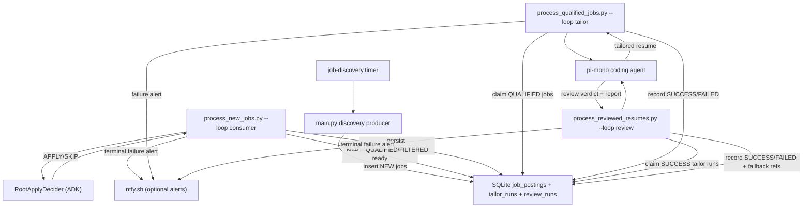

# Architecture

## Overview
The runtime is a producer/consumer pipeline on a shared SQLite queue:
- `main.py` (producer) discovers jobs and inserts rows with `status='NEW'`.
- `scripts/process_new_jobs.py` (consumer) drains NEW backlog, calls the root gate agent, and persists `QUALIFIED`/`FILTERED` decisions.
- Retry metadata (`agent_retry_count`, `agent_next_retry_at`) allows bounded retries before terminal failure (`agent_failed_at`), with optional ntfy alerts.
- `scripts/process_qualified_jobs.py` runs autonomous tailoring for QUALIFIED jobs and stores artifact metadata in `tailor_runs`.
- `scripts/process_reviewed_resumes.py` runs autonomous post-tailor review and stores verdict/diagnostics in `review_runs`.

## Discovery Side
- `main.py` loads `companies.yaml` and optional `search_criteria.yaml` + `candidate_profile.yaml`, resolves default board search terms, fetches Greenhouse/Workday/JobSpy jobs, deduplicates, and inserts into SQLite.
- Job board terms are now config-driven with fallback defaults derived from profile/search config rather than hardcoded senior-role terms.

## Queue + Persistence
- `src/database/schema.sql` defines queue and stats tables and now includes retry columns:
  - `agent_retry_count`
  - `agent_next_retry_at`
- `DatabaseManager` owns:
  - queue selection (`get_jobs_pending_agent_processing`)
  - success persistence (`record_agent_decision`)
  - transient retry persistence (`record_agent_retry`)
  - terminal failure marking (`mark_job_agent_terminal_failed`)
  - manual requeue support (`reset_agent_failure_state`)

## Gate Worker
- `scripts/process_new_jobs.py`:
  - processes full pending backlog (bounded by per-cycle `--limit`)
  - retries per job using configurable backoff
  - marks terminal failure after max retries
  - sends optional ntfy alerts for terminal failures and startup config failures
- `scripts/run_pipeline_once.py` provides a one-shot orchestrator (`discovery -> one gate batch`) for operations and testing.

## Resume Tailor Worker (Autonomous)
- `scripts/process_qualified_jobs.py` is the autonomous tailor worker daemon.
- Claims QUALIFIED jobs from SQLite via atomic `BEGIN IMMEDIATE` transactions with claim tokens.
- State tracked in a separate `tailor_runs` table (PENDING -> SUCCESS/FAILED) with retry backoff.
- Invokes `run_resume_tailor_pipeline` from `src/agents/resume_tailor_pi/` for each claimed job.
- Copies `config/resume_content.yaml` into a per-run YAML work file and never mutates the canonical baseline.
- Preflight checks validate `pi` command, `latexmk`, and database path before entering the loop.
- Generated artifacts land in `data/tailored_resumes/<job_hash>/resume_tailored.{tex,pdf}` plus `resume_content_work.yaml`.
- Supports both `--once` (one-shot) and `--loop` (persistent daemon) modes.
- Environment knobs: `TAILOR_POLL_INTERVAL_SECONDS`, `TAILOR_MAX_RETRIES`, `TAILOR_RETRY_BACKOFF_SECONDS`, `TAILOR_RETRY_BACKOFF_MULTIPLIER`, `TAILOR_CLAIM_LEASE_SECONDS`, `TAILOR_OUTPUT_DIR`.

## Resume Review Worker (Autonomous)
- `scripts/process_reviewed_resumes.py` is the autonomous review worker daemon.
- Claims successful tailor runs via atomic `BEGIN IMMEDIATE` transactions and tracks attempts in `review_runs`.
- Invokes `run_resume_review_pipeline` from `src/agents/resume_review_pi/` for each claimed run.
- Runtime is hard-error only (timeout/crash/missing-report/invalid-schema/missing-selected-artifacts); verdict quality judgment is agent-authored.
- Persists agent diagnostics (`agent_stdout`, `agent_stderr`) and base fallback refs on hard runtime failures.
- Uses base reference artifacts (`resume_base.{tex,pdf}`) generated from `config/resume_content.yaml` for compare-to-base checks.
- Supports `--once` and `--loop` modes with retry backoff.
- Environment knobs: `REVIEW_POLL_INTERVAL_SECONDS`, `REVIEW_MAX_RETRIES`, `REVIEW_RETRY_BACKOFF_SECONDS`, `REVIEW_RETRY_BACKOFF_MULTIPLIER`, `REVIEW_CLAIM_LEASE_SECONDS`, `REVIEW_OUTPUT_DIR`.

## Resume Tailor Pipeline (Pi-Mono)
- Canonical source of truth is `config/resume_content.yaml`; generated `.tex` is an artifact.
- Tools-first command surface lives in `scripts/resume_tailor_tools.py`:
  - `db-get-job-context`
  - `load-resume-yaml` / `save-resume-yaml`
  - `render-resume-tex`
  - `compile-resume`
  - `get-page-count`
- Runtime loop in `src/agents/resume_tailor_pi/runtime.py`:
  - initial content pass
  - exactly two content readjust retries on overflow
  - bounded balanced layout compression fallback
  - explicit failure if output still exceeds one page
- Optional per-run branch isolation is supported through `--create-git-branch`.

## Prompt/Profile
- Gate prompt candidate context is config-backed:
  - primary source: `config/candidate_profile.yaml`
  - optional override: `CANDIDATE_PROFILE_PATH`
  - fallback: built-in context string in prompts module
- Gate parser no longer uses plain-text decision fallback; APPLY/SKIP must be recovered from structured JSON.

## Deployment Topology
- `deploy/job-discovery.timer` + `deploy/job-discovery.service` for periodic producer runs.
- `deploy/job-agent-worker.service` for continuous gate queue draining.
- `deploy/job-tailor-worker.service` for continuous tailor queue draining (persistent daemon, `Restart=always`, 30s backoff). Requires pi-mono and latexmk.
- `deploy/job-review-worker.service` for continuous review queue draining (persistent daemon, `Restart=always`, 30s backoff). Requires pi-mono, latexmk, and poppler CLIs.
- Optional `deploy/job-agent-alert@.service` as a systemd `OnFailure` hook.
