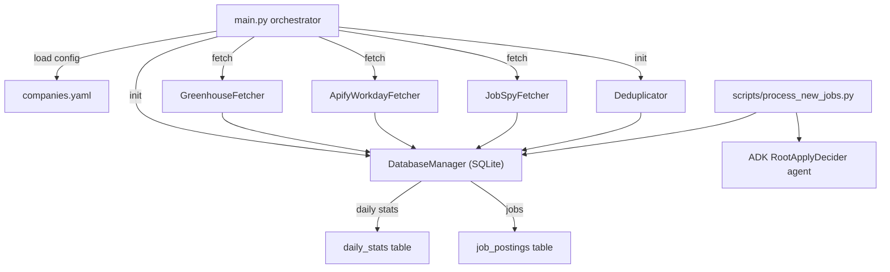

# Architecture

## Overview
The system is a Python async pipeline that pulls jobs from multiple sources (Greenhouse HTTP API, Workday via Apify actor, JobSpy scrape), deduplicates them, stores into SQLite, logs crawl/daily stats, and optionally hands NEW jobs to an ADK agent for apply/skip decisions.

## Orchestrator
- `main.py` loads YAML config, initializes DB and deduplicator, iterates Greenhouse, Workday (Apify), and JobSpy sources, inserts new jobs, logs crawl history, updates daily stats, and summarizes cycle metrics [main.py:24-168](main.py:24-168).
- Logging configured via `setup_logger`; cycle/crawl summaries written with loguru [main.py:12-22](main.py:12-22) [src/utils/logger.py:9-91](src/utils/logger.py:9-91).

## Data Layer
- SQLite schema: job_postings (with status/agent fields), crawl_history, daily_stats [src/database/schema.sql:1-89](src/database/schema.sql:1-89).
- `DatabaseManager` handles connection (WAL, busy_timeout), schema creation, dedup-safe inserts, crawl logging, daily stats upsert, agent result persistence, and counts [src/database/db_manager.py:14-205](src/database/db_manager.py:14-205).

## Fetch Layer
- `BaseFetcher` defines async fetch interface and source naming contract [src/fetchers/base_fetcher.py:1-32](src/fetchers/base_fetcher.py:1-32).
- `GreenhouseFetcher` pulls jobs via public API with description HTML cleaning and salary parsing [src/fetchers/greenhouse_fetcher.py:1-120](src/fetchers/greenhouse_fetcher.py:1-120).
- `ApifyWorkdayFetcher` runs the Apify Workday actor, fetches dataset items, and maps them to JobPosting [src/fetchers/apify_fetcher.py:1-110](src/fetchers/apify_fetcher.py:1-110).
- `JobSpyFetcher` scrapes boards via jobspy, cleans/normalizes data (salary to annual cents) into JobPosting models [src/fetchers/jobspy_fetcher.py:1-200](src/fetchers/jobspy_fetcher.py:1-200).

## Deduplication
- `Deduplicator` queries DB by hash and filters out existing jobs before insert; exposes stats helper [src/utils/deduplicator.py:11-59](src/utils/deduplicator.py:11-59).
- `JobPosting.job_hash` combines normalized company/title + description slice to produce MD5 [src/models/job_posting.py:43-50](src/models/job_posting.py:43-50).

## Agent Processing (Phase 2)
- `scripts/process_new_jobs.py` loads candidate profile, fetches NEW jobs, runs the ADK root decider agent, and records decisions; currently gated by stub model wiring [scripts/process_new_jobs.py:1-200](scripts/process_new_jobs.py:1-200).
- `root_apply_decider.get_decider_model()` is intentionally a stub raising RuntimeError until a model is injected; `build_root_agent` constructs the ADK agent with JSON schema output [src/agents/root_apply_decider.py:1-105](src/agents/root_apply_decider.py:1-105).

## Deployment
- systemd oneshot service plus 30-minute timer; deploy README guides setup and highlights placeholders to replace (user/path/venv) [deploy/job-discovery.service:1-20](deploy/job-discovery.service:1-20) [deploy/job-discovery.timer:1-14](deploy/job-discovery.timer:1-14) [deploy/README.md:1-95](deploy/README.md:1-95).
