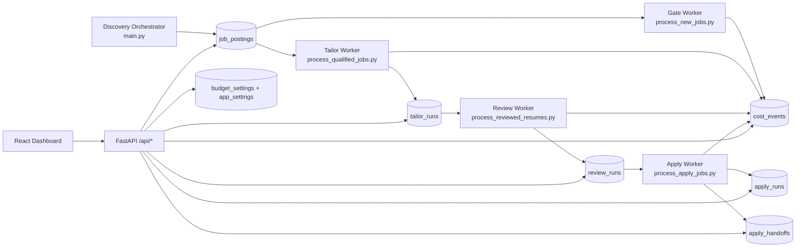

# Architecture

## System overview

The runtime is split into:

1. **Pipeline surface** (discovery + staged workers) writing durable state in SQLite.
2. **Control-plane surface** (FastAPI + React dashboard) for observability, retries, review actions, settings, and budget management.

Evidence: `main.py:1039-1266`, `scripts/process_new_jobs.py:266-345`, `scripts/process_qualified_jobs.py:404-534`, `scripts/process_reviewed_resumes.py:493-694`, `scripts/process_apply_jobs.py:437-859`, `api/main.py:1479-2630`, `src/database/schema.sql:99-148`.

## Runtime boundaries

### Discovery boundary

- Discovery fans out across Greenhouse, Workday (Apify), JobSpy variants, plus additional source adapters (Ashby, Lever, LinkedIn, GitHub repo, career-page watcher) depending on config/entrypoint usage (`main.py:160-206`, `src/fetchers/apify_fetcher.py:157-209`, `src/fetchers/ashby_fetcher.py:72-233`, `src/fetchers/lever_fetcher.py:74-233`, `src/fetchers/linkedin_fetcher.py:127-234`, `src/fetchers/github_repo_fetcher.py:112-305`, `src/fetchers/career_page_watcher.py:117-194`).

### Worker boundary

- Each stage claims units of work, performs one scoped action, and writes stage results with retry metadata (`scripts/process_new_jobs.py:266-345`, `scripts/process_qualified_jobs.py:404-534`, `scripts/process_reviewed_resumes.py:493-694`, `scripts/process_apply_jobs.py:437-859`).
- Apply stage defaults to dry-run unless explicitly configured otherwise (`scripts/process_apply_jobs.py:48-55`, `tests/test_full_pipeline_e2e.py:300-484`).

### API/UI boundary

- API routes provide dashboard stats, jobs listing/detail actions, human-review actions, failure retries, cost analytics, budget, and settings files (`api/main.py:1479-2630`, `api/main.py:2938-3659`).
- Dashboard uses React Query polling defaults (30s polling, short stale window) and broad non-settings sync invalidation (`dashboard/src/lib/query-client.ts:1-30`, `dashboard/src/components/layout/topbar-sync.ts:1-8`).

## Deployment topology

- Home-server oriented deployment: Docker compose profile split and worker shell wrappers are provided (`docker-compose.yml:29-126`, `scripts/docker/run_workers.sh:15-72`).
- Apply automation requires a reachable Chrome CDP target; helper startup script is included (`deploy/start-chrome-cdp.sh:1-40`, `src/agents/apply_worker/browser.py:88-164`).

## Operational caveats (architecture-level)

- SPA fallback currently guards `api/` paths but can still let bare `/api` resolve to `index.html` depending on build state (`api/main.py:3663-3685`).
- Static assets are mounted at import-time if `dashboard/dist/assets` exists, so post-start build generation may require API restart for asset serving (`api/main.py:1445-1448`).
