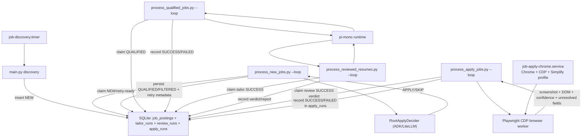

# Architecture

## Overview
The runtime is a staged producer/consumer pipeline coordinated through SQLite.

- `main.py` discovers and inserts `NEW` jobs.
- `scripts/process_new_jobs.py` claims NEW/retry-ready jobs and writes gate decisions (`QUALIFIED` or `FILTERED`).
- `scripts/process_qualified_jobs.py` claims QUALIFIED jobs and persists tailoring attempts in `tailor_runs`.
- `scripts/process_reviewed_resumes.py` claims successful tailor runs and persists review verdicts in `review_runs`.
- `scripts/process_apply_jobs.py` claims successful review runs and persists browser apply diagnostics in `apply_runs`.

## Persistence Design
- Queue state is split between coarse `job_postings.status` and per-stage run tables.
- Claiming is transaction-based (`BEGIN IMMEDIATE`) with lease windows to avoid double-processing.
- Stage retries are tracked per stage table/columns (gate on `job_postings`, tailor/review/apply in run tables).

## Gate Stage
- Uses shared model bootstrap in `src/agents/shared/model.py`.
- Default model is `openai/gpt-5.1-codex-mini`.
- Parsed decision is strict JSON recovery; no plain-text fallback path.

## Tailor + Review Stages
- Tailor stage enforces one-page output from canonical YAML resume content.
- Review stage enforces strict report schema and artifact selection semantics.
- Review success verdicts (`PASS`, `TAILORED`, `BASE`) feed apply-stage eligibility.

## Apply Stage
- Apply worker requires reachable Chrome CDP endpoint and Playwright.
- Browser flow: navigate, detect Simplify, attempt autofill trigger, upload resume, scan unresolved fields, compute deterministic confidence, persist artifacts.
- Current behavior does not execute final submit click; outcomes currently remain review-required (`NEEDS_REVIEW`) even when run is technically successful.

## Deployment Topology
- systemd unit set includes discovery timer, gate worker, tailor worker, review worker, apply worker, and a dedicated Chrome CDP unit for browser automation.
- Apply worker service depends on Chrome CDP unit and X display (`DISPLAY=:99`).
