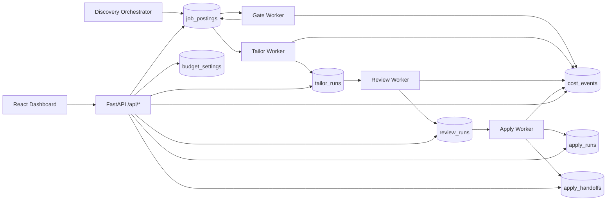

# Architecture

## System Overview

The system is a staged automation pipeline plus an operations control plane.

- Pipeline writes and advances job state in SQLite.
- FastAPI exposes live operational data and mutation endpoints.
- React dashboard consumes API endpoints with polling and explicit mutations.

## Runtime Boundaries

### Discovery Boundary

- `main.py` loads config, fetches sources, deduplicates, persists jobs, records crawl metrics.

### Worker Boundaries

- Gate worker (`scripts/process_new_jobs.py`)
- Tailor worker (`scripts/process_qualified_jobs.py`)
- Review worker (`scripts/process_reviewed_resumes.py`)
- Apply worker (`scripts/process_apply_jobs.py`)

Each worker claims work atomically and persists attempt outcomes, retries, and terminal failures.

### API/UI Boundary

- `api/main.py` runs startup migrations and serves `/api/*`.
- Dashboard static build is served by FastAPI assets mount + SPA fallback.
- Dashboard dev mode proxies `/api` to backend via Vite proxy config.

## Deployment Topology

Primary homeserver topology uses systemd timer/services for discovery and continuous workers, plus a dedicated Chrome CDP unit for apply runtime.
