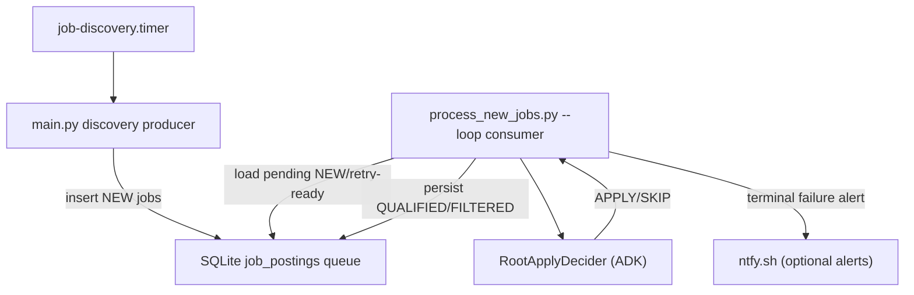

# Architecture

## Overview
The runtime is a producer/consumer pipeline on a shared SQLite queue:
- `main.py` (producer) discovers jobs and inserts rows with `status='NEW'`.
- `scripts/process_new_jobs.py` (consumer) drains NEW backlog, calls the root gate agent, and persists `QUALIFIED`/`FILTERED` decisions.
- Retry metadata (`agent_retry_count`, `agent_next_retry_at`) allows bounded retries before terminal failure (`agent_failed_at`), with optional ntfy alerts.

## Discovery Side
- `main.py` loads `companies.yaml` and optional `search_criteria.yaml` + `candidate_profile.yaml`, resolves default board search terms, fetches Greenhouse/Workday/JobSpy jobs, deduplicates, and inserts into SQLite.
- Job board terms are now config-driven with fallback defaults derived from profile/search config rather than hardcoded senior-role terms.

## Queue + Persistence
- `src/database/schema.sql` defines queue and stats tables and now includes retry columns:
  - `agent_retry_count`
  - `agent_next_retry_at`
- `DatabaseManager` owns:
  - queue selection (`get_jobs_pending_agent_processing`)
  - success persistence (`record_agent_decision`)
  - transient retry persistence (`record_agent_retry`)
  - terminal failure marking (`mark_job_agent_terminal_failed`)
  - manual requeue support (`reset_agent_failure_state`)

## Gate Worker
- `scripts/process_new_jobs.py`:
  - processes full pending backlog (bounded by per-cycle `--limit`)
  - retries per job using configurable backoff
  - marks terminal failure after max retries
  - sends optional ntfy alerts for terminal failures and startup config failures
- `scripts/run_pipeline_once.py` provides a one-shot orchestrator (`discovery -> one gate batch`) for operations and testing.

## Prompt/Profile
- Gate prompt candidate context is config-backed:
  - primary source: `config/candidate_profile.yaml`
  - optional override: `CANDIDATE_PROFILE_PATH`
  - fallback: built-in context string in prompts module

## Deployment Topology
- `deploy/job-discovery.timer` + `deploy/job-discovery.service` for periodic producer runs.
- `deploy/job-agent-worker.service` for continuous queue draining.
- Optional `deploy/job-agent-alert@.service` as a systemd `OnFailure` hook.
