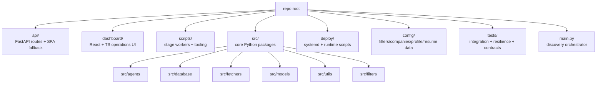

# Codebase Information

## Repository identity

`agentic-job-applier` is an autonomous job-discovery-and-application system with:

- Python pipeline/workers and SQLite persistence (`main.py:1039-1266`, `src/database/db_manager.py:79-139`).
- FastAPI backend control plane (`api/main.py:1479-2630`).
- React + TypeScript operations dashboard (`dashboard/src/main.tsx:1-15`, `dashboard/package.json:6-63`).

## Language and platform profile

### Supported (first-class)

- **Python** for orchestration, workers, API, fetchers, models (`main.py:1039-1266`, `scripts/process_apply_jobs.py:437-859`, `src/fetchers/greenhouse_fetcher.py:157-188`).
- **TypeScript/TSX** for dashboard UI, API adapters, and runtime client behavior (`dashboard/src/pages/JobsPage.tsx:76-247`, `dashboard/src/lib/api/client.ts:37-127`).
- **SQL (SQLite)** for durable state and run tables (`src/database/schema.sql:99-148`).
- **Shell** for Docker/system operations scripts (`scripts/docker/run_workers.sh:15-72`, `deploy/start-chrome-cdp.sh:1-40`).

### Not first-class in this repo

- No Java/C#/Go/Rust service runtime is wired as part of app execution; operational/runtime entrypoints are Python + Node/Vite (`pyproject.toml:7-28`, `dashboard/package.json:6-63`).

## Technology stack

### Backend/runtime

- FastAPI + Uvicorn API runtime (`api/main.py:1429-1448`, `pyproject.toml:20-28`).
- aiosqlite-based DB manager (`src/database/db_manager.py:79-139`).
- ADK/LiteLLM/OpenAI-driven gate decision runtime (`src/agents/root_apply_decider/runtime.py:80-126`, `src/agents/root_apply_decider/prompts.py:351-507`).
- Playwright + Chrome CDP apply automation (`scripts/process_apply_jobs.py:191-273`, `src/agents/apply_worker/browser.py:88-164`).

### Frontend

- React, React Query, Vite, Monaco (`dashboard/package.json:6-63`, `dashboard/src/lib/query-client.ts:1-30`, `dashboard/src/lib/monaco/setup-workers.ts:7-26`).

## High-level structure map

## Architectural patterns

- Lease/claim based stage processing with retry metadata and claim tokens (`src/database/db_manager.py:1089-1169`, `tests/test_tailor_concurrent_claims.py:26-222`).
- Forward-only stage-cost telemetry + budget gating (`src/utils/cost_tracking.py:24-112`, `tests/test_budget_enforcement.py:93-570`).
- API DTO + frontend adapter separation for snake_case backend contracts (`dashboard/src/lib/api/types.ts:136-170`, `dashboard/src/lib/api/adapters.ts:48-216`).
