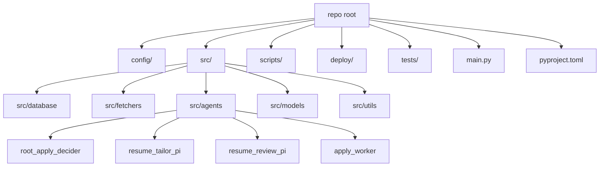

# Codebase Information

## Repository identity

- Project: `agentic-job-applier`, Python 3.11+ package managed by `uv` (`pyproject.toml:1-8`, `pyproject.toml:36-44`).
- Primary objective: discover jobs from multiple sources, persist normalized postings in SQLite, then run staged agent/worker processing from gate → tailor → review → apply (`main.py:1-5`, `scripts/process_new_jobs.py:1-9`, `scripts/process_qualified_jobs.py:2-15`, `scripts/process_reviewed_resumes.py:2-13`, `scripts/process_apply_jobs.py:2-15`).

## Technology stack

- Runtime language: Python (`pyproject.toml:7-27`).
- Core libraries:
  - Data + validation: `pydantic`, `pyyaml` (`pyproject.toml:22`, `pyproject.toml:26`).
  - Persistence: `aiosqlite` with SQLite-backed schema and migrations (`pyproject.toml:10`, `src/database/db_manager.py:72-110`, `src/database/schema.sql:1-225`).
  - Networking/scraping: `httpx`, `apify-client`, `python-jobspy` (`pyproject.toml:11`, `pyproject.toml:16`, `pyproject.toml:24`).
  - Agent runtime: Google ADK + LiteLLM/OpenAI (`pyproject.toml:15`, `pyproject.toml:17`, `src/agents/shared/model.py:13-37`, `src/agents/root_apply_decider/agent.py:9-20`).
  - Browser automation: Playwright via CDP (`pyproject.toml:21`, `src/agents/apply_worker/browser.py:16-31`, `scripts/process_apply_jobs.py:33-41`).
- Ops/runtime packaging: systemd `.service`/`.timer` units and shell launcher for Chrome CDP (`deploy/job-discovery.timer:1-14`, `deploy/job-agent-worker.service:1-35`, `deploy/job-tailor-worker.service:1-37`, `deploy/job-review-worker.service:1-37`, `deploy/job-apply-worker.service:1-38`, `deploy/start-chrome-cdp.sh:1-38`).

## Supported vs. unsupported languages/formats

### Supported and actively implemented
- Python application/runtime code (`main.py:7-26`, `src/agents/__init__.py:1-15`).
- SQL DDL (SQLite schema and checks/indexes) (`src/database/schema.sql:1-225`).
- YAML configuration and canonical resume content (`config/companies.yaml:1-143`, `config/search_criteria.yaml:1-92`, `config/resume_content.yaml:1-210`).
- TOML project metadata (`pyproject.toml:1-44`).
- systemd unit/timer definitions and Bash runtime helper (`deploy/job-discovery.service:1-33`, `deploy/job-discovery.timer:1-14`, `deploy/start-chrome-cdp.sh:1-38`).

### Not implemented as first-class runtime code
- No in-repo TypeScript/JavaScript application modules are wired into runtime entrypoints (runtime import surfaces are Python-only) (`main.py:19-26`, `src/fetchers/__init__.py:1-17`, `src/agents/__init__.py:1-15`).
- No compiled service binaries or container manifests are used as the primary execution path; systemd runs Python modules directly (`deploy/job-agent-worker.service:11-13`, `deploy/job-tailor-worker.service:10-13`, `deploy/job-review-worker.service:10-13`, `deploy/job-apply-worker.service:11-16`).

## High-level filesystem map

Evidence for this layout and entrypoint routing appears in module imports and package exports (`main.py:19-26`, `src/fetchers/__init__.py:3-17`, `src/agents/__init__.py:7-15`).

## Architectural style snapshot

- **Producer + queue-backed workers**: discovery writes NEW jobs; workers claim/transition state from SQLite queues (`main.py:524-656`, `src/database/db_manager.py:372-455`, `src/database/db_manager.py:1047-1156`, `src/database/db_manager.py:1430-1541`, `src/database/db_manager.py:1862-1979`).
- **Schema-first contracts**: each agent stage exposes typed invocation/result schemas (`src/agents/root_apply_decider/schemas.py:11-49`, `src/agents/resume_tailor_pi/schemas.py:438-534`, `src/agents/resume_review_pi/schemas.py:112-331`, `src/agents/apply_worker/schemas.py:42-208`).
- **Deterministic tool CLIs for agent subprocesses**: tailor/review tools emit machine-readable JSON payloads and strict command surfaces (`scripts/resume_tailor_tools.py:30-57`, `scripts/resume_tailor_tools.py:97-171`, `scripts/resume_review_tools.py:35-63`, `scripts/resume_review_tools.py:129-237`).
