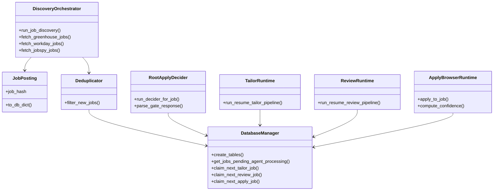

# Components

## Component catalog

### 1) Discovery orchestrator (`main.py`)
- Coordinates configuration loading, fetch fan-out, deduplication, DB inserts, and daily/cycle metrics (`main.py:545-656`).
- Applies optional title-include filtering before persistence (`main.py:202-207`, `main.py:249-252`, `main.py:341-343`, `main.py:469-470`).

### 2) Fetcher adapters (`src/fetchers/*`)
- `BaseFetcher`: async interface contract for `fetch_jobs()` and source naming (`src/fetchers/base_fetcher.py:9-53`).
- `GreenhouseFetcher`: HTTP API integration + HTML stripping + salary parsing (`src/fetchers/greenhouse_fetcher.py:85-131`, `src/fetchers/greenhouse_fetcher.py:179-249`).
- `ApifyWorkdayFetcher`: runs sync Apify client in executor and normalizes payload variants (`src/fetchers/apify_fetcher.py:93-143`, `src/fetchers/apify_fetcher.py:176-194`).
- `JobSpyFetcher`: sync scrape in executor + pandas/NaN cleanup + salary annualization (`src/fetchers/jobspy_fetcher.py:121-164`, `src/fetchers/jobspy_fetcher.py:16-64`, `src/fetchers/jobspy_fetcher.py:256-308`).

### 3) Persistence layer (`src/database/db_manager.py` + `schema.sql`)
- Owns connection lifecycle, pragmas, schema bootstrapping/migrations (`src/database/db_manager.py:72-132`, `src/database/db_manager.py:576-704`).
- Implements queue claim/retry/stale-recovery operations for gate/tailor/review/apply stages (`src/database/db_manager.py:372-455`, `src/database/db_manager.py:1047-1277`, `src/database/db_manager.py:1430-1698`, `src/database/db_manager.py:1862-2317`).

### 4) Model and dedup subsystem
- `JobPosting` canonical model performs URL/text canonicalization and SHA-256 dedup hash generation (`src/models/job_posting.py:51-129`).
- `Deduplicator` performs in-batch dedup + DB hash existence filtering (`src/utils/deduplicator.py:28-70`).

### 5) Gate agent subsystem (`src/agents/root_apply_decider`)
- Fixed OpenAI model wiring + ADK agent assembly (`src/agents/root_apply_decider/agent.py:18-20`, `src/agents/root_apply_decider/agent.py:191-209`).
- Prompt builder with untrusted-text delimiters and profile fallback (`src/agents/root_apply_decider/prompts.py:16-46`, `src/agents/root_apply_decider/prompts.py:197-242`, `src/agents/root_apply_decider/prompts.py:304-337`).
- Runtime executes per-job isolated ADK session and JSON recovery parser (`src/agents/root_apply_decider/runtime.py:61-131`, `src/agents/root_apply_decider/agent.py:102-141`).

### 6) Tailor agent subsystem (`src/agents/resume_tailor_pi`)
- Canonical resume schema with lock rules + non-editable sections (`src/agents/resume_tailor_pi/schemas.py:21-35`, `src/agents/resume_tailor_pi/schemas.py:343-376`, `src/agents/resume_tailor_pi/schemas.py:536-628`).
- Runtime loop: content retries → bounded layout compression fallback → one-page enforcement (`src/agents/resume_tailor_pi/runtime.py:441-639`).

### 7) Review agent subsystem (`src/agents/resume_review_pi`)
- Review report schema handshake and verdict model (`src/agents/resume_review_pi/schemas.py:21-32`, `src/agents/resume_review_pi/schemas.py:112-188`).
- Runtime accepts agent verdict unless hard operational failures occur (pi invocation, missing/invalid report, missing selected artifacts) (`src/agents/resume_review_pi/runtime.py:265-334`).
- Deterministic analysis tools: geometry, compare-to-base profiles, log parsing, text signals (`src/agents/resume_review_pi/tools.py:432-485`, `src/agents/resume_review_pi/tools.py:528-635`, `src/agents/resume_review_pi/tools.py:638-767`).

### 8) Apply worker subsystem (`src/agents/apply_worker`)
- Browser automation via Playwright CDP with Simplify detection, resume upload, unresolved field scan, confidence scoring, screenshot/DOM capture (`src/agents/apply_worker/browser.py:108-348`).
- Outcome and diagnostic schemas (`src/agents/apply_worker/schemas.py:42-208`).

### 9) Operational scripts (`scripts/*`)
- Worker/process entrypoints: `process_new_jobs`, `process_qualified_jobs`, `process_reviewed_resumes`, `process_apply_jobs`.
- Diagnostics and utilities: `status.py`, `query_jobs.py`, `run_pipeline_once.py`, `decide_job.py`, `run_resume_tailor.py` (`scripts/status.py:53-249`, `scripts/query_jobs.py:18-138`, `scripts/run_pipeline_once.py:71-143`, `scripts/decide_job.py:27-88`, `scripts/run_resume_tailor.py:163-284`).

## Component relationship diagram

## Notable implementation characteristics

- Claim/retry logic is encoded in SQL where clauses for fairness and retry eligibility rather than in-memory queues (`src/database/db_manager.py:406-437`, `src/database/db_manager.py:1082-1116`, `src/database/db_manager.py:1464-1505`, `src/database/db_manager.py:1896-1943`).
- Worker scripts are designed to run both one-shot and loop modes with environment-driven tuning (`scripts/process_new_jobs.py:395-430`, `scripts/process_qualified_jobs.py:560-618`, `scripts/process_reviewed_resumes.py:696-717`, `scripts/process_apply_jobs.py:627-654`).
