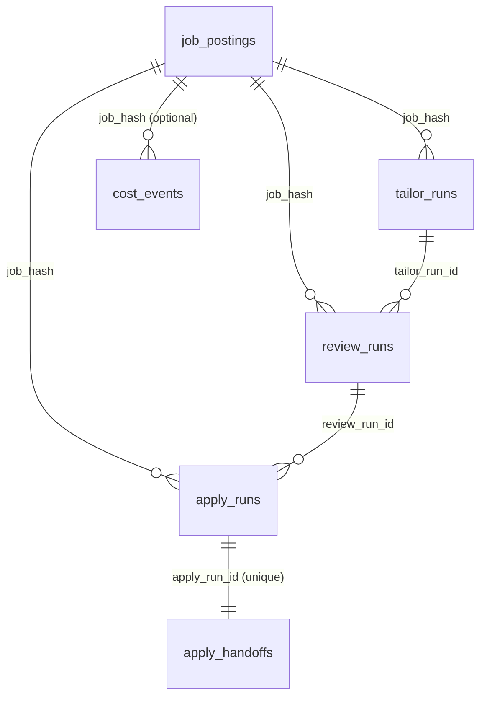

# Data Models

## Canonical Job Model

`src/models/job_posting.py` defines the shared normalized posting shape used by all fetchers before persistence.

Key behaviors:
- URL canonicalization for stable hashing
- Content normalization
- Deterministic `job_hash` generation used as cross-stage identity

## SQLite Schema Overview

### Core Tables

- `job_postings`
- `crawl_history`
- `daily_stats`

### Stage Tables

- `tailor_runs`
- `review_runs`
- `apply_runs`
- `apply_handoffs`

### Cost/Budget Tables

- `cost_events`
- `budget_settings`

`cost_events` is forward-only telemetry with stage checks:
- `GATE`
- `TAILOR`
- `REVIEW`
- `APPLY`
- `DISCOVERY`

`budget_settings` is a single-row table (`id = 1`) holding monthly budget configuration.

## Relationship Snapshot

## Status/Outcome Domains

- `job_postings.status`: `NEW`, `FILTERED`, `QUALIFIED`, `APPLIED`, `REJECTED`
- `tailor_runs.status`: `PENDING`, `SUCCESS`, `FAILED`
- `review_runs.status`: `PENDING`, `SUCCESS`, `FAILED`
- `apply_runs.status`: `PENDING`, `SUCCESS`, `FAILED`
- `apply_handoffs.handoff_status`: `PENDING_REVIEW`, `APPROVED`, `REJECTED`

## API DTO Shapes

Frontend DTO contracts are centralized in `dashboard/src/lib/api/types.ts` and remain snake_case to match backend responses.
