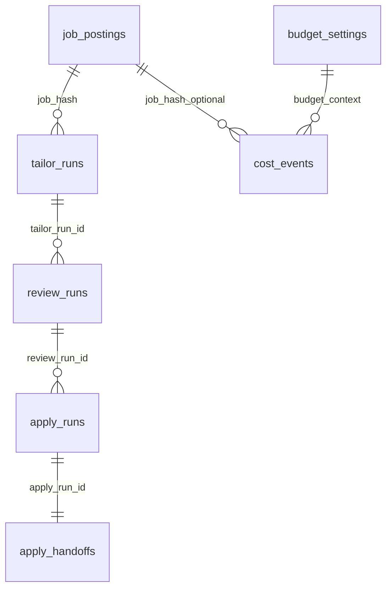

# Data Models

## Canonical job model

`JobPosting` is the normalization boundary across fetchers.

- Canonicalizes job type and source URL forms used for dedupe/hash stability.
- Infers remote status from location text.
- Serializes `raw_data` as JSON for persistence.
- Generates deterministic `job_hash` identity used across all pipeline stages.

Evidence: `src/models/job_posting.py:18-240`, `tests/test_integration.py:143-200`.

## Core SQLite entities

### Primary pipeline table

- `job_postings`: discovered jobs, stage status, gate decisions, retries, claim metadata (`src/database/schema.sql:1-98`, `src/database/db_manager.py:384-469`).

### Stage run tables

- `tailor_runs`: per-job tailor attempts with claim token, retries, artifact paths, and error details (`src/database/schema.sql:99-117`, `src/database/db_manager.py:1089-1255`).
- `review_runs`: per-tailor-run review attempts with verdict/report and fallback-base metadata (`src/database/schema.sql:120-148`, `scripts/process_reviewed_resumes.py:360-457`).
- `apply_runs`: apply attempts linked to review runs (`src/database/db_manager.py:1793-1866`).
- `apply_handoffs`: human-review queue records tied to apply runs (`src/database/db_manager.py:2270-2316`, `src/database/db_manager.py:2650-2732`).

### Cost + settings tables

- `cost_events`: forward-only per-stage cost telemetry (`src/utils/cost_tracking.py:24-112`, `src/database/db_manager.py:2430-2454`).
- `budget_settings`: monthly budget cap and usage (`src/database/db_manager.py:2502-2577`).
- `app_settings`: service-tier persistence (`src/database/db_manager.py:2579-2648`).

## Relationship map

## Status domains

- `job_postings.status`: includes `NEW`, `QUALIFIED`, `FILTERED`, `APPLIED`, `REJECTED` and operational intermediates shown in dashboard status badges (`dashboard/src/pages/JobsPage.tsx:54-68`, `dashboard/src/pages/JobsPage.tsx:114-145`).
- `tailor_runs.status`, `review_runs.status`, `apply_runs.status`: `PENDING|SUCCESS|FAILED` lifecycle with retry metadata (`tests/test_tailor_concurrent_claims.py:26-222`, `tests/test_review_worker.py:129-333`, `tests/test_apply_worker_and_retry_semantics.py:529-775`).
- `apply_handoffs.handoff_status`: review queue states such as `PENDING_REVIEW`, completion, and dismiss/reject outcomes (`dashboard/src/pages/HumanReviewPage.tsx:98-155`, `src/database/db_manager.py:2650-2732`).

## Important model caveats

- Some schema-readiness checks validate only sentinel tables and may not detect partially-migrated companion tables (`src/database/db_manager.py:1793-1866`, `src/database/db_manager.py:2386-2428`).
- Tailor and agent claim token ownership enforcement differs from apply-stage strict claim-token checks (`src/database/db_manager.py:1171-1255`, `src/database/db_manager.py:591-929`, `tests/test_apply_worker_and_retry_semantics.py:778-1193`).
