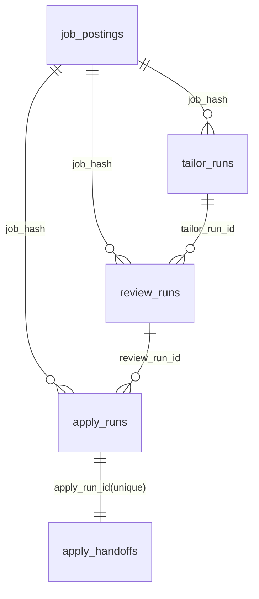
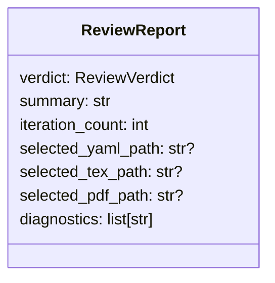

# Data Models

## Canonical application data model

### `JobPosting` (in-memory normalization)

`JobPosting` is the shared cross-source model that all fetchers must emit (`src/models/job_posting.py:18-50`).

Key behaviors:
- `job_hash` is SHA-256 over normalized source/company/title/location/posted_date + canonical URL + content digests (`src/models/job_posting.py:51-77`).
- URL canonicalization strips tracking params (`utm_*`, `gh_src`, `gh_jid`) and normalizes query ordering (`src/models/job_posting.py:97-129`).
- Remote detection and job-type normalization happen via validators (`src/models/job_posting.py:130-183`).

## SQLite schema model

Core schema is in `src/database/schema.sql` and extended idempotently in `DatabaseManager` migrations (`src/database/schema.sql:1-225`, `src/database/db_manager.py:576-704`, `src/database/db_manager.py:967-1020`, `src/database/db_manager.py:1351-1403`, `src/database/db_manager.py:1745-1835`).

### Primary tables

- `job_postings`: normalized job content + workflow state + gate metadata (`src/database/schema.sql:2-56`).
- `crawl_history`: per-crawl operational records (`src/database/schema.sql:71-87`).
- `daily_stats`: per-date aggregate counters (`src/database/schema.sql:89-96`).

### Stage-run tables

- `tailor_runs` for QUALIFIED job resume generation attempts (`src/database/schema.sql:99-118`).
- `review_runs` for post-tailor review verdicts and report artifacts (`src/database/schema.sql:120-149`).
- `apply_runs` for browser automation attempts and diagnostics (`src/database/schema.sql:151-194`).
- `apply_handoffs` for human review queue when apply outcome is `NEEDS_REVIEW` (`src/database/schema.sql:195-225`).

## Entity relationship map

Relationship semantics are enforced by query logic in claim methods (not SQL foreign keys) (`src/database/db_manager.py:1472-1475`, `src/database/db_manager.py:1910-1913`, `src/database/db_manager.py:2164-2181`).

## Stage outcome enums and status domains

- Job status domain: `NEW`, `FILTERED`, `QUALIFIED`, `APPLIED`, `REJECTED` (`src/database/schema.sql:36-56`).
- Tailor/review/apply run statuses: `PENDING`, `SUCCESS`, `FAILED` (`src/database/schema.sql:102-113`, `src/database/schema.sql:124-142`, `src/database/schema.sql:155-188`).
- Review verdicts: `PASS`, `TAILORED`, `BASE`, `FAIL` (`src/agents/resume_review_pi/schemas.py:21-32`).
- Apply outcomes: `NEEDS_REVIEW`, `SUBMITTED`, `FAILED_PREFILL`, `FAILED_UPLOAD`, `FAILED_NAVIGATION`, `FAILED_OTHER` (`src/agents/apply_worker/schemas.py:42-58`).

## Resume canonical model (tailor/review)

The resume pipeline uses a YAML-canonical `ResumeContent` model with explicit lock rules and section IDs (`src/agents/resume_tailor_pi/schemas.py:360-376`).

- Lock constraints:
  - fixed section order and headings (`src/agents/resume_tailor_pi/schemas.py:21-32`, `src/agents/resume_tailor_pi/schemas.py:551-581`)
  - non-editable sections: `personal`, `education` (`src/agents/resume_tailor_pi/schemas.py:33`, `src/agents/resume_tailor_pi/schemas.py:557-562`)
  - snapshot digest guard for locked sections (`src/agents/resume_tailor_pi/schemas.py:584-628`)

- Current baseline resume instance is stored in `config/resume_content.yaml` (`config/resume_content.yaml:1-210`).

## Review report model

`ReviewReport` is the required completion artifact for review runtime (`src/agents/resume_review_pi/schemas.py:112-188`).

For non-FAIL verdicts, selected artifact paths are mandatory by schema validator (`src/agents/resume_review_pi/schemas.py:171-187`).

## Apply diagnostics model

`ApplyRunResult` captures end-state plus confidence and unresolved field metadata (`src/agents/apply_worker/schemas.py:173-208`).

- Confidence payload includes weighted checks and hard-blocker flags (`src/agents/apply_worker/schemas.py:139-166`, `src/agents/apply_worker/confidence.py:210-230`).
- Unresolved field payload captures selector/label/type/required/options context for later repair workflows (`src/agents/apply_worker/schemas.py:82-112`, `src/agents/apply_worker/field_scanner.py:157-172`).
