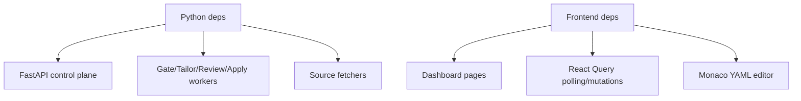

# Dependencies

## Python runtime dependencies

Primary runtime libraries are declared in `pyproject.toml` and include:

- API/runtime: `fastapi`, `uvicorn`, `python-multipart` (`pyproject.toml:20-28`).
- Persistence/networking: `aiosqlite`, `httpx`, `python-dotenv`, `pyyaml` (`pyproject.toml:10-20`).
- Fetchers: `apify-client`, `python-jobspy` (`pyproject.toml:10-18`).
- Agent/runtime: `google-adk`, `litellm`, `openai` (`pyproject.toml:12-24`).
- Browser automation: `playwright` (`pyproject.toml:19-21`).

## Frontend dependencies

Dashboard dependencies are declared in `dashboard/package.json`:

- UI/runtime: `react`, `react-dom` (`dashboard/package.json:13-18`).
- Data/cache: `@tanstack/react-query` (`dashboard/package.json:13-18`).
- Charts/UX: `recharts`, icon/utility libraries (`dashboard/package.json:13-29`).
- Tooling: Vite + TypeScript + ESLint (`dashboard/package.json:30-63`).

## Dependency-to-subsystem map

## External binaries/services

- `pi` CLI and LaTeX tooling (`latexmk`) for tailor/review pipelines (`scripts/process_qualified_jobs.py:583-657`, `scripts/process_reviewed_resumes.py:697-783`).
- Chrome/Chromium CDP target for apply worker automation (`scripts/process_apply_jobs.py:191-273`, `deploy/start-chrome-cdp.sh:1-40`).
- Optional ntfy endpoint/token for operator notifications (`src/utils/notifications.py:21-115`, `tests/test_ops_config_and_notifications.py:12-150`).

## Runtime configuration dependencies

- Stage cost rates from env are optional and invalid values downgrade to zero-cost accounting (`src/utils/cost_tracking.py:24-75`).
- Service tier and budget settings persist in DB and gate feature availability/worker execution (`src/database/db_manager.py:2502-2648`, `dashboard/src/pages/SettingsPage.tsx:2435-2867`).
