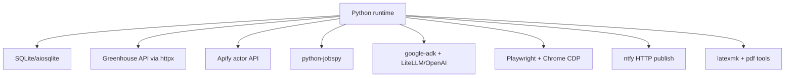

# Dependencies

## Python dependencies (declared)

The project declares runtime dependencies in `pyproject.toml` (`pyproject.toml:8-27`), with dev/test dependencies in `dependency-groups.dev` (`pyproject.toml:29-34`).

## Dependency-to-subsystem mapping

| Dependency | Primary usage in repo | Evidence |
|---|---|---|
| `aiosqlite` | Async SQLite connection + row access in persistence layer | `src/database/db_manager.py:13-14`, `src/database/db_manager.py:72-110` |
| `httpx` | Greenhouse fetch HTTP client and ntfy notification POSTs | `src/fetchers/greenhouse_fetcher.py:6-8`, `src/utils/notifications.py:14-15`, `src/utils/notifications.py:96-103` |
| `apify-client` | Workday scraping actor integration | `src/fetchers/apify_fetcher.py:7-8`, `src/fetchers/apify_fetcher.py:155-161` |
| `python-jobspy` | Job board scraping for Indeed/Glassdoor/LinkedIn | `src/fetchers/jobspy_fetcher.py:8`, `src/fetchers/jobspy_fetcher.py:176-183` |
| `google-adk` | Gate agent construction and runner session execution | `src/agents/root_apply_decider/agent.py:9`, `src/agents/root_apply_decider/runtime.py:8-11` |
| `litellm` (via ADK extensions) | OpenAI model object for ADK decider | `src/agents/shared/model.py:31-38` |
| `pydantic` | Schemas for postings, gate/tailor/review/apply contracts | `src/models/job_posting.py:15-16`, `src/agents/resume_tailor_pi/schemas.py:15-19`, `src/agents/resume_review_pi/schemas.py:12-15`, `src/agents/apply_worker/schemas.py:13-14` |
| `python-dotenv` | `.env` loading in entrypoints/path resolver | `main.py:16`, `scripts/process_new_jobs.py:19`, `src/utils/paths.py:8-9` |
| `playwright` | Browser application automation via CDP | `src/agents/apply_worker/browser.py:16-18`, `scripts/process_apply_jobs.py:236-242` |
| `loguru` | Structured logging across orchestrator/workers/utils | `main.py:17`, `scripts/process_qualified_jobs.py:28`, `src/utils/logger.py:6` |
| `pyyaml` | YAML config + resume content parsing | `main.py:15`, `src/agents/root_apply_decider/prompts.py:11`, `src/agents/resume_tailor_pi/yaml_io.py:8` |

## External binaries/services required at runtime

- `pi` command (or command override env vars) for tailor/review agent subprocesses (`scripts/process_qualified_jobs.py:195-205`, `scripts/process_reviewed_resumes.py:193-202`).
- LaTeX toolchain (`latexmk`) for resume compilation (`scripts/process_qualified_jobs.py:207-213`, `scripts/process_reviewed_resumes.py:204-208`).
- PDF analysis tools for review stage: `pdfinfo`, `pdftotext`, `pdftoppm` (`scripts/process_reviewed_resumes.py:205-208`, `src/agents/resume_review_pi/tools.py:71-95`, `src/agents/resume_review_pi/tools.py:349-373`).
- Chrome with CDP for apply worker (`scripts/process_apply_jobs.py:263-268`, `deploy/job-apply-chrome.service:1-13`, `deploy/start-chrome-cdp.sh:31-38`).

## Configuration dependencies

- Required/optional env keys are documented in `.env.example`, including stage-specific retry knobs and model overrides (`.env.example:1-79`).
- Discovery source definitions and filters come from YAML config files (`config/companies.yaml:4-143`, `config/search_criteria.yaml:4-92`).

## Dependency interaction map

## Risk notes tied to dependencies

- Apply preflight checks for Playwright + Chrome reachability fail fast and return without notification, unlike tailor/review preflight flows that page ntfy (`scripts/process_apply_jobs.py:655-667`, `scripts/process_qualified_jobs.py:627-632`, `scripts/process_reviewed_resumes.py:719-724`).
- Systemd unit files contain placeholder `User` and path values; deployment requires manual replacement before units are valid (`deploy/job-agent-worker.service:9-13`, `deploy/job-tailor-worker.service:8-13`, `deploy/job-review-worker.service:8-13`, `deploy/job-apply-worker.service:9-16`).
