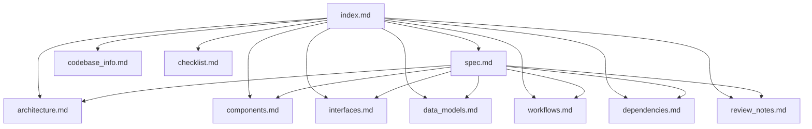

# Agentic Job Applier Spec Index

This index is the **primary entrypoint** for AI assistants. Load this file first, then open only the linked docs needed for the question to minimize context cost.

## How to use this spec (AI assistant workflow)

1. Start with `spec.md` for a narrative overview and cross-file synthesis.
2. Use the routing table below to select the most relevant deep-dive document.
3. Validate detailed claims with cited source evidence in `path:line` form.
4. If docs and code conflict, prefer current source code and update docs accordingly (`AGENTS.md:30-32`).

## Repository at a glance

The repo implements a staged job automation pipeline: discovery writes normalized jobs to SQLite, then workers process NEW → QUALIFIED/FILTERED (gate), QUALIFIED → tailored resume runs, tailored runs → review verdicts, and review-success rows → browser apply diagnostics/handoffs (`main.py:524-656`, `scripts/process_new_jobs.py:231-344`, `scripts/process_qualified_jobs.py:360-499`, `scripts/process_reviewed_resumes.py:432-619`, `scripts/process_apply_jobs.py:368-569`).

## Documentation map (with metadata)

| File | Tags | Purpose | Read when you need |
|---|---|---|---|
| `.aqa/spec/spec.md` | `overview`, `synthesis`, `entry-summary` | Cohesive end-to-end narrative, key architecture, risks, and reading guidance. | A full understanding quickly, or a briefing artifact. |
| `.aqa/spec/codebase_info.md` | `inventory`, `stack`, `languages`, `layout` | Basic codebase identity, stack, supported formats, high-level filesystem map. | Orientation, technology stack, repo shape questions. |
| `.aqa/spec/architecture.md` | `architecture`, `topology`, `deployment` | Architectural boundaries, stage decomposition, and deployment topology. | “How is the system structured?” |
| `.aqa/spec/components.md` | `components`, `responsibilities` | Major modules/classes/scripts and ownership boundaries. | “Which component owns X?” |
| `.aqa/spec/interfaces.md` | `api`, `cli`, `contracts`, `integration` | External integrations, internal queue/worker APIs, deterministic tool contracts. | CLI usage, integration points, contract semantics. |
| `.aqa/spec/data_models.md` | `schema`, `pydantic`, `sqlite`, `entities` | Canonical models, DB tables, enums, and relationships. | Status transitions, table meanings, payload fields. |
| `.aqa/spec/workflows.md` | `workflow`, `lifecycle`, `state-machine` | Stage-by-stage operational flows and lifecycle transitions. | Process/lifecycle/debugging flow questions. |
| `.aqa/spec/dependencies.md` | `deps`, `runtime`, `ops` | Dependency mapping, external binaries/services, env/runtime constraints. | Install/runtime failures, dependency impact analysis. |
| `.aqa/spec/review_notes.md` | `qa`, `gaps`, `consistency`, `risks` | Consistency/completeness audit, known gaps, recommendations. | Caveats, follow-ups, documentation quality checks. |
| `.aqa/spec/checklist.md` | `process`, `traceability` | Workflow completion checklist for this spec run. | Verifying generation completeness. |

## Relationship graph

## Query routing guide

- **“How does one job move through the whole system?”** → `workflows.md` then `data_models.md`.
- **“What tables/columns track retries and claims?”** → `data_models.md` then `interfaces.md`.
- **“What does the apply worker actually do today?”** → `components.md` + `workflows.md` + `review_notes.md`.
- **“What dependencies or binaries are required in production?”** → `dependencies.md`.
- **“Where are known risks or doc gaps?”** → `review_notes.md`.

## Suggested assistant prompts

- “Using `index.md` + `workflows.md`, explain failure recovery semantics for each worker stage.”
- “Using `index.md` + `data_models.md`, list all status/outcome enums and where they are persisted.”
- “Using `index.md` + `dependencies.md`, give a production preflight checklist for homeserver deployment.”
