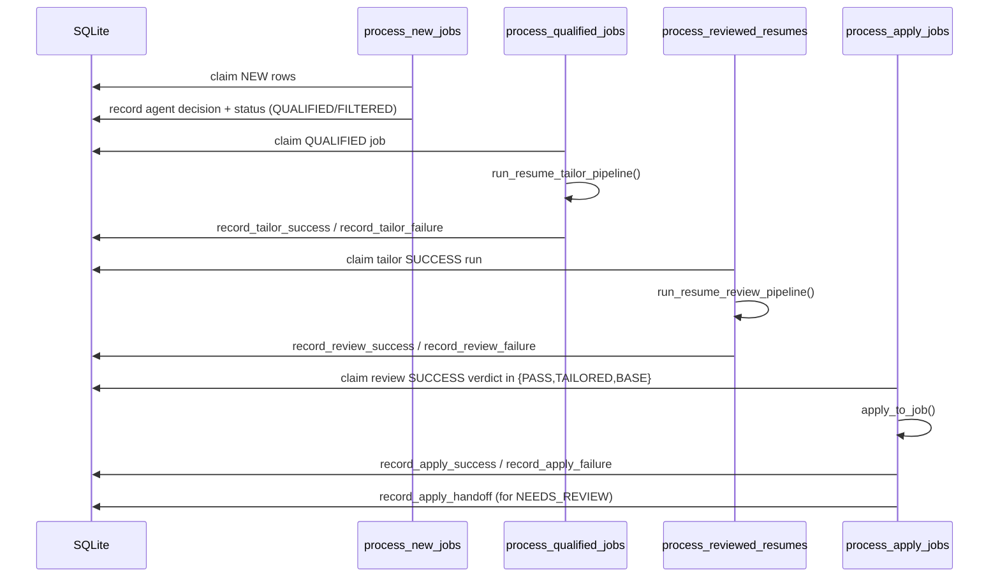

# Interfaces

## External interfaces

### Job source interfaces

1. **Greenhouse public boards API**
   - Endpoint pattern: `https://boards-api.greenhouse.io/v1/boards/{id}/jobs?content=true` (`src/fetchers/greenhouse_fetcher.py:16`, `src/fetchers/greenhouse_fetcher.py:103-109`).
   - Handles 404/429 as soft failures (returns empty list) (`src/fetchers/greenhouse_fetcher.py:110-119`).

2. **Apify Workday actor**
   - Actor ID: `gooyer.co/myworkdayjobs` (`src/fetchers/apify_fetcher.py:18`).
   - Requires `APIFY_API_TOKEN`; actor run plus dataset iteration executed in thread executor (`src/fetchers/apify_fetcher.py:69-74`, `src/fetchers/apify_fetcher.py:115-135`, `src/fetchers/apify_fetcher.py:155-161`).

3. **JobSpy scrape interface**
   - Sync `scrape_jobs(...)` wrapped by async executor (`src/fetchers/jobspy_fetcher.py:8`, `src/fetchers/jobspy_fetcher.py:138-144`, `src/fetchers/jobspy_fetcher.py:176-183`).

### Model/provider interfaces

- Root gate agent uses ADK `Agent` + `Runner` with LiteLLM model object (`src/agents/root_apply_decider/agent.py:9-20`, `src/agents/root_apply_decider/runtime.py:8-18`, `src/agents/root_apply_decider/runtime.py:93-131`).
- OpenAI credential required by shared model builder (`src/agents/shared/model.py:25-29`).

### Notification interface

- Optional ntfy publish helper reads env config and performs HTTP POST (`src/utils/notifications.py:21-34`, `src/utils/notifications.py:54-114`).
- systemd alert unit also supports optional bearer-token auth (`deploy/job-agent-alert@.service:10-12`).

## Internal interfaces

### Queue/claim API in `DatabaseManager`

- Gate queue claim: `get_jobs_pending_agent_processing(limit)` (`src/database/db_manager.py:372-455`).
- Tailor queue claim: `claim_next_tailor_job(max_retries, lease_seconds)` (`src/database/db_manager.py:1047-1156`).
- Review queue claim: `claim_next_review_job(max_retries, lease_seconds)` (`src/database/db_manager.py:1430-1541`).
- Apply queue claim: `claim_next_apply_job(max_retries, lease_seconds)` (`src/database/db_manager.py:1862-1979`).

### Worker entrypoints

- `python -m scripts.process_new_jobs [--once|--loop --limit N]` (`scripts/process_new_jobs.py:395-416`).
- `python -m scripts.process_qualified_jobs [--once|--loop]` (`scripts/process_qualified_jobs.py:562-599`).
- `python -m scripts.process_reviewed_resumes [--once|--loop]` (`scripts/process_reviewed_resumes.py:636-695`).
- `python -m scripts.process_apply_jobs [--once|--loop] [--dry-run|--no-dry-run]` (`scripts/process_apply_jobs.py:577-625`).

### Deterministic tool CLIs (agent subprocess contract)

1) `scripts.resume_tailor_tools`
- Commands: `db-get-job-context`, `load-resume-yaml`, `save-resume-yaml`, `backup-resume-yaml`, `restore-resume-yaml`, `render-resume-tex`, `compile-resume`, `get-page-count` (`scripts/resume_tailor_tools.py:111-171`).
- Output envelope: `{"ok": true, "result": ...}` or `{"ok": false, "error": ...}` (`scripts/resume_tailor_tools.py:30-57`).

2) `scripts.resume_review_tools`
- Includes all tailor commands plus `analyze-pdf-geometry`, `compare-pdf-to-base`, `analyze-latex-log`, `extract-pdf-text-signals`, `write-review-report` (`scripts/resume_review_tools.py:203-237`).
- Same deterministic JSON envelope contract (`scripts/resume_review_tools.py:35-63`).

## Data/control flow sequence (gate → tailor → review → apply)

Sequence semantics are implemented in worker scripts and DB methods (`scripts/process_new_jobs.py:231-344`, `scripts/process_qualified_jobs.py:390-499`, `scripts/process_reviewed_resumes.py:465-619`, `scripts/process_apply_jobs.py:397-569`, `src/database/db_manager.py:705-831`, `src/database/db_manager.py:1158-1243`, `src/database/db_manager.py:1543-1664`, `src/database/db_manager.py:1981-2213`).

## Validation and error interface contracts

- Gate parser rejects non-JSON/text-only decisions (must recover APPLY/SKIP from JSON object) (`src/agents/root_apply_decider/agent.py:122-133`; validated in `tests/test_apply_decider.py:199-217`).
- Review runtime hard-fails when report missing/invalid or selected artifacts missing (`src/agents/resume_review_pi/runtime.py:310-321`, `src/agents/resume_review_pi/runtime.py:230-263`; tested in `tests/test_resume_review_runtime.py:220-315`).
- Tailor worker YAML-copy failures are persisted with `yaml_copy_failed:` prefix (`scripts/process_qualified_jobs.py:422-430`; tested in `tests/test_tailor_worker_error_recovery.py:162-213`).
