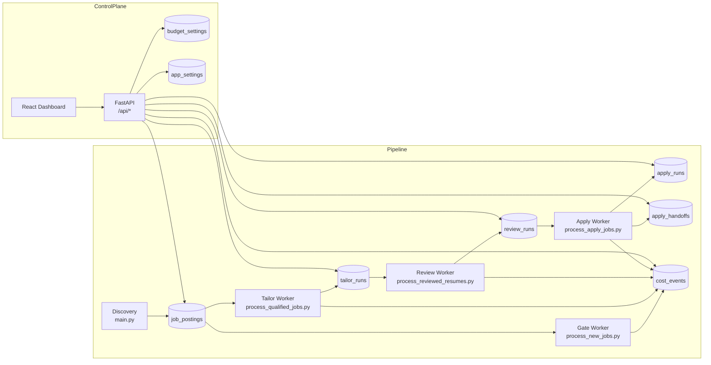
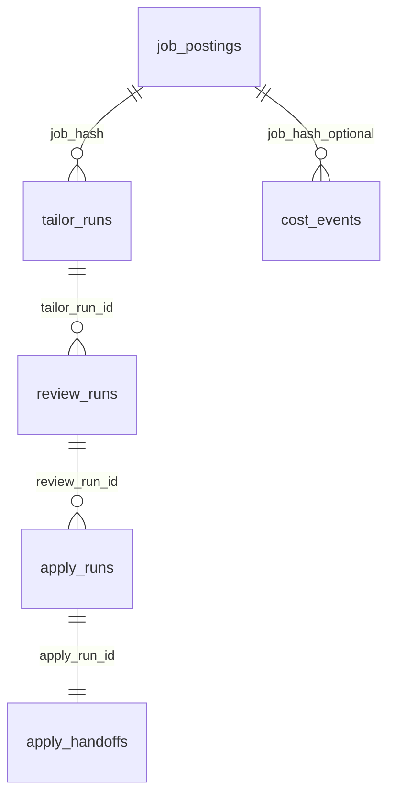
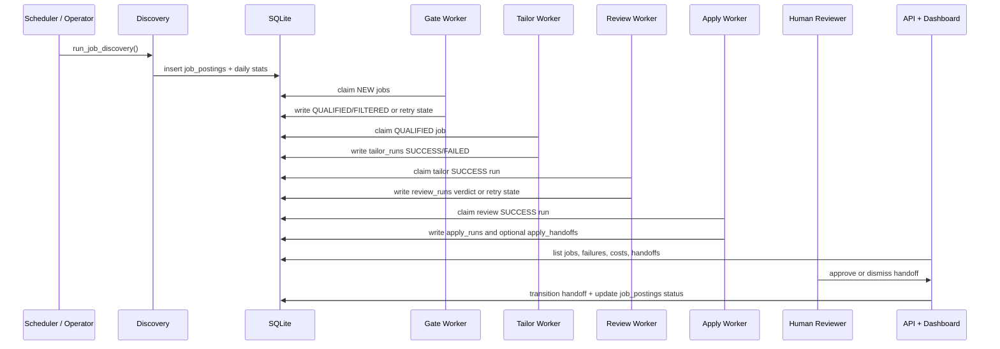

# Agentic Job Applier Narrative Specification

## Executive Summary
Agentic Job Applier is a two-surface system: an asynchronous, SQLite-backed pipeline that discovers jobs and advances them through gate, tailor, review, and apply stages, plus a FastAPI + React control plane used for monitoring, settings management, retries, cost analytics, and human review. (`.aqa/spec/index.md:14-17`, `main.py:1039-1266`, `api/main.py:1479-2630`, `dashboard/src/main.tsx:1-15`)
The canonical technical references remain the topical docs under `.aqa/spec/`; this file is intentionally a narrative onboarding guide that connects those documents into one end-to-end mental model, and implementation still outranks documentation when they differ. (`.aqa/spec/index.md:7-10`, `.aqa/spec/index.md:21-32`, `AGENTS.md:30-32`)
For a new engineer, the most important idea is that nearly every automation step is modeled as a claimable queue backed by explicit run tables, retry timestamps, and operator-visible diagnostics, while budget guards and dashboard workflows sit alongside that pipeline rather than outside it. (`src/database/schema.sql:35-56`, `src/database/schema.sql:99-186`, `scripts/process_new_jobs.py:266-377`, `scripts/process_qualified_jobs.py:404-534`, `scripts/process_reviewed_resumes.py:493-694`, `scripts/process_apply_jobs.py:437-688`)

## Table of Contents
- [How to Use This Narrative Spec](#how-to-use-this-narrative-spec)
- [System Purpose and Runtime Shape](#system-purpose-and-runtime-shape)
- [Core Data Model and Persistence](#core-data-model-and-persistence)
- [End-to-End Pipeline Narrative](#end-to-end-pipeline-narrative)
  - [1. Discovery](#1-discovery)
  - [2. Gate](#2-gate)
  - [3. Tailor](#3-tailor)
  - [4. Review](#4-review)
  - [5. Apply](#5-apply)
  - [6. Human Review Resolution](#6-human-review-resolution)
- [Control Plane: API and Dashboard](#control-plane-api-and-dashboard)
- [Configuration, Dependencies, and Deployment](#configuration-dependencies-and-deployment)
- [Testing, Invariants, and Operational Guarantees](#testing-invariants-and-operational-guarantees)
- [Known Risks, Unknowns, and Follow-Up Validation](#known-risks-unknowns-and-follow-up-validation)
- [Practical Onboarding Guidance](#practical-onboarding-guidance)

## How to Use This Narrative Spec
Start here when you want the repository’s story, not the smallest-possible answer. The index explicitly says `index.md` is the entrypoint, topic docs such as `architecture.md`, `interfaces.md`, `data_models.md`, and `workflows.md` are the preferred source of truth, and `spec.md` exists as a narrative synthesis for walkthrough-style understanding. (`.aqa/spec/index.md:3-10`, `.aqa/spec/index.md:21-40`)

A useful reading order for new contributors is: this file for the high-level mental model, `data_models.md` for table and status details, `workflows.md` for per-stage sequencing, `interfaces.md` for HTTP and DTO contracts, and `review_notes.md` for current rough edges. That ordering mirrors both the repository guidance in `AGENTS.md` and the way the runtime is actually organized in code. (`AGENTS.md:7-17`, `AGENTS.md:30-32`, `.aqa/spec/index.md:34-44`)

## System Purpose and Runtime Shape
At the product level, the repository exists to discover job postings from multiple upstream sources, normalize them into one shared `JobPosting` model, store them durably in SQLite, and then optionally apply increasingly expensive AI and browser-driven steps to move promising jobs toward application. The control plane is not a separate product; it is the operational face of the same pipeline, reading from and mutating the same persisted state. (`AGENTS.md:3-17`, `src/models/job_posting.py:48-80`, `main.py:1039-1266`, `api/main.py:1479-2630`)

The architectural split is best understood as “pipeline surface” plus “control-plane surface.” The pipeline surface is composed of the discovery orchestrator and stage workers, each of which claims work, writes deterministic stage results, and emits cost telemetry. The control-plane surface is a FastAPI app plus a React dashboard that polls those tables, exposes operator actions, and edits the file-backed settings that shape later runs. (`.aqa/spec/index.md:14-17`, `scripts/process_new_jobs.py:266-377`, `scripts/process_qualified_jobs.py:404-534`, `scripts/process_reviewed_resumes.py:493-694`, `scripts/process_apply_jobs.py:437-688`, `api/main.py:1429-1495`, `dashboard/src/App.tsx:27-40`)

The repository is intentionally home-server friendly. The provided Docker Compose file treats API, discovery, and gate as the always-on core, then adds tailor/review under the `tailor` profile and the apply worker under the `full` profile; the browser automation path also ships a helper script that starts Xvfb and Chrome with remote debugging enabled so Playwright can attach to a real profile with extensions. (`docker-compose.yml:1-10`, `docker-compose.yml:29-126`, `deploy/start-chrome-cdp.sh:1-41`)

## Core Data Model and Persistence
The normalization boundary is `JobPosting`. Every fetcher is expected to produce that model, and the model itself is responsible for canonical job-type mapping, remote detection, URL canonicalization, stable hashing, and JSON serialization of raw source payloads. This is a strong design choice: rather than pushing source-specific oddities down into storage or the gate agent, the repository standardizes them once and lets later stages operate on a common shape. (`src/models/job_posting.py:18-45`, `src/models/job_posting.py:82-159`, `src/models/job_posting.py:161-236`)

A `job_hash` is the pipeline’s durable identity key. It is derived from normalized source, company, title, location, posted date, canonicalized URL, and digests of description and requirements, which means tracking parameters and superficial formatting changes should not create distinct jobs, but materially different postings still will. The tests lock in that expectation. (`src/models/job_posting.py:82-108`, `src/models/job_posting.py:127-159`, `tests/test_integration.py:143-200`)

SQLite persistence is centered on one primary table plus several stage-specific run tables. `job_postings` stores the discovered record and coarse workflow status, while `tailor_runs`, `review_runs`, `apply_runs`, and `apply_handoffs` store stage-local attempt history, retries, artifacts, and human-review state. Cost and configuration data live beside those runtime tables in `cost_events`, `budget_settings`, and `app_settings`. (`src/database/schema.sql:1-56`, `src/database/schema.sql:99-186`, `src/database/db_manager.py:2374-2648`)

The coarse status model lives on `job_postings`: `NEW`, `FILTERED`, `QUALIFIED`, `APPLIED`, and `REJECTED`. Stage-local intermediates such as `PENDING`, `SUCCESS`, `FAILED`, retry counts, `next_retry_at`, and `claim_token` live in the run tables instead. That split explains why the Jobs page can show a high-level pipeline state while the Failures and Human Review pages drill into stage-specific details. (`src/database/schema.sql:35-56`, `src/database/schema.sql:99-186`, `dashboard/src/pages/JobsPage.tsx:114-145`, `dashboard/src/pages/FailuresPage.tsx:117-247`, `dashboard/src/pages/HumanReviewPage.tsx:98-155`)

A notable operational nuance is that claim semantics are not uniform across stages. Review and apply finalization paths require the active `claim_token` and reject stale writers, but gate and tailor completion paths currently clear claim metadata without verifying the claimant, so their tokens are closer to lease hints than hard ownership guards. (`src/database/db_manager.py:420-469`, `src/database/db_manager.py:720-929`, `src/database/db_manager.py:1062-1255`, `src/database/db_manager.py:1556-1696`, `src/database/db_manager.py:2017-2173`)

## End-to-End Pipeline Narrative
The cleanest mental model is: discovery creates durable jobs, gate decides whether they deserve more expensive work, tailor generates artifacts for qualified jobs, review compares tailored artifacts against base references, apply runs browser automation over reviewed jobs, and human review resolves any apply outcome that intentionally stops short of submission. Every stage is budget-gated before claim, records forward-only telemetry, and is designed to be safe to rerun after successful completion. (`main.py:1039-1266`, `src/utils/cost_tracking.py:78-135`, `tests/test_full_pipeline_e2e.py:400-484`, `tests/test_budget_enforcement.py:243-282`, `tests/test_budget_enforcement.py:513-570`)

### 1. Discovery
Discovery is orchestrated by `run_job_discovery()`. It loads versioned YAML config from `config/`, derives default JobSpy search terms from `candidate_profile.yaml` and `search_criteria.yaml`, optionally enables pre-gate filters from `filters.yaml`, creates the base tables plus gate schema, and then walks through each configured source family before writing a daily rollup row. (`main.py:1039-1090`, `main.py:1100-1248`, `main.py:160-206`)

The source fan-out is broader than the original three-source description in `AGENTS.md`: the current runtime can fetch from Greenhouse, Workday via Apify, JobSpy-backed boards, Lever, Ashby, LinkedIn, GitHub-hosted listings repositories, and generic career-page watchers. Each adapter still normalizes into `JobPosting`, but they differ meaningfully in how much structure they can recover from upstream data. (`main.py:1102-1236`, `src/fetchers/greenhouse_fetcher.py:157-189`, `src/fetchers/apify_fetcher.py:101-155`, `src/fetchers/jobspy_fetcher.py:148-333`, `src/fetchers/linkedin_fetcher.py:163-364`, `src/fetchers/github_repo_fetcher.py:112-248`, `src/fetchers/career_page_watcher.py:125-197`)

Discovery does two layers of duplicate protection. First, the `Deduplicator` removes repeated hashes within the current batch; then it asks the database which of the remaining hashes already exist. That ordering avoids redundant lookups and keeps duplicate accounting aligned with what will actually be inserted. (`src/utils/deduplicator.py:26-68`, `src/utils/deduplicator.py:70-108`)

Filtering happens before the gate agent, not after it. Hard filters reject jobs outright before insertion, while soft filters either insert immediately as `FILTERED` or auto-qualify them as `QUALIFIED`, thereby skipping the model call. The soft experience-years rule is worth knowing because it only matches descriptions that explicitly mention `experience|exp` after the year count, which is narrower than the comment suggests. (`main.py:1077-1082`, `main.py:220-278`, `src/filters/job_filter.py:25-32`, `src/filters/job_filter.py:83-154`, `src/filters/job_filter.py:284-372`)

Three discovery nuances matter operationally. Workday is skipped entirely if `APIFY_API_TOKEN` is absent; JobSpy will fall back to a hardcoded search term of `software engineering internship` if neither board-level search terms nor profile-derived defaults exist; and daily `jobs_duplicate` metrics are currently computed as `discovered - new`, which means soft-filtered or hard-rejected rows are effectively folded into the duplicate bucket rather than broken out separately. (`main.py:394-398`, `main.py:499-516`, `main.py:1112-1115`, `main.py:1241-1247`, `main.py:220-278`)

### 2. Gate
The gate worker (`scripts/process_new_jobs.py`) is the AI decision stage. It loads the decider model, checks budget before reading any queue state, claims eligible `NEW` rows, runs one isolated ADK session per job, and then either persists a `QUALIFIED` / `FILTERED` outcome or records retry/terminal-failure metadata. (`scripts/process_new_jobs.py:235-377`, `scripts/process_new_jobs.py:414-513`, `src/database/db_manager.py:384-469`, `src/database/db_manager.py:720-895`)

The prompt is deliberately opinionated and JSON-only. It bakes in candidate-fit heuristics such as student-role preference, ML/AI/MLOps bias, a low-compensation warning, and “bias toward APPLY for borderline but aligned roles,” then combines that instruction with candidate context, prompt-safety rules, and truncated description/requirements blocks. Candidate context is loaded from `config/candidate_profile.yaml` or an env override, cached with `@lru_cache(maxsize=1)`, and cleared when the API profile routes write new settings. (`src/agents/root_apply_decider/prompts.py:16-46`, `src/agents/root_apply_decider/prompts.py:351-408`, `src/agents/root_apply_decider/prompts.py:461-507`, `api/main.py:3187-3190`, `api/main.py:3233-3245`, `api/main.py:3461-3468`)

Runtime isolation is strong by design. `run_decider_for_job()` creates a fresh in-memory ADK session for each job, collects streamed text, prefers the final response when marked, and then parses that raw text into a `GateRunResult`. This keeps cross-job state out of the gate loop, but it also means malformed or empty model output still has to be reconstructed locally. (`src/agents/root_apply_decider/runtime.py:62-134`)

Retry behavior is explicit and test-anchored. The worker uses a 1-based exponential backoff formula, stores SQLite-friendly UTC timestamps, and marks terminal failures with an ntfy alert once retries are exhausted. The tests also verify that budget checks happen before pending-job queries and that successful reruns become no-ops after the first pass. (`scripts/process_new_jobs.py:105-153`, `scripts/process_new_jobs.py:289-345`, `tests/test_budget_enforcement.py:285-337`, `tests/test_full_pipeline_e2e.py:408-484`)

One important caveat: the gate worker writes cost telemetry inline in both the success and exception paths rather than best-effort, so a telemetry outage can interrupt retry bookkeeping or success accounting. The apply worker already treats telemetry as non-fatal; gate does not yet do the same. (`scripts/process_new_jobs.py:289-304`, `scripts/process_new_jobs.py:347-364`, `scripts/process_apply_jobs.py:375-409`)

### 3. Tailor
The tailor worker is the first stage that creates filesystem artifacts. It checks budget, claims one `QUALIFIED` job, validates the `job_hash`, creates a per-job output directory, copies the canonical base YAML into `resume_content_work.yaml`, runs `run_resume_tailor_pipeline()` in an executor, and then records `SUCCESS` or `FAILED` with cost telemetry and retry scheduling. (`scripts/process_qualified_jobs.py:404-534`, `scripts/process_qualified_jobs.py:583-745`)

The copy-first behavior is fundamental. The worker never edits `config/resume_content.yaml` in place; instead it copies that file into a run-local work file and points the tailor pipeline at the copy. Tests confirm that the canonical YAML remains unchanged on success, on pipeline failure, and even when the source YAML changes after the work copy has already been created. (`scripts/process_qualified_jobs.py:438-469`, `tests/test_tailor_yaml_baseline.py:82-198`, `tests/test_tailor_yaml_baseline.py:252-317`)

Successful tailor runs persist three artifact references—`resume_content_work.yaml`, `resume_tailored.tex`, and `resume_tailored.pdf`—plus page count. Those filenames matter downstream because the review-stage handoff and tests expect them to be stable. (`scripts/process_qualified_jobs.py:438-499`, `tests/test_full_pipeline_e2e.py:771-794`)

Tailor retries are lease-based and count prior `FAILED` runs per job. Startup cleanup converts stale `PENDING` rows to `FAILED`, and concurrency tests verify that claims remain atomic across separate DB connections. That said, tailor completion writes still update by `run_id` alone rather than enforcing the active claim token, so stale writers are not blocked as strictly as they are in review and apply. (`src/database/db_manager.py:1062-1169`, `src/database/db_manager.py:1171-1255`, `scripts/process_qualified_jobs.py:697-705`, `tests/test_tailor_concurrent_claims.py:74-222`)

### 4. Review
The review worker bridges “we have a tailored artifact” to “we trust this artifact enough to drive apply.” It claims successful tailor runs, resolves the tailored YAML path (including a compatibility fallback for older rows), verifies the expected artifact files exist, ensures base reference TeX/PDF artifacts are present, runs the review pipeline in an executor, and then writes either a successful verdict/report or a failed review row with fallback-base references and retry metadata. (`scripts/process_reviewed_resumes.py:281-308`, `scripts/process_reviewed_resumes.py:311-357`, `scripts/process_reviewed_resumes.py:460-694`, `scripts/process_reviewed_resumes.py:828-896`)

Review is where claim-token ownership becomes strict. `record_review_success()` and `record_review_failure()` both require `status = 'PENDING'` and the matching claim token, and tests explicitly reject invalid tokens for both paths. That is the repository’s strongest implementation of stage ownership today. (`src/database/db_manager.py:1556-1696`, `tests/test_review_worker.py:233-300`)

The stage is also deliberately history-preserving. A failed review does not mutate the tailor row or overwrite the failed attempt later; it writes fallback base paths, an optional `next_retry_at`, and then allows a later reclaim to create a second `review_runs` row. The end-to-end tests treat that preserved attempt history as part of the contract. (`src/database/schema.sql:120-148`, `tests/test_full_pipeline_e2e.py:488-703`, `tests/test_review_worker.py:195-333`)

One current implementation gap is path validation for missing TeX or PDF artifact metadata. `_resolve_tailored_yaml_path()` handles missing YAML metadata more carefully, but `artifact_tex_path` and `artifact_pdf_path` are still passed through `Path(str(... or "")).resolve()`, which can turn absent values into the current working directory and make the existence check less precise than intended. (`scripts/process_reviewed_resumes.py:281-308`, `scripts/process_reviewed_resumes.py:552-559`)

### 5. Apply
The apply worker is a browser automation stage over reviewed jobs, not a generic “submit anything” bot. It claims only review-success rows with verdicts in `PASS`, `TAILORED`, or `BASE`, resolves the resume PDF from the review verdict, validates the `job_hash`, runs Chrome/CDP preflight checks, and then calls the Playwright-based `apply_to_job()` flow before recording the result. (`src/database/db_manager.py:1898-2015`, `scripts/process_apply_jobs.py:191-273`, `scripts/process_apply_jobs.py:437-688`, `scripts/process_apply_jobs.py:691-857`)

Resume selection is verdict-driven. `PASS` and `TAILORED` prefer the selected tailored PDF when it exists; `BASE` or a missing selected PDF falls back to the persisted base PDF. This keeps the apply worker aligned with review-stage decisions instead of re-deciding resume choice on its own. (`scripts/process_apply_jobs.py:191-223`)

The browser flow connects to a pre-existing Chrome instance over CDP, requires a real browser context, navigates to the target page, waits for network idle, attempts to detect and trigger Simplify, uploads a resume using layered fallback strategies, scans unresolved fields, computes a confidence report, and saves screenshot/DOM/unresolved-field artifacts under the apply run directory. Missing Simplify markers still yield a successful `NEEDS_REVIEW` run rather than hanging, and navigation failures are classified as `FAILED_NAVIGATION` with screenshot capture. (`src/agents/apply_worker/browser.py:88-178`, `src/agents/apply_worker/browser.py:208-351`, `src/agents/apply_worker/resume_upload.py:40-76`, `src/agents/apply_worker/resume_upload.py:79-194`, `src/agents/apply_worker/field_scanner.py:178-264`, `tests/test_apply_worker_and_retry_semantics.py:375-526`)

The apply stage is intentionally conservative in v1. Dry-run is the default, and even the non-dry-run branch still resolves to `NEEDS_REVIEW` because auto-submit is not implemented yet. In other words, this worker currently automates the approach-to-submit and evidence capture path, but final submission still depends on later product work or manual resolution semantics. (`scripts/process_apply_jobs.py:48-55`, `scripts/process_apply_jobs.py:766-773`, `src/agents/apply_worker/browser.py:329-337`)

Apply finalization is robust by comparison with earlier stages. Success and failure writes require the active claim token, successful `NEEDS_REVIEW` runs create or update an `apply_handoffs` row, and cost telemetry is explicitly best-effort so handoff persistence still succeeds when telemetry storage is unavailable. Retry semantics are attempt-based: `current_attempt = failure_count + 1`, and the stage only schedules another retry while `current_attempt < max_retries`. (`src/database/db_manager.py:2017-2268`, `scripts/process_apply_jobs.py:275-409`, `scripts/process_apply_jobs.py:585-661`, `tests/test_apply_worker_and_retry_semantics.py:778-1193`)

The unresolved-field scanner and upload fallbacks are promising but not perfect. The scanner only considers blank values or explicit validation errors, which can miss unchecked radio/checkbox groups, and the resume uploader logs each failed selector or iframe attempt before falling back. Those diagnostics are useful today, but they also point to where a future repair agent will need more precise semantics. (`src/agents/apply_worker/field_scanner.py:79-170`, `src/agents/apply_worker/resume_upload.py:79-194`, `tests/test_apply_worker_and_retry_semantics.py:1197-1278`)

### 6. Human Review Resolution
Human review is modeled as first-class state, not an ad hoc manual note. When apply ends in `NEEDS_REVIEW`, the database writes an `apply_handoffs` record keyed to the apply run, with resume source, diagnostics, unresolved fields, screenshot, DOM snapshot, and reviewer metadata. (`src/database/db_manager.py:2175-2316`)

Resolving a handoff is an atomic DB operation: `transition_handoff_status()` verifies the handoff exists and is still `PENDING_REVIEW`, updates the handoff to `APPROVED` or `REJECTED`, and then updates the linked job status to `APPLIED` or `REJECTED`. The Human Review page is built directly on that workflow, defaulting to `PENDING_REVIEW`, showing reviewer-facing diagnostics and AI-recommended answers, and invalidating human-review, dashboard, jobs, and cost queries after complete/dismiss actions. (`src/database/db_manager.py:2650-2732`, `dashboard/src/pages/HumanReviewPage.tsx:98-155`, `dashboard/src/pages/HumanReviewPage.tsx:382-492`, `dashboard/src/lib/api/client.ts:182-233`)

A small but real gap is that the client supports optional `reviewer_notes`, yet the current page does not collect or send them. The backend and DTOs are ready for notes, but the UI flow remains binary approve/dismiss today. (`dashboard/src/lib/api/client.ts:199-233`, `dashboard/src/pages/HumanReviewPage.tsx:273-278`, `dashboard/src/pages/HumanReviewPage.tsx:473-492`)

## Control Plane: API and Dashboard
The FastAPI app owns startup migrations, JSON endpoints, file-backed settings mutations, and the SPA/static-file bridge. On startup it runs migrations through the lifespan hook; at import time it mounts `/assets` only if the dashboard build already exists. That latter detail matters in development or deployment flows where the frontend build may appear after the API starts. (`api/main.py:1429-1448`)

The HTTP surface covers health, dashboard KPIs and charts, paginated jobs, tailored-resume download, human review queue mutations, a unified failures feed with stage-qualified retry IDs, cost analytics, budget, service tier, API-key status, and settings file management. The route list is broad because the dashboard is thin: most user actions map almost 1:1 to backend endpoints. (`api/main.py:1479-2630`, `api/main.py:2938-3650`)

The dashboard client treats transport shape very strictly. Successful responses must have a non-empty body and `application/json` content type, and non-2xx responses are normalized into typed `ApiError` objects with `code` and `details`. This strictness is good for frontend determinism, but it also exposes backend contract drift quickly. (`dashboard/src/lib/api/client.ts:37-127`)

That contract drift exists today in a few places. The API normalizes `HTTPException`, but FastAPI-native validation failures can still emit framework 422 payloads; settings responses are not fully uniform across profile/resume/filters/sources; and malformed failure retry IDs such as `TAILOR:abc` can still raise a server error because numeric parsing is not guarded early enough. (`api/main.py:1451-1476`, `api/main.py:2527-2629`, `api/main.py:3147-3623`)

On the frontend, `main.tsx` boots Monaco worker setup before rendering the app inside a singleton `QueryClientProvider`. The global query client polls every 30 seconds, treats data as stale after 5 seconds, refetches on focus, retries queries once, and never retries mutations. Manual sync is broad: it invalidates everything except query roots whose first key segment is `"settings"`. (`dashboard/src/main.tsx:1-15`, `dashboard/src/lib/query-client.ts:18-30`, `dashboard/src/components/layout/topbar-sync.ts:1-8`, `dashboard/src/components/layout/TopBar.tsx:88-93`)

The dashboard route tree is intentionally small and operationally focused: overview dashboard, jobs, human review, failures, cost tracking, and settings. The sidebar is the single source of truth for that navigation and also embeds a live monthly-budget widget that flips to `BUDGET EXCEEDED` when remaining budget is exhausted. (`dashboard/src/App.tsx:27-40`, `dashboard/src/components/layout/Sidebar.tsx:55-62`, `dashboard/src/components/layout/Sidebar.tsx:74-209`)

The Jobs page is server-backed, not a client-side dump. It debounces search, paginates in 20-row pages, exposes source and status filters, and expands rows to show gate verdict, safe outbound job-posting links, simplified pipeline-step pills, and tailored-resume download state. One nuance is that the status badge vocabulary is broader than the filter dropdown, so pending/failed-like states can render without being directly selectable from the current UI controls. (`dashboard/src/pages/JobsPage.tsx:15-17`, `dashboard/src/pages/JobsPage.tsx:76-187`, `dashboard/src/pages/JobsPage.tsx:295-386`)

The overview dashboard and cost pages are both read-heavy operational surfaces. The overview dashboard renders KPI cards, discovery trends, source breakdown, pipeline funnel, and applications-over-time charts, while the cost page renders budget-aware KPIs, a 7d/30d/all spend trend, stage-cost bars, and a recent-failures panel capped at five items. (`dashboard/src/pages/DashboardPage.tsx:59-243`, `dashboard/src/pages/CostTrackingPage.tsx:80-223`, `dashboard/src/pages/CostTrackingPage.tsx:284-490`)

Settings are now a major subsystem in their own right. The page supports guided forms, raw YAML, and file actions for candidate profile, resume, filters, and sources; resume editing is tier-gated to `latex` and `full`; Monaco YAML schemas are registered only for `candidate_profile.yaml` and `resume_content.yaml`; and filters are presented as a split between hard filters that reject before DB insert and soft filters that auto-categorize without invoking the gate agent. (`dashboard/src/pages/SettingsPage.tsx:2341-2433`, `dashboard/src/pages/SettingsPage.tsx:2435-2867`, `dashboard/src/pages/SettingsPage.tsx:2873-3244`, `dashboard/src/lib/monaco/yaml-config.ts:10-15`, `dashboard/src/lib/monaco/yaml-config.ts:182-215`, `api/main.py:3147-3650`)

## Configuration, Dependencies, and Deployment
Python runtime dependencies cover FastAPI/Uvicorn, SQLite (`aiosqlite`), HTTP/networking, YAML, Apify and JobSpy integrations, ADK/LiteLLM/OpenAI model plumbing, and Playwright. The dashboard depends on React, React Query, Recharts, Monaco, TypeScript, Vite, and ESLint. Those dependency choices closely mirror the two-surface architecture: Python for stateful automation and APIs, TypeScript for operator UI. (`pyproject.toml:10-28`, `dashboard/package.json:13-63`, `.aqa/spec/dependencies.md:3-18`)

There are two categories of configuration. File-backed settings live under `config/` and include companies, filters, candidate profile, and resume content; env-backed settings provide secrets, stage cost rates, poll intervals, retry counts, claim leases, paths, and browser runtime knobs. The settings API deliberately writes both classes of configuration, including `.env`-backed API keys and YAML-backed profile/resume/filter/source files. (`main.py:1060-1082`, `api/main.py:2869-3050`, `api/main.py:3147-3650`, `src/utils/cost_tracking.py:24-75`)

Service tier is a cross-cutting concept. The API validates tiers as `base`, `latex`, or `full`, stores the selected value in `app_settings`, and the dashboard uses that tier to enable or disable resume editing and downstream automation expectations. The underlying DB helper does not itself enforce the enum, so the API route is currently the main guardrail. (`api/main.py:3003-3050`, `src/database/db_manager.py:2604-2648`, `dashboard/src/pages/SettingsPage.tsx:2435-2867`)

Operationally, the non-core workers require more than Python packages. Tailor and review need a discoverable `pi` command plus `latexmk`; apply needs Playwright installed, a reachable Chrome CDP endpoint, and a Linux display/Xvfb setup when running headfully with extensions. Notifications are optional and fail-safe, activating only when `NTFY_TOPIC` is configured. (`scripts/process_qualified_jobs.py:200-225`, `scripts/process_reviewed_resumes.py:794-837`, `scripts/process_apply_jobs.py:226-273`, `deploy/start-chrome-cdp.sh:17-41`, `src/utils/notifications.py:21-115`)

Two deployment scripts are worth knowing about. `scripts/docker/run_workers.sh` runs gate, tailor, and review together for non-Compose development and exits the whole group if any child dies; `deploy/start-chrome-cdp.sh` starts Xvfb if needed, then launches Chrome with a real user-data dir and remote debugging enabled. Both are operational conveniences, but both also encode assumptions about a single machine supervising tightly-coupled worker processes. (`scripts/docker/run_workers.sh:1-72`, `deploy/start-chrome-cdp.sh:1-41`)

## Testing, Invariants, and Operational Guarantees
The deterministic test suite is a strong part of the design, not an afterthought. Full end-to-end tests create the DB, run discovery, gate, tailor, and review, then rerun the same stages and assert that successful work is not repeated. That gives new contributors a reliable baseline for reasoning about idempotency and rerun safety. (`tests/test_full_pipeline_e2e.py:400-484`)

Budget enforcement is explicitly “pre-claim only.” Workers should refuse to claim new work when remaining budget is zero, but already-claimed work is allowed to finish even if the cost event recorded at completion pushes the system over budget. The tests cover that rule across gate, tailor, review, and apply. (`src/utils/cost_tracking.py:115-135`, `tests/test_budget_enforcement.py:243-282`, `tests/test_budget_enforcement.py:285-570`)

Concurrency guarantees are also tested, especially for the claim-based stages. Tailor concurrent-claim tests use separate DB connections to show that one job is only claimed once under a race, that multiple jobs can be distributed across multiple workers, and that stale `PENDING` rows become reclaimable after cleanup. Similar tests exist for review and apply retry/claim behavior. (`tests/test_tailor_concurrent_claims.py:26-222`, `tests/test_review_worker.py:128-333`, `tests/test_apply_worker_and_retry_semantics.py:529-775`)

The repository also treats failure isolation as a first-class invariant. Orchestrator accounting tests prove that one company’s crawl-start failure does not abort other companies in the same source family, partial insert failures still persist non-zero crawl counters, daily stats are still written with mixed success/failure outcomes, and malformed JobSpy scalar config does not fan out one crawl per character. (`tests/test_orchestrator_accounting_integrity.py:93-207`, `tests/test_orchestrator_accounting_integrity.py:209-432`, `tests/test_orchestrator_accounting_integrity.py:435-604`)

Finally, the UI and API layers are not untested glue. Tests cover strict resume-download and settings-upload contracts, structured candidate-profile settings shape, security guardrails around accepted job-posting URLs, and frontend runtime expectations such as aggressive sync invalidation. For onboarding, that means a surprising amount of product behavior is already encoded in regression tests even when the corresponding UI copy is still rough. (`tests/test_api_resume_download_and_settings_upload.py:23-262`, `tests/test_api_profile_settings_contract.py:60-262`, `dashboard/src/pages/jobs-url.ts:1-23`, `dashboard/src/components/layout/TopBar.test.ts:5-18`, `tests/test_security_and_collection.py:11-55`)

## Known Risks, Unknowns, and Follow-Up Validation
This section is intentionally candid. The following items do not make the repository unusable, but they do define where an engineer should be careful when changing behavior or trusting operational signals.

### Schema and queue semantics
- Tailor, apply, and cost/settings schema-readiness checks are sentinel-based rather than full-schema validations. A partially migrated database can therefore pass readiness checks and fail later when code touches missing companion tables or columns. (`src/database/db_manager.py:982-1060`, `src/database/db_manager.py:1793-1896`, `src/database/db_manager.py:2386-2454`)
- Claim-token enforcement is uneven: review and apply guard finalization with `claim_token`, while gate and tailor do not. If the system ever runs with more aggressive concurrency or very short claim leases, stale writers are more believable in gate/tailor than in review/apply. (`src/database/db_manager.py:720-929`, `src/database/db_manager.py:1171-1255`, `src/database/db_manager.py:1556-1696`, `src/database/db_manager.py:2017-2173`)
- Lease-based retry systems assume operators choose lease durations longer than real worker runtimes. The code clamps lease values to at least one second, but it does not prevent unrealistic settings. (`src/database/db_manager.py:1090-1127`, `src/database/db_manager.py:1471-1514`, `src/database/db_manager.py:1926-1975`, `src/database/db_manager.py:1715-1730`, `src/database/db_manager.py:2335-2350`)

### API and settings contracts
- The API error envelope is not universal because FastAPI validation errors can bypass the custom `HTTPException` handler, so frontend callers must still tolerate framework-native 422s. (`api/main.py:1451-1476`, `api/main.py:1738-1742`, `api/main.py:2953-2954`, `api/main.py:3076-3078`)
- The failures retry route accepts stage-qualified IDs but can still 500 on malformed numeric segments, and the failures feed itself mixes `TAILORING` in places where an engineer might expect `TAILOR`. (`api/main.py:2242-2524`, `api/main.py:2527-2629`, `dashboard/src/pages/FailuresPage.tsx:163-178`)
- Settings responses are not fully uniform across profile, resume, filters, and sources, and `.env` API-key writes are done in place without atomic temp-file replacement or locking. That is workable in a single-operator setup, but it is not a great multi-writer story. (`api/main.py:2869-2913`, `api/main.py:3147-3623`)
- The SPA fallback guards `api/` paths but not bare `/api`, so a dashboard build can cause `/api` to resolve to `index.html` instead of a JSON 404. (`api/main.py:3663-3695`)

### Worker/runtime behavior
- Gate telemetry writes are still batch-fatal, unlike apply telemetry writes, which are already best-effort. A cost-telemetry outage therefore has inconsistent blast radius across stages. (`scripts/process_new_jobs.py:289-304`, `scripts/process_new_jobs.py:347-364`, `scripts/process_apply_jobs.py:375-409`)
- Review artifact-path validation has an empty-string-to-current-directory edge case for missing TeX/PDF metadata. (`scripts/process_reviewed_resumes.py:552-559`)
- Apply is still effectively review-first rather than auto-submit. `--no-dry-run` exists, but the non-dry-run branch still lands on `NEEDS_REVIEW`. (`scripts/process_apply_jobs.py:733-743`, `scripts/process_apply_jobs.py:766-773`, `src/agents/apply_worker/browser.py:329-337`)
- The field scanner can miss unresolved radio/checkbox groups because its definition of “unresolved” is mainly empty text value or visible validation error. (`src/agents/apply_worker/field_scanner.py:79-170`)

### Data and metric interpretation
- Greenhouse salary normalization currently drifts from the schema comment: the schema documents `parsed_from_description`, while the fetcher writes `parsed`, and the regex treats `to` as a character class member instead of a literal separator. (`src/database/schema.sql:21-25`, `src/fetchers/greenhouse_fetcher.py:171-188`, `src/fetchers/greenhouse_fetcher.py:230-255`)
- The salary filter assumes all salary fields are annual cents, which is correct for current fetchers but worth protecting if a new source ever emits dollars rather than cents. (`src/models/job_posting.py:65-69`, `src/fetchers/jobspy_fetcher.py:281-333`, `src/filters/job_filter.py:31-32`, `src/filters/job_filter.py:254-278`)
- Daily `jobs_duplicate` counts should be read as “not counted as newly inserted” rather than “exact duplicates only,” because filtered and rejected jobs also contribute to `discovered - new`. (`main.py:220-278`, `main.py:1112-1115`, `main.py:1241-1247`)

### UI rough edges and follow-up validation
- Several error banners still tell the operator to “Use Sync now to retry” even on pages where the sync action is not present in the local workflow context. (`dashboard/src/pages/JobsPage.tsx:190-194`, `dashboard/src/pages/HumanReviewPage.tsx:242-245`, `dashboard/src/pages/FailuresPage.tsx:183-186`, `dashboard/src/pages/CostTrackingPage.tsx:200-203`)
- TopBar’s `SYNC ISSUES` indicator is cache-wide, not sync-action-specific, so unrelated query failures can make the global sync chip look unhealthy. (`dashboard/src/components/layout/TopBar.tsx:66-86`)
- Monaco YAML configuration is global and one-time, which is fine for the current app but could surprise future contributors if editors are dynamically remounted or new schema-backed YAML models are added. (`dashboard/src/lib/monaco/yaml-config.ts:182-215`)

## Practical Onboarding Guidance
If you are fixing a pipeline bug, start with the stage worker plus the corresponding DB manager methods and tests, not the dashboard. The worker scripts clearly show claim timing, retry timing, and success/failure persistence, and the tests usually pin the intended contract more tightly than comments alone. (`scripts/process_new_jobs.py:235-377`, `scripts/process_qualified_jobs.py:374-575`, `scripts/process_reviewed_resumes.py:360-694`, `scripts/process_apply_jobs.py:275-688`, `tests/test_full_pipeline_e2e.py:400-703`)

If you are changing HTTP or UI behavior, read the backend route, the DTO in `dashboard/src/lib/api/types.ts`, the client function in `dashboard/src/lib/api/client.ts`, and the page component together. The frontend adapter layer is intentionally thin, so contract mismatches usually come from route payload shape rather than deep view-model translation. (`api/main.py:1479-3650`, `dashboard/src/lib/api/types.ts:39-270`, `dashboard/src/lib/api/client.ts:129-280`, `dashboard/src/lib/api/adapters.ts:64-216`)

If you are introducing a new source, treat `JobPosting` as the contract you must satisfy and verify the result against deduplication, salary-unit assumptions, remote detection, and filter behavior. Most downstream code assumes normalization is already done by the time a row hits SQLite. (`src/models/job_posting.py:48-236`, `src/utils/deduplicator.py:26-68`, `src/filters/job_filter.py:83-372`)

Most importantly, keep the canonical-doc split in mind: use this file to remember the story, but use the topic docs and code for surgical questions. That division is deliberate, and it is the easiest way to stay productive in a repository that spans Python workers, SQLite schema evolution, file-backed settings, and a live React operations UI. (`.aqa/spec/index.md:7-10`, `.aqa/spec/index.md:21-40`, `AGENTS.md:30-32`)
