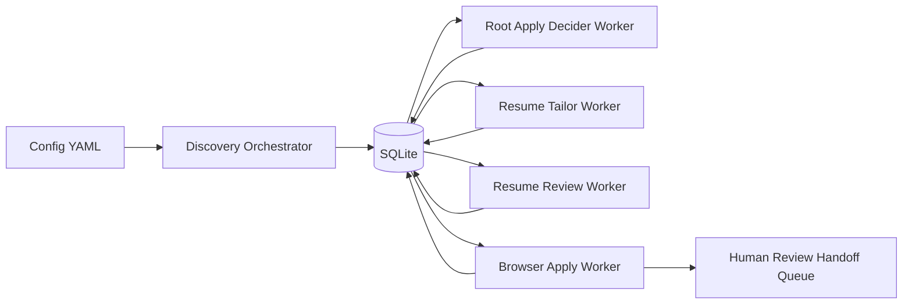
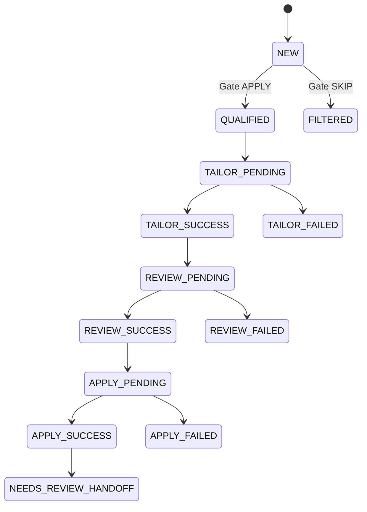

# Agentic Job Applier Specification

## Executive summary

Agentic Job Applier is a Python-first automation system that continuously discovers job postings, normalizes and deduplicates them, and advances them through a staged worker pipeline backed by SQLite. The lifecycle is explicitly queue-driven: discovery writes NEW rows, the gate classifies them, tailoring generates one-page resume artifacts, review decides whether tailored/base output should be used, and apply-stage browser automation captures submission diagnostics and human-review handoffs. The architecture emphasizes deterministic contracts (Pydantic schemas, JSON CLI tool envelopes, SQL claim semantics) so each stage can retry, recover from stale claims, and be audited without ad hoc state. Operationally, systemd units run producer/consumer services, with current apply behavior intentionally review-first (`main.py:524-656`, `scripts/process_new_jobs.py:231-344`, `scripts/process_qualified_jobs.py:360-499`, `scripts/process_reviewed_resumes.py:432-619`, `scripts/process_apply_jobs.py:368-569`, `src/database/db_manager.py:372-455`, `src/database/db_manager.py:1047-1156`, `src/database/db_manager.py:1430-1541`, `src/database/db_manager.py:1862-1979`, `src/agents/apply_worker/browser.py:327-335`).

## Table of contents

- [1. System scope and intent](#1-system-scope-and-intent)
- [2. End-to-end architecture](#2-end-to-end-architecture)
- [3. Pipeline stages](#3-pipeline-stages)
- [4. Data model and state progression](#4-data-model-and-state-progression)
- [5. Interface contracts](#5-interface-contracts)
- [6. Operational model](#6-operational-model)
- [7. Design principles observed](#7-design-principles-observed)
- [8. Key risks, assumptions, and gaps](#8-key-risks-assumptions-and-gaps)
- [9. Reading guide for companion docs](#9-reading-guide-for-companion-docs)

## 1. System scope and intent

The repository’s runtime purpose is to discover internship/early-career jobs from multiple boards, persist a normalized catalog, and automate downstream triage/application preparation using agent-assisted stages (`README.md:3-17`, `main.py:1-5`).

Discovery sources and config-driven targeting:
- Greenhouse companies (`config/companies.yaml:4-88`)
- Workday companies (`config/companies.yaml:89-111`)
- JobSpy-backed boards and search permutations (`config/companies.yaml:112-143`, `main.py:414-521`)
- Title include filters and search criteria (`config/search_criteria.yaml:4-40`, `main.py:555-559`)

## 2. End-to-end architecture

This topology is implemented by `main.py` + stage-specific scripts + stage-specific DB claim APIs (`main.py:524-656`, `scripts/process_new_jobs.py:381-483`, `scripts/process_qualified_jobs.py:547-712`, `scripts/process_reviewed_resumes.py:622-824`, `scripts/process_apply_jobs.py:572-740`, `src/database/db_manager.py:372-455`, `src/database/db_manager.py:1047-1156`, `src/database/db_manager.py:1430-1541`, `src/database/db_manager.py:1862-1979`).

## 3. Pipeline stages

### 3.1 Discovery stage

`run_job_discovery()` loads config, initializes DB, executes source loops, deduplicates inserts, and records crawl/day aggregates (`main.py:545-656`).

Source adapter specifics:
- Greenhouse API + HTML cleanup + salary pattern extraction (`src/fetchers/greenhouse_fetcher.py:103-131`, `src/fetchers/greenhouse_fetcher.py:179-249`).
- Apify Workday actor wrapped in thread executor (`src/fetchers/apify_fetcher.py:115-143`).
- JobSpy scraping and salary annualization (`src/fetchers/jobspy_fetcher.py:121-164`, `src/fetchers/jobspy_fetcher.py:256-308`).

### 3.2 Gate stage (NEW backlog)

The gate worker claims NEW rows atomically, runs ADK-based apply/skip decisions, persists status and serialized agent output, and handles retry/terminal failure semantics (`scripts/process_new_jobs.py:231-344`, `src/database/db_manager.py:372-455`, `src/database/db_manager.py:705-831`).

The decision parser enforces JSON-recoverable APPLY/SKIP only (`src/agents/root_apply_decider/agent.py:122-133`; `tests/test_apply_decider.py:199-217`).

### 3.3 Tailor stage (QUALIFIED backlog)

The tailor worker:
- claims eligible QUALIFIED jobs (`scripts/process_qualified_jobs.py:390-397`);
- copies canonical resume YAML to per-run working YAML (`scripts/process_qualified_jobs.py:418-423`);
- runs the tailor runtime in executor (`scripts/process_qualified_jobs.py:445-451`);
- records success/failure with retry/backoff (`scripts/process_qualified_jobs.py:465-499`, `scripts/process_qualified_jobs.py:289-358`).

Tailor runtime enforces lock constraints and one-page policy with bounded layout fallback (`src/agents/resume_tailor_pi/runtime.py:496-639`, `src/agents/resume_tailor_pi/schemas.py:536-628`).

### 3.4 Review stage (tailor SUCCESS backlog)

The review worker ensures base reference artifacts exist, claims successful tailor runs, invokes review runtime, and persists either verdict-bearing success or fallback-aware failure rows (`scripts/process_reviewed_resumes.py:306-353`, `scripts/process_reviewed_resumes.py:465-619`).

Review runtime contract: only hard operational faults should fail the run (invocation/report/artifact validation), otherwise agent-authored verdict stands (`src/agents/resume_review_pi/runtime.py:265-334`; `tests/test_resume_review_runtime.py:71-177`, `tests/test_resume_review_runtime.py:220-315`).

### 3.5 Apply stage (review SUCCESS with eligible verdicts)

Apply worker claims review-success rows with verdict in PASS/TAILORED/BASE, resolves selected/base resume path, runs Playwright automation, computes confidence, and persists apply diagnostics plus handoff rows for NEEDS_REVIEW outcomes (`src/database/db_manager.py:1912-1914`, `scripts/process_apply_jobs.py:433-569`, `src/agents/apply_worker/browser.py:236-348`, `src/database/db_manager.py:2119-2213`).

Current behavior remains review-first even with `--no-dry-run`; auto-submit path is TODO (`src/agents/apply_worker/browser.py:327-335`).

## 4. Data model and state progression

Primary entities and stage-run tables are defined in `schema.sql` and runtime migrations (`src/database/schema.sql:2-225`, `src/database/db_manager.py:967-1020`, `src/database/db_manager.py:1351-1403`, `src/database/db_manager.py:1745-1835`).

Queue fairness/concurrency invariants are tested directly (atomic non-duplicate claims, FIFO retry ordering) (`tests/test_queue_claim_concurrency_and_fairness.py:46-83`, `tests/test_queue_claim_concurrency_and_fairness.py:116-182`, `tests/test_queue_claim_concurrency_and_fairness.py:185-239`).

## 5. Interface contracts

### 5.1 Deterministic CLI tools for agent subprocesses

Both tailor/review tool CLIs expose explicit subcommands and deterministic JSON envelopes:
- success: `{"ok": true, "result": ...}`
- failure: `{"ok": false, "error": ...}`

(`scripts/resume_tailor_tools.py:30-57`, `scripts/resume_tailor_tools.py:97-171`, `scripts/resume_review_tools.py:35-63`, `scripts/resume_review_tools.py:129-237`).

### 5.2 Resume review completion handshake

Review runtime requires a valid `ReviewReport` artifact; non-FAIL verdicts require selected YAML/TEX/PDF paths (`src/agents/resume_review_pi/schemas.py:112-188`, `src/agents/resume_review_pi/runtime.py:201-263`).

### 5.3 Job-context contract for tooling

Tooling supports exactly-one selector (`job_hash` or `job_id`), and CLI integration tests assert explicit error text on misses (“No job found”) (`src/database/db_manager.py:223-285`, `scripts/resume_tailor_tools.py:111-121`, `tests/test_resume_tailor_cli_integration.py:171-189`).

## 6. Operational model

Recommended deployment model is a timer-driven discovery producer plus continuously running stage workers under systemd (`deploy/README.md:5-10`, `deploy/job-discovery.timer:1-14`, `deploy/job-agent-worker.service:30-35`, `deploy/job-tailor-worker.service:29-37`, `deploy/job-review-worker.service:29-37`, `deploy/job-apply-worker.service:30-38`).

Environment knobs for stage polling/retry/model configuration are documented in `.env.example` (`.env.example:24-79`).

## 7. Design principles observed

1. **Determinism over implicit behavior**
   - Typed schemas and strict parser/report contracts reduce ambiguous outcomes (`src/agents/root_apply_decider/schemas.py:11-49`, `src/agents/resume_review_pi/schemas.py:112-188`).

2. **Queue correctness via SQL transactions**
   - Claims happen in DB transactions with claim tokens and lease windows (`src/database/db_manager.py:403-443`, `src/database/db_manager.py:1077-1148`, `src/database/db_manager.py:1461-1533`, `src/database/db_manager.py:1893-1971`).

3. **Crash recovery as first-class behavior**
   - Stale PENDING cleanup is implemented and invoked at worker startup (`src/database/db_manager.py:1244-1277`, `src/database/db_manager.py:1665-1697`, `src/database/db_manager.py:2262-2294`).

4. **Tool-first agent runtimes**
   - Tailor/review prompts direct agents toward deterministic local tools for DB/YAML/PDF analysis (`src/agents/resume_review_pi/prompts.py:169-222`, `scripts/resume_review_tools.py:203-237`).

## 8. Key risks, assumptions, and gaps

- **Apply-stage auto-submit is not active**: no-dry-run currently still yields NEEDS_REVIEW in browser runtime (`src/agents/apply_worker/browser.py:332-335`).
- **Operational alerting asymmetry**: only gate unit has systemd `OnFailure` hook to alert unit (`deploy/job-agent-worker.service:5` vs `deploy/job-tailor-worker.service:1-37`, `deploy/job-review-worker.service:1-37`, `deploy/job-apply-worker.service:1-38`).
- **Manual deployment templating required**: placeholder user/path values must be replaced (`deploy/job-discovery.service:8-13`, `deploy/job-agent-worker.service:9-13`).
- **Candidate profile context is optional and fallback-based**: if profile file is missing/malformed, fallback prompt context is used (`src/agents/root_apply_decider/prompts.py:197-214`).

## 9. Reading guide for companion docs

- **Need architecture diagrams + boundaries?** → `architecture.md`.
- **Need module ownership details?** → `components.md`.
- **Need CLI/API contract specifics?** → `interfaces.md`.
- **Need table/enum definitions?** → `data_models.md`.
- **Need process flow and lifecycle states?** → `workflows.md`.
- **Need dependency/binary requirements?** → `dependencies.md`.
- **Need caveats/inconsistency audit?** → `review_notes.md`.
