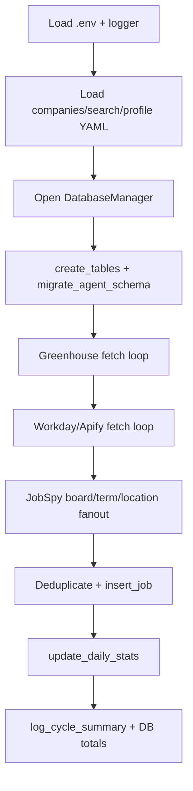
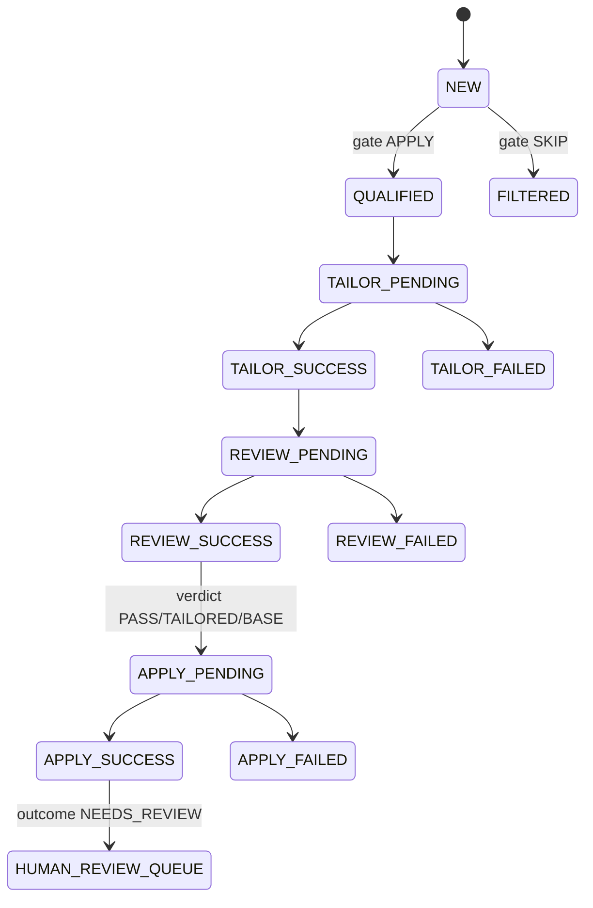

# Workflows

## 1) Discovery workflow (producer)

`run_job_discovery()` executes one cycle:
- load configs;
- create/migrate DB;
- fetch per-source families;
- deduplicate and insert;
- update daily stats;
- log cycle summary (`main.py:524-656`).

Source fan-out implementations: Greenhouse (`main.py:210-293`), Workday (`main.py:295-385`), JobSpy (`main.py:387-521`).

## 2) Gate workflow (NEW → QUALIFIED/FILTERED)

- Worker claims NEW rows atomically (`src/database/db_manager.py:372-455`).
- Runs root decider per job, parses required JSON decision, maps to status (`scripts/process_new_jobs.py:231-344`, `src/agents/root_apply_decider/agent.py:102-141`, `src/agents/root_apply_decider/runtime.py:46-59`).
- Retries transient failures with scheduled `agent_next_retry_at`; marks terminal failures and notifies (`scripts/process_new_jobs.py:281-324`, `scripts/process_new_jobs.py:152-181`).

## 3) Tailor workflow (QUALIFIED → tailor_runs)

- Claims one QUALIFIED job into `tailor_runs` PENDING row (`src/database/db_manager.py:1047-1156`).
- Copies canonical YAML to per-job work YAML, then runs pipeline in executor (`scripts/process_qualified_jobs.py:418-451`).
- On success stores artifact paths/page count; on failure applies retry/backoff/terminal alert logic (`scripts/process_qualified_jobs.py:465-499`, `scripts/process_qualified_jobs.py:289-358`).

Tailor runtime internals:
- content-phase retries;
- lock checks;
- compile/page-measure;
- bounded balanced layout fallback;
- rollback on failures (`src/agents/resume_tailor_pi/runtime.py:496-639`).

## 4) Review workflow (tailor SUCCESS → review_runs)

- Ensures base reference TeX/PDF exists and is current (`scripts/process_reviewed_resumes.py:306-353`).
- Claims eligible tailor success run into `review_runs` (`src/database/db_manager.py:1430-1541`).
- Invokes review runtime and persists success verdict/report or failure diagnostics/fallback refs (`scripts/process_reviewed_resumes.py:530-619`, `src/database/db_manager.py:1543-1664`).

Runtime hard-failure boundaries:
- pi subprocess failure,
- missing/invalid report,
- missing selected artifacts for non-FAIL verdicts (`src/agents/resume_review_pi/runtime.py:294-321`, `src/agents/resume_review_pi/runtime.py:230-263`).

## 5) Apply workflow (review SUCCESS verdicts → apply_runs/handoffs)

- Claims eligible review rows where verdict in `PASS|TAILORED|BASE` (`src/database/db_manager.py:1912-1914`).
- Resolves tailored/base resume path from review verdict (`scripts/process_apply_jobs.py:186-220`).
- Runs Playwright CDP automation: navigate, detect Simplify, upload resume, scan unresolved fields, compute confidence, capture artifacts (`src/agents/apply_worker/browser.py:236-348`).
- Persists apply success/failure and creates handoff row for `NEEDS_REVIEW` outcomes (`scripts/process_apply_jobs.py:502-541`, `src/database/db_manager.py:2119-2213`).

## End-to-end stage progression

State transitions are represented by table status/verdict/outcome fields (`src/database/schema.sql:36-56`, `src/database/schema.sql:99-149`, `src/database/schema.sql:151-225`).

## Operational loop behavior

All worker scripts support one-shot and continuous polling modes with environment-configurable intervals/retry knobs (`scripts/process_new_jobs.py:395-480`, `scripts/process_qualified_jobs.py:560-709`, `scripts/process_reviewed_resumes.py:636-821`, `scripts/process_apply_jobs.py:627-736`, `.env.example:24-79`).
