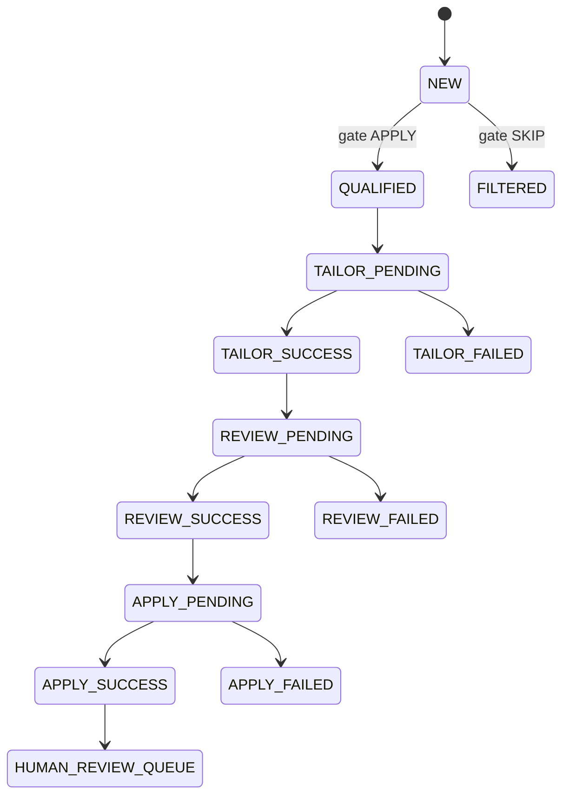

# Workflows

## 1) Discovery Workflow

- `main.py` loads config and DB.
- Fetchers fan out by source.
- Results are deduplicated and inserted into `job_postings`.
- Crawl metrics and daily stats are updated.

## 2) Gate Workflow (`NEW -> QUALIFIED/FILTERED`)

- Worker claims eligible `NEW` rows.
- Runs root apply/skip decider.
- Persists decision, retries, and terminal errors.
- Records gate-stage cost events.

## 3) Tailor Workflow (`QUALIFIED -> tailor_runs`)

- Claims one eligible job.
- Runs resume tailor pipeline.
- Records SUCCESS/FAILED with retry backoff.
- Records tailoring-stage cost events.

## 4) Review Workflow (`tailor_runs SUCCESS -> review_runs`)

- Claims eligible tailor success output.
- Runs resume review runtime.
- Persists verdict artifacts or failure diagnostics.
- Records review-stage cost events.

## 5) Apply Workflow (`review_runs SUCCESS -> apply_runs/handoffs`)

- Claims eligible review run.
- Runs browser apply flow and diagnostics.
- Persists apply run outcome.
- Creates `apply_handoffs` when outcome requires human review.
- Records apply-stage cost events when work was executed.

## 6) Control-Plane Workflow (FastAPI + Dashboard)

- API startup runs idempotent migrations, including cost schema migration.
- Dashboard polls API data via React Query (default 30s interval).
- Mutation endpoints drive:
  - human review completion/dismissal
  - failure retry by stage-qualified ID
  - budget updates
  - settings file uploads/downloads

## End-To-End State Snapshot

