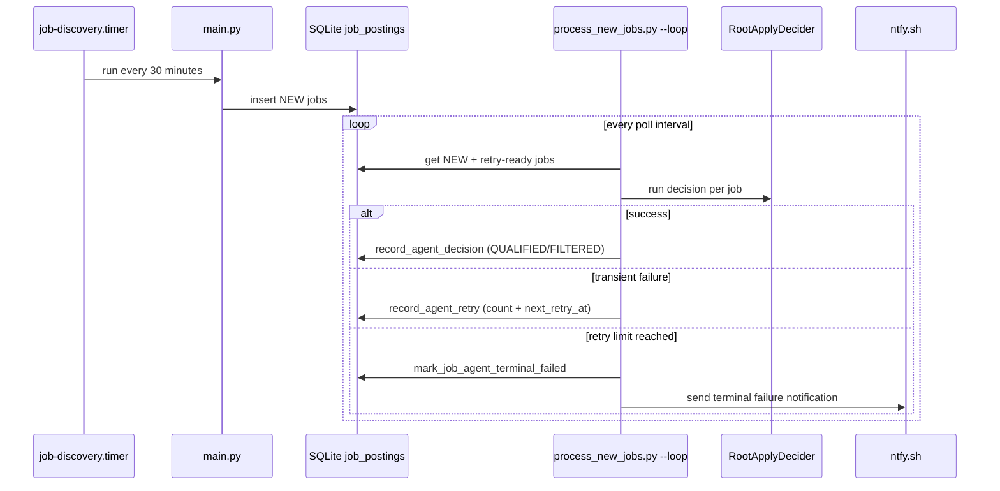
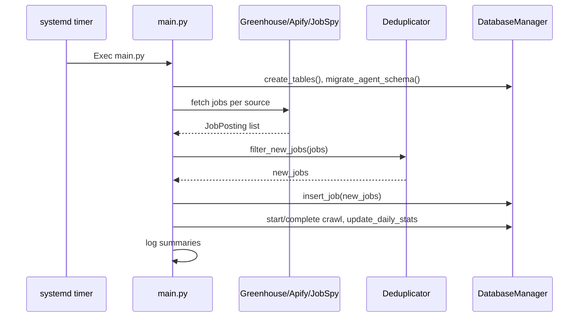

# Workflows

## Autonomous Producer/Consumer Runtime

- Producer: `main.py` via `job-discovery.timer`.
- Consumer: `scripts/process_new_jobs.py --loop` via `job-agent-worker.service`.
- Queue boundary: `job_postings` rows in status `NEW`.

## Job Discovery Cycle

- Trigger: systemd timer every 30 minutes.
- Steps: load configs (`companies`, optional `search_criteria` + `candidate_profile`), fetch per source, dedup, insert NEW rows, update crawl and daily stats.

## One-shot Pipeline Workflow
- Command: `python -m scripts.run_pipeline_once [--limit N]`.
- Sequence:
  1. run one discovery cycle
  2. run one gate-processing batch against current NEW/retry-ready backlog
- Intended for local ops/debug and deterministic integration tests.

## Utility CLIs
- **Query jobs**: filter by company/title/location/remote/new, display results [scripts/query_jobs.py:21-105](scripts/query_jobs.py:21-105).
- **Find/verify Greenhouse ID**: try common patterns or verify an ID [scripts/find_greenhouse_id.py:19-105](scripts/find_greenhouse_id.py:19-105).
- **Smoke-test fetchers**: async checks for Greenhouse (Stripe) and JobSpy (Indeed) [scripts/test_fetchers.py:18-78](scripts/test_fetchers.py:18-78).
- **Single-job decider**: run agent against one job hash, optionally persist [scripts/decide_job.py:32-79](scripts/decide_job.py:32-79).

## Deployment Flow
- Install deps and configure `.env`.
- Configure and install:
  - `job-discovery.service`
  - `job-discovery.timer`
  - `job-agent-worker.service`
  - optional `job-agent-alert@.service`
- Enable both autonomous units:
  - `job-discovery.timer`
  - `job-agent-worker.service`
