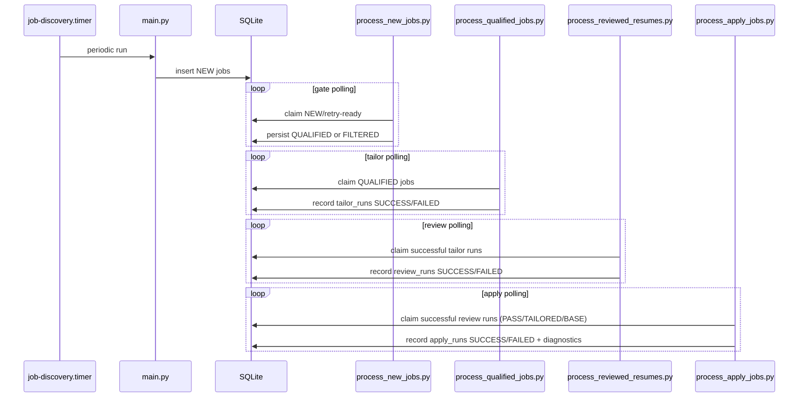

# Workflows

## Full Runtime Pipeline

## Discovery Cycle (`main.py`)
1. Load config files and profile/search defaults.
2. Initialize DB schema/migrations used by discovery/gate stage.
3. Fetch from Greenhouse, Apify Workday, JobSpy.
4. Apply title include-pattern filtering.
5. Deduplicate in-batch and against DB hashes.
6. Insert unseen rows with `status='NEW'`.
7. Record crawl and daily stats.

## Gate Worker (`scripts/process_new_jobs.py`)
1. Claim NEW/retry-ready rows atomically.
2. Run decider model and parse structured decision.
3. On success: persist `QUALIFIED` or `FILTERED`.
4. On transient failure: schedule retry timestamp.
5. On retry exhaustion: mark terminal gate failure and optionally notify via ntfy.

## Tailor Worker (`scripts/process_qualified_jobs.py`)
1. Claim next eligible QUALIFIED job.
2. Prepare per-run working YAML copy.
3. Run one-page tailoring pipeline.
4. Persist SUCCESS/FAILED row in `tailor_runs` with artifacts or error/retry metadata.

## Review Worker (`scripts/process_reviewed_resumes.py`)
1. Claim next eligible successful tailor run.
2. Ensure base comparison artifacts exist.
3. Run review runtime and validate strict report contract.
4. Persist SUCCESS/FAILED row in `review_runs`, including selected artifacts and diagnostics.

## Apply Worker (`scripts/process_apply_jobs.py`)
1. Preflight: validate Playwright import and Chrome CDP reachability.
2. Claim next eligible successful review run with verdict `PASS|TAILORED|BASE`.
3. Resolve resume PDF source (`TAILORED` or fallback `BASE`).
4. Connect to Chrome via CDP and run browser flow:
   - navigate
   - detect/trigger Simplify
   - upload resume
   - scan unresolved fields
   - compute confidence
   - capture screenshot and DOM snapshot
5. Persist `apply_runs` success/failure and retry metadata.
6. For `NEEDS_REVIEW` outcomes, upsert `apply_handoffs` with operator-facing diagnostics.

### Current Behavior Notes
- Default mode is dry-run (`APPLY_DRY_RUN=true`).
- Even with `--no-dry-run`, submit logic is not implemented yet; outcome remains `NEEDS_REVIEW`.
- Worker closes the page after each run and stores artifacts under `data/apply_runs/<job_hash>/`.
- `NEEDS_REVIEW` successes are also persisted into `apply_handoffs` for explicit human review queues.

## One-shot Pipeline
- `python -m scripts.run_pipeline_once --limit N`
- Runs one discovery cycle followed by one gate batch.
- Does not execute tailor/review/apply stages.

## Deployment Flow (Linux/systemd)
1. Configure `.env` and config YAML files.
2. Install dependencies (`uv sync`) and system tools (`latexmk`, poppler, Chrome/Xvfb for apply).
3. Edit service placeholders (user/path).
4. Install units:
   - `job-discovery.service`, `job-discovery.timer`
   - `job-agent-worker.service`
   - `job-tailor-worker.service`
   - `job-review-worker.service`
   - `job-apply-chrome.service`
   - `job-apply-worker.service`
5. Enable timer and workers.

## Operational Checks
- `python -m scripts.status`: current job/crawl/daily and gate retry visibility.
- SQL inspection is currently required for tailor/review/apply run summaries.
