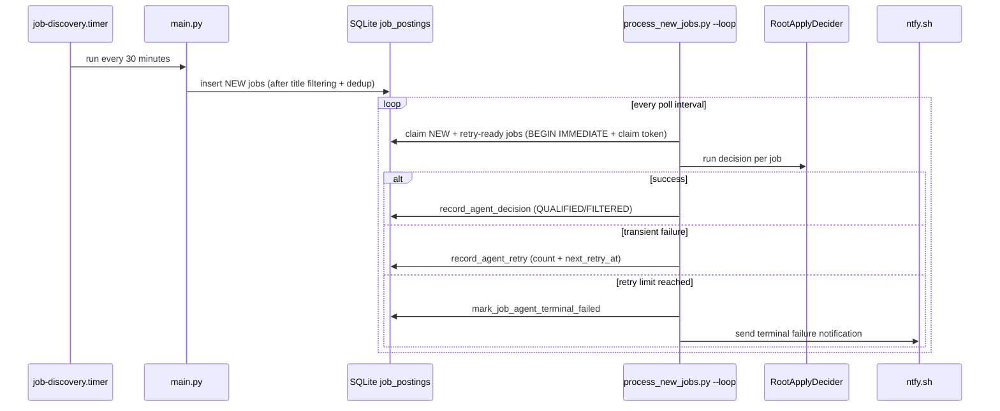
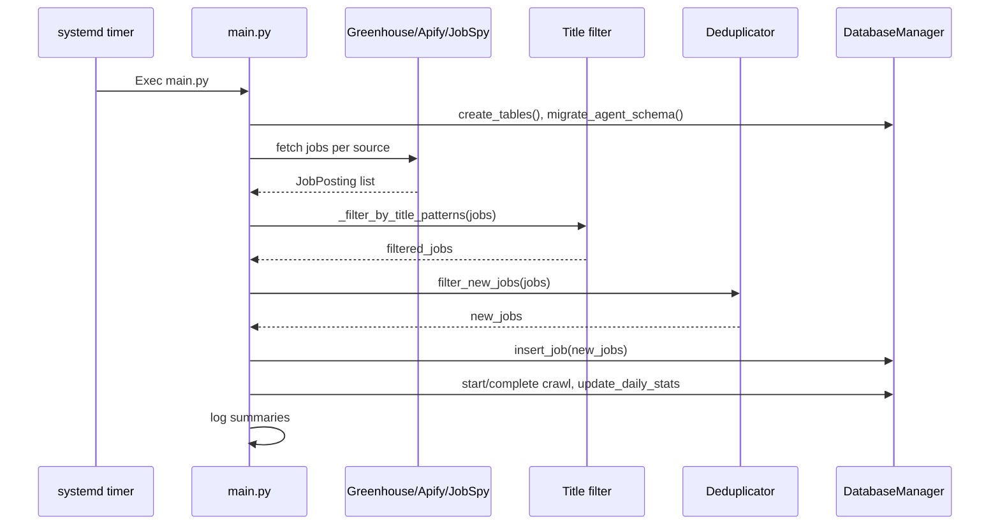
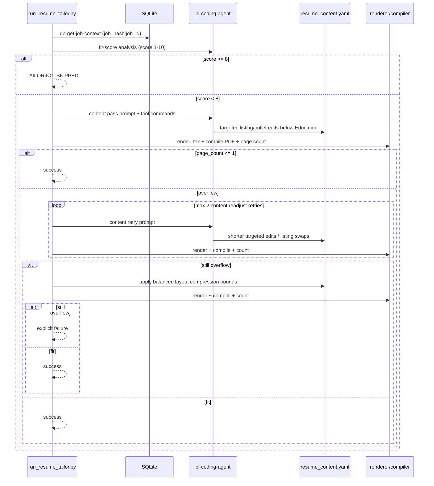
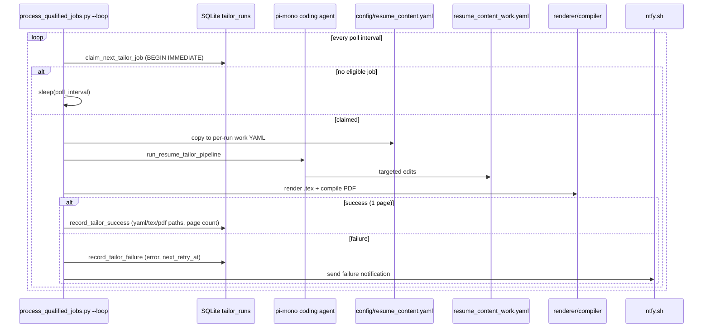
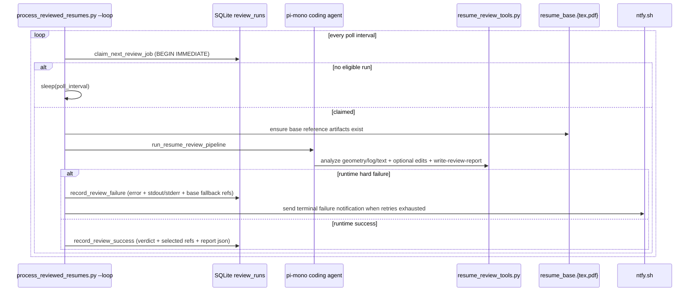

# Workflows

## Autonomous Producer/Consumer Runtime

- Producer: `main.py` via `job-discovery.timer`.
- Consumer: `scripts/process_new_jobs.py --loop` via `job-agent-worker.service`.
- Queue boundary: `job_postings` rows in status `NEW`, claimed via atomic tokens.

## Job Discovery Cycle

- Trigger: systemd timer every 30 minutes.
- Steps: load configs (`companies`, optional `search_criteria` + `candidate_profile`), resolve board search terms, fetch per source, apply title include-pattern filtering, dedup (in-batch + DB lookup), insert NEW rows, update crawl and daily stats.

## One-shot Pipeline Workflow
- Command: `python -m scripts.run_pipeline_once [--limit N]`.
- Sequence:
  1. run one discovery cycle
  2. run one gate-processing batch against current NEW/retry-ready backlog
- Intended for local ops/debug and deterministic integration tests.

## Utility CLIs
- **Query jobs**: filter by company/title/location/remote/new, display results.
- **Find/verify Greenhouse ID**: try common patterns or verify an ID.
- **Smoke-test fetchers**: async checks for Greenhouse (Stripe) and JobSpy (Indeed).
- **Single-job decider**: run agent against one job hash, optionally persist.
- **Resume migration**: convert LaTeX source to canonical YAML (`scripts/migrate_resume_tex_to_yaml.py`).
- **Resume tailor tools**: DB/YAML/render/compile/page-count/backup/restore commands (`scripts/resume_tailor_tools.py`).
- **Resume review tools**: tailor-equivalent commands plus geometry/log/text/report commands (`scripts/resume_review_tools.py`).
- **Resume tailor runner**: one-job pi-mono tailoring loop with one-page enforcement (`scripts/run_resume_tailor.py`).
- **Database status**: terminal summary of pipeline state (`scripts/status.py`).

## Resume Tailor Workflow (On-Demand)

## Autonomous Tailor Worker

- Worker: `scripts/process_qualified_jobs.py --loop` via `job-tailor-worker.service`.
- Queue boundary: `job_postings` rows in status `QUALIFIED` without a SUCCESS tailor_run.
- State: `tailor_runs` table tracks per-attempt PENDING/SUCCESS/FAILED with claim lease.

## Autonomous Review Worker

- Worker: `scripts/process_reviewed_resumes.py --loop` via `job-review-worker.service`.
- Queue boundary: successful `tailor_runs` rows without a successful `review_runs` row.
- State: `review_runs` tracks PENDING/SUCCESS/FAILED, verdicts, report payloads, retry scheduling, and base fallback references.

## Deployment Flow
- Install deps and configure `.env`.
- Install system dependencies: texlive-full, latexmk (for tailor worker).
- Configure and install:
  - `job-discovery.service`
  - `job-discovery.timer`
  - `job-agent-worker.service`
  - `job-tailor-worker.service`
  - `job-review-worker.service`
  - optional `job-agent-alert@.service`
- Enable all autonomous units:
  - `job-discovery.timer`
  - `job-agent-worker.service`
  - `job-tailor-worker.service`
  - `job-review-worker.service`
