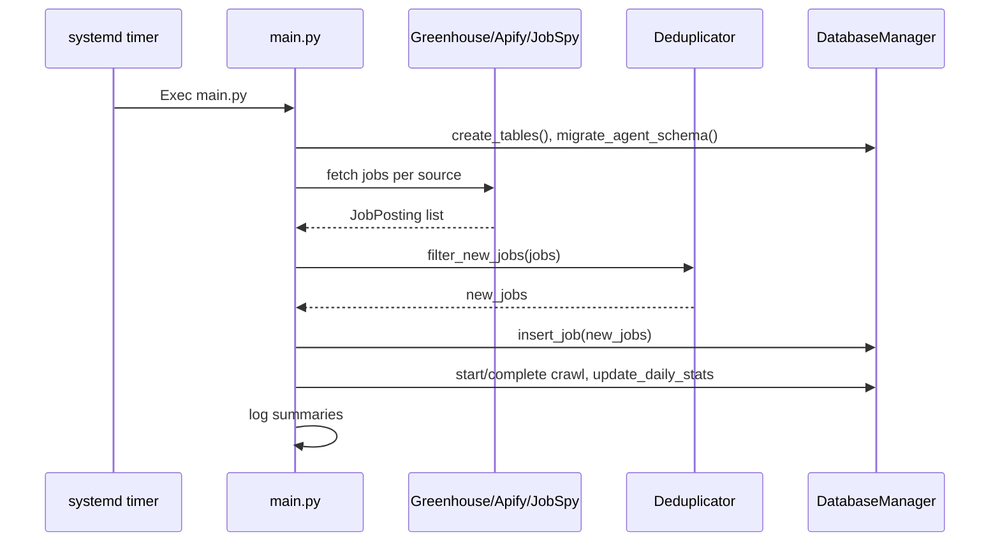
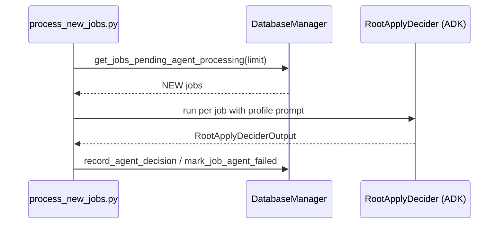

# Workflows

## Job Discovery Cycle

- Trigger: systemd timer every 30 minutes (oneshot service) [deploy/job-discovery.timer:1-12](deploy/job-discovery.timer:1-12).
- Steps: load env/logging, load company configs, fetch per source, dedup and insert, record crawl history and daily stats, log cycle summary [main.py:24-168](main.py:24-168).

## Agent Decision Loop (Phase 2)

- Entry: `scripts/process_new_jobs.py --loop|--once`; loads env, candidate profile, ADK model (stub), processes NEW jobs [scripts/process_new_jobs.py:130-200](scripts/process_new_jobs.py:130-200).
- Model requirement: `get_decider_model()` stub must be implemented; otherwise jobs are skipped with a warning [src/agents/root_apply_decider.py:51-74](src/agents/root_apply_decider.py:51-74) [scripts/process_new_jobs.py:156-164](scripts/process_new_jobs.py:156-164).

## Utility CLIs
- **Query jobs**: filter by company/title/location/remote/new, display results [scripts/query_jobs.py:21-105](scripts/query_jobs.py:21-105).
- **Find/verify Greenhouse ID**: try common patterns or verify an ID [scripts/find_greenhouse_id.py:19-105](scripts/find_greenhouse_id.py:19-105).
- **Smoke-test fetchers**: async checks for Greenhouse (Stripe) and JobSpy (Indeed) [scripts/test_fetchers.py:18-78](scripts/test_fetchers.py:18-78).
- **Single-job decider**: run agent against one job hash, optionally persist [scripts/decide_job.py:32-79](scripts/decide_job.py:32-79).

## Deployment Flow
- Install deps with uv, copy .env, edit systemd service placeholders (User, WorkingDirectory, PATH, ExecStart), install service+timer, enable and verify [deploy/README.md:7-54](deploy/README.md:7-54) [deploy/job-discovery.service:5-17](deploy/job-discovery.service:5-17).
- Timer runs main.py every 30 minutes with randomized delay to avoid thundering herd [deploy/job-discovery.timer:4-12](deploy/job-discovery.timer:4-12).
