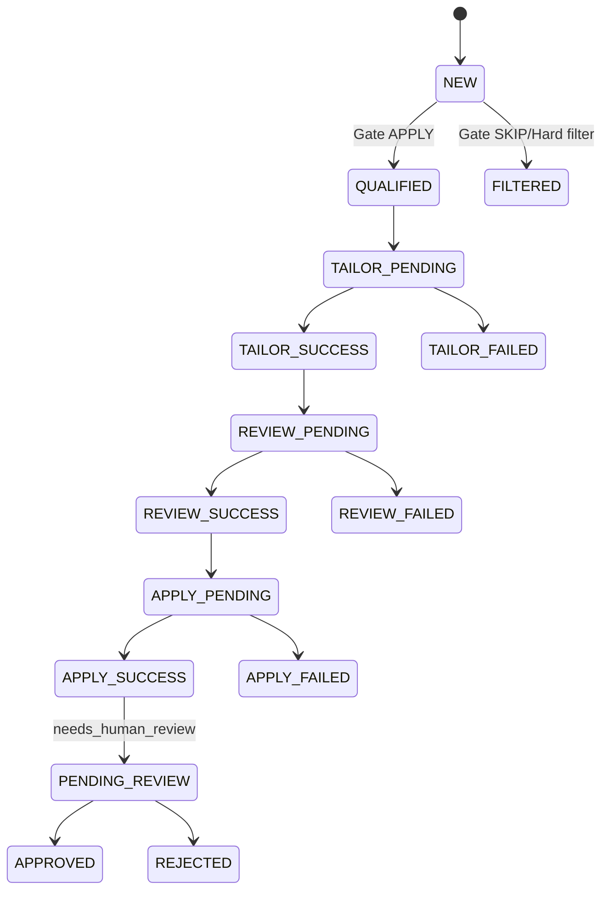

# Workflows

## Pipeline workflow

### 1) Discovery

1. Load config and source settings.
2. Fan out fetchers.
3. Normalize to `JobPosting`.
4. Deduplicate in-batch then against DB.
5. Insert new/qualified rows and update crawl/day metrics.

Evidence: `main.py:220-278`, `main.py:1039-1266`, `src/utils/deduplicator.py:43-107`.

### 2) Gate (`NEW` → `QUALIFIED` / `FILTERED`)

1. Budget check before claim.
2. Claim pending `NEW` jobs.
3. Run apply/skip decision runtime.
4. Persist decision, retries, terminal failure state.
5. Emit stage cost events.

Evidence: `scripts/process_new_jobs.py:51-63`, `scripts/process_new_jobs.py:266-345`, `tests/test_budget_enforcement.py:93-570`.

### 3) Tailor (`QUALIFIED` → `tailor_runs`)

1. Claim one job atomically.
2. Copy baseline resume YAML to per-run working file.
3. Run tailor pipeline.
4. Persist success/failure with retry scheduling.
5. Emit cost event + notifications for terminal failures.

Evidence: `scripts/process_qualified_jobs.py:292-371`, `scripts/process_qualified_jobs.py:404-534`, `tests/test_tailor_yaml_baseline.py:82-317`.

### 4) Review (`tailor_runs SUCCESS` → `review_runs`)

1. Claim review run from successful tailor artifacts.
2. Validate run/job identity and required artifacts.
3. Run review pipeline.
4. Persist verdict/report or failed retry metadata/fallback references.

Evidence: `scripts/process_reviewed_resumes.py:360-457`, `scripts/process_reviewed_resumes.py:493-694`, `tests/test_review_worker.py:129-333`.

### 5) Apply (`review_runs SUCCESS` → `apply_runs` + optional `apply_handoffs`)

1. Claim apply run with claim token.
2. Run browser flow (dry-run default, CDP preflight required).
3. Persist success/failure using claim-token guarded writes.
4. Create handoff when outcome requires human review.

Evidence: `scripts/process_apply_jobs.py:48-55`, `scripts/process_apply_jobs.py:191-273`, `scripts/process_apply_jobs.py:437-859`, `tests/test_apply_worker_and_retry_semantics.py:778-1193`.

## Control-plane workflow (API + dashboard)

- Dashboard polls key views and invalidates on sync/retry/review mutations (`dashboard/src/lib/query-client.ts:1-30`, `dashboard/src/components/layout/topbar-sync.ts:1-8`, `dashboard/src/pages/HumanReviewPage.tsx:382-545`).
- Jobs page uses server-backed query with debounced search, filters, pagination, expandable diagnostics (`dashboard/src/pages/JobsPage.tsx:76-247`, `dashboard/src/pages/JobsPage.tsx:295-386`).
- Settings page supports guided + raw YAML + file upload/download with service-tier gated resume tooling (`dashboard/src/pages/SettingsPage.tsx:2344-3244`).
- Failures page provides stage retry actions; API currently accepts stage-qualified failure IDs (`dashboard/src/pages/FailuresPage.tsx:204-347`, `api/main.py:2527-2629`).

## End-to-end state model

## Operational behavior invariants

- One-shot mode is default for workers; looping is opt-in (`scripts/process_new_jobs.py:385-513`, `scripts/process_qualified_jobs.py:583-745`, `scripts/process_reviewed_resumes.py:697-896`).
- Retry scheduling uses SQLite-compatible datetime formats and exponential/backoff style stage-specific semantics (`tests/test_apply_worker_and_retry_semantics.py:529-775`, `scripts/process_new_jobs.py:266-345`).
- Stage execution is designed to be idempotent after successful completion in deterministic integration tests (`tests/test_full_pipeline_e2e.py:402-484`).
