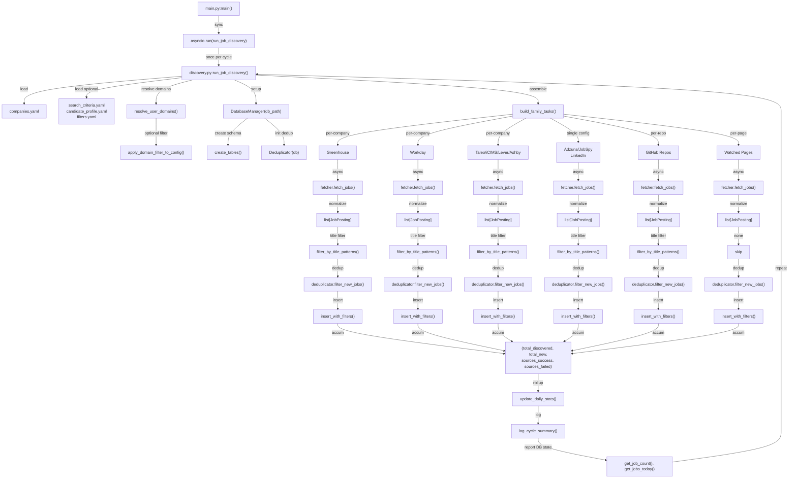

# Discovery & Fetchers Subsystem Architecture Specification

**Last Updated:** 2026-05-25  
**Status:** Authoritative Reference  
**Scope:** Job discovery pipeline from crawl initiation through database insertion

---

## 1. Purpose

The Discovery & Fetchers subsystem is the non-LLM half of the agentic-job-applier pipeline. It crawls 14+ job sources (Greenhouse, Workday, Ashby, Lever, Taleo, iCIMS, LinkedIn, JobSpy, Adzuna, GitHub repos, career pages, and others) on a repeating interval, normalizes raw postings into a shared `JobPosting` model, deduplicates against existing database state, applies pre-gate filtering, and persists new/qualified/soft-filtered jobs to SQLite. Discovery makes no LLM calls and incurs no operational spend; it runs continuously as a background task in the API supervisor, fetching hundreds to thousands of new postings per cycle.

---

## 2. Top-Level Entry Flow

### 2.1 Sync Entry Point → Async Coordinator

```
main.py:main() (sync)
  ↓
main.py:run_discovery_loop() (async, repeating interval)
  ↓
src/orchestrator/discovery.py:run_job_discovery() (async, per-cycle)
```

**Key Details (main.py:58-87):**
- `run_discovery_loop()` is the importable async entrypoint used by the API supervisor (src/orchestrator/discovery.py:100-111)
- Wraps `run_job_discovery()` in a repeating sleep loop with configurable interval (default 30 minutes)
- Catches `asyncio.CancelledError` and re-raises; other exceptions are logged and the loop continues
- Never makes LLM calls, so it runs regardless of autonomous-apply toggle

### 2.2 Cycle Coordinator: Configuration → Fetchers → Database

**Phase 1: Configuration Loading (discovery.py:100-194)**

```python
run_job_discovery()
  → Load companies.yaml (mandatory watchlist config)
  → Load search_criteria.yaml (optional, search terms & include patterns)
  → Load candidate_profile.yaml (optional, user domains & target roles)
  → Load filters.yaml (optional, pre-gate filter rules)
  → Resolve user domains from candidate_profile
  → Apply domain filter to watchlist (pruning per-company ATS sections)
  → Derive Workday searchText from candidate profile
  → Build pre-gate filters (strict & loose variants for EE-friendly tenants)
```

**Evidence:** src/orchestrator/discovery.py:125-194

- Domain filtering (discovery.py:141-165) is optional; untagged companies always match (domains.py:393-394)
- `candidate_profile.yaml` triggers domain inference from `target_roles` if explicit `domains` list is absent (domains.py:204-234)
- Workday CXS anonymous queries default to ~40 results; searchText derived from candidate's target_roles expands to 100s (discovery.py:185-193)

**Phase 2: Database Setup & Shared State (discovery.py:197-201)**

```python
async with DatabaseManager(db_path):
  → create_tables() (schema creation & lightweight migrations)
  → migrate_agent_schema()
  → Initialize Deduplicator(db) for hash-based duplicate filtering
```

**Evidence:** discovery.py:197-201

**Phase 3: Family Task Assembly & Concurrent Execution (discovery.py:216-256)**

```python
build_family_tasks() assembles coroutines for:
  1. Greenhouse (per-company, ATS direct API)
  2. Workday (per-company, CXS public API, with searchText)
  3. Taleo (per-company, OData API)
  4. iCIMS (per-company, JSON API)
  5. Adzuna (single config, job board aggregator)
  6. JobSpy (per-board, multi-source aggregator)
  7. Lever (per-company, ATS direct API)
  8. Ashby (per-company, ATS direct API)
  9. GitHub repos (per-repo, issues scraped for internship postings)
  10. LinkedIn (single config, guest jobs API)
  11. Watched pages (per-page, generic career page scraper)
```

**Evidence:** _family_tasks.py:64-232

- Each family is optional; empty sections are skipped (discovery.py:214-215)
- Families run concurrently via `asyncio.gather(..., return_exceptions=True)` so one slow/hung family doesn't block others (discovery.py:237-240)
- Each family coroutine returns `(total_discovered, total_new, sources_success, sources_failed)` 4-tuple

**Phase 4: Cycle Rollup & Observability (discovery.py:258-286)**

```python
Accumulate totals across all families:
  → total_discovered (sum of all fetched postings)
  → total_new (net new jobs after dedup + filtering)
  → total_duplicate (discovered - new)
  → sources_success (families that completed without exception)
  → sources_failed (families that raised exceptions)

Insert daily_stats row with cycle-level metrics
Log cycle summary to console/file
Report database totals (jobs, jobs added today)
```

**Evidence:** discovery.py:205-286

---

## 3. Fetcher Inventory

| Name | File | Sources Covered | Public Methods | Returns |
|------|------|-----------------|-----------------|---------|
| **Greenhouse** | src/fetchers/greenhouse_fetcher.py | Greenhouse public job boards (any company using Greenhouse ATS) | `async fetch_jobs()` | `list[JobPosting]` |
| **Workday** | src/fetchers/workday_fetcher.py | Workday CXS public API (500+ Enterprise tenants) | `async fetch_jobs()` with optional searchText & description fetch | `list[JobPosting]` |
| **Taleo** | src/fetchers/taleo_fetcher.py | Oracle Taleo public OData API | `async fetch_jobs()` | `list[JobPosting]` |
| **iCIMS** | src/fetchers/icims_fetcher.py | iCIMS public JSON API | `async fetch_jobs()` | `list[JobPosting]` |
| **Adzuna** | src/fetchers/adzuna_fetcher.py | Adzuna job aggregator API | `async fetch_jobs()` with search terms | `list[JobPosting]` |
| **JobSpy** | src/fetchers/jobspy_fetcher.py | Multi-source aggregator (Indeed, LinkedIn guest, Glassdoor, ZipRecruiter, etc.) | `async fetch_jobs()` with search terms | `list[JobPosting]` |
| **Lever** | src/fetchers/lever_fetcher.py | Lever ATS public postings API | `async fetch_jobs()` | `list[JobPosting]` |
| **Ashby** | src/fetchers/ashby_fetcher.py | Ashby public job board API | `async fetch_jobs()` | `list[JobPosting]` |
| **LinkedIn** | src/fetchers/linkedin_fetcher.py | LinkedIn guest jobs API (unauthenticated, rate-limited) | `async fetch_jobs()` with search terms, location, experience level filters | `list[JobPosting]` |
| **GitHub Repos** | src/fetchers/github_repo_fetcher.py | GitHub repo issues (internship posting pattern) | `async fetch_jobs()` per repo | `list[JobPosting]` |
| **Career Page Watcher** | src/fetchers/career_page_watcher.py | Generic HTTP career pages | `async fetch_jobs()` | `list[JobPosting]` |
| **Himalayas** | src/fetchers/himalayas_fetcher.py | Himalayas jobs API | `async fetch_jobs()` | `list[JobPosting]` |
| **Remotive** | src/fetchers/remotive_fetcher.py | Remotive remote jobs API | `async fetch_jobs()` | `list[JobPosting]` |
| **The Muse** | src/fetchers/themuse_fetcher.py | The Muse API | `async fetch_jobs()` | `list[JobPosting]` |
| **Startup Jobs** | src/fetchers/startup_jobs_fetcher.py | Startup Jobs board | `async fetch_jobs()` | `list[JobPosting]` |
| **Working Nomads** | src/fetchers/working_nomads_fetcher.py | Working Nomads remote jobs | `async fetch_jobs()` | `list[JobPosting]` |

**All fetchers inherit from `BaseFetcher` (src/fetchers/base_fetcher.py):**
- Abstract methods: `async fetch_jobs()` and `get_source_name()`
- Async context manager protocol: `__aenter__()` / `__aexit__()`
- Config storage: `self.config` dict and derived `self.source_name`

**Evidence:** base_fetcher.py:10-88

---

## 4. Shared Fetcher Infrastructure

### 4.1 Base Fetcher

**File:** src/fetchers/base_fetcher.py  
**Purpose:** Abstract interface for all job fetchers (lines 10-88)

- Defines `fetch_jobs()` contract (must return `list[JobPosting]`)
- Defines `get_source_name()` contract (must return machine-friendly identifier)
- Provides default async context manager (lines 56-88) — subclasses override for resource setup/teardown
- Stores fetcher-specific `config` dict on initialization

### 4.2 ATS Scanner

**File:** src/fetchers/ats_scanner.py  
**Purpose:** Zero-token direct ATS API scanner for career pages (lines 1-458)

Detects ATS provider from URL and hits JSON APIs directly:
- Greenhouse: `boards-api.greenhouse.io/v1/boards/{id}/jobs`
- Ashby: `api.ashbyhq.com/posting-api/job-board/{id}`
- Lever: `api.lever.co/v0/postings/{id}`
- BambooHR: Minimal support

**Key functions:**
- `detect_ats_provider(url)` (lines 44-67) — pattern-based provider detection
- `_extract_board_id(url, provider)` (lines 70-100) — regex extraction of board ID from URL
- `_matches_title_filter(title, positive, negative)` (lines 103-128) — keyword filtering
- `_fetch_greenhouse_jobs()`, `_fetch_ashby_jobs()`, `_fetch_lever_jobs()` (lines 131-285) — provider-specific fetch logic

**ATSScanner class (lines 288-458):**
- Initializes with list of `PortalConfig` (company name, careers URL, optional provider hint, title filters)
- `fetch_jobs()` (lines 328-360) runs up to `SCAN_CONCURRENCY=10` portal scans in parallel
- Returns combined list of normalized `JobPosting` objects
- No HTTP client created in `__init__`; created in `__aenter__()` to support context manager pattern

### 4.3 Fuzzy Deduplication

**File:** src/fetchers/fuzzy_dedup.py  
**Purpose:** Supplement SHA-256 hash dedup with fuzzy company/role matching (lines 1-128)

**Thresholds:**
- `MIN_TOKEN_OVERLAP = 2` (lines 19)
- `MIN_OVERLAP_RATIO = 0.6` (lines 20)

**Key functions:**
- `normalize_company_name(name)` (lines 23-54) — strips punctuation, removes corporate suffixes (Inc, Ltd, Corp, LLC, etc.), collapses whitespace
- `_tokenize_role(title)` (lines 57-67) — splits title into meaningful tokens, filters stopwords
- `roles_are_similar(title_a, title_b)` (lines 70-98) — returns true if overlap ≥ MIN_TOKEN_OVERLAP and ratio ≥ MIN_OVERLAP_RATIO
- `is_fuzzy_duplicate(new_company, new_title, existing_company, existing_title)` (lines 101-127) — combines normalized company match + fuzzy role similarity

**Not currently integrated into core dedup path.** Primary dedup is hash-based via `Deduplicator.filter_new_jobs()` (see section 4.5).

### 4.4 Liveness Checker

**File:** src/fetchers/liveness_checker.py  
**Purpose:** Verify whether job posting URLs are still active (lines 1-152)

**Checks performed (in order):**
1. HTTP status code (404/410 → expired, 2xx → continue)
2. Expired signal patterns (lines 21-36) — "this job is no longer available", "position has been filled", "no longer accepting applications", etc.
3. Apply button presence (lines 39-49) — `<button>apply</button>`, `<a>apply</a>`, class/id matching "apply", language variants
4. Content length (line 52) — minimum 300 chars of text content as proxy for real job page vs. redirect shell

**Result enum (lines 55-60):**
- `ACTIVE` — apply mechanism found
- `EXPIRED` — explicit expired signal matched
- `UNCERTAIN` — ambiguous (no apply button but content present)

**Main async function (lines 63-95):**
- `check_liveness(url, client=None)` — returns `(LivenessResult, reason_str)` tuple
- Creates own HTTP client if not provided
- Timeout: `LIVENESS_TIMEOUT_SECONDS = 10.0` (line 18)

**Not currently invoked in discovery loop.** Available for post-fetch filtering or stale-job detection.

### 4.5 Error Handling

**File:** src/fetchers/errors.py  
**Purpose:** Typed exceptions for fetcher failures (lines 1-15)

- `FetchError(RuntimeError)` — raised by fetcher when network/provider error occurs (vs. valid empty-result crawl)
- Used by orchestrators to distinguish crawl failures from empty results in metrics

---

## 5. Config Inputs

### 5.1 Configuration Files

**Location:** `config/` directory (referenced from discovery.py:128)

| File | Required? | Loader | Consumed By |
|------|-----------|--------|-------------|
| `companies.yaml` | **YES** | `load_yaml()` (main.py:33) | discovery.py:129; domains.py filtering; family_tasks.py per-company loops |
| `search_criteria.yaml` | Optional | `load_optional_yaml()` (main.py:34) | discovery.py:130; `include_title_patterns`, `default_search_terms` |
| `candidate_profile.yaml` | Optional | `load_optional_yaml()` (main.py:35) | discovery.py:131; domain inference via domains.py:204-234 |
| `filters.yaml` | Optional | `load_optional_yaml()` (main.py:36) | discovery.py:134; JobFilter instantiation for pre-gate filtering |

**Evidence:** discovery.py:128-134

### 5.2 YAML Schema (companies.yaml)

**Watchlist sections** (domain-filtered if user domains are set):
- `greenhouse_companies: {name: {greenhouse_id, industry?, ...}, ...}`
- `workday_companies: {name: {workday_url, industry?, ...}, ...}`
- `taleo_companies: {name: {taleo_url, industry?, ...}, ...}`
- `icims_companies: {name: {icims_url, industry?, ...}, ...}`
- `lever_companies: {name: {lever_url, industry?, ...}, ...}`
- `ashby_companies: {name: {ashby_url, industry?, ...}, ...}`

**Search-term sections** (NOT filtered by domain):
- `adzuna: {enabled, ...}` — enabled flag gates entire Adzuna fetch
- `job_boards: {board_name: {enabled, ...}, ...}` — per-board enabled flag
- `linkedin: {enabled, ...}` — enabled flag gates entire LinkedIn fetch
- `github_repos: [{enabled?, domains?, ...}, ...]` — list of repo configs, per-entry enabled flag + optional domains field
- `watched_pages: [{...}, ...]` — generic career page list

**Evidence:** _family_tasks.py:97-230

### 5.3 Domain Taxonomy

**User-facing domains** (8 choices, stored in candidate_profile.yaml):
- `software_tech`
- `civil_construction`
- `hardware_semis`
- `healthcare`
- `life_sciences`
- `finance`
- `consumer_retail`
- `energy_industrial`

**Company-level granular industries** (e.g., companies.yaml's `industry` field):
- Expanded via `DOMAIN_TO_INDUSTRIES` mapping (domains.py:55-82)
- Examples: `semiconductor`, `pharma_biotech`, `civil_engineering`, `finance_banking`, etc.

**Evidence:** domains.py:29-82

### 5.4 Environment Variables

- `LOG_FILE` (default: `logs/job_monitor.log`) — log output path
- `LOG_LEVEL` (default: `INFO`) — logging verbosity
- `RUN_INTERVAL_MINUTES` — interval for repeating discovery cycle (if set, used by run_discovery_loop)
- Database path — resolved via `resolve_database_path()` in src/utils/paths.py

**Evidence:** main.py:109-111

---

## 6. Dedup & Filtering

### 6.1 Hash-Based Deduplication (Primary)

**File:** src/utils/deduplicator.py (lines 9-108)

**Hash computation (JobPosting.job_hash property):**
- Identity fields: source, company, title, location, posted_date, canonicalized source_url, description SHA-256, requirements SHA-256
- Hashing done in JobPosting.py:82-108 (property @job_hash)
- URL normalization (JobPosting._canonicalize_url) strips query params used for tracking

**Deduplicator workflow (filter_new_jobs):**
1. In-batch dedup: deduplicate within response before DB lookup (lines 46-51)
2. DB lookup: `get_existing_job_hashes([job.job_hash for job in unique_jobs])` (line 53)
3. Filter: return only jobs not in existing_hashes set (lines 57-61)

**Evidence:** deduplicator.py:26-68; job_posting.py:82-108

### 6.2 Title Pattern Filtering (Optional)

**File:** src/orchestrator/insert_pipeline.py:21-29

```python
filter_by_title_patterns(jobs, include_patterns: list[str])
  → Compile patterns with re.IGNORECASE
  → Keep only jobs where at least one pattern matches title
```

Applied by each family before dedup (e.g., greenhouse.py:68).

**Evidence:** insert_pipeline.py:21-29; greenhouse.py:67-69

### 6.3 Pre-Gate Filtering (Hard/Soft)

**File:** src/orchestrator/insert_pipeline.py:41-100 + src/filters/job_filter.py

**Filter actions:**
- `REJECT` — hard-reject, not inserted, counted as hard_rejected
- `REJECT_FILTERED` — soft-reject, inserted with status="FILTERED", counted as soft_filtered
- `ACCEPT_QUALIFIED` — auto-qualified, inserted with status="QUALIFIED", counted as inserted_qualified
- `ACCEPT_NEW` — normal accept, inserted with default status, counted as inserted_new

**Filter instantiation:**
- `job_filter = JobFilter(filters_config)` (discovery.py:181) — strict filter
- `loose_job_filter = build_loose_filter(filters_config)` (discovery.py:182) — relaxed filter for EE-friendly Workday tenants

**Evidence:** discovery.py:178-183; insert_pipeline.py:67-100

---

## 7. Insert Pipeline

**File:** src/orchestrator/insert_pipeline.py (lines 41-127)

**Entry point:** `insert_with_filters(jobs, db, job_filter, counters=None)`

**Workflow per job:**
1. Apply filter (if configured): `job_filter.filter_job(job)` → (action, reason)
2. Convert to DB dict: `job.to_db_dict()`
3. Route by action:
   - **REJECT**: skip, increment hard_rejected counter
   - **REJECT_FILTERED**: set status="FILTERED", insert, increment soft_filtered counter
   - **ACCEPT_QUALIFIED**: set status="QUALIFIED", insert, increment inserted_qualified counter
   - **ACCEPT_NEW** (default): insert with default status, increment inserted_new counter
4. Database insertion (await): `db.insert_job(db_dict)` (returns bool was_inserted)
5. Return 4-tuple: `(inserted_new, inserted_qualified, soft_filtered, hard_rejected)`

**Late-bound resolution (lines 103-127):**
- Per-fetcher modules call `resolve_insert_with_filters()` at runtime
- Looks up `main._insert_with_filters` if available (for test mocking), else returns production `insert_with_filters`

**Evidence:** insert_pipeline.py:41-127

---

## 8. Domain Handling

**File:** src/orchestrator/domains.py (lines 1-395)

**Purpose:** Two-level domain taxonomy + watchlist filtering

### 8.1 User Domains (Broad, 8 choices)

Stored in candidate_profile.yaml under `profile.domains`. Examples:
- `software_tech`, `civil_construction`, `hardware_semis`, `healthcare`, `life_sciences`, `finance`, `consumer_retail`, `energy_industrial`

**Inference from target_roles (domains.py:159-181):**
- `infer_domains_from_target_roles(target_roles)` — matches keywords in role strings (e.g., "civil engineer" → civil_construction)
- Used as fallback when explicit domains not set (domains.py:204-234)

### 8.2 Company-Level Industries (Granular)

Stored in companies.yaml per company under `industry` field. Examples:
- `semiconductor`, `pharma_biotech`, `civil_engineering`, `finance_banking`, `software_tech`, etc.

**Expansion mapping (domains.py:55-82):**
```python
DOMAIN_TO_INDUSTRIES = {
    "software_tech": {"software_tech", "telecom"},
    "hardware_semis": {"semiconductor", "manufacturing_automotive", "telecom"},
    ...
}
```

### 8.3 Filtering Workflow

**Watchlist sections filtered (domains.py:277-284):**
- `greenhouse_companies`, `workday_companies`, `icims_companies`, `taleo_companies`, `lever_companies`, `ashby_companies`

**List sections with per-entry domains (domains.py:289):**
- `github_repos` — each entry may declare `domains: [...]` for per-repo filtering

**Search-term sections NOT filtered:**
- `linkedin`, `job_boards` (adzuna, jobspy), `watched_pages` — these are search-driven, already domain-relevant by construction

**Filtering logic (domains.py:237-270 + 292-327):**
- `filter_companies_by_domain(section, user_domains)` — for watchlist dicts
- `filter_list_section_by_domain(entries, user_domains)` — for list sections
- **Catch-all**: untagged companies/entries (no industry / no domains field) always pass (domains.py:393-394)

**Entry point: discovery.py:153-155**
```python
companies_config = apply_domain_filter_to_config(companies_config, user_domains)
```

**Evidence:** domains.py:1-395; discovery.py:140-165

---

## 9. Crawl Metrics & Observability

### 9.1 Crawl History Table

**Tracked by:** DatabaseManager.start_crawl() / complete_crawl()

**Per-crawl fields:**
- source (e.g., "greenhouse", "workday")
- source_name (company name or board identifier)
- jobs_found (total discovered in crawl)
- jobs_new (net new after dedup + filtering)
- error (exception message, if any)
- duration (wall-clock seconds)
- timestamp

**Evidence:** greenhouse.py:63, 86-90, 99-104

### 9.2 Daily Stats Table

**Rolled up after all families complete (discovery.py:260-268):**

```python
await db.update_daily_stats(
    date=today,
    jobs_discovered=total_discovered,
    jobs_new=total_new,
    jobs_duplicate=total_duplicate,
    sources_crawled=sources_success,
    sources_failed=sources_failed,
)
```

**Accessible via:** `db.get_job_count()`, `db.get_jobs_today()` (lines 284-286)

### 9.3 Logging

**Cycle banner (discovery.py:116-119):**
- Timestamp ISO format
- Marks cycle start for systemd/cron/interactive log review

**Family-level summaries (log_crawl_summary calls):**
- per-family totals before accumulation
- Called by each family orchestrator (greenhouse.py:79-85)

**Cycle summary (log_cycle_summary call, discovery.py:273-280):**
- total_discovered, total_new, total_duplicate, sources_success, sources_failed, duration
- Printed after all families complete

**Database snapshot (discovery.py:284-286):**
- Logged total jobs in DB + jobs added today
- Distinguishes "quiet day" from "failed to insert"

**Evidence:** discovery.py:112-286; greenhouse.py:79-85; src/utils/logger.py

---

## 10. Notable Design Choices, Gotchas & Known Risks

### 10.1 Monkeypatch-Friendly Architecture

**Problem:** Tests need to substitute fetcher classes and orchestrator functions without modifying imports.

**Solution:** Late-bound attribute resolution via `main` module (lines 59-80 in discovery.py, lines 36-55 in _family_tasks.py, lines 19-43 in _resolve.py).

- Discovery and family tasks look up attributes on the `main` module at call time
- Tests patch `main.GreenhouseFetcher`, `main.fetch_greenhouse_jobs`, `main._insert_with_filters` before calling `run_job_discovery()`
- Production code uses direct imports, so no test harness overhead

**Risk:** If `main` is imported after patches are set, the lookups may use the original unpatched class. Test suite must import `main` after all patches are applied.

**Evidence:** discovery.py:59-80, _family_tasks.py:36-62, _resolve.py:19-43, insert_pipeline.py:103-127

### 10.2 Concurrent Family Execution with Exception Isolation

**Problem:** One slow/hung family (e.g., Workday tenant returning 800+ jobs) stalls the entire cycle.

**Solution:** `asyncio.gather(..., return_exceptions=True)` (discovery.py:237-240).

- Each family is an independent coroutine
- If one raises, others continue
- Exception is returned in results tuple and caught at rollup (discovery.py:241-250)
- Sources_failed counter incremented per exception family

**Risk:** A family that hangs without raising (e.g., infinite loop in fetch) will block that entire family's coroutine. Workday orchestrator mitigates with `asyncio.wait_for()` timeout (workday.py:99, 120s per-company).

**Evidence:** discovery.py:214-256, _family_tasks.py:94-232, workday.py:27 + 99-100

### 10.3 Domain Filter Catch-All

**Problem:** As company watchlist grows, many entries lack `industry` tags.

**Solution:** Untagged companies always match any user domain selection (domains.py:393-394).

**Consequence:** A user with `domains=[hardware_semis]` will still crawl every Workday company that has no industry tag. This is intentional — prevents silent data loss.

**Maintenance burden:** Keeping industry tags in sync with new companies is a manual process.

**Evidence:** domains.py:237-270, 367-394; discovery.py:136-139

### 10.4 Workday Search Text Derivation

**Problem:** Workday CXS anonymous API returns only ~40 default-sorted results per tenant. Enterprise tenants (Merck, J&J) host 800+ real openings.

**Solution:** Pass searchText token derived from user's `target_roles` (discovery.py:188-193).

**Implementation:** `resolve_workday_search_text()` picks first match from priority list `_WORKDAY_SEARCH_TOKEN_PRIORITY = ("intern", "co-op", "new grad", "junior", "early career")` (config_loader.py:35-41).

**Effect:** Typically expands results from 40 to 200-400 per tenant.

**Risk:** If user's target_roles contain none of these keywords (e.g., "Senior Software Engineer"), searchText remains empty and results stay capped at ~40.

**Evidence:** config_loader.py:35-41; discovery.py:188-193; workday.py:44-65

### 10.5 Loose Filter for EE-Friendly Tenants

**Problem:** Strict pre-gate filter requires `domain + intern` title pattern. "Engineering Intern" titles at semiconductor/aerospace companies match. But "Process Engineering Intern" or "Hardware Engineering Intern" don't explicitly contain "intern" after title tokenization.

**Solution:** Workday orchestrator accepts optional `loose_job_filter` and applies it to tenants tagged with EE-friendly industries (workday.py:43-60, line 14 imports EE_FRIENDLY_INDUSTRIES).

**Consequence:** Same company may be filtered strictly in one family (Greenhouse) but loosely in Workday if it's tagged as `industry=semiconductor`.

**Evidence:** workday.py:14, 43-60; config_loader.py:23-29

### 10.6 In-Batch Dedup Before DB Lookup

**Problem:** Fetchers sometimes return duplicate rows within a single response (e.g., LinkedIn pagination artifacts). Naive DB dedup would do separate lookups per duplicate.

**Solution:** `filter_new_jobs()` first deduplicates within batch via `seen_in_batch` set (deduplicator.py:41-51), then batches the DB lookup.

**Effect:** Reduces DB query count and catches intra-response duplicates before persistence.

**Evidence:** deduplicator.py:26-68

### 10.7 No Soft-Delete or Stale-Job Detection

**Problem:** Job postings remain in database even after they expire or are manually closed.

**Status:** Liveness checker exists (`check_liveness()`) but is not integrated into discovery loop.

**Consequence:** Database accumulates 1000s of stale postings over time. Users see expired jobs unless they're manually filtered out upstream (agent applies to expired posting and fails).

**Future work:** Integrate liveness_checker into discovery cycle or implement scheduled stale-job purge.

**Evidence:** liveness_checker.py:63-152; not called anywhere in orchestrator

### 10.8 LinkedIn Rate Limiting

**Problem:** LinkedIn actively rate-limits scrapers and detects automation.

**Solution:** LinkedIn fetcher includes (linkedin_fetcher.py:34-46):
- Random delays between page requests (MIN_DELAY_SECONDS=8, MAX_DELAY_SECONDS=20)
- Exponential backoff on HTTP 429 (_BACKOFF_SECONDS=[60, 120, 300])
- Browser-like headers (Chrome 120 UA)
- curl_cffi for TLS fingerprinting obfuscation

**Risk:** IP blocking if scraping is too aggressive. Conservative polling intervals (30+ min cycle) + proxy support (via curl_cffi ProxySpec) recommended.

**Evidence:** linkedin_fetcher.py:1-89

### 10.9 Return Type Inconsistency: Deduplicator.get_stats()

**Deduplicator has two methods with different return types:**
- `filter_new_jobs()` returns `list[JobPosting]` (filtered, mutates intent)
- `get_stats()` returns `dict[str, int]` (non-destructive reporting)

**Design:** Allows callers to get dedup counts without side-effects. Used in some reporting paths but not in main discovery flow.

**Evidence:** deduplicator.py:70-108

---

## 11. Flowchart: Discovery Cycle



---

## 12. Summary Table: Key Files & Responsibilities

| File | Lines | Responsibility |
|------|-------|-----------------|
| main.py | 58-87 | Async entry point, environment loading, top-level exception handling |
| src/orchestrator/discovery.py | 100-287 | Cycle coordinator: config loading, family task assembly, rollup metrics |
| src/orchestrator/_family_tasks.py | 64-232 | Per-family task factory, resolves each family coroutine |
| src/orchestrator/fetchers/*.py | per-file | Per-ATS/source orchestration wrapper (Greenhouse, Workday, etc.) |
| src/orchestrator/insert_pipeline.py | 41-127 | Filter routing, DB insertion, counter tracking |
| src/fetchers/base_fetcher.py | 10-88 | Abstract base class, async context manager protocol |
| src/fetchers/*_fetcher.py | per-file | Concrete fetcher: network request, response parsing, normalization |
| src/fetchers/ats_scanner.py | 288-458 | Zero-token ATS API direct scanner (multi-provider support) |
| src/fetchers/fuzzy_dedup.py | 1-128 | Fuzzy company/role matching (not integrated) |
| src/fetchers/liveness_checker.py | 63-152 | URL liveness checking (not integrated) |
| src/fetchers/errors.py | 1-15 | FetchError exception type |
| src/utils/deduplicator.py | 9-108 | Hash-based duplicate filtering, in-batch dedup optimization |
| src/models/job_posting.py | 48-200+ | Normalized posting model, SHA-256 job_hash computation |
| src/orchestrator/config_loader.py | 1-200+ | YAML loading, list/int normalization, Workday search text derivation |
| src/orchestrator/domains.py | 1-395 | Domain taxonomy, company filtering, inference logic |

---

## Conclusion

The Discovery & Fetchers subsystem is the plumbing that keeps the job pipeline fed. It is:
- **Non-LLM, low-cost**: Makes no API calls to Claude/OpenAI; runs continuously without spend
- **Concurrent but resilient**: 11+ fetcher families run in parallel without blocking each other
- **Configurable and extensible**: New sources are added as fetchers, new filtering logic via config
- **Observability-first**: Crawl history, daily stats, and per-source error tracking enable operational debugging
- **Test-friendly**: Monkeypatch architecture makes unit testing easy; late-bound resolution prevents import-time conflicts

Future enhancements should focus on: (1) integrating liveness checking to purge stale jobs, (2) adding fuzzy dedup to primary path, (3) supporting proxy rotation for rate-limited sources like LinkedIn, (4) adding job description enrichment from browser JS execution.

