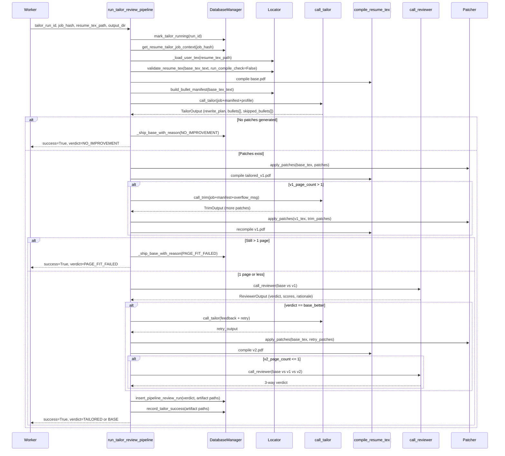
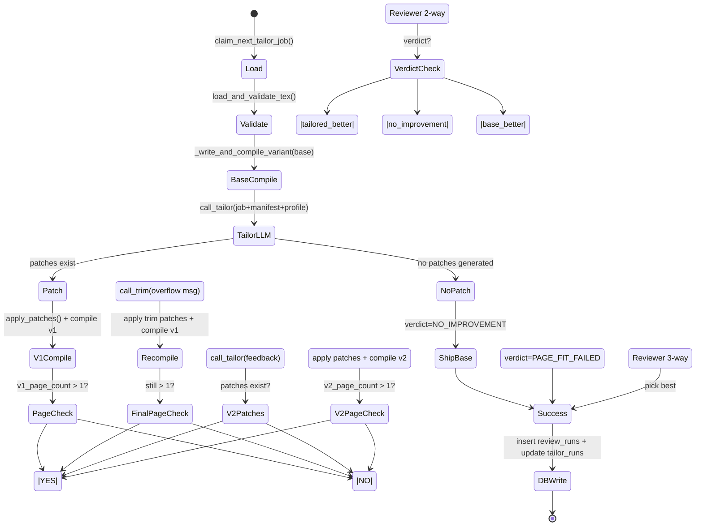

# Resume Tailor + Review Pipeline: Architecture Specification

**Subsystem:** QUALIFIED → tailored resume + review verdict (Phase 2 implementation)

**Last updated:** 2026-05-25

---

## 1. Purpose

The resume tailor + review pipeline is a novel, deterministic, LaTeX-native system that takes a QUALIFIED job posting and produces a tailored single-page resume variant ranked by a reviewer against the base. It is **one unified pipeline** (not two workers) because:

- **Compile once, patch in-memory N times**: The base PDF is compiled once at pipeline start; all tailored variants are patched in-memory from the base `.tex` source and recompiled. This eliminates redundant I/O.
- **Reviewers need both inputs**: The reviewer agent compares base vs. tailored side-by-side and must see both `.tex` sources; separating tailor and review workers would require async handoff and duplicate artifact management.
- **Feedback loop is tight**: When the reviewer prefers base, a single retry tailor pass is triggered *within the same pipeline execution* with the reviewer's critique; keeping orchestration in one place keeps control flow readable.

The pipeline's execution model:

- **Worker daemon** (`scripts/process_qualified_jobs.py`): autonomous or both mode → polls for QUALIFIED jobs, claims one, runs the pipeline.
- **User-triggered (opt-in)**: `POST /api/jobs/{job_hash}/tailor` enqueues a `FastAPI.BackgroundTask` that runs the same pipeline function with its own `DatabaseManager`.
- **Database ownership**: The pipeline owns *every* DB write — marking runs RUNNING, SUCCESS, FAILED; inserting review_runs rows; recording cost. No split responsibility.

---

## 2. Worker Entry Flow

**File:** `/Users/jspags/Projects/agentic-job-applier/scripts/process_qualified_jobs.py`

### Mode Gating

The worker reads `automation.tailor_mode` from `system_settings` on every poll cycle (lines 309–315):

```
TAILOR_MODE_KEY = "tailor_mode"
OPT_IN_MODE = "opt_in"
AUTONOMOUS_MODES = {"autonomous", "both"}

mode = await db.get_automation_mode(TAILOR_MODE_KEY)
if mode == OPT_IN_MODE:
    # Skip claiming; only run stale-row sweep
    return 0
if mode not in AUTONOMOUS_MODES:
    # Warn and treat as opt_in
    return 0
```

### Claim Semantics

`claim_next_tailor_job()` (line 216) returns:
- A row from `tailor_runs` where `status='PENDING'` and `next_retry_at <= NOW`.
- The claimer is granted a lease of `DEFAULT_TAILOR_CLAIM_LEASE_SECONDS` (7200s default, env override via `TAILOR_CLAIM_LEASE_SECONDS`).
- Maximum retry budget is checked; the claim respects `max_retries` parameter (default 2, env override via `TAILOR_MAX_RETRIES`).
- Returns `None` if no claimable job exists.

### Stale-Run Sweep

Every cycle, **regardless of mode** (line 305):

```python
stale_count = await db.mark_stale_tailor_runs_failed(lease_seconds=lease_seconds)
```

This marks any PENDING/RUNNING row whose `started_at + lease_seconds < NOW` as FAILED. Ensures crashed runs (worker OOM, network partition) are eventually reaped without operator intervention.

### Pipeline Invocation

When a job is claimed (line 246):

```python
result: TailorRunResult = await run_tailor_review_pipeline(
    db=db,
    tailor_run_id=run_id_raw,
    job_hash=job_hash,
    base_resume_tex_path=resume_tex_path,
    candidate_profile_yaml_path=candidate_profile_yaml_path,
    output_dir=run_output_dir,
)
```

The result carries `success`, `verdict`, `error`, and artifact paths. The worker logs and optionally notifies on terminal failure (after max_retries exhausted); the DB is already updated by the pipeline.

---

## 3. `run_tailor_review_pipeline` Step-by-Step

**File:** `/Users/jspags/Projects/agentic-job-applier/src/agents/resume_tailor/pipeline.py` (lines 535–964)

A high-level walkthrough of the 13-step orchestrator:



### Step-by-step detail:

1. **Mark RUNNING** (line 573): Update `tailor_runs.status = 'RUNNING'`
2. **Load job context** (line 575): Fetch job posting, title, description from DB
3. **Opportunistic JD enrichment** (line 588): For LinkedIn/iCIMS rows, attempt to backfill missing description; swallow failures
4. **Load + re-validate .tex** (lines 600–617): Read disk, validate contract (compile check skipped — Phase 0 enforced at upload), catch drift
5. **Compile base PDF** (lines 627–639): Write `base.tex`, run tectonic/latexmk, capture page count
6. **Build bullet manifest** (line 642): Extract all `experience` and `projects` bullets with stable IDs and byte offsets
7. **Tailor LLM** (lines 645–659): Send job+manifest+profile to the tailor model (default `openai/gpt-5.4`), get `TailorOutput` with rewrite proposals
8. **Resolve patches** (lines 665–668): Map bullet IDs to byte offsets via manifest; drop unknown IDs and `keep` actions
9. **No patches case** (lines 670–699): If tailor proposed nothing or all IDs dropped → ship base with verdict `NO_IMPROVEMENT`
10. **Apply patches + compile v1** (lines 701–746): Splice rewrites into base `.tex`, write `tailored_v1.tex`, compile. If >1 page, call trim LLM once, reapply patches, recompile
11. **Page-fit gate** (lines 748–766): If still >1 page after trim → ship base with verdict `PAGE_FIT_FAILED`
12. **Reviewer (2-way)** (lines 769–786): Compare base vs v1, get verdict; if `base_better`, trigger retry
13. **Retry (optional 3-way)** (lines 792–832): Rebuild v2 from base with feedback; if v2 passes page check, run 3-way reviewer, else stick with 2-way result
14. **Select final variant** (lines 868–872): Map reviewer verdict to (base or tailored) artifacts
15. **DB writes** (lines 892–936): Insert review_runs row with verdict+scores+report JSON, update tailor_runs with SUCCESS, write planner artifact (best-effort)

---

## 4. The `.tex` Contract

**File:** `/Users/jspags/Projects/agentic-job-applier/docs/resume-tex-contract.md`

The contract is the **single source of truth** for what `.tex` shapes the locator and validator accept. Every rule maps to a contract error code (`CONTRACT_*`), enforced at upload time and re-validated at tailor runtime.

### Tailorable Sections (§1)

Only these headings (case-insensitive) route into the tailor LLM:

| Heading text | Kind |
|---|---|
| Experience, Work Experience, Professional Experience, Employment, Employment History, Work History, Career Experience | `experience` |
| Projects, Side Projects, Personal Projects, Open Source Projects, Selected Projects | `projects` |

Detection regex (line 54 in `contract.py`):
```regex
^\s*\\section\{(?:\\textbf\{)?(?P<heading>[^{}]+?)\}?\}\s*$
```

Any other `\section{...}` (Skills, Education, Summary, Awards) is recorded as `kind="other"` and silently skipped at tailor time. Skills, Education, etc. are **never shown to the LLM**.

### Entry Headers (§2)

A role or project entry must start with one of **six macro forms** or **two fallbacks**:

1. `\resumeSubheading{title}{dates}{org}{location}` — Jake's, sb2nov
2. `\cventry[opts]{a}{b}{c}{d}{e}{f}` — ModernCV (6-arg)
3. `\cvitem{dates}{role at company}` — ModernCV terse
4. `\cvevent{title}{holder}{location}{description}` — AltaCV
5. `\runsubsection{company} \descript{| role} \location{dates}` — Deedy
6. `\item {\textbf{Role}} \hfill {\textbf{Dates}}` — Generic bold (Jake's family without macro)

**Fallbacks** (only when none of the six match a line):
- **Fallback A:** `\textbf{Role at Company}` on a line by itself
- **Fallback B:** `\textbf{Role}\hfill Dates` on a line by itself

The matched header line becomes the `role_context` (literal text shown to the LLM); bullets between this line and the next entry header are grouped under it.

**Limitation:** Entry headers with nested braces (`{}` inside a macro arg) are skipped; the regex `[^{}]*` cannot span nested braces. Planned Phase 2 extension: TexSoup cross-check.

### Bullets (§3)

Three forms are recognized:

1. **`\resumeItem{body}`** — Jake's / sb2nov. Body extraction uses balanced-brace logic; nested `\textbf{...}`, `\textit{...}`, user-defined macros inside the body are preserved verbatim.
2. **`\cvline{label}{body}`** — Awesome-CV / ModernCV. Body = the second arg.
3. **`\item ...`** — Only inside `itemize`-like blocks under a recognized entry header. Body runs from `\item` to the next `\item`, `\end{itemize}`, `\resumeItemListEnd`, `\resumeSubHeadingListEnd`, `\resumeItem`, or `\cvline`.

The locator emits **body byte offsets only** (not the wrapping macro), so the patcher can splice replacements at exact positions. Duplicate bullet bodies never confuse the patcher — byte offsets disambiguate.

### Validator Checks (§4)

The validator runs these checks in order and **halts on the first failure**:

| Error code | When | Fix |
|---|---|---|
| `CONTRACT_COMPILE_FAILED` | Tectonic non-zero exit | Fix LaTeX error; run `tectonic -X compile <file>.tex` locally |
| `CONTRACT_NO_TAILORABLE_SECTION` | Zero sections match the allowlist | Add or rename a section heading |
| `CONTRACT_UNKNOWN_ENTRY_HEADER` | Tailorable section has bullets but no recognized header | Wrap entries in `\resumeSubheading{...}{...}{...}{...}` |
| `CONTRACT_ORPHAN_BULLET` | `\resumeItem` / `\cvline` / `\item` before any entry header in its section | Move bullet under a header or add one above |
| `CONTRACT_UNBALANCED_BULLET` | `\resumeItem{...}` or `\cvline{...}{...}` body has unbalanced `{` / `}` | Escape literal braces as `\{` / `\}` |

---

## 5. Bullet Manifest (Locator)

**File:** `/Users/jspags/Projects/agentic-job-applier/src/agents/resume_tailor/locator.py`

**Public entry:** `build_bullet_manifest(tex_text: str) -> BulletManifest` (line 67)

The locator is a **pure function**. Same input → same output. No LLM, no caching, no side effects.

### What is a "Locator"?

The locator is a deterministic walker that outputs a **BulletManifest**:

```python
class BulletManifest:
    sections: list[BulletSection]

class BulletSection:
    id: str  # "experience", "experience_2", "projects", etc.
    kind: str  # "experience" or "projects"
    heading: str  # Original \\section{...} text
    entries: list[BulletEntry]

class BulletEntry:
    id: str  # e.g. "exp.checkout"
    role_context: str  # Literal entry header line
    header_byte_start: int
    bullets: list[BulletItem]

class BulletItem:
    id: str  # e.g. "exp.checkout.b1"
    text: str  # Original body text
    byte_start: int  # Inclusive start of body
    byte_end: int  # Exclusive end of body
```

### ID Generation

IDs are **stable within a single `.tex` version** but never persisted across user edits.

- **Section ID**: `experience` (if first), `experience_2` (if second), `projects`, etc. Kind-sequence counter ensures uniqueness.
- **Entry ID**: `{section_id}.{slug_from_header_text}` where slug is derived from the first 8 words of the entry header, capped at `MAX_ENTRY_ID_LENGTH=58` (lines 41–48).
- **Bullet ID**: `{entry_id}.b{N}` where N is the sequence number within the entry.

Example (from prompts.py line 142):
```
section_id: "experience"
entry_id: "exp.checkout" (from "Senior Software Engineer | Checkout Platform Team")
bullet_id: "exp.checkout.b1", "exp.checkout.b2", ...
```

### Byte Offsets

Offsets are **inclusive start, exclusive end** and point to the **body only** (not the wrapping macro):

- For `\resumeItem{Built a notifications service...}`, the offset spans the literal text "Built a notifications service..." (the characters inside the `{}`).
- For `\item ...`, the offset starts after `\item` and ends before the next `\item` or `\end{itemize}`.

The patcher uses these offsets to splice replacements without parsing or reserializing LaTeX.

### Walking Algorithm

1. **Find all `\section{...}` headings** (line 87 via `SECTION_HEADING_RE.finditer`)
2. **For each heading** → determine kind (experience/projects/other) via the allowlist (line 97)
3. **Skip `other` kind** (line 99)
4. **For each tailorable section** → walk its body between this heading and the next (line 117):
   - **Scan entry headers** via six macro + two fallback patterns (line 160)
   - **Dedupe per-line hits**, preferring macro forms over fallbacks (line 161)
   - **For each entry** → extract bullets between its header and the next entry (line 178)
5. **Return `BulletManifest`** with only experience/projects sections (line 133)

---

## 6. Tailor Agent

**Files:** 
- `/Users/jspags/Projects/agentic-job-applier/src/agents/resume_tailor/llm.py`
- `/Users/jspags/Projects/agentic-job-applier/src/agents/resume_tailor/prompts.py`

### Model Selection

Default: `openai/gpt-5.4` (env override via `RESUME_TAILOR_MODEL`)

Rationale (line 13–17 in llm.py): Smaller models (4, mini) compress bullets and strip `\textbf{}` macros even with explicit rules. The tailor and trim agents both use gpt-5.4; the reviewer uses `openai/gpt-5-mini` (cheaper, rubric scoring is more tolerant).

### Instructor Framework

Each call wraps the LLM via Instructor (lines 94–150 in llm.py):

```python
@dataclass
class LlmCallResult(Generic[T]):
    parsed: T  # Validated Pydantic model
    model: str  # "openai/gpt-5.4"
    usage: TokenUsage  # (prompt, completion, total tokens)
    cost: CostBreakdown  # (prompt_cost, completion_cost, total_cost)
```

Instructor automatically re-asks on JSON parse errors or Pydantic validation failures, up to `INSTRUCTOR_MAX_RETRIES=3` (line 44).

### Pydantic Output Schema

**File:** `pipeline_schemas.py` (lines 81–99)

```python
class TailorOutput:
    rewrite_plan: str  # 2-3 sentences: bullets targeted + strategy
    bullets: list[BulletPatchProposal]  # Per-bullet decisions
    skipped_bullets: list[SkippedBulletNote]  # Optional "why I left this alone"

class BulletPatchProposal:
    id: str  # Exact manifest bullet ID
    rationale: str  # Why keep/rewrite
    action: Literal["keep", "rewrite"]
    new_text: str  # Replacement when action="rewrite"
```

**Field ordering is intentional** (line 6–8): `rewrite_plan` comes first, matching the Let-Me-Speak-Freely (LMSF) pattern where reasoning precedes the answer.

### System Prompt

**File:** `prompts.py` (lines 25–180)

The prompt:

1. **Sets expectations**: Tailor is one stage of a 3-stage pipeline (tailor → patch → compile → reviewer → pick). Optimize for edits that earn their place.
2. **Defines bullet manifest format**: JSON with sections → entries → bullets. Only `experience` and `projects` bullets appear. Skills/education never see the LLM.
3. **Specifies output JSON** schema verbatim (lines 54–69)
4. **States hard rules** (lines 71–124):
   - Aim for 4–8 rewrites. Don't pad.
   - Never invent companies, dates, skills, metrics. Reviewer enforces factuality as a veto.
   - `new_text` must be within ±15% of original character count.
   - Never set `new_text` to empty string when `action="rewrite"` (bullet removal is trim-stage only).
   - If original bullet contains `\textbf{X}` macros, `new_text` must preserve them verbatim OR add new bolds for JD keywords already in the bullet.
5. **Bold rules** (lines 85–109): Bold is a recruiter eye-anchor and ATS signal. When elevating terms to bold:
   - Copy original bolds verbatim
   - Promote technologies, frameworks, metrics, acronyms, proper nouns introduced for the first time
   - Only bold terms already truthfully in the bullet (no invention)
   - Don't bold generic verbs or filler
6. **Works example** (lines 126–180): Concrete walkthrough with job, manifest excerpt, and expected output

### Message Assembly

The tailor receives a user-role message (lines 254–289 in pipeline.py):

```
<job_posting>
  title: ...
  company: ...
  description: ...
  requirements: ...
</job_posting>

<candidate_profile>
  ... YAML snippet from config/candidate_profile.yaml ...
</candidate_profile>

<bullet_manifest>
  { "sections": [ ... ] }  # JSON manifest
</bullet_manifest>
```

When retrying (lines 797–801), an additional block is appended:

```
<retry_feedback>
  Your previous attempt was rated weaker than the base resume.
  Address this critique: {reviewer_feedback}
</retry_feedback>
```

---

## 7. Patcher

**File:** `/Users/jspags/Projects/agentic-job-applier/src/agents/resume_tailor/patcher.py`

**Public entry:** `apply_patches(tex_text: str, patches: list[BulletPatch]) -> str` (line 52)

### The BulletPatch Type

```python
class BulletPatch:
    bullet_id: str  # Manifest ID (for traceability)
    byte_start: int  # Inclusive start offset
    byte_end: int  # Exclusive end offset
    new_text: str  # Replacement (sanitized by latex_safe)
```

### Patching Algorithm

The patcher is **dumb** — it only splices bytes. No LaTeX parsing.

1. **Validate bounds** (lines 86–100 in patcher.py):
   - Check all patches fit within the document
   - Check no two patches overlap
   - Check `byte_start <= byte_end` (no inverted spans)
2. **Sort descending by `byte_start`** (line 76): This ensures earlier offsets remain valid as we mutate the back half of the string
3. **For each patch** (lines 79–81):
   - Sanitize `new_text` via `latex_safe()` (escapes bare `\`, `{`, `}`, `$`, `%`, `#`, `_`, `&` that the LLM may have emitted)
   - Splice: `result = result[:byte_start] + sanitized + result[byte_end:]`
4. **Return mutated `.tex`** (line 82)

### LaTeX Sanitization

**File:** `latex_sanitize.py` (lines 1–50)

```python
def latex_safe(text: str) -> str:
    """Escape bare LaTeX-active characters."""
    # Replaces:
    # \ → \\
    # { → \{
    # } → \}
    # $ → \$
    # % → \%
    # # → \#
    # _ → \_
    # & → \&
```

The sanitizer is **intentionally narrow** — it *only* escapes the 8 reserved characters. It does not:
- Unescape existing escapes (e.g., `\textbf` stays as-is)
- Validate macro syntax
- Recurse into nested structures

The LLM is instructed to copy `\textbf{...}`, `\textit{...}`, user-defined macros verbatim, so the LLM output + sanitization preserves them.

### Atomicity

**File:** `patcher.py` line 190 `write_patched_tex_atomically`:

```python
def write_patched_tex_atomically(tex_text: str, target_path: Path) -> None:
    with tempfile.NamedTemporaryFile(..., delete=False) as tmp:
        tmp.write(tex_text.encode("utf-8"))
        tmp_path = tmp.name
    os.replace(tmp_path, target_path)
```

Write to a temp file, then `os.replace()` to the target. Ensures the on-disk `.tex` is never partially written or corrupted if the process crashes mid-write.

---

## 8. Compiler

**Files:**
- `/Users/jspags/Projects/agentic-job-applier/src/agents/resume_tailor/compiler.py`
- `/Users/jspags/Projects/agentic-job-applier/src/agents/resume_tailor/base_compile.py`

### Primary Compiler: Tectonic

**File:** `compiler.py` (lines 45–88)

Default: **Tectonic** (a self-contained, CTAN-cache-aware TeX compiler)

```python
def compile_resume_tex(
    *,
    tex_path: str | Path,
    pdf_output_path: str | Path | None = None,
    timeout_seconds: int | None = None,
) -> Path:
    """
    Compile .tex to PDF via tectonic (default) or latexmk (env override).
    """
```

**Timeout:**
- Default Tectonic: `DEFAULT_TECTONIC_TIMEOUT_SECONDS = 240` (line 22)
- Env override: `TECTONIC_TIMEOUT_SECONDS` (line 36)
- First compiles (cold CTAN cache) can run long; subsequent compiles (warm cache) finish quickly

**Fallback:** `latexmk` when `RESUME_COMPILER=latexmk` env var is set (line 35)

### Output Layout

For a given variant (e.g., `tailored_v1`), the pipeline writes:

```
<output_dir>/
  base/
    base.tex
    base.pdf
    base.log
  tailored_v1/
    tailored_v1.tex
    tailored_v1.pdf
    tailored_v1.log
    tailored_v1.plan.json  # Planner artifact (best-effort)
  tailored_v2/  # Optional, if retry succeeded
    tailored_v2.tex
    tailored_v2.pdf
    tailored_v2.log
```

### Page Count Extraction

**File:** `compiler.py` (lines 250–290)

```python
def get_pdf_page_count(
    *,
    pdf_path: Path,
    log_path: Path,
) -> int:
    """Extract page count from tectonic/latexmk .log file."""
```

Tectonic writes the final page count in the `.log` file. The pipeline searches the log for the last occurrence of `Output written on ... (N pages)` and extracts N.

### Base Resume Caching

**File:** `base_compile.py` (lines 31–87)

The API "apply anyways" path needs a fresh base PDF without re-compiling on every click. `compile_base_resume_pdf()` caches by SHA256:

```python
async def compile_base_resume_pdf(
    *,
    tex_path: Path,
    cache_dir: Path | None = None,
) -> Path:
    """Compile tex_path to PDF, caching by sha256 of the .tex bytes."""
    
    tex_bytes = tex_path.read_bytes()
    digest = hashlib.sha256(tex_bytes).hexdigest()
    cached_pdf_path = cache_dir / f"{digest}.pdf"
    
    if cached_pdf_path.exists():
        return cached_pdf_path
    
    # Compile if cache miss, store at cached_pdf_path
```

Cache key is the `.tex` content hash; any edit to `config/resume.tex` produces a new cache entry automatically.

---

## 9. Reviewer Agent

**Files:** 
- `/Users/jspags/Projects/agentic-job-applier/src/agents/resume_tailor/llm.py`
- `/Users/jspags/Projects/agentic-job-applier/src/agents/resume_tailor/prompts.py`

### Inputs

The reviewer receives:

1. **Job posting** (formatted as `<job_posting>` block)
2. **Base `.tex` source** (formatted as `<resume label="base">...</resume>`)
3. **Tailored v1 `.tex` source** (formatted as `<resume label="tailored_v1">...</resume>`)
4. **Optional v2 `.tex` source** (if retry produced a 3-way comparison)
5. **Optional retry feedback** (if v2 exists, the original 2-way verdict's `feedback_for_retry`)

The reviewer sees the **full `.tex` source**, not PDF text extraction or rendered output. This gives it:
- Exact byte-level visibility into what the patcher did
- Access to macro information (bolds, italics, etc.) for factuality checking
- Ability to spot LaTeX errors or malformations

### Output Verdict

**File:** `pipeline_schemas.py` (lines 24–34, 128–150)

```python
class ReviewerVerdict(str, Enum):
    TAILORED_BETTER = "tailored_better"
    BASE_BETTER = "base_better"
    NO_MEANINGFUL_IMPROVEMENT = "no_meaningful_improvement"

class ReviewerOutput:
    rationale: str  # 2-3 sentences justifying the pick (field-1)
    scores_base: ReviewerScores  # keyword_fit, specificity, factuality (0–5 each)
    scores_tailored: ReviewerScores
    verdict: ReviewerVerdict
    feedback_for_retry: Optional[str]  # Required when verdict=base_better
```

**Factuality veto** (pipeline_schemas.py line 118–125): When `scores_tailored.factuality < scores_base.factuality` due to invented claims, the prompt forces `verdict=base_better` regardless of other rubric scores.

### Rubric Axes

- **keyword_fit** (0–5): Alignment with JD keywords, skills, and requirements
- **specificity** (0–5): Concreteness, action verbs, measurable impact vs. generic phrasing
- **factuality** (0–5): Zero invented claims. Acts as a veto axis.

The reviewer is instructed to assign scores on each axis for both base and tailored, then render the verdict and optional feedback.

### System Prompt

**File:** `prompts.py` (lines 400–600, estimated)

The reviewer prompt:

1. Establishes context: "You are a resume reviewer assessing tailored vs. base variants."
2. States the rubric (keyword fit, specificity, factuality).
3. Enforces the factuality veto: "Any unsupported claim in the tailored variant forces `base_better`."
4. Specifies 2-way vs. 3-way comparison logic:
   - 2-way: "Compare base and tailored_v1. Pick the better one."
   - 3-way: "Compare base, tailored_v1, and tailored_v2. Pick the strongest. Do not use `base_better` for a 3-way comparison."
5. Describes output JSON schema matching `ReviewerOutput`

---

## 10. 3-Way Pick: Base vs Tailored v1 vs Tailored v2

**File:** `pipeline.py` (lines 768–866)

### When Does v2 Exist?

A `tailored_v2` is generated **only when**:

1. The 2-way reviewer verdict is `base_better` (line 793)
2. The tailor is invoked again with the reviewer's `feedback_for_retry` (lines 797–812)
3. The retry produces patches (line 818)
4. The compiled v2 is ≤1 page (line 830)

If any of these conditions fail, the result is 2-way only.

### Selection Logic

**File:** `pipeline.py` (lines 454–478)

```python
def _select_final_variant(
    *,
    verdict: ReviewerVerdict,
    base_artifacts: tuple[Path, Path],
    tailored_artifacts: tuple[Path, Path],
) -> tuple[str, tuple[Path, Path]]:
    """Map reviewer verdict to selected artifacts."""
    
    if verdict == ReviewerVerdict.TAILORED_BETTER:
        return DBReviewVerdict.TAILORED.value, tailored_artifacts
    if verdict == ReviewerVerdict.BASE_BETTER:
        return DBReviewVerdict.BASE.value, base_artifacts
    return DBReviewVerdict.NO_IMPROVEMENT.value, base_artifacts
```

**Three outcomes:**

1. **`TAILORED`**: Reviewer preferred tailored variant → ship the tailored PDF/TeX (v1 or v2 depending on 3-way run)
2. **`BASE`**: Reviewer preferred base → ship the base PDF/TeX
3. **`NO_IMPROVEMENT`**: Reviewer found them roughly equivalent → ship the base PDF/TeX (conservative default)

---

## 11. Artifact Layout

**File:** `pipeline.py` (lines 626–746)

After a successful run, the output directory contains:

```
<output_dir>/<job_hash>/
├── base/
│   ├── base.tex          # Original resume (unpatched copy)
│   ├── base.pdf          # Compiled PDF
│   └── base.log          # Tectonic/latexmk log
├── tailored_v1/
│   ├── tailored_v1.tex   # Patched resume (first tailor attempt)
│   ├── tailored_v1.pdf   # Compiled PDF
│   ├── tailored_v1.log   # Tectonic/latexmk log
│   └── tailored_v1.plan.json  # Planner's rationale-first JSON (new in phase 2)
└── tailored_v2/          # Optional (only if retry succeeded)
    ├── tailored_v2.tex
    ├── tailored_v2.pdf
    └── tailored_v2.log
```

### Planner Artifact

**New in Phase 2 (bug E, 2026-05-25)** (lines 83–150 in pipeline.py)

The planner's rationale-first JSON (`tailored_v1.plan.json`) is persisted next to the compiled variant. Purpose: dashboard can display "Why these edits" without re-running the model.

```json
{
  "model": "openai/gpt-5.4",
  "saved_at": "2026-05-25T10:30:45Z",
  "rewrite_plan": "Targeting 5 bullets to align with backend SRE keywords...",
  "bullets_applied": 5,
  "bullets_dropped": [
    { "id": "exp.checkout.b7", "rationale": "Unknown ID" }
  ],
  "bullets": [ ... all TailorOutput.bullets ... ],
  "kept_unchanged": [ ... all TailorOutput.skipped_bullets ... ]
}
```

Path stored in `tailor_runs.plan_json_path` (line 97 in tailor.py migration).

---

## 12. Cost Tracking

**File:** `pipeline.py` (lines 481–532)

Each LLM call's token usage and cost is recorded via `record_llm_call_cost()`:

```python
async def _record_cost(
    *,
    db: DatabaseManager,
    stage: str,  # PIPELINE_STAGE_TAILOR or PIPELINE_STAGE_REVIEW
    job_hash: str,
    tailor_run_id: int,
    phase: str,  # "tailor", "trim", "retailor", "two_way", "three_way"
    call_result: LlmCallResult[Any],
) -> None:
```

**Phases recorded per run:**

- `tailor`: Initial tailor call (always)
- `trim`: Trim call (if v1 >1 page)
- `retailor`: Retry tailor call (if 2-way verdict == base_better)
- `two_way`: First reviewer call (always)
- `three_way`: 3-way reviewer call (if v2 exists)

Cost recording is **best-effort** — failures are logged but do not fail the pipeline (line 532: `except Exception as exc: logger.warning(...)`).

---

## 13. User-Triggered (Opt-In) Path

**File:** `/Users/jspags/Projects/agentic-job-applier/api/routers/tailor_runs.py`

When the dashboard's "Tailor resume" button is clicked on a QUALIFIED job:

### HTTP Request

```http
POST /api/jobs/{job_hash}/tailor
Content-Type: application/json

{ "apply_after": false }  # Optional; default false
```

### Route Handler (lines 220–280)

1. **Validate job_hash** (line 227)
2. **Check automation mode**:
   - If mode == `autonomous`, reject (worker is claiming jobs; user can't interrupt) → 409
   - If mode == `opt_in` or `both`, proceed
3. **Create PENDING tailor_runs row** (line 255): Insert with `status='PENDING'` and claim token
4. **Enqueue BackgroundTask** (line 277):
   ```python
   background_tasks.add_task(
       _run_pipeline_background,
       db_path=db_path,
       tailor_run_id=tailor_run_id,
       job_hash=job_hash,
       output_dir=output_dir,
       apply_after=apply_after,
   )
   ```
5. **Return 202 Accepted** with the new tailor_runs row ID

### BackgroundTask Handler (lines 63–121)

```python
async def _run_pipeline_background(
    *,
    db_path: str,
    tailor_run_id: int,
    job_hash: str,
    output_dir: Path,
    apply_after: bool = False,
) -> None:
```

1. **Open a fresh DatabaseManager** (line 94): `async with DatabaseManager(db_path) as db:`
2. **Run the same pipeline** (line 96): `await run_tailor_review_pipeline(...)`
3. **If `apply_after=True` and pipeline succeeded** (lines 113–121):
   ```python
   if result.success and apply_after:
       try:
           await db.enqueue_apply_run(...)
       except Exception as exc:
           logger.warning("Apply enqueue failed: {}", exc)
   ```
4. **Errors are logged** (line 107) **not raised**: BackgroundTasks cannot escape exceptions

**Key difference from worker**: User-triggered runs do not participate in budget checks (`check_budget_before_claim`); they run immediately unless the mode explicitly forbids it.

---

## 14. Risks & Known Gaps

### Legacy YAML Columns

**File:** `pipeline.py` (lines 889–900)

The `artifact_yaml_path` columns on `tailor_runs` and `review_runs` are **semantically dead in Phase 2+**. The pipeline writes empty strings; plan §6 calls for a future cleanup PR that drops these columns entirely.

**Impact:** Minimal. The columns are harmless; the only waste is disk space and a few extra columns in schema introspection.

### Retry Semantics

The tailor worker respects `DEFAULT_TAILOR_MAX_RETRIES = 2` (from `process_qualified_jobs.py` line 41). When a pipeline fails:

1. If `failure_count < max_retries`, the claim marks the job `next_retry_at = NOW + backoff` (backoff TBD, currently always `None` per line 990 in pipeline.py)
2. When `failure_count >= max_retries`, the job is terminal → notification sent (line 266)

**Gap:** No exponential backoff. Every retry happens immediately on the next poll cycle. Plan §5 called for backoff tuning; Phase 2 skipped it.

### Page-Fit Handling

The pipeline enforces `PAGE_LIMIT = 1` (line 73 in pipeline.py). When a variant overflows:

1. **v1 overfull** → trim LLM removes content once (lines 714–746)
2. **Still overfull** → verdict=PAGE_FIT_FAILED, ship base (lines 748–766)
3. **v2 overfull** (if retry attempted) → verdict stays from 2-way, v2 is discarded (lines 830–832)

**Gap:** Trim LLM is called once. If the model removes too much or too little, there's no second chance. The plan called for iterative trim; Phase 2 chose single-pass for simplicity.

### Entry Headers with Nested Braces

**File:** `locator.py` (lines 91–93 in contract.py)

The regex `[^{}]*` in macro args cannot span nested braces. Example that fails:

```latex
\cventry[options]{name}{title}{\begin{itemize}...\end{itemize}}{more}{args}{6}
```

Planned v2 extension: TexSoup cross-check. Phase 2 skips these entries silently.

**Impact:** Small. Most templates use flat macro args; brace-nesting is rare in entry headers.

### Concurrency & Claim Overlap

The worker uses SQLite's `PRAGMA journal_mode = WAL` (write-ahead logging) for concurrent reads. **Claim conflicts** are prevented via:

1. Unique constraint on `(job_hash, status='PENDING')` 
2. PENDING → RUNNING transition is atomic `UPDATE ... WHERE status='PENDING'`

**Known gap:** If two workers poll the same DB simultaneously, both may read the same PENDING row before either updates to RUNNING. SQLite's WAL mitigates this but doesn't eliminate it. Plan §3 recommended Redis for distributed claim; Phase 2 chose SQLite for simplicity.

---

## Diagrams

### Tailor Flow State Machine



### Artifact Directory Tree

```
<output_dir>/<job_hash>/
│
├── base/
│   ├── base.tex
│   ├── base.pdf
│   └── base.log
│
├── tailored_v1/
│   ├── tailored_v1.tex        <- patched (LLM + patcher)
│   ├── tailored_v1.pdf        <- compiled
│   ├── tailored_v1.log        <- tectonic log
│   └── tailored_v1.plan.json  <- planner rationale (NEW)
│
└── tailored_v2/ (optional)
    ├── tailored_v2.tex
    ├── tailored_v2.pdf
    └── tailored_v2.log
```

---

## Summary Table: Key Constants & Timeouts

| Constant | Default | Env Override | Purpose |
|---|---|---|---|
| `DEFAULT_TAILOR_POLL_INTERVAL_SECONDS` | 30 | `TAILOR_POLL_INTERVAL_SECONDS` | Worker poll loop sleep |
| `DEFAULT_TAILOR_CLAIM_LEASE_SECONDS` | 7200 (2h) | `TAILOR_CLAIM_LEASE_SECONDS` | Stale-run reap threshold |
| `DEFAULT_TAILOR_MAX_RETRIES` | 2 | `TAILOR_MAX_RETRIES` | Max failure budget per job |
| `DEFAULT_TECTONIC_TIMEOUT_SECONDS` | 240 | `TECTONIC_TIMEOUT_SECONDS` | Tectonic compile timeout |
| `PAGE_LIMIT` | 1 | *hardcoded* | Max pages allowed |
| `INSTRUCTOR_MAX_RETRIES` | 3 | *hardcoded* | LLM re-ask limit |
| `DEFAULT_TAILOR_MODEL` | `openai/gpt-5.4` | `RESUME_TAILOR_MODEL` | Tailor + trim agent |
| `DEFAULT_REVIEWER_MODEL` | `openai/gpt-5-mini` | `RESUME_REVIEWER_MODEL` | Reviewer agent |

---

## Phase 2 Changes (Summary)

- ✅ Replaced YAML resume payload with deterministic `.tex` manifest + byte-offset patcher
- ✅ Introduced stable bullet IDs for traceability and planner artifact link
- ✅ Simplified validator and locator by encoding the contract in `contract.py`
- ✅ New planner artifact (`tailored_v1.plan.json`) persists LLM rationale for dashboard
- ✅ Factuality veto in reviewer: unsupported claims force `base_better` regardless of other scores
- ✅ One-shot trim pass when v1 overflows page limit
- ✅ Optional v2 + 3-way reviewer when 2-way verdict is `base_better`
- ✅ Dead legacy YAML columns written as empty strings pending cleanup PR

---

## Open Questions / Phase 3 Planning

1. **Backoff on retry failure**: Should failed tailor runs sleep before claiming again, or claim immediately?
2. **Distributed claim**: SQLite's claim semantics are adequate for single-server. Scale to multi-server will need Redis or DB-level locking.
3. **Contract loosening**: Should the 36% pass rate on the 10 curated templates trigger loosening the contract to recognize more macro forms (e.g., `\cvsection`, `\resumeProjectHeading`)?
4. **Entry headers with nested braces**: Should Phase 3 add TexSoup cross-check to support them, or leave as Phase 4+?

