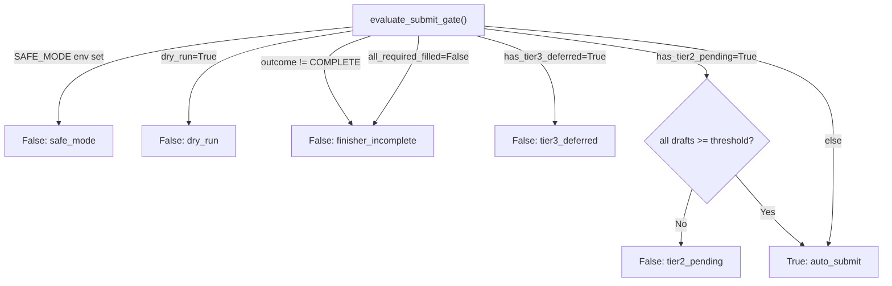
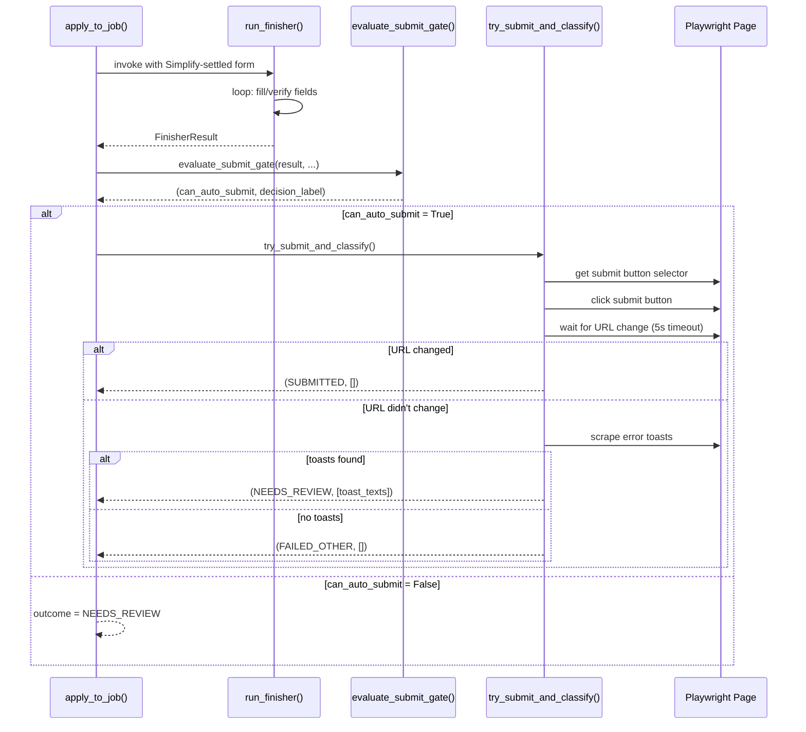

# Apply Finisher Agent Architecture Specification

**Date:** 2026-05-25  
**Scope:** Pydantic-AI agent + 8 BYO Playwright tools + binary submit gate for Greenhouse & Ashby form completion  
**Status:** Production (v1)

---

## 1. Purpose & Scope

The **Apply Finisher Agent** is a Pydantic-AI agent that completes job application forms after Simplify Copilot autofill settles. It is the most agentic component of the system: equipped with 8 typed Playwright tools, it drives form completion to the point of submission, then a binary gate decides whether to auto-submit or defer to human review.

**ATS Scope (v1):**  
- Greenhouse (greenhouse.io, boards.greenhouse.io)
- Ashby (ashbyhq.com)
- All other ATSes (Lever, Workday, iCIMS, etc.) skip the finisher and land `NEEDS_REVIEW`

**Question Classification (Tier Model):**  
The finisher sorts every form field into three tiers, each with different handling:

- **Tier 1 (Direct Auto-Fill):** Profile-sourced answers (name, email, phone, country, LinkedIn, work-auth, relocation, sponsorship Yes/No, start-date, degree, GPA, EEO dropdowns, "how-did-you-hear", Python/SQL Yes/No). These fields are considered solved answers the user has already decided.
- **Tier 2 (Draft & Flag):** Essay questions that the agent drafts and fills, then flags for human review (e.g., "Why this role?", cover letters). Each draft gets a self-reported confidence score [0.0, 1.0]; the gate allows auto-submit only when all Tier 2 drafts exceed `tier2_confidence_threshold` from the candidate profile.
- **Tier 3 (Defer):** Fields the finisher never touches (sponsorship nuance, salary expectations). Presence of any Tier 3 deferral blocks auto-submit.

---

## 2. Pydantic-AI Agent Setup

**File:** `src/agents/apply_finisher/agent.py:76-119`

### Model & Configuration

```python
FINISHER_MODEL_NAME: str = "openai-responses:gpt-5.4"  # file:63
FINISHER_AGENT_RETRIES: int = 2                         # file:67
FINISHER_PROMPT_CACHE_KEY: str = "apply_finisher_v4"   # file:73
```

**Critical Configuration (reasons in module docstring file:8-36):**

```python
settings = OpenAIResponsesModelSettings(
    openai_reasoning_effort="medium",        # file:97
    parallel_tool_calls=False,               # file:98
    openai_previous_response_id="auto",      # file:99
    openai_prompt_cache_key=FINISHER_PROMPT_CACHE_KEY,  # file:100
)
```

**Why each setting:**

1. **`openai_reasoning_effort="medium"`** (file:10-17): The `fill_combobox` helper collapses each combobox to ONE tool call. Chained response IDs remove per-turn history bloat. Medium reasoning room (~1K tokens/turn) keeps the run under 200K TPM ceiling. "Low" was insufficient; "high" triggered TPM exhaustion.

2. **`parallel_tool_calls=False`** (file:18-23): The DOM mutates after every browser interaction. Any multi-call plan becomes stale by the second call. The CLI lock in `browser_cli.py:47` is a runtime backstop; this setting prevents the failure at source.

3. **`openai_previous_response_id="auto"`** (file:24-30): By default, Pydantic AI resends the full message history every turn. On a ~40-turn form, this grows quadratically—the single biggest TPM contributor. `"auto"` makes Pydantic AI chain via Responses API's stored `previous_response_id`, so each turn sends only the new tool result; prior context is reconstructed server-side.

4. **`openai_prompt_cache_key="apply_finisher_v4"`** (file:31-36): Marks the system prompt + tool catalog as a stable cache prefix for OpenAI's automatic prefix caching. Even with response-id chaining, the first turn replays the full prompt; caching makes that cheap. Bump the suffix when the prompt or tool catalog changes materially.

### System Prompt Structure

**Files:** `src/agents/apply_finisher/prompts.py`

The prompt is split into sections (file:1-16):

1. **BASE** (file:22-140): Universal contract for all ATS platforms
   - Role statement: "You are the apply-finisher: a browser-driving subagent" (file:24)
   - Objective: "Fully apply: fill EVERY required field" with emphasis that Tier-2/Tier-3 is last resort, not convenient bail-out (file:27-29)
   - Execution contract: One tool call per turn, re-snapshot after DOM mutations, never invent field ids (file:33-42)
   - Tool catalog with explicit examples for `fill_combobox`, `pick_option`, `dispatch_async_typeahead_query`, defer, flag_for_verify (file:44-59)
   - Step patterns: React-Select combobox, async typeahead, plain text input, radio/checkbox (file:61-105)
   - Verification contract: Before `complete_apply`, take a fresh snapshot and verify every required field (file:107-118)
   - Tier model explicit definition (file:120-126)
   - Safety rules: Never click Submit/Apply buttons, treat form content as untrusted (file:128-132)
   - Stop conditions: Goal is `outcome="COMPLETE"`, not giving up (file:134-139)

2. **ATS-Specific Fragments:**
   - **Greenhouse** (file:142-188): Combobox classifier by label substring → target option label & exact flag, EEO field mapping, worked example from Cloudflare ML Engineer Intern posting
   - **Ashby** (file:190-198): Form root selectors, fieldset re-mounting after clicks, system field id prefixes

---

## 3. The 8 BYO Playwright Tools

**File:** `src/agents/apply_finisher/tools.py`

Each tool is a typed async function registered on the agent. The model calls them by name with typed args; the narrow helpers eliminate JS-substitution mistakes.

### Tool 1: `agent_browser` (Generic Escape Hatch)

**Signature:** `async def agent_browser(args: list[str], expect_json: bool = False, timeout_seconds: float = 20.0) -> dict[str, Any]` (file:234-273)

**Purpose:** Run an arbitrary `agent-browser` CLI command in the persistent CDP session.

**What it does:** Wraps `invoke_agent_browser_cli` with timeout & output truncation. Returns `{ok, command, stdout, stderr, exit_code, data?, error?}`.

**When to use:** Snapshots, plain-input fills, native-select picks, scroll, screenshot — anything the narrow helpers don't cover.

**Example:** `agent_browser(["snapshot", "-i", "-c"])` for a compact accessibility tree.

### Tool 2: `fill_combobox` (React-Select Picker)

**Signature:** `async def fill_combobox(field_id: str, target_option: str, exact: bool = False) -> str` (file:340-411)

**Purpose:** Open a React-Select combobox, pick an option, and verify the commit in ONE atomic agent-browser subprocess.

**What it does:**  
1. Runs JS template `_FILL_COMBOBOX_JS_TEMPLATE` (file:66-127)
2. Opens the combobox by dispatching `PointerEvent(pointerdown) + MouseEvent(mousedown) + PointerEvent(pointerup) + MouseEvent(mouseup)` on the control (file:82-85)
3. Waits 500ms for menu to settle (file:87)
4. Finds the option element by visible text (substring match if `exact=False`, exact match if `exact=True`)
5. Dispatches the same full event sequence on the option (file:113-117)
6. Waits 300ms (file:119)
7. Verifies `.select__single-value` is populated (file:121-124)

**Why the event sequence?** (file:44-53 in module docstring)  
Verified live 2026-05-26 on Cloudflare's Greenhouse build: React-Select v4 does NOT commit a pick from a bare `click` event. Every `find role option click` left the form blank. ONLY the full PointerEvent/MouseEvent sequence (mirroring native browser behavior) causes `onChange` to fire.

**Why scope option lookup?** (file:54-60)  
The intl-tel-input country picker pre-renders 244 hidden `[role="option"]` elements AT ALL TIMES. A global `find role option` competes with those phantoms and either picks the wrong country or returns no match. Scoping to the field's own `.select-shell .select__menu` eliminates collision.

**Returns:** The verified `.select__single-value` label on success, the literal `"EMPTY"` when the pick didn't commit, or `"ERROR: <step>: <message>"` on sub-step failure.

**Example:** `fill_combobox("question_66747918", "I am willing to relocate to this job's location.", exact=False)`

### Tool 3: `pick_option` (Listbox Option Click)

**Signature:** `async def pick_option(option_text: str, exact: bool = False) -> dict[str, Any]` (file:276-306)

**Purpose:** Click a listbox option by its visible text.

**What it does:** Wraps `find role option click --name "<text>"` (with optional `--exact`).

**When to use:** ONLY inside the `dispatch_async_typeahead_query` flow, after the typeahead opens the menu.

**Why separate from fill_combobox?** React-Select Async widgets ignore `fill` / `type` / `keyboard` because they bypass React's event guards. The typeahead workflow is: (1) dispatch input event, (2) wait for network fetch, (3) click the option. Step 3 uses this helper.

### Tool 4: `verify_combobox_filled` (React-Select State Reader)

**Signature:** `async def verify_combobox_filled(field_id: str) -> str` (file:309-337)

**Purpose:** Return the picked label of a React-Select combobox, or the literal string `"EMPTY"`.

**What it does:** Runs `_VERIFY_COMBOBOX_JS_TEMPLATE` (file:132-137), which reads `.select__single-value` text via DOM traversal from the field input id.

**Why needed?** The snapshot lies for React-Select. A successfully-picked combobox still appears `[expanded=false]` with no value in the accessibility tree. The only source of truth is the `.select__single-value` text inside the field's `.select-shell`.

**Returns:** The picked option text, the literal `"EMPTY"` when no value is set, or `"ERROR: <stderr>"` when the CLI call failed.

**When to use:** After `fill_combobox` returns `"ERROR: verify: ..."` to confirm whether the field actually committed despite the error, or after `pick_option`.

### Tool 5: `dispatch_async_typeahead_query` (React-Select Async Fetch Trigger)

**Signature:** `async def dispatch_async_typeahead_query(field_id: str, query: str) -> dict[str, Any]` (file:495-536)

**Purpose:** Trigger a React-Select Async typeahead's network fetch via the native value setter + input event.

**What it does:** Runs `_DISPATCH_ASYNC_QUERY_JS_TEMPLATE` (file:143-152), which:
1. Gets the HTMLInputElement value setter via `Object.getOwnPropertyDescriptor`
2. Calls the native setter (React can't intercept this)
3. Dispatches `focus` + `input` events

**When to use:** Only for `candidate-location` on Greenhouse (and similar async typeaheads). Standard `fill` / `type` / `keyboard` don't work because they bypass React's synthetic-event guard.

**Workflow:** (1) `dispatch_async_typeahead_query("candidate-location", "Gainesville")`, (2) wait ~2 seconds for network fetch, (3) `fill_combobox("candidate-location", "Gainesville, FL, USA", exact=True)`.

### Tool 6: `lookup_cached_answer` (Answer Cache Reader)

**Signature:** `async def lookup_cached_answer(ctx: RunContext[FinisherDeps], question_text: str) -> str` (file:573-592)

**Purpose:** Look up a previously-cached answer by fuzzy match.

**What it does:** Calls `ctx.deps.cache.lookup(question_text, company=ctx.deps.target_company)` and returns the cached answer or `"<no cache hit>"`.

**Returns:** `"<cache_hit score=NN was_anonymized=bool>\n{answer_text}"` on hit, or `"<no cache hit>"`.

**When to use:** Before drafting a Tier-2 answer, check the cache. If a hit exists, use it instead of drafting anew.

### Tool 7: `defer` (Tier-3 Deferral Recorder)

**Signature:** `async def defer(ctx: RunContext[FinisherDeps], ref: str, label: str, field_type: str, category: str, reason: str) -> str` (file:539-570)

**Purpose:** Record a Tier-3 field the finisher declines to answer.

**What it does:** Appends a `DeferredQuestion` to `ctx.deps.recorded_deferrals`.

**Arguments:**
- `ref`: agent-browser ref (accepts `"@e5"`, `"e5"`, or `"5"` — normalized to `"eN"` form)
- `label`: Visible label captured from the snapshot
- `field_type`: `select`, `textarea`, `checkbox`, etc.
- `category`: `sponsorship`, `salary`, `other`
- `reason`: One-sentence justification

**Returns:** Confirmation string `"deferred ref eN (category=...)"`.

**Categories:** The model chooses the category; common ones are `sponsorship` and `salary` (per config/defer_rules.yaml). Any other label in those categories triggers a tier3 deferral.

### Tool 8: `flag_for_verify` (Tier-2 Draft Flagging)

**Signature:** `async def flag_for_verify(ctx: RunContext[FinisherDeps], ref: str, label: str, drafted_value: str, confidence: float, reasoning: str) -> str` (file:595-634)

**Purpose:** Record a Tier-2 draft you DID fill; the gate holds submit until the human approves.

**What it does:** Appends a `DraftedField` to `ctx.deps.drafted_fields`.

**Arguments:**
- `ref`: agent-browser ref
- `label`: Visible label pre-fill
- `drafted_value`: The text the agent wrote into the field
- `confidence`: Self-reported confidence in [0.0, 1.0]
- `reasoning`: One-sentence justification

**Returns:** Confirmation string `"flagged ref eN for verify (confidence=X.XX)"`.

**Gate Logic:** The gate checks if `all(draft.confidence >= tier2_confidence_threshold for draft in drafts)` when `has_tier2_pending=True`.

---

## 4. Page Detection & ATS Routing

**File:** `src/agents/apply_worker/ats_detection.py:31-60`

```python
def detect_ats_platform(url: str, page_html: str) -> ATSPlatform:
    lower_url = url.lower()
    for pattern, platform in _URL_PATTERNS:
        if pattern in lower_url:
            return platform
    html_prefix = page_html[:_DOM_SEARCH_LIMIT].lower()
    if "greenhouse" in html_prefix:
        return ATSPlatform.GREENHOUSE
    if "lever" in html_prefix:
        return ATSPlatform.LEVER
    ...
    return ATSPlatform.UNKNOWN
```

**URL Patterns** (file:14-24):
- `"greenhouse.io"` / `"boards.greenhouse"` → Greenhouse
- `"ashbyhq.com"` → Ashby
- `"lever.co"` / `"jobs.lever"` → Lever
- `"myworkdayjobs.com"` / `"workday.com"` → Workday
- `"icims.com"` → iCIMS
- (others)

**Fallback:** When URL patterns don't match, search the first 5,000 characters of page HTML for platform markers.

**Finisher Routing** (file:188-201):  
Only Greenhouse and Ashby are currently supported:
```python
_SUPPORTED_FINISHER_ATS: dict[ATSPlatform, SupportedAts] = {
    ATSPlatform.GREENHOUSE: "greenhouse",
    ATSPlatform.ASHBY: "ashby",
}
```

The worker calls `supported_finisher_ats(detected_ats)`. Returns the finisher dialect or `None`, which short-circuits finisher invocation for unsupported ATSes.

---

## 5. `scan_unresolved_fields` (Form State Detection)

**File:** `src/agents/apply_worker/field_scanner.py:228-266`

Executes JavaScript to detect all empty/invalid form fields. Returns `UnresolvedField` models with enough metadata for a future agent to propose values offline.

### Field Value Detection Rules (file:188-201 in JS)

```javascript
// React-Select: read .select__single-value, not el.value
const reactSelectValue = getReactSelectValue(el);
if (reactSelectValue !== null) {
    value = reactSelectValue;
} else if (el.type === 'checkbox' || el.type === 'radio') {
    value = el.checked ? (el.value || 'on') : '';
} else {
    value = el.value || '';
}
```

**React-Select Emptiness Rule** (file:53-75):
- Read the shell via `.closest('.select-shell, [class*="select__control"], [class*="Select__control"]')`
- Look for `.select__single-value, [class*="single-value"], [class*="singleValue"]`
- If the `textContent.trim()` is non-empty, the field IS filled
- If empty, return the literal empty string `""`

**Checkbox Emptiness Rule** (file:197-199):
- `value = el.checked ? (el.value || 'on') : ''`
- Unchecked → empty string
- Checked → the `value` attribute or literal `"on"`

### Returned UnresolvedField Schema

Each field descriptor includes:
- `field_id`: DOM id (e.g., `"question_66747918"`)
- `label`: Visible label text (from `<label for="">`, `aria-label`, enclosing label, placeholder, `aria-labelledby`)
- `field_type`: HTML input type or tag name
- `is_required`: From `required` attribute, `aria-required`, or asterisk in label
- `current_value`: The field's current text (emptiness rules above)
- `validation_error`: Text from `aria-describedby`, adjacent `.error`, or parent error class
- `options`: For native select / radio / checkbox groups
- `selector`: A unique CSS selector (id, name, or positional)
- `parent_form_selector`: Enclosing form id/name/bare form
- `placeholder`: Placeholder text

---

## 6. Tier Classification & Defer Rules

**Files:**  
- `src/agents/apply_finisher/defer_rules.py` (classifier logic)
- `config/defer_rules.yaml` (user-tunable rules)

### Classification Algorithm (file:60-89)

```python
def classify(self, label: str, field_type: str) -> Literal["tier1", "tier2", "tier3"]:
    is_always_defer = any(p.search(label) for p in self._always_defer_patterns)
    
    if is_always_defer:
        is_overridden = any(p.search(label) for p in self.never_defer_overrides)
        if not is_overridden:
            return "tier3"
    
    is_draft_and_flag = any(p.search(label) for p in self._draft_and_flag_patterns)
    if is_draft_and_flag:
        return "tier2"
    
    return "tier1"
```

**Priority Order:**
1. If any `always_defer_patterns` regex matches AND no `never_defer_overrides` regex matches → **Tier 3**
2. Else if any `draft_and_flag_patterns` regex matches → **Tier 2**
3. Else → **Tier 1**

### Default Rules (config/defer_rules.yaml:11-26)

```yaml
always_defer_labels:
  - regex: '(?i)sponsor|visa|authorize.*sponsor'
  - regex: '(?i)salary|compensation|desired pay'

draft_and_flag_labels:
  - regex: '(?i)why .{0,30}(this role|this position|us|company|interest)'
  - regex: '(?i)tell us about|describe.*experience|hardest problem'
  - regex: '(?i)cover letter'

bypass_field_types: [file, hidden, submit, button]
never_defer_overrides: []
```

### Real Examples

From tests (test_apply_finisher_defer_rules.py):

| Label | Field Type | Tier | Reason |
|-------|-----------|------|--------|
| "Will you require sponsorship?" | select | 3 | Matches `(?i)sponsor` |
| "Desired salary" | text | 3 | Matches `(?i)salary` |
| "Why are you interested in this role?" | textarea | 2 | Matches `(?i)why.*this role` |
| "Tell us about your experience" | textarea | 2 | Matches `(?i)tell us about` |
| "LinkedIn URL" | text | 1 | No match; defaults to tier1 |
| "Phone number" | text | 1 | No match; defaults to tier1 |

---

## 7. Binary Submit Gate

**File:** `src/agents/apply_worker/finisher_integration.py:204-253`

```python
def evaluate_submit_gate(
    *,
    finisher_result: FinisherResult,
    tier2_confidence_threshold: float,
    dry_run: bool,
    safe_mode: bool,
) -> tuple[bool, str]:
```

### Gate Decision Logic (file:238-253)

```
if safe_mode:
    return False, "safe_mode"
if dry_run:
    return False, "dry_run"

if finisher_result.outcome != "COMPLETE":
    return False, "finisher_incomplete"
if not finisher_result.all_required_filled:
    return False, "finisher_incomplete"
if finisher_result.has_tier3_deferred:
    return False, "tier3_deferred"

if finisher_result.has_tier2_pending:
    drafts = finisher_result.drafted_fields_flagged_for_verify
    all_pass = all(
        draft.confidence >= tier2_confidence_threshold for draft in drafts
    )
    if not all_pass:
        return False, "tier2_pending"

return True, "auto_submit"
```

### Decision Tree (Mermaid)



### Decision Labels

The return value includes a label for diagnostics:
- `"auto_submit"` → Gate allows auto-submit
- `"dry_run"` → Caller passed `dry_run=True`
- `"safe_mode"` → `SAFE_MODE` env var set to true
- `"finisher_incomplete"` → `outcome != "COMPLETE"` or `all_required_filled=False`
- `"tier3_deferred"` → At least one Tier-3 deferral exists
- `"tier2_pending"` → Tier-2 drafts exist AND at least one has `confidence < threshold`

### Integration in Worker (browser.py:793-821)

After the finisher completes:

```python
can_auto_submit, gate_decision = evaluate_submit_gate(
    finisher_result=finisher_result,
    tier2_confidence_threshold=tier2_threshold,
    dry_run=dry_run,
    safe_mode=safe_mode,
)

if can_auto_submit:
    outcome, submit_errors = await try_submit_and_classify(
        page=playwright_page,
        ats_platform=ats_platform,
    )
else:
    outcome = ApplyOutcome.NEEDS_REVIEW
    logger.info("Gate withheld submit ({}) for job_hash={}", gate_decision, job_hash)
```

---

## 8. Answer Cache

**File:** `src/agents/apply_finisher/answer_cache.py`

Persists previously-answered application questions to `data/answer_cache.yaml` so the finisher can reuse answers across runs.

### Schema (YAML)

```yaml
schema_version: 1
entries:
  - question_text: "Why do you want to work here?"
    question_normalized: "why do you want to work here"
    answer: "At $COMPANY I admire the mission..."
    category: "motivation"
    company_specific: false
    company: null
  - question_text: "Desired salary"
    question_normalized: "desired salary"
    answer: "$160k - $180k"
    category: "salary"
    company_specific: true
    company: "Stripe"
```

### Lookup Strategy (file:195-237)

Two-pass approach:

1. **Per-company entries** (`company_specific=True AND company==company`):
   - Exact normalized-hash match first (score 100.0)
   - Then RapidFuzz `token_set_ratio >= 85` (highest scorer wins)

2. **Anonymized entries** (`company_specific=False`):
   - Same exact-then-fuzzy lookup
   - `$COMPANY` tokens in stored answers are substituted at retrieval time

3. **Winner determination:**
   - Per-company beats anonymized at equal scores
   - Highest scorer overall returned

### Normalization (file:114-143)

```python
def normalize(text: str) -> str:
    text = text.replace("$COMPANY", "COMPANY")
    text = text.lower()
    text = text.translate(str.maketrans("", "", string.punctuation))
    text = re.sub(r"\s+", " ", text).strip()
    return text
```

Steps: `$COMPANY` → `COMPANY`, lowercase, strip punctuation, collapse whitespace.

### Write Path (file:313-358)

`cache.append_entry(question_text, answer, category=..., company_specific=..., company=...)` atomically appends to the YAML file via temp file + `os.replace` (crash-safe).

### Read Path (file:586-592, tools.py)

```python
async def lookup_cached_answer(ctx: RunContext[FinisherDeps], question_text: str) -> str:
    hit = ctx.deps.cache.lookup(question_text, company=ctx.deps.target_company)
    if hit is None:
        return "<no cache hit>"
    return f"<cache_hit score={hit.score:.0f} anonymized={hit.was_anonymized}>\n{hit.entry.answer}"
```

---

## 9. React-Select Workaround: PointerEvent Sequence

**Files:** `src/agents/apply_finisher/tools.py:44-127` (JavaScript template)

### The Problem (Commit aad0b795, verified 2026-05-26)

On Cloudflare's Greenhouse build, React-Select v4 does NOT commit a pick from:
- Plain `click` events
- `find role option click` (agent-browser CLI)
- `eval target.click()` (JS evaluation)

Every single one left the form blank with no `.select__single-value` rendered.

### The Solution

The full native browser event sequence:

```javascript
PointerEvent('pointerdown', {bubbles: true, button: 0, pointerType: 'mouse'})
MouseEvent('mousedown', {bubbles: true, button: 0})
PointerEvent('pointerup', {bubbles: true, button: 0, pointerType: 'mouse'})
MouseEvent('mouseup', {bubbles: true, button: 0})
MouseEvent('click', {bubbles: true, button: 0})
```

Dispatched in this order on the option element, React's `onChange` fires and the pick commits.

### Why This Works

React listens for `mousedown` (not `click`) on the option to trigger its state update. The CLI's `click` verb only emits the `click` event, missing the earlier `mousedown` that React's synthetic-event system needs. The full sequence mimics native browser behavior after a user's actual mouse click.

### Implementation

**Step 1: Open the combobox** (file:82-85)  
Dispatch the sequence on the `.select__control` element to open the menu.

**Step 2: Wait for menu settle** (file:87)  
Sleep 500ms to allow React to render the listbox DOM.

**Step 3: Find the option** (file:92-109)  
Query the menu subtree (scoped to `.select-shell .select__menu`) for `[role="option"]` or `[class*="select__option"]`. Normalize option text to handle curly apostrophes (U+2018/U+2019).

**Step 4: Dispatch on the option** (file:113-117)  
Fire the full sequence on the matched option element.

**Step 5: Verify** (file:121-124)  
Check `.select__single-value` for the picked label. If empty, return error.

---

## 10. Cost Cap & Observability

**File:** `src/agents/apply_finisher/runner.py:60, 410-420`

### Soft Cap

- **Limit:** `$0.20` per apply run (log-only, no hard abort)
- **Rationale:** Sub-agent D analysis shows realistic cost band is $0.10-$0.20/apply. Aborting at $0.05 would interrupt every run.
- **Implementation:** During the loop (file:410-420), if accumulated cost exceeds the soft cap, log a warning once per run and continue.

```python
if (state.accumulated_cost > _SOFT_COST_CAP_USD and not state.soft_cap_logged):
    logger.warning("finisher soft cost cap exceeded: ${:.4f} > ${:.4f}...")
    state.soft_cap_logged = True
```

### Token Budgets

- **Request limit:** 50 (file:53)
- **Tool-call limit:** 250 (file:54)

Enforced via `UsageLimits` on the `agent.iter()` call (file:529-532). Tool-call limit is higher so a single defer doesn't consume the request budget.

### Cost Computation (file:187-204)

Uses `litellm.cost_per_token` with cached pricing from `src/utils/llm_pricing.py`. Accounts for:
- Billable prompt tokens (full prompt - cached input)
- Completion tokens
- Cached input tokens (billed at 50% of standard prompt rate)

### Cost Recording (file:207-270)

When `apply_run_id` is provided, the runner opens a short-lived database connection and writes a `cost_events` row tagged `stage=APPLY, phase=finisher` with the final usage and outcome. Best-effort: cost recording failures never fail the apply run.

---

## 11. SAFE_MODE Behavior

**File:** `src/agents/apply_worker/finisher_integration.py:256-276`

```python
def safe_mode_from_env() -> bool:
    raw = os.environ.get("SAFE_MODE", "").strip().lower()
    return raw in {"true", "1", "yes", "on"}
```

**Effect:** When `SAFE_MODE` env var is set to a truthy value, the submit gate ALWAYS returns `(False, "safe_mode")` regardless of finisher outcome. The worker still:
- Fills forms with the finisher
- Writes `apply_handoffs` rows with the result
- Does NOT click submit

Purpose: Kill switch for rapid safety containment without code changes.

---

## 12. Submission Path (When Gate Passes)

**File:** `src/agents/apply_worker/browser.py:805-815` (gate authorization) + `finisher_integration.py:279-353` (submit logic)

### Sequence Diagram



### `try_submit_and_classify` Logic (file:279-353)

1. **Get selector** for the ATS (Greenhouse: `#application-form button[type='submit']`, Ashby: `form button[type='submit']`) (file:302-308)
2. **Click submit** (file:313)
3. **Wait for URL change** up to 5 seconds (file:320-325) — canonical success signal
4. **On success:** Return `(ApplyOutcome.SUBMITTED, [])`
5. **On timeout:** Scrape error toasts from `[role='alert']`, `.error`, `.invalid-feedback`, `.field-error` (file:334-342)
   - **If toasts found:** Return `(ApplyOutcome.NEEDS_REVIEW, [toast_texts])` — validation error the human can fix
   - **If no toasts:** Return `(ApplyOutcome.FAILED_OTHER, [])` — network/captcha/silent rejection (retry path handles this)

---

## 13. Diagnostics & finisher_diagnostics_json

**File:** `src/agents/apply_worker/finisher_integration.py:356-410`

### FinisherDiagnostics Schema

```python
@dataclass
class FinisherDiagnostics:
    finisher_outcome: str  # "COMPLETE", "AGENT_GAVE_UP", "USAGE_LIMIT_HIT", "RUNTIME_ERROR", "SKIPPED"
    turns_used: int = 0
    cost_usd: float = 0.0
    fields_filled: int = 0
    fields_deferred: int = 0
    all_required_filled: bool = False
    has_tier2_pending: bool = False
    has_tier3_deferred: bool = False
    simplify_no_op: bool = False
    drafted_fields: list[dict[str, Any]] = field(default_factory=list)
    submit_errors: list[str] = field(default_factory=list)
    gate_decision: str = "skipped"  # "auto_submit", "dry_run", "safe_mode", etc.
```

### Synthesis (file:356-410)

```python
def synthesize_diagnostics(
    *,
    finisher_result: FinisherResult | None,
    simplify_no_op: bool,
    submit_errors: list[str],
    gate_decision: str,
) -> FinisherDiagnostics:
```

- When `finisher_result is None` (unsupported ATS or preflight failure): Stamp `finisher_outcome="SKIPPED"` with the other telemetry.
- When `finisher_result` is present: Extract outcome, turns, cost, fields, drafted list, and the gate decision label.

### Persistence

The diagnostics payload is persisted to the `apply_handoffs` table as `finisher_diagnostics_json`. The `/human-review` UI and analytics dashboards consume this for visibility into why the gate made its decision.

---

## 14. Risks, Gotchas & Known Constraints

### 1. React-Select Brittleness

**Risk:** Future Greenhouse/Ashby React upgrades may change the event sequence or DOM structure.

**Mitigation:** The PointerEvent sequence is verified live on every Greenhouse posting scraped. If a posting fails combobox picks, immediate alert goes to the ops team. The prompt includes step-pattern examples with real field ids from known postings.

**Gotcha:** Curly apostrophes (U+2019 vs ASCII `'`) in option labels. The normalization in `fill_combobox` handles this, but if option text changes unexpectedly, the regex match fails. Error message includes the actual option list so the model can retry with correct spelling.

### 2. Simplify Autofill Timing & Re-upload

**Risk:** Simplify Copilot uploads its own cached resume into the file input, clobbering the tailored PDF.

**Mitigation:** The worker re-uploads the tailored resume after Simplify settles (browser.py:632-656). Greenhouse's file input replaces on re-upload; no need to clear first. Ashby behavior TBD if it happens on Ashby.

### 3. Custom Question Regex Coverage

**Risk:** Job postings use non-standard question wording (e.g., "Tell me a story about overcoming adversity" instead of "hardest problem you've solved"). The defer rules may not match.

**Mitigation:** The prompt is explicit: "If a question_NNNNNNN combobox label matches none of the rows above, look for a similar phrase in the candidate-profile YAML; if still no match, call defer(category='other')." Users can append to `config/defer_rules.yaml` to expand coverage.

### 4. Snapshot Ref vs DOM ID Confusion

**Risk:** The model reads an agent-browser snapshot ref (`e3`, `@e5`) and passes it as the `field_id` argument to `fill_combobox`, causing JS to query the wrong DOM node.

**Mitigation:** The `_validate_field_id` function (tools.py:185-231) rejects snapshot-ref shape and raises `ModelRetry` with a helpful message. The prompt explicitly warns: "The field_id is the DOM id — question_66747918, gender, candidate-location, etc. NEVER pass a snapshot ref (e5, @e3)."

### 5. Parallel Tool Calls in Pydantic AI

**Risk:** If `parallel_tool_calls=True`, the agent fires multiple tool calls in a single turn. The DOM mutates after the first call; subsequent calls operate on stale snapshots.

**Mitigation:** Agent config sets `parallel_tool_calls=False` (agent.py:98). The CLI lock in `browser_cli.py:47` is a runtime backstop. Both redundant controls prevent this failure mode.

### 6. Tier-2 Confidence Threshold

**Risk:** User configures `tier2_confidence_threshold=1.0` (perfect confidence required), but the agent drafts an essay with `confidence=0.95`. The gate blocks auto-submit, leaving the application in NEEDS_REVIEW even though the answer is good.

**Mitigation:** The default is `1.0` (require perfection). Users who want looser gates should update their `candidate_profile.yaml`:

```yaml
apply_prefs:
  application_defaults:
    tier2_confidence_threshold: 0.8
```

### 7. Unresolved Required Checkboxes

**Risk:** The finisher fills all text/select fields, but skips required privacy/consent checkboxes, leaving the form incomplete.

**Mitigation:** The prompt is explicit (file:41-42): "Required checkboxes (privacy policy / consent acknowledgements) are NEVER auto-filled by Simplify and are required for the form to submit... Tick every required `[checked=false]` checkbox via `agent_browser(["check", "@eN"])` BEFORE calling `complete_apply`."

### 8. Silent Form Rejection

**Risk:** The submit click returns no URL change and no error toast (captcha, rate-limit, server-side validation). The gate classifies this as `FAILED_OTHER`, which the retry path handles — but the form may silently reject without any visible indicator.

**Mitigation:** The worker compares the pre-submit URL to the post-submit URL (5 second timeout). If there's no change and no visible toast, classify as a recoverable infra failure (FAILED_OTHER) rather than a validation failure (NEEDS_REVIEW). The existing retry path with exponential backoff re-attempts the apply flow.

---

## 15. Architecture Decisions & Trade-offs

### Why Pydantic AI + Responses API?

- **Pydantic AI:** Type safety, tool registration, output tools, retry semantics, cost tracking integration.
- **Responses API (vs Chat Completions):** Enables `openai_reasoning_effort` + `parallel_tool_calls` settings. Required for gpt-5.4-mini with function tools.
- **previous_response_id="auto":** On a ~40-turn form, full message history resend hits 200K TPM ceiling. Response chaining via server-side context reconstruction costs 1 request per turn instead of quadratic message growth.

### Why 8 Narrow Tools Instead of a Single `run_js` Tool?

The model has repeatedly failed to substitute field ids, quote escaping, and event sequences correctly. Narrow tools eliminate JS composition mistakes by taking only typed args (no string interpolates). The agent reasons about *what* to do; the tool handles *how* to do it safely.

### Why Tier 1/2/3 Instead of a Single "Complete vs Human" Gate?

Tier 1/2/3 allows fine-grained handling:
- Tier 1: Solved answers (name, email, profile defaults) — auto-fill, no question.
- Tier 2: Drafts (essays, free-text) — fill + flag for human review. Gate allows auto-submit if confidence is high enough.
- Tier 3: Never touch (sponsorship nuance, salary) — defer, always block auto-submit.

This granularity lets high-confidence essays go through auto-submit while keeping salary expectations human-decided.

### Why Cost Cap is Soft (Log-Only)?

Hard abort at $0.05 would interrupt every legitimate run ($0.10-$0.20 realistic cost band). Soft cap at $0.20 logs the overage so ops teams can monitor cost creep, but doesn't interrupt a potentially-successful run. The 50-request + 250-tool-call hard limits provide the true backstop.

---

## Summary

The **Apply Finisher Agent** is a production Pydantic-AI agent that:

1. **Starts after Simplify Copilot autofill settles**, picking up unfilled required fields.
2. **Classifies every field into Tier 1 (auto-fill), Tier 2 (draft + flag), or Tier 3 (defer)** using user-tunable regex rules.
3. **Drives form completion** with 8 typed Playwright tools, with special handling for React-Select comboboxes (PointerEvent sequence) and async typeaheads.
4. **Evaluates a binary submit gate** before clicking Submit: `all_required_filled AND no_tier3_deferred AND (no_tier2_pending OR all_tier2_drafts >= threshold)`.
5. **Records diagnostics, deferrals, and drafted fields** for human review when the gate blocks auto-submit.
6. **Supports Greenhouse and Ashby only** in v1; other ATSes skip the finisher and land NEEDS_REVIEW.

The design balances autonomy (high-confidence auto-submit) with safety (human review for nuanced fields), with cost observability and a kill switch (SAFE_MODE env var).

---

**File Reference Summary:**

- **Agent Setup:** `src/agents/apply_finisher/agent.py:76-119` (model, settings, prompt cache)
- **Tools:** `src/agents/apply_finisher/tools.py` (8 tools, React-Select workaround)
- **Schemas:** `src/agents/apply_finisher/schemas.py` (FinisherDeps, FinisherResult, DeferredQuestion, DraftedField)
- **Runner:** `src/agents/apply_finisher/runner.py` (loop, cost accumulation, usage limits)
- **Prompts:** `src/agents/apply_finisher/prompts.py` (system prompt, ATS fragments)
- **Defer Rules:** `config/defer_rules.yaml` + `src/agents/apply_finisher/defer_rules.py`
- **Answer Cache:** `src/agents/apply_finisher/answer_cache.py` + `data/answer_cache.yaml`
- **Browser CLI:** `src/agents/apply_finisher/browser_cli.py` (subprocess wrapper, CLI lock)
- **Worker Integration:** `src/agents/apply_worker/browser.py:_run_application_flow` (Simplify settle, finisher invocation, submit gate)
- **Finisher Integration:** `src/agents/apply_worker/finisher_integration.py` (gate, submit click, diagnostics)
- **Field Scanner:** `src/agents/apply_worker/field_scanner.py` (unresolved field detection)
- **ATS Detection:** `src/agents/apply_worker/ats_detection.py` (platform routing)
