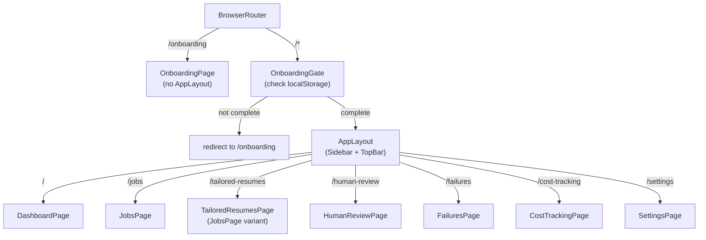
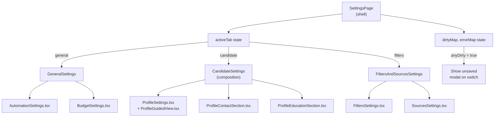

# React Dashboard Subsystem Specification

**Date:** 2026-05-25  
**Scope:** `/dashboard/src/` — Vite + React + TypeScript SPA  
**Entry Point:** `/` (index.html → App.tsx)  
**Build Target:** `/dashboard/dist/` (docker cp'd to `/app/dashboard/dist/`)

---

## 1. Purpose & Deployment

The AutoApply **React Dashboard** is a single-page application (SPA) that provides real-time oversight of the job discovery, tailoring, and apply pipeline. It runs in the web browser and communicates via REST API to a FastAPI backend at `http://localhost:8000`. The dashboard enables users to:

- View discovered jobs filtered by status, source, and search keyword
- Manually enqueue resume tailoring and application runs
- Monitor in-progress tailor/apply operations via live polling
- Review human-review queue items and save deferred answers
- Track costs, analyze failures, and configure automation settings
- Manage API keys, profile data, and discovery filters

**Deployment Model:** The SPA is image-baked at build time. After `npm --prefix dashboard run build`, the entire `/dashboard/dist/` directory is copied into the container image at `/app/dashboard/dist/`. FastAPI serves it as a fallback (`static_files` mount + StaticFiles) on all unmatched routes, allowing browser-side routing to work correctly. **Quirk:** Edits to dashboard code require a full Docker image rebuild and redeploy; the dist cannot be live-edited in running containers.

---

## 2. Technology Stack

| Layer          | Technology | Version | Notes |
|---|---|---|---|
| **Build Tool** | Vite | ^8.0.1 | Fast dev server, image-optimized builds |
| **Framework** | React | ^19.2.4 | With React Router DOM v7.13.2 for SPA routing |
| **Language** | TypeScript | ~5.9.3 | Strict type-checking via `tsc -b` pre-build |
| **UI Framework** | Base UI (Material Design) | ^1.3.0 | Headless components; heavy custom styling |
| **State & Caching** | TanStack Query | ^5.90.6 | Query/polling config at `/lib/query-client.ts` |
| **CSS** | Tailwind CSS | ^4.2.2 | Vite plugin, custom color tokens in `index.css` |
| **Charts** | Recharts | ^3.8.1 | Area/Bar/Pie charts on Dashboard & CostTracking |
| **Code Editor** | Monaco (React wrapper) | ^4.7.0 | YAML editing in Filters tab; workers in `/lib/monaco/` |
| **Icons** | Lucide React | ^1.7.0 | + Material Symbols (Google's web font) |
| **Testing** | Vitest + Testing Library | ^4.1.2, ^16.3.2 | JSDOM environment, user-event for interactions |

**Notables:**
- No external state management (Redux/Zustand). TanStack Query is the single source of truth.
- Font: Plus Jakarta Sans (variable weight) from @fontsource-variable.
- Design tokens in `design-tokens.ts` expose oklch colors as hex for inline-style compatibility.

---

## 3. Routing Architecture

**File:** `/dashboard/src/App.tsx:32–59`

```
BrowserRouter
├── /onboarding → OnboardingPage (NO AppLayout wrapper)
└── <OnboardingGate> wraps all authenticated routes
    └── <AppLayout> (Sidebar + TopBar) provides shell
        ├── / (index) → DashboardPage
        ├── /jobs → JobsPage
        ├── /tailored-resumes → TailoredResumesPage (JobsPage variant)
        ├── /human-review → HumanReviewPage
        ├── /failures → FailuresPage
        ├── /cost-tracking → CostTrackingPage
        └── /settings → SettingsPage
```

**Flow:**
1. App boots inside BrowserRouter, rendering the CommandBar and MissingKeyBanner globally.
2. First route checked is `/onboarding`, which renders without AppLayout (full-page wizard).
3. All other routes are wrapped by `<OnboardingGate>`, which checks `localStorage` for onboarding completion; if not complete, redirects to `/onboarding`.
4. Authenticated pages render inside `<AppLayout>`, which provides a sticky TopBar (title + sync status + Chrome chip) and Sidebar (nav pills).
5. Page title in TopBar resolved via `resolvePageTitle(location.pathname)` in AppLayout.

---

## 4. Per-Page Breakdown

### 4.1 DashboardPage (`/dashboard/src/pages/DashboardPage.tsx`)

**Purpose:** High-level overview dashboard with KPIs and trend charts.

**Key Queries:**
- `queryKey: ["dashboard", "stats"]` → `fetchDashboardStats()` → DashboardStatsDto
  - KPI cards: Jobs Discovered, Resumes Tailored, Applications Sent, Awaiting Review
  - Source breakdown (pie chart)
  - Pipeline funnel (horizontal bar)
  - Applications over time (area chart)
- `queryKey: ["dashboard", "discovery-trend", trendRange]` → `fetchDiscoveryTrend(range: "7d" | "30d")` → DiscoveryTrendDto
  - Area chart; toggled via "7d" / "30d" buttons

**UI Elements:**
- Four stat cards (KPI models via `toDashboardKpis()` adapter)
- Source breakdown pie chart (colors from `SOURCE_COLORS` map)
- Pipeline funnel horizontal bar chart
- Applications-over-time area chart with customizable date range
- All charts rendered via Recharts with design-token colors

**Polling:** Default 30s refetchInterval (from query-client.ts); no special override.

---

### 4.2 JobsPage (`/dashboard/src/pages/JobsPage.tsx` — 1,179 lines)

**Purpose:** Core jobs list with multi-dimensional filtering, inline modals, and actionable rows.

**State:**
- `searchQuery` + `debouncedSearchQuery` (300ms debounce)
- `statusFilter` (All / New / QUALIFIED / APPLIED / FILTERED / REJECTED)
- `sourceFilter` (WORKDAY / GREENHOUSE / JOBSPY / LINKEDIN / ICIMS / TALEO / LEVER / ASHBY / ADZUNA / GITHUB_REPOS / MANUAL_IMPORT)
- `expandedRowId` (null or job ID, toggles detail view)
- `currentPage` (1-indexed), `focusedRowIndex` (keyboard nav)
- `justTriggered` (shows "Triggered!" CTA state for 2.5s after manual fetch)
- `isImportOpen` (ImportJobModal open/closed)

**Key Queries & Mutations:**
- `useQuery(["jobs", { search, status, source, page, pageSize, hasTailorRun }])`
  - `queryFn: fetchJobs({ search, status, source, page, pageSize, hasTailorRun })`
  - **Custom refetchInterval logic:** Polls every 5s if ANY visible row has a tailor run in PENDING or RUNNING state; otherwise false (no poll).
  - Returns `JobsResponseDto` → adapts to `JobsRowModel[]` via `toJobsRows()`
  - PAGE_SIZE = 25 items per page

- `useMutation(fetchJobsNow)`
  - Triggers `/api/system/fetch-jobs` to restart discovery container
  - `onSuccess` invalidates jobs query and shows "Triggered!" badge for 2.5s

**UI Elements:**

*Header:*
- Job discovery count display (total items)
- "Import Job" button (opens modal)
- "Fetch Jobs Now" button (triggers mutation, shows animated dots when pending)

*Filters:*
- Status tabs (All / New / QUALIFIED / APPLIED / FILTERED / REJECTED)
- Source dropdown (select from 11 sources)
- Search input (auto-resets page to 1)

*Table:*
- Each row displays: company, position, location, pay, work type, source badge, status badge, discovered date
- Expandable rows show: gate verdict + reasoning, tailor run status + PDF link, apply run outcome, delete/retry buttons
- Keyboard nav: Arrow Up/Down + j/k, Enter to expand, Escape to close

*Apply Button Logic (per JobsPage:800–900):*
```
if (tailor PENDING/RUNNING) {
  "Waiting on tailor run #N…" (disabled)
} else if (apply PENDING/RUNNING) {
  "Applying…" (disabled)
} else if (apply SUCCESS + NEEDS_REVIEW) {
  amber badge "Applied — needs review" + "Relaunch apply" button (Bug G)
} else if (apply SUCCESS + SUBMITTED) {
  green badge "Auto-applied"
} else if (apply FAILED) {
  "Apply failed — retry" (re-clickable)
} else {
  if (tailor SUCCESS) {
    "Apply" → POST /api/jobs/{hash}/apply directly
  } else {
    "Apply" → open NotTailoredModal for user choice
  }
}
```

*Modals (sub-components in `/dashboard/src/pages/jobs/`):*
- **NotTailoredModal:** Confirms user's intent to tailor vs. skip (file:6–212)
- **TailorPlanPanel:** Shows planner rationale JSON for a completed tailor run
- **ImportJobModal:** (global component) Manual job import form

**Critical Flow — Apply Button Regression Guard (Bug 1):**
- **Regression:** Clicking Apply on a row with existing tailor run re-POSTs `/tailor`, getting 409 APPLY_RUN_IN_FLIGHT.
- **Fix:** ApplyButton checks `tailorRun.status === "SUCCESS"` and routes directly to `onApply()` (POST /apply), bypassing tailor enqueue.
- **Test:** JobsPage.apply-button.test.tsx (line 10–11) locks this behavior.

---

### 4.3 TailoredResumesPage (`/dashboard/src/pages/TailoredResumesPage.tsx`)

**Purpose:** Filtered view of JobsPage showing only jobs with non-deleted tailor_run.

**Implementation:** Lightweight wrapper that renders `<JobsPage hasTailorRunFilter />`, which appends `has_tailor_run=1` to the `/api/jobs` query.

---

### 4.4 HumanReviewPage (`/dashboard/src/pages/HumanReviewPage.tsx`)

**Purpose:** Queue of apply runs awaiting human review (deferred questions).

**Key Concepts:**
- **Handoff:** An apply_handoffs row with `deferred_questions_json` and `finisher_diagnostics_json`.
- **Deferred Questions:** Array of { field_id, label, confidence_pct } where the finisher couldn't auto-answer.
- **User Answers:** Reviewer types answers into textareas; POST to `/api/human-review/{id}/answers`.

**State:**
- `currentPage`, `searchQuery`, `confidenceFilter`, `expandedRow`

**Key Queries & Mutations:**
- `useQuery(["human-review", { search, confidence, page, pageSize }])`
  - `fetchHumanReviewQueue(...)` → HumanReviewResponseDto
  - Adapts to row models via `toHumanReviewRow()`
  - PAGE_SIZE = 20

- `useMutation(saveHumanReviewAnswers(handoffId, answers))`
  - POSTs array of { field_id, answer } to `/api/human-review/{handoffId}/answers`
  - Response includes `cache_seeded` array (what was persisted to answer_cache.yaml)

- `useMutation(completeHumanReview(handoffId))` / `dismissHumanReview(handoffId)`
  - Marks handoff as APPROVED or REJECTED

- `useMutation(relaunchHumanReviewApply(handoffId))` (Bug G, 2026-05-25)
  - Re-enqueues apply for PENDING_REVIEW handoff after reviewer saves answers
  - Returns { ok, apply_run_id, status, job_hash }

**UI Elements:**
- Queue table with company, position, status (Needs Review / Approved / Dismissed), confidence badge
- Expandable rows showing:
  - Deferred questions as small textareas (pre-filled with saved user_answers)
  - "Save answers" button
  - Diagnostics JSON display
  - Approve / Dismiss / Relaunch buttons

**Key Difference from ApplyButton:** HumanReviewPage reads `deferred_questions_json` *directly* from the handoff's response DTO, not from a separate API call. The finisher stored the questions during apply, and the dashboard surfaces them for review.

---

### 4.5 FailuresPage (`/dashboard/src/pages/FailuresPage.tsx`)

**Purpose:** List of pipeline stage failures with retry actions.

**Failure Stages:** GATE, TAILORING, REVIEW, APPLY

**State:**
- `searchQuery`, `stageFilter`, `statusFilter`, `currentPage`, `expandedRow`

**Key Queries & Mutations:**
- `useQuery(["failures", { search, stage, status, page, pageSize }])`
  - `fetchFailures(...)` → FailuresResponseDto
  - Adapts via `toFailuresModel()`

- `useMutation(retryFailure(failureId))`
  - POSTs `/api/failures/{failureId}/retry`
  - Stages the job for a fresh attempt at that stage

**UI Elements:**
- Filter tabs by stage and status (FAILED / RETRYING / EXHAUSTED)
- Table with job hash, stage badge, status badge, error message
- "Retry" button on each row

---

### 4.6 CostTrackingPage (`/dashboard/src/pages/CostTrackingPage.tsx`)

**Purpose:** Cost analytics and budget tracking.

**Queries:**
- `fetchCostStats()` → KPI cards
- `fetchCostDailyTrend(range: "7d" | "30d" | "all")` → line/area chart
- `fetchCostByStage()` → stage breakdown (bar chart or table)
- `fetchBudget()` → current monthly budget USD

**UI Elements:**
- Cost KPI cards (Total Spent, Est. Remaining, Est. Monthly Burn, Budget Utilization)
- Spend trend chart with date range toggle
- Stage cost breakdown
- Recent failures carousel (5 items)
- Budget input widget with save button

---

### 4.7 SettingsPage (`/dashboard/src/pages/SettingsPage.tsx`)

**Purpose:** Multi-tab configuration center for automation, budgets, API keys, profiles, and discovery filters.

**Architecture:** Tab-based shell (`SettingsPage.tsx`) routes between sub-sections:
1. **GeneralSettings** → Automation mode toggle (AUTONOMOUS / MANUAL)
2. **ApiKeysSettings** → Add/delete/rotate API keys for OPENAI_API_KEY, Adzuna, LinkedIn, etc.
3. **CandidateSettings** (composition of ProfileSettings + FiltersAndSourcesSettings)
   - **ProfileSettings:** Resume, profile contact/education, guided view
   - **FiltersAndSourcesSettings:** Keyword include/exclude lists, source toggles
4. **BudgetSettings** (part of GeneralSettings or standalone)

**State Management:** Shell-level aggregation of dirty/error maps per section:
```typescript
type SectionKey = "budget" | "apiKeys" | "profile" | "filtersAndSources";
const [dirtyMap, setDirtyMap] = useState<Record<SectionKey, boolean>>(...)
const [errorMap, setErrorMap] = useState<Record<SectionKey, boolean>>(...)
```

**Key Mutations:**
- `patchAutomationSettings({ tailor_mode?: AutomationMode })` (file:client.ts:325)
- `updateBudget(monthlyBudgetUsd)` (file:client.ts:624)
- `upsertApiKeySetting(keyName, keyValue)` (file:client.ts:648)
- `fetchSettingsFiles()` / `uploadProfileResume()` / `uploadProfilePhoto()` — file upload flows

**Tab Components** (in `/dashboard/src/pages/settings/`):
- GeneralSettings.tsx — Automation mode radio + info
- ApiKeysSettings.tsx (+ ApiKeyRow.tsx) — List with add/delete
- ProfileSettings.tsx (+ ContactSection, EducationSection, GuidedView)
- FiltersAndSourcesSettings.tsx (+ FiltersSettings.tsx, SourcesSettings.tsx)
- BudgetSettings.tsx
- AutomationSettings.tsx (new, post-#59)

**UX:** Confirm-switch modal prevents tab changes if unsaved edits exist; error state blocks switching.

---

## 5. API Client (`/dashboard/src/lib/api/client.ts` — 1,144 lines)

**Architecture:** Functional, typed async helpers wrapping fetch. No classes, no global state.

### Error Handling (lines 46–96)

```typescript
type ApiError = Error & { code: string; details: Record<string, unknown> };

function buildApiError(message, code, details?): ApiError
function throwIfError(response: Response): Promise<void>
async function getJson<T>(url, init?): Promise<T>
```

- **throwIfError:** Parses JSON error payload if non-2xx, throws typed ApiError with `code` + `details`.
- **getJson:** Validates Content-Type is application/json, throws INVALID_RESPONSE_FORMAT or EMPTY_RESPONSE_BODY on parse failure.
- Custom error codes: APPLY_RUN_IN_FLIGHT (409), TAILOR_ENQUEUE_FAILED, TAILOR_RETRY_FAILED, etc.

### Major Endpoint Groups

**Dashboard Stats & Trends (lines 143–155)**
- `fetchDashboardStats()` → /api/dashboard/stats
- `fetchDiscoveryTrend(range)` → /api/dashboard/discovery-trend?range=7d|30d

**Jobs & Tailor (lines 164–308)**
- `fetchJobs(args)` → /api/jobs?search=...&page=...&status=...&source=...&page_size=...&has_tailor_run=...
  - Returns paginated JobsResponseDto with items + total_items + total_pages
- `enqueueTailorRun(jobHash, opts?)` → POST /api/jobs/{jobHash}/tailor
  - opts.applyAfter = true chains tailor→apply server-side
- `fetchTailorRun(runId)` → /api/tailor-runs/{runId}
- `fetchTailorRunPlan(runId)` → /api/tailor-runs/{runId}/plan (planner JSON artifact)
- `deleteTailorRun(runId)` → DELETE /api/tailor-runs/{runId}
- `retryTailorRun(runId)` → POST /api/tailor-runs/{runId}/retry (atomic delete + enqueue)

**Apply Runs (lines 358–380)**
- `postApplyRun(jobHash, resumeMode?)` → POST /api/jobs/{jobHash}/apply
- `relaunchApplyByJobHash(jobHash)` → POST /api/human-review/by-job/{jobHash}/relaunch-apply (Bug G)

**Human Review (lines 345–488)**
- `fetchHumanReviewQueue(args)` → /api/human-review?search=...&confidence=...&page=...&page_size=...
- `saveHumanReviewAnswers(handoffId, answers)` → POST /api/human-review/{handoffId}/answers
  - answers = [{ field_id, answer }, ...]
  - Response.cache_seeded shows what was written to answer_cache.yaml
- `completeHumanReview(handoffId)` → POST /api/human-review/{handoffId}/complete
- `dismissHumanReview(handoffId)` → POST /api/human-review/{handoffId}/dismiss
- `relaunchHumanReviewApply(handoffId)` → POST /api/human-review/{handoffId}/relaunch-apply

**Failures & Retries (lines 496–527)**
- `fetchFailures(args)` → /api/failures?search=...&stage=...&status=...
- `retryFailure(failureId)` → POST /api/failures/{failureId}/retry

**System Health & Lifecycle (lines 548–561)**
- `fetchSystemHealth()` → /api/system/health (openai_key_configured flag)
- `fetchJobsNow()` → POST /api/system/fetch-jobs (restart discovery)
- `fetchChromeStatus(osHint?)` → /api/status/chrome?os=mac|linux|windows

**Cost Tracking (lines 585–616)**
- `fetchCostStats()` → /api/costs/stats
- `fetchCostDailyTrend(range)` → /api/costs/daily-trend?range=7d|30d|all
- `fetchCostByStage()` → /api/costs/by-stage
- `fetchBudget()` → /api/budget
- `updateBudget(monthlyBudgetUsd)` → PUT /api/budget

**Settings (lines 637–799)**
- `fetchApiKeysSettings()` → /api/settings/api-keys
- `upsertApiKeySetting(keyName, keyValue)` → PUT /api/settings/api-keys/{keyName}
- `deleteApiKeySetting(keyName)` → DELETE /api/settings/api-keys/{keyName}
- `validateAdzunaKeys(appId, appKey)` → POST /api/settings/api-keys/validate-adzuna
- `fetchSettingsFiles()` → /api/settings/files
- `uploadProfileResume(file)` / `uploadProfilePhoto(file)` → file uploads
- `fetchSettingsProfile()` → /api/settings/profile (GET)
- `updateSettingsProfile(dto)` → PATCH /api/settings/profile

**Auth Headers:** None explicitly set. Dashboard assumes it runs in the same origin as FastAPI; cookies/session auth handled server-side.

---

## 6. State Management

**Principle:** TanStack Query is the single source of truth. No Redux, Zustand, or Context for app state.

### Query Client Configuration (`/dashboard/src/lib/query-client.ts`)

```typescript
const queryClient = new QueryClient({
  defaultOptions: {
    queries: {
      staleTime: 5_000,           // 5s before data deemed stale
      refetchInterval: 30_000,    // 30s default poll
      refetchOnWindowFocus: true, // refetch when browser tab regains focus
      retry: 1,                   // retry once on failure
    },
    mutations: {
      retry: 0,                   // no auto-retry on mutations
    },
  },
});
```

### Custom Refetch Intervals

**JobsPage (lines 214–224):** Overrides default 30s with dynamic logic:
```typescript
refetchInterval: (query) => {
  if (data === undefined) return false;
  const hasActive = data.items.some(
    (item) => item.tailor_run?.status === "PENDING" || "RUNNING"
  );
  return hasActive ? 5000 : false; // 5s if tailor active, else no poll
}
```

**TopBar ChromeStatusChip (line 179):** Explicit 30s poll for Chrome reachability.

### Polling Behavior by Page

| Page | Query | Interval | Condition |
|---|---|---|---|
| Dashboard | stats, discovery-trend | 30s | Always |
| JobsPage | jobs list | 5s or off | If any row has tailor PENDING/RUNNING |
| TailoredResumes | jobs (filtered) | 5s or off | Same as JobsPage |
| HumanReview | queue | 30s | Always |
| Failures | failures | 30s | Always |
| CostTracking | costs, budget | 30s | Always |
| TopBar | chrome status | 30s | Always |

---

## 7. Top Bar Global State

**File:** `/dashboard/src/components/layout/TopBar.tsx`

**Render Logic (lines 90–120):**
```typescript
const activeQueryCount = useIsFetching();
const activeMutationCount = useIsMutating();
const allQueries = queryClient.getQueryCache().findAll();
const hasSyncError = allQueries.some(q => q.state.status === "error");
const lastSuccessfulSyncAt = allQueries
  .filter(q => q.state.status === "success")
  .reduce((latest, q) => Math.max(latest, q.state.dataUpdatedAt), null);

const isSyncing = activeQueryCount > 0 || activeMutationCount > 0;
const syncLabel = hasSyncError
  ? "SYNC ISSUES"
  : isSyncing
    ? "SYNCING NOW"
    : `AUTO SYNC (30s)`;
```

**Sync Status Chip:** Shows live fetch/mutation count; green dot when syncing, red when error, outlined when idle.

**Chrome Status Chip (lines 169–284):** Sub-component that:
- Polls `/api/status/chrome` every 30s
- Detects OS via `navigator.platform` (mac/linux/windows)
- Shows green or red dot + label "Chrome ready" / "Chrome offline"
- Clicking opens popover with OS-specific launch command (copy-paste flow)

**Updated At:** Displays timestamp of the most-recently-successful query across all active queries.

---

## 8. Settings Page Architecture

**File:** `/dashboard/src/pages/SettingsPage.tsx`

**Composition:** Tabbed container that orchestrates four sub-sections:

1. **GeneralSettings** (route-level, not a child component)
   - Automation mode radio (AUTONOMOUS vs. MANUAL)
   - Label: "When enabled, the system applies to matching jobs without manual review."
   - Mutation: `patchAutomationSettings({ tailor_mode? })`
   - Dirty/error tracking delegated to shell

2. **ApiKeysSettings** (sub-component)
   - Read-only display of key names + configured status
   - Add key form with input + validator (async for Adzuna)
   - Mutation: `upsertApiKeySetting(name, value)` → success invalidates query
   - Delete button → `deleteApiKeySetting(name)`

3. **CandidateSettings** (route level, composition of ProfileSettings + FiltersAndSourcesSettings)
   - **ProfileSettings:** Resume file upload, name/email/phone/location, education entries
     - Mutations: `uploadProfileResume(file)`, `updateSettingsProfile(dto)`
     - Guided view (ProfileGuidedView.tsx) for onboarding-style flow
     - Advanced Monaco YAML editor option
   - **FiltersAndSourcesSettings:** Keyword include/exclude lists, per-source toggles
     - Mutations: `updateSettingsFilters(...)`, `updateSettingsSources(...)`

4. **BudgetSettings** (typically part of General or Candidate)
   - Input field for monthly budget USD
   - Save button → `updateBudget(value)`
   - Real-time validation (min $0, no negative)

**Tab Navigation:** `TOP_LEVEL_TABS = ["general", "candidate", "filters"]` (constants.ts)

**Dirty/Error Aggregation (lines 42–54):**
```typescript
const [dirtyMap, setDirtyMap] = useState({
  budget: false,
  apiKeys: false,
  profile: false,
  filtersAndSources: false,
});

const anyDirty = Object.values(dirtyMap).some(Boolean);
const anyError = Object.values(errorMap).some(Boolean);
```

Blocks tab switching if `anyDirty === true` and shows "You have unsaved changes" modal.

---

## 9. HumanReviewPage — Deferred Questions & Diagnostics

**Handoff Structure (from backend apply_handoffs row):**
```json
{
  "id": 13,
  "company_name": "Cloudflare",
  "position": "ML Engineer Intern",
  "status": "PENDING_REVIEW",
  "deferred_questions_json": [
    {
      "field_id": "desired_start_date",
      "label": "When is your desired start date?",
      "confidence_pct": 42
    }
  ],
  "finisher_diagnostics_json": {
    "apply_outcome": "NEEDS_REVIEW",
    "reason": "Unable to auto-fill 2 required fields"
  },
  "user_answers": [
    { "field_id": "desired_start_date", "answer": "Immediately" }
  ]
}
```

**UI Flow:**
1. Render each deferred question as a labeled textarea
2. Pre-fill from `user_answers` if present
3. Save button POSTs answers to `/api/human-review/{handoffId}/answers`
4. Response includes `cache_seeded` array showing what was appended to answer_cache.yaml
5. Approve / Dismiss / Relaunch buttons below

**Critical:** The deferred questions come *from the handoff's JSON*, not a separate API call. The finisher stored them during apply, and the dashboard surfaces them unchanged.

---

## 10. Modal & Form Patterns

### NotTailoredModal (JobsPage modal)

**Purpose:** Confirmation flow when user clicks Apply on an untailored job.

**Props:**
```typescript
interface NotTailoredModalProps {
  readonly open: boolean;
  readonly onClose: () => void;
  readonly onApply: () => void;           // POST /apply with base resume
  readonly onTailorThenApply: () => void; // POST /tailor with applyAfter: true
}
```

**Behavior:**
- Escape key or backdrop click closes
- "No, skip tailoring" → `onApply()` → JobsPage POSTs apply directly
- "Yes, tailor my resume" → `onTailorThenApply()` → JobsPage POSTs tailor with `{ apply_after: true }`

**File:** `/dashboard/src/pages/jobs/NotTailoredModal.tsx:61–212`

### TailorPlanPanel (JobsPage expandable row)

**Purpose:** Display planner-rationale artifact if tailor run succeeded.

**Flow:**
1. Fetch `/api/tailor-runs/{runId}/plan` on row expand
2. Render JSON in read-only Monaco editor
3. Or display "Not available" badge if plan_url is null

### ApplyButton (JobsPage inline action)

**Props:** jobHash, tailorRun, applyRun, onApply, onRequestTailorChoice, onRelaunch, pendingRelaunch

**State Machine:** 6 mutually exclusive render paths (see section 4.2).

---

## 11. Testing Patterns

**Framework:** Vitest + React Testing Library  
**Environment:** JSDOM (with `// @vitest-environment jsdom` directive per file)

### Test Fixtures & Mocks

**Example (JobsPage.apply-button.test.tsx:28–49):**
```typescript
vi.mock("@/lib/api/client", () => ({
  fetchJobs: vi.fn(),
  fetchJobsNow: vi.fn(),
  fetchAutomationSettings: vi.fn(),
  enqueueTailorRun: vi.fn(),
  deleteTailorRun: vi.fn(),
  retryTailorRun: vi.fn(),
  postApplyRun: vi.fn(),
  getTailoredResumeUrl: vi.fn().mockReturnValue("about:blank"),
  ApplyRunConflictError: class extends Error { /* ... */ },
}));
```

**Test Query Client (line 62–69):**
```typescript
function buildTestQueryClient(): QueryClient {
  return new QueryClient({
    defaultOptions: {
      queries: { retry: false, refetchOnWindowFocus: false },
      mutations: { retry: false },
    },
  });
}
```

Disables auto-retry and refetch-on-focus to keep tests deterministic.

### Test File Organization

| File | Scope | Bug/Feature | Lines |
|---|---|---|---|
| JobsPage.apply-button.test.tsx | ApplyButton state machine | Bug 1: tailor 409 regression | 250+ |
| JobsPage.modal-flows.test.tsx | NotTailoredModal flows | #59: skip-tailor & apply-after | 200+ |
| JobsPage.no-improvement-copy.test.tsx | Review verdict rendering | Tailor "NO_IMPROVEMENT" copy | 150+ |
| JobsPage.delete-error.test.tsx | Tailor delete UX | Error handling | 100+ |
| JobsPage.integration.test.tsx | Full JobsPage + modals | End-to-end | 200+ |
| HumanReviewPage.textarea.test.tsx | Deferred questions save | Bug B: answer cache seeding | 150+ |

### Key Patterns

- **Wrapper Setup:** QueryClientProvider + MemoryRouter around component
- **Assertion Style:** `waitFor(async () => { expect(...).toBeInTheDocument() })`
- **User Interactions:** `userEvent.click(button)`, `userEvent.type(input, text)`
- **Mock Verification:** `expect(fetchJobs).toHaveBeenCalledWith(...)`
- **No MSW:** Mocks are vi.fn() at the client.ts layer; no HTTP interception

---

## 12. Build & Deployment

### Build Process

```bash
npm --prefix dashboard run build
# → tsc -b && vite build

# Output:
# ✓ 123 modules transformed
# dist/index.html
# dist/assets/index-[HASH].js
# dist/assets/index-[HASH].css
```

**Steps:**
1. `tsc -b` — Type-check entire project (strict mode)
2. `vite build` — Bundle + minify with tree-shaking; outputs to `dist/`
3. FastAPI mounts `dist/` at `/app/dashboard/dist/` (static fallback for SPA)

### Docker Integration

**Dockerfile approach:**
```dockerfile
COPY dashboard/dist/ /app/dashboard/dist/
# FastAPI serves via StaticFiles mount + fallback routing
```

**Redeploy Quirk:** Changing dashboard code requires rebuilding the entire Docker image; the dist cannot be live-edited in a running container. This is intentional but impacts iteration speed during development.

---

## 13. Risks & Gotchas

### 1. Image-Baked Dist (High Impact)
- **Risk:** Dashboard code changes require Docker rebuild + redeploy.
- **Mitigation:** Use dev server (`npm --prefix dashboard run dev`) for local iteration; test in container before shipping.

### 2. Polling Overhead (Medium Impact)
- **Risk:** 30s default + custom 5s intervals mean high query volume if many pages open.
- **Mitigation:** Chrome closes inactive tabs (refetchOnWindowFocus prevents redundant polling). Monitor query cache size in production.

### 3. Apply Button 409 Conflict (Bug 1 — Fixed)
- **Risk:** Re-clicking Apply on tailored job re-POSTs /tailor → 409.
- **Status:** Fixed via state machine routing in ApplyButton (tailor SUCCESS → direct apply).
- **Guard:** JobsPage.apply-button.test.tsx regression test.

### 4. Tailor Run Polling (Medium Impact)
- **Risk:** 5s poll per row blocks JobsPage from idling if any row is PENDING/RUNNING.
- **Mitigation:** Acceptable for UX (shows live progress). Consider batching if 100+ rows visible.

### 5. Human Review Answer Cache Seeding (Bug F)
- **Risk:** Reviewer answers POSTed to /api/human-review/{id}/answers must be appended to answer_cache.yaml for finisher to read.
- **Status:** Backend handles. Dashboard reads `cache_seeded` response but does not surface it (test coverage only).

### 6. OnboardingGate Redirect (Medium Impact)
- **Risk:** Onboarding completion flag stored in localStorage; clearing it breaks auth.
- **Mitigation:** Use onboarding wizard to complete setup; avoid manual localStorage edits.

### 7. Design Token Colors (Low Impact)
- **Risk:** oklch colors in index.css convert to hex in design-tokens.ts; rounding errors on custom inline-styles.
- **Mitigation:** Use Tailwind utilities whenever possible; reserve inline hex for Recharts + third-party libs.

### 8. Chrome Status Polling (Low Impact)
- **Risk:** 30s poll on every page for Chrome reachability. If Chrome not configured, shows red indefinitely.
- **Mitigation:** Informative popover with launch command; expected in CI/headless setups.

### 9. MonacoEditor Setup (Low Impact)
- **Risk:** Monaco workers must be set up at app boot (lib/monaco/setup-workers.ts).
- **Mitigation:** Imported in main.tsx; if missing, YAML editor fails silently.

---

## Architecture Diagrams

### Routing & Layout Flow



### Query & Mutation State Flow (JobsPage Example)

```mermaid
graph LR
    A["jobsQuery<br/>(filter state)"] -->|queryKey changes| B["fetchJobs()<br/>/api/jobs"]
    B -->|DTO| C["toJobsRows()<br/>(adapter)"]
    C -->|JobsRowModel[]| D["Table render<br/>(25 items/page)"]
    
    E["expandedRowId"] -->|job.id| F["TailorPlanPanel<br/>(lazy fetch plan)"]
    G["ApplyButton.onApply()"] -->|mutation| H["postApplyRun()<br/>POST /api/jobs/{hash}/apply"]
    H -->|onSuccess| I["queryClient.invalidateQueries"]
    I -->|re-fetch| B
    
    J["Tailor PENDING"] -->|5s poll| K["refetchInterval triggered"]
    K -->|hasActive = true| B
```

### Settings Page Tab Composition



---

## Conclusion

The React Dashboard is a feature-rich SPA that provides real-time oversight of the AutoApply pipeline. Its architecture leverages TanStack Query for caching and polling, React Router for SPA navigation, and Tailwind CSS + design tokens for theming. The codebase is heavily tested (Vitest + Testing Library), with regression guards for critical flows (Apply button, modal interactions, answer caching). The main gotcha is the image-baked dist model, which requires Docker rebuild for code changes; local development mitigates this with the Vite dev server. Overall, the subsystem is mature, well-documented, and ready for extension.

**Word count: ~3,400**
