# Onboarding Wizard Architecture Spec

**Subsystem:** React multi-step configuration wizard (`/onboarding`)  
**Purpose:** Gate first-visit users; collect profile, roles, resume, filters, API keys, and company watchlist; write user-facing YAML config files  
**Scope:** `dashboard/src/{pages,lib}/onboarding/` + API integration points  
**Document Date:** 2026-05-25  

---

## 1. Purpose & Overview

The Onboarding Wizard is an **8-step interactive React flow** that runs when a user first visits the dashboard. It gates access to the main application until the user completes two mandatory steps (Profile + Resume) and optionally walks through six additional configuration steps. Upon completion, the wizard persists YAML configuration files (`candidate_profile.yaml`, `filters.yaml`, `sources.yaml`) and environment settings (OpenAI/Adzuna API keys), then redirects the user to the dashboard homepage.

### High-Level Objectives
- **First-visit gating**: Only users who have uploaded a resume and filled their profile can access the main UI
- **YAML generation**: Transform user input into application-config YAML in a canonical order
- **API key safe-keeping**: Persist secrets to `.env` (on-machine only)
- **Watchlist slug resolution**: Map user-entered company names → Greenhouse board slugs via lookup table + multi-pattern API probing
- **Cross-domain feature seeding**: Auto-detect role categories (Software/Hardware/PM/Quant) and seed `sources.yaml` with domain-specific GitHub repos

### Key Constraints
- Resume-only input is `.tex` (LaTeX); PDF/DOCX deprecated (migration skill handles conversion)
- Greenhouse slug validation uses public boards API (CORS-safe)
- Adzuna keys are optional; partial fills trigger inline validation errors
- Wizard state is ephemeral (React state only); partial completion on page reload loses all unsaved data
- Education entries require both school and degree (apply finisher cannot fill blanks)

---

## 2. Step-by-Step Architecture

**Total Steps:** 8 (indices 0–7)  
**Mandatory:** Step 0 (Profile), Step 3 (Resume)  
**Optional:** Steps 1, 2, 4, 5, 6, 7

| # | Name | Component | User Input | Validation | API Call | YAML Target |
|---|------|-----------|-----------|------------|----------|------------|
| 0 | About You | `StepProfile.tsx` | Full name, email, phone, city, state, country, LinkedIn, portfolio, summary | Name + email required; email type validation | `POST /api/settings/profile` (via `updateProfileStructured`) | `candidate_profile.yaml` → `profile.contact` |
| 1 | Education | `StepEducation.tsx` | Per-entry: school, degree, major, minors (multiline), GPA, start/end dates (YYYY-MM), "currently enrolled" checkbox | School + degree required on every row; dates validated as YYYY-MM format | `POST /api/settings/profile` (same endpoint as Step 0) | `candidate_profile.yaml` → `profile.education_entries[]` |
| 2 | Target Roles | `StepRoles.tsx` | Target roles (multiline), strongest areas, resume tailor notes, job-board search terms | At least one target role required | `POST /api/settings/profile` + `PUT /api/settings/filters` | Profile → `target_roles[]`; Filters → `soft_filters.positive_keywords` (derived from strongest_areas) |
| 3 | Resume | `StepResume.tsx` | `.tex` file upload (single file, accept=".tex") | File upload triggers `uploadResumeTex` mutation; on 200 response, sets `resumeUploaded=true` | `POST /api/settings/resume/tex` | Persists to `settings/resume.tex` on disk |
| 4 | Filters | `StepFilters.tsx` | Min/max salary, job types (checkboxes), require remote, exclude title patterns (multiline), exclude companies (multiline) | None (all optional) | `PUT /api/settings/filters` | `filters.yaml` → `hard_filters.{min_salary_usd, max_salary_usd, exclude_job_types, require_remote, exclude_title_patterns, exclude_companies}` |
| 5 | AI Provider | `StepProvider.tsx` | OpenAI API key (required), Adzuna app ID + key (optional pair) | Adzuna partial-fill error: both or neither; OpenAI key validation deferred to finish | `POST /api/settings/provider` (OpenAI); `POST /api/settings/api-keys` (Adzuna); `POST /api/validate-adzuna` | `.env` → `OPENAI_API_KEY`, `ADZUNA_APP_ID`, `ADZUNA_APP_KEY`; `sources.yaml` → `adzuna_enabled: true/false` |
| 6 | Apply Prefs | `StepApplyPrefs.tsx` | Eligibility (work auth, sponsorship), EEO defaults, compensation, availability, location prefs, application defaults, languages (multiline table) | Work auth + sponsorship required (tri-state: yes/no/unknown); others optional | `POST /api/settings/profile` (embedded in structured payload) | `candidate_profile.yaml` → `apply_prefs.*` |
| 7 | Watchlist | `StepWatchlist.tsx` | Companies (multiline, one per line) | None (all optional) | `GET /api/settings/sources` + `PUT /api/settings/sources` | `sources.yaml` → `greenhouse_companies:{company_name: {greenhouse_id, priority}}` |

### Step Validation Matrix

```
Step 0 (Profile):   canAdvance ← fullName.trim() !== "" && email.trim() !== ""
Step 1 (Education): canAdvance ← education.every(e => e.school.trim() !== "" && e.degree.trim() !== "")
Step 2 (Roles):     canAdvance ← roles.targetRoles.trim() !== ""
Step 3 (Resume):    canAdvance ← resumeUploaded === true
Step 4 (Filters):   canAdvance ← true (always)
Step 5 (Provider):  canAdvance ← true (always; validation deferred to finish)
Step 6 (ApplyPrefs):canAdvance ← work_auth !== "unknown" && sponsorship !== "unknown"
Step 7 (Watchlist): canAdvance ← true (always; optional)
Finish:             handleFinish() → finishOnboarding() orchestrates all API calls
```

---

## 3. Routing & State Management

### Component Hierarchy

```
App.tsx
  └─ OnboardingGate (reads query key: ["onboarding-status"])
      ├─ [Route "/onboarding"] → OnboardingPage.tsx (shell)
      │   ├─ WizardHeader (static title + intro)
      │   ├─ ProgressIndicator (step pills 0–7; clickable to jump)
      │   ├─ Conditional rendering by currentStep
      │   │   ├─ Step 0: StepProfile
      │   │   ├─ Step 1: StepEducation
      │   │   ├─ Step 2: StepRoles
      │   │   ├─ Step 3: StepResume
      │   │   ├─ Step 4: StepFilters
      │   │   ├─ Step 5: StepProvider
      │   │   ├─ Step 6: StepApplyPrefs
      │   │   └─ Step 7: StepWatchlist
      │   ├─ NavigationButtons (← Back | → Next | ✓ Finish)
      │   └─ WarningBanner (dismissible alerts for watchlist failures)
      └─ [Other routes] (MainLayout, Settings, etc.)
```

**File:** `/Users/jspags/Projects/agentic-job-applier/dashboard/src/pages/OnboardingPage.tsx` (lines 71–265)

### Wizard State Model (React `useState`)

```typescript
// In OnboardingPage.tsx
const [currentStep, setCurrentStep] = useState<number>(0);
const [profile, setProfile] = useState<ProfileDraft>(defaultProfileDraft);
const [education, setEducation] = useState<EducationEntry[]>(defaultEducationDraft);
const [roles, setRoles] = useState<RolesDraft>(defaultRolesDraft);
const [resumeFile, setResumeFile] = useState<File | null>(null);
const [resumeUploaded, setResumeUploaded] = useState<boolean>(false);
const [filters, setFilters] = useState<FiltersDraft>(defaultFiltersDraft);
const [provider, setProvider] = useState<ProviderDraft>(defaultProviderDraft);
const [applyPrefs, setApplyPrefs] = useState<ApplyPrefsDraft>(defaultApplyPrefsDraft);
const [watchlist, setWatchlist] = useState<WatchlistDraft>(defaultWatchlistDraft);
const [saving, setSaving] = useState<boolean>(false);
const [error, setError] = useState<string | null>(null);
const [warning, setWarning] = useState<string | null>(null);
const [notOnGreenhouseWarning, setNotOnGreenhouseWarning] = useState<string | null>(null);
```

**Key insight:** All state is ephemeral. If the user closes the browser tab mid-wizard, all data is lost. Re-opening the tab bounces them back to `/onboarding` (fresh start).

### Navigation Flow

- **`handleNext()`** (line 128): Increments `currentStep` if < `STEP_COUNT - 1`; only fires if `canAdvance()` returns `true`
- **`handleBack()`** (line 136): Decrements `currentStep` if > 0
- **`ProgressIndicator` click** (line 204): Direct jump to any step (no validation enforced)
- **`handleFinish()`** (line 144): Orchestrates `finishOnboarding()` with all draft state; on success, navigates to `/` (dashboard)

**File:** `/Users/jspags/Projects/agentic-job-applier/dashboard/src/pages/OnboardingPage.tsx` (lines 128–181)

### Resume Upload State Machine

```
Initial:
  resumeFile = null
  resumeUploaded = false
  resumeMutation.isPending = false

User selects file:
  resumeFile = File
  resumeMutation.mutate(file) starts
  resumeMutation.isPending = true
  UI shows "Uploading..."

Server responds 200:
  resumeMutation.onSuccess() fires
  resumeUploaded = true
  resumeMutation.isPending = false
  UI shows "Resume uploaded successfully" (green)

Server responds 422 (invalid .tex):
  resumeMutation.onError() fires
  resumeUploaded = false
  resumeMutation.isPending = false
  UI shows error from ValidatorError list

canAdvance() for Step 3:
  return resumeUploaded === true
```

**File:** `/Users/jspags/Projects/agentic-job-applier/dashboard/src/pages/OnboardingPage.tsx` (lines 89–94)

---

## 4. Resume Parsing

### Upload Flow

**Endpoint:** `POST /api/settings/resume/tex`  
**Client call:** `uploadResumeTex(file: File)` (line 90, invoked on file selection)  
**File:** `/Users/jspags/Projects/agentic-job-applier/dashboard/src/lib/api/client.ts`

```typescript
export async function uploadResumeTex(file: File): Promise<SettingsResumeTexUploadDto> {
  const formData = new FormData();
  formData.append("file", file);
  return getJson<SettingsResumeTexUploadDto>("/api/settings/resume/tex", {
    method: "POST",
    body: formData,
    // no Content-Type header — browser auto-sets with boundary
  });
}
```

### Backend Processing

**Endpoint handler:** `/Users/jspags/Projects/agentic-job-applier/api/routers/settings_resume.py` (lines 64–113)

```python
@router.post("/resume")
async def upload_resume_tex(file: UploadFile = File(...)) -> JSONResponse:
    # 1. Read uploaded text from multipart
    tex_text = await _read_uploaded_text(file)
    
    # 2. Validate against .tex contract
    report = validate_resume_tex(tex_text, run_compile_check=False)
    if not report.ok:
        return JSONResponse(status_code=422, content={
            "ok": False,
            "code": "INVALID_RESUME_TEX",
            "errors": [error.model_dump() for error in report.errors],
        })
    
    # 3. Persist to disk
    resume_path = SETTINGS_RESUME_PATH  # config/resume.tex
    resume_path.write_text(tex_text, encoding="utf-8")
    
    # 4. Return manifest preview (optional; parsed bullets, section headers, etc.)
    return JSONResponse(status_code=200, content={
        "ok": True,
        "resume": metadata,
        "manifest_preview": report.manifest_preview.model_dump(mode="json") or None,
    })
```

**Validator:** `/Users/jspags/Projects/agentic-job-applier/src/agents/resume_tailor/validator.py`  
Enforces `.tex` contract (see `docs/resume-tex-contract.md`):
- Must have `\begin{document}` / `\end{document}`
- Sections must follow a known pattern (e.g., `\section{Experience}`)
- Bullets must be `\item` or custom command in itemize/enumerate
- No bare text outside defined sections

**File format support:** Only `.tex` is accepted. PDF and DOCX deprecated as of Phase 3 (#60).

### Output Location

**Client side:** Wizard shows success message after HTTP 200; sets `resumeUploaded = true`

**Server side:** Resume stored as `/config/resume.tex` (per `api/config.py`)

**User-facing YAML:** Resume content is NOT written to `config/candidate_profile.yaml`. Instead, it lives in raw `.tex` form and is referenced by the apply finisher at runtime to patch bullets.

---

## 5. Adzuna API-Key Live Validation

### Endpoint & Trigger

**Endpoint:** `POST /api/validate-adzuna` (called during `finishOnboarding()` only, not step-by-step)  
**Client call:** `validateAdzunaKeys(id: string, key: string)` (line 108 in finish-onboarding.ts)

```typescript
export async function validateAdzunaKeys(appId: string, appKey: string): Promise<void> {
  const response = await fetch("/api/validate-adzuna", {
    method: "POST",
    headers: { "Content-Type": "application/json" },
    body: JSON.stringify({ app_id: appId, app_key: appKey }),
  });
  if (!response.ok) {
    throw new Error(`Adzuna validation failed (HTTP ${response.status}).`);
  }
}
```

**File:** `/Users/jspags/Projects/agentic-job-applier/api/routers/settings_api_keys.py` (implementation)

### Client-Side Validation (Step 5)

**UI Component:** `StepProvider.tsx` (lines 38–46)

```typescript
const adzunaIdFilled = draft.adzunaAppId.trim() !== "";
const adzunaKeyFilled = draft.adzunaAppKey.trim() !== "";
const adzunaPartial = (adzunaIdFilled && !adzunaKeyFilled) || (!adzunaIdFilled && adzunaKeyFilled);
const inlineError = draft.adzunaError ?? 
  (adzunaPartial ? "Provide both Adzuna fields or leave both blank." : undefined);
```

**Behavior on Step 5:**
- If one field filled, other empty → inline red error text (line 132)
- If both empty → no error (optional)
- If both filled → no error; upstream validation happens at finish

### Finish-Time Validation (finish-onboarding.ts, lines 104–115)

```typescript
const adzunaId = provider.adzunaAppId.trim();
const adzunaKey = provider.adzunaAppKey.trim();
if (adzunaId !== "" && adzunaKey !== "") {
  // 1. Probe Adzuna API with the credentials
  await validateAdzunaKeys(adzunaId, adzunaKey);
  
  // 2. On success, persist both keys to .env
  await upsertApiKeySetting("ADZUNA_APP_ID", adzunaId);
  await upsertApiKeySetting("ADZUNA_APP_KEY", adzunaKey);
  
  // 3. Update sources.yaml to enable Adzuna fetcher
  const current = await fetchSources();
  await updateSources(setAdzunaEnabledInYaml(current.yaml_text, true));
} else if (adzunaId !== "" || adzunaKey !== "") {
  // Partial fill at finish time (should never happen if Step 5 validates)
  throw new Error("Provide both Adzuna fields or leave both blank.");
}
```

**Success behavior:** Both keys stored; `sources.yaml` updated to mark Adzuna enabled; onboarding continues

**Failure behavior:** Exception thrown; wizard shows error banner (line 177 in OnboardingPage); user stays on step 5 or prior

---

## 6. OpenAI API-Key Validation

### Input & Storage

**Component:** `StepProvider.tsx` (lines 58–78)  
**Input type:** password (masked; shows as `••••`)

**Finish-time check (finish-onboarding.ts, lines 100–102):**

```typescript
if (provider.apiKey.trim() !== "") {
  await postOpenAiProviderKey(provider.apiKey);
}
```

**Backend:** `POST /api/settings/provider` (lines 69–109 in settings_provider.py)

```python
@router.post("/provider")
async def post_provider(payload: ProviderWriteRequest) -> dict[str, object]:
    provider_type = (payload.provider_type or "").strip().lower()
    if provider_type != "openai":
        _raise_api_error(status_code=400, code="UNSUPPORTED_PROVIDER", ...)
    
    api_key = (payload.api_key or "").strip()
    if not api_key:
        _raise_api_error(status_code=400, code="MISSING_API_KEY", ...)
    
    _write_env_key("OPENAI_API_KEY", api_key)
    return { "ok": True, "mode": "byok", "provider": "openai" }
```

**Storage location:** `.env` file (project root) under key `OPENAI_API_KEY`

**Validation scope:** No live API probe (e.g., no call to OpenAI `/models` endpoint). Validation is purely structural (non-empty string).

**Failure behavior:** If endpoint returns HTTP error, exception thrown; wizard shows error banner; user must fix and re-submit.

---

## 7. Watchlist Resolution & Greenhouse Slug Validation

### Two-Layer Company Resolution Strategy

**Purpose:** Map user-entered company names → verified Greenhouse board slugs

**File:** `/Users/jspags/Projects/agentic-job-applier/dashboard/src/lib/onboarding/watchlist.ts` (lines 79–108)

#### Layer 1: Lookup Table (Fast Path)

```typescript
export async function resolveGreenhouseSlug(
  name: string,
  knownSlugs: Record<string, string | null>,
): Promise<{ slug: string; status: GreenhouseSlugStatus }> {
  // Case-insensitive exact match in bundled fixture
  const key = Object.keys(knownSlugs).find(k => k.toLowerCase() === name.toLowerCase());
  if (key !== undefined) {
    const val = knownSlugs[key];
    if (val === null) return { slug: "", status: "not_on_greenhouse" };
    return { slug: val, status: "verified" };
  }
  
  // Fall through to Layer 2...
}
```

**Data source:** `/Users/jspags/Projects/agentic-job-applier/dashboard/src/data/greenhouse_known_slugs.json`  
**Indexed by:** KNOWN_SLUGS constant (line 45 in constants.ts)  
**Value meanings:**
- `"stripe"` (string) → verified slug
- `null` → company confirmed absent from Greenhouse (uses Workday/Taleo/etc.)
- Missing key → unknown; fall through to Layer 2

#### Layer 2: Multi-Pattern API Probing

For companies not in the fixture, try up to 4 slug transforms in sequence:

```typescript
const patterns = [
  base.replace(/\s+/g, ""),           // "Google Cloud" → "googlecloud"
  base.replace(/\s+/g, "-"),          // "Google Cloud" → "google-cloud"
  base.split(" ")[0] ?? base,         // "Google Cloud" → "google"
  base.replace(/\s+(inc|corp|...)/, "").replace(/\s+/g, ""), // Strip suffix
];

for (const slug of patterns) {
  const status = await validateGreenhouseSlug(slug);
  if (status === "verified") return { slug, status };
  if (status === "network_error") hadNetworkError = true;
}
```

**Returns:** First 200 response (verified), or `not_found` (all 404s), or `network_error` (DNS/CORS failure)

### Greenhouse Public Boards API

**Endpoint:** `GET https://boards-api.greenhouse.io/v1/boards/{slug}/departments`  
**Security:** Unauthenticated, CORS-safe  
**File:** watchlist.ts, lines 44–56

```typescript
export async function validateGreenhouseSlug(slug: string): Promise<GreenhouseSlugStatus> {
  try {
    const response = await fetch(
      `https://boards-api.greenhouse.io/v1/boards/${encodeURIComponent(slug)}/departments`,
    );
    if (response.ok) return "verified";
    return "not_found";
  } catch {
    return "network_error";  // DNS, CORS, offline
  }
}
```

### Watchlist Save & Merge (finishOnboarding, lines 133–136)

```typescript
const watchlistResult: WatchlistSaveResult =
  watchlist.companies.trim() !== ""
    ? await saveWatchlistCompanies(watchlist.companies, updateSources, fetchSources)
    : EMPTY_WATCHLIST_RESULT;
```

**File:** watchlist.ts, lines 127–183

**Process:**
1. Split companies textarea by newlines
2. Validate each company name concurrently
3. Partition results into three lists: `unverified` (404), `networkFailures` (fetch error), `notOnGreenhouse` (confirmed absent)
4. Build YAML block for verified + unverified entries (not_found companies still get guessed slugs)
5. Merge into existing `sources.yaml` or append if missing
6. Return partitioned result for UI warning banners

**YAML output format** (lines 164–166):
```yaml
greenhouse_companies:
  Stripe:
    greenhouse_id: "stripe"
    priority: 3
  "Company: Inc.":
    greenhouse_id: "company-inc"
    priority: 3
```

### User-Facing Warning Messages

**File:** watchlist.ts, lines 203–224

```typescript
export function buildWatchlistWarning(result: WatchlistSaveResult): {
  warning: string | null;
  notOnGreenhouseWarning: string | null;
} {
  const sentences: string[] = [];
  if (result.unverified.length > 0) {
    sentences.push(
      `Could not verify Greenhouse IDs for: ${result.unverified.join(", ")}. ...`
    );
  }
  if (result.networkFailures.length > 0) {
    sentences.push(
      `Could not reach Greenhouse to verify: ${result.networkFailures.join(", ")}. ...`
    );
  }
  const warning = sentences.length > 0 ? sentences.join(" ") : null;
  const notOnGreenhouseWarning =
    result.notOnGreenhouse.length > 0
      ? `${result.notOnGreenhouse.join(", ")} don't appear to use Greenhouse...`
      : null;
  return { warning, notOnGreenhouseWarning };
}
```

**OnboardingPage renders both** (lines 236–249):
- `warning` as a dismissible WarningBanner (unverified + network failures)
- `notOnGreenhouseWarning` as a separate WarningBanner (confirmed absent)
- Auto-redirect after 3.5s if either warning shown (WATCHLIST_WARNING_REDIRECT_DELAY_MS = 3500)

---

## 8. First-Visit Gating

### OnboardingGate Component

**File:** `/Users/jspags/Projects/agentic-job-applier/dashboard/src/components/OnboardingGate.tsx`

```typescript
export function OnboardingGate({ children }: OnboardingGateProps): JSX.Element {
  const { data, isLoading, isError } = useQuery({
    queryKey: ["onboarding-status"],
    queryFn: fetchOnboardingStatus,
    staleTime: 60_000,
    retry: 1,
  });

  if (isLoading) return <div className="min-h-screen" />;
  if (isError || data === undefined) return <>{children}</>;
  if (!data.is_complete) return <Navigate to="/onboarding" replace />;
  return <>{children}</>;
}
```

**Placement:** App.tsx wraps main route group

```typescript
<OnboardingGate>
  <Route path="/" element={<Dashboard />} />
  <Route path="/settings" element={<Settings />} />
  {/* ... other routes ... */}
</OnboardingGate>
```

### Completion Status Check

**Endpoint:** `GET /api/settings/onboarding-status`  
**File:** `/Users/jspags/Projects/agentic-job-applier/api/routers/settings_provider.py` (lines 112–147)

```python
@router.get("/onboarding-status")
async def get_onboarding_status() -> dict[str, object]:
    profile_has_content = _profile_has_content()
    
    completed_steps: list[str] = []
    missing_steps: list[str] = []
    
    if profile_has_content:
        completed_steps.append("profile")
    else:
        missing_steps.append("profile")
    
    if SETTINGS_RESUME_PATH.exists():
        completed_steps.append("resume")
    else:
        missing_steps.append("resume")
    
    is_complete = "profile" in completed_steps and "resume" in completed_steps
    
    return {
        "ok": True,
        "is_complete": is_complete,
        "completed_steps": completed_steps,
        "missing_steps": missing_steps,
    }

def _profile_has_content() -> bool:
    if not SETTINGS_PROFILE_PATH.exists():
        return False
    try:
        content = SETTINGS_PROFILE_PATH.read_text(encoding="utf-8").strip()
    except OSError:
        return False
    return len(content) > 50  # Threshold to avoid treating empty placeholder as complete
```

### Completion Definition

**Wizard is "complete" when:**
1. `config/candidate_profile.yaml` exists AND contains > 50 bytes of non-whitespace
2. `config/resume.tex` exists

**Bug fix history:** Line 140 in finish-onboarding.ts mentions "Bug 2 fix" — the wizard must refetch the onboarding-status query BEFORE navigating away (line 140 in finish-onboarding.ts), otherwise OnboardingGate sees stale data and bounces the user back to `/onboarding`.

---

## 9. Re-run from Settings

The wizard steps are individually accessible from `/settings` after onboarding completes, allowing users to update profile, filters, watchlist, etc. without re-running the full 8-step flow.

### Settings-Mode Integration

**Per-step refactoring:** Each Step component is pure (takes draft + onChange callback); could be dropped into a Settings page as-is.

**Example:** Settings → Resume Tab would render `StepResume` with state wired to a `/settings/resume` endpoint.

**Current implementation:** Not yet built (out of scope for onboarding wizard spec).

---

## 10. Dist-Onboarding Workflow & Preseeding

### Distribution Context

The app is distributed to non-technical Windows users via `dist/` folder. On first run, the app should have pre-seeded candidate profile and resume so the user sees a "resume already loaded" state rather than starting from scratch.

**Workflow:**
1. App packager runs `scripts/build_greenhouse_slug_table.py` to refresh `greenhouse_known_slugs.json`
2. Distribution bundle includes default `config/candidate_profile.yaml` template (skeleton)
3. On first launch, if resume already exists in `config/resume.tex`, Onboarding Gating immediately bounces to dashboard
4. If missing, wizard runs as normal

**Related skill:** `./.claude/skills/onboard-user/` (if exists) may contain automation to pre-fill the wizard for distribution scenarios. Not examined in detail here.

---

## 11. Risks, Gotchas & Edge Cases

### Partial Completion & Browser Refresh

**Risk:** User fills Steps 0–3, closes browser, reopens.  
**Outcome:** All state lost; user bounces back to `/onboarding` (fresh start).  
**Mitigation:** None currently. Consider: localStorage snapshot on each step change? (Would require opt-in from user.)

### File Upload Size Limits

**Resume upload:** No explicit frontend size check. FastAPI multipart handler has default limits (likely 25MB).  
**Risk:** Very large `.tex` files (e.g., with embedded images) may timeout.  
**Mitigation:** Document `.tex` contract; recommend <1MB files.

### Education Row Validation

**Risk:** User adds an education row, enters school but no degree, tries to advance.  
**Outcome:** `canAdvance()` returns `false` (line 106); Next button disabled.  
**Behavior:** User must fill both school + degree on every row, or delete the row entirely (no "save as partial" option).

### Adzuna Partial Fill at Finish Time

**Risk:** Step 5 client-side validation passes (both fields empty), but user somehow submits only one key.  
**Outcome:** finish-onboarding.ts line 113 throws error (defensive check); wizard shows error banner.  
**Mitigation:** Client-side validation + server-side defensive check.

### Watchlist Network Transience

**Risk:** User has Greenhouse-verified company; onboarding finishes; then Greenhouse API goes down.  
**Outcome:** `networkFailures` list populated; warning banner shown; companies still written to YAML with guessed slugs. User can re-verify from Settings later.  
**Mitigation:** Onboarding succeeds even with network failures; user can re-visit the watchlist step from Settings.

### Company Name YAML Escaping

**Risk:** User enters `Acme "Quoted" Corp` as a company name.  
**Outcome:** `escapeYamlMappingKey()` (line 76–82 in yaml-builders.ts) wraps in double quotes and escapes internal quotes: `"Acme \"Quoted\" Corp"`.  
**Mitigation:** YAML safe escaping implemented; tested in OnboardingPage.test.ts.

### Greenhouse Slug Table Staleness

**Risk:** New company joins Greenhouse after bundle release.  
**Outcome:** User enters company; Layer 1 (lookup) misses; Layer 2 (API probing) finds it; stored with guessed slug; works fine.  
**Mitigation:** API probing fallback handles this. Lookup table is optimization, not gating.

### Resume Validator Contract Violations

**Risk:** User uploads `.tex` that violates resume contract (e.g., bare text outside `\section{}` blocks).  
**Outcome:** `POST /api/settings/resume/tex` returns 422 with `ValidatorError` list (line 86–95 in settings_resume.py).  
**Frontend:** Error code is `INVALID_RESUME_TEX`; errors array includes `{ line, column, message }` tuples. Could be rendered as a dismissible inline list.  
**Mitigation:** Validator enforces contract; frontend can guide user to fix.

---

## 12. API Orchestration Order (finishOnboarding)

The order of API calls in `finishOnboarding()` (finish-onboarding.ts, lines 82–142) is **load-bearing** and must be preserved:

```
1. POST /api/settings/profile (buildStructuredProfilePayload)
   → Persists contact, roles, education, apply_prefs
   → If fails, no YAML has been touched yet (safe to retry)

2. POST /api/settings/provider (OpenAI API key)
   → Only if apiKey.trim() !== ""
   → Writes to .env

3. PUT /api/settings/filters (buildFiltersYaml)
   → Derives hard + soft filters from filters draft + roles
   → soft_filters.positive_keywords pulled from roles.strongestAreas

4. seedGithubRepos (detect role categories, update sources.yaml)
   → Detects SimplifyJobs category (Software/Hardware/PM/Quant)
   → Replaces github_repos: block

5. seedKeylessBoards (seed job-board search)
   → Adds job_boards: + linkedin: blocks if not present
   → Uses roles.searchTerms as fallback to targetRoles

6. saveWatchlistCompanies (validate + merge greenhouse_companies)
   → Probes each company; partitions into validated/unverified/notOnGreenhouse
   → Writes to sources.yaml
   → Returns WatchlistSaveResult for warning banners

7. refetchOnboardingStatus (query invalidation)
   → Await before navigate("/") so OnboardingGate sees is_complete: true
   → (Bug 2 fix)
```

---

## 13. Wizard Flow Diagram

```mermaid
stateDiagram-v2
    [*] --> LoadingStatus: App mounts
    LoadingStatus --> Onboarding: is_complete == false
    LoadingStatus --> Dashboard: is_complete == true
    
    Onboarding --> Step0[Step 0: About You]
    Step0 --> Step0: User edits profile\nname + email required
    Step0 --> Validate0: Click Next
    Validate0 --> Step0: canAdvance() == false\n(missing field)
    Validate0 --> Step1[Step 1: Education]: canAdvance() == true
    
    Step1 --> Step1: User adds/edits education\nrows (optional, but\neach row needs school+degree)
    Step1 --> Step2[Step 2: Target Roles]: Click Next
    
    Step2 --> Step2: User enters roles\n(at least one required)
    Step2 --> Step3[Step 3: Resume]: Click Next
    
    Step3 --> Step3: User selects .tex file\nuploadResumeTex() called
    Step3 --> UploadWait: Uploading...
    UploadWait --> Step3: HTTP 422\nVALIDATES_ERROR shown
    UploadWait --> Step3: HTTP 200\nresumeUploaded = true\ncanAdvance() == true
    Step3 --> Step4[Step 4: Filters]: Click Next
    
    Step4 --> Step4: User sets hard filters\n(optional)
    Step4 --> Step5[Step 5: AI Provider]: Click Next
    
    Step5 --> Step5: User enters OpenAI key\n+ optional Adzuna pair
    Step5 --> ValidateAdzuna: One Adzuna field filled?\nerror shown
    ValidateAdzuna --> Step5: Clear both or fill both
    Step5 --> Step6[Step 6: Apply Prefs]: Click Next
    
    Step6 --> Step6: User answers eligibility\n(work auth + sponsorship required)
    Step6 --> ValidateElig: Both answered?
    ValidateElig --> Step6: canAdvance() == false
    ValidateElig --> Step7[Step 7: Watchlist]: Click Next\ncanAdvance() == true
    
    Step7 --> Step7: User enters company names\n(optional)
    Step7 --> Review: Click Finish
    
    Review --> FinishAPI: POST profile,filters,keys...\nValidate Adzuna\nValidate Greenhouse slugs\nRefetch onboarding-status
    FinishAPI --> FinishErr: Any API call fails
    FinishErr --> Step0: Show error banner\n(bounce to whichever step)
    FinishAPI --> WatchlistWarn: Unverified/network\nfailures in watchlist
    WatchlistWarn --> Dashboard: Warning banners shown\nAuto-redirect in 3.5s
    FinishAPI --> Dashboard: All clear\nNavigate to /
    
    Step0 --> Dashboard: ProgressIndicator\nclick jump (no validation)
    Step1 --> Dashboard: (same)
    Step2 --> Dashboard: (same)
    Step3 --> Dashboard: (same)
    Step4 --> Dashboard: (same)
    Step5 --> Dashboard: (same)
    Step6 --> Dashboard: (same)
    Step7 --> Dashboard: (same)
    
    Dashboard --> Maintenance[/settings/... edit\nindividual steps]
```



---

## 14. Type Contracts & Key Interfaces

**File:** `/Users/jspags/Projects/agentic-job-applier/dashboard/src/lib/onboarding/types.ts`

```typescript
interface ProfileDraft {
  fullName: string;
  email: string;
  phone: string;
  city: string;
  stateOrRegion: string;
  countryCode: string;
  linkedinUrl: string;
  githubUrl: string;
  portfolioUrl: string;
  summary: string;
}

interface EducationEntry {
  id: string;  // stable id for React keys
  school: string;
  degree: string;
  major: string;
  minors: string[];
  gpa: string;
  startDate: string;  // YYYY-MM format
  endDate: string;
  currentlyEnrolled: boolean;
}

interface RolesDraft {
  targetRoles: string;  // multiline
  strongestAreas: string;  // → soft_filters.positive_keywords
  experienceHighlights: string;
  searchTerms: string;  // job-board search terms
}

interface FiltersDraft {
  minSalary: string;
  maxSalary: string;
  requireRemote: boolean;
  jobTypes: string[];  // ["Full-time", "Part-time", ...]
  excludeTitlePatterns: string;  // multiline regex
  excludeCompanies: string;  // multiline
}

interface ProviderDraft {
  apiKey: string;  // OpenAI
  adzunaAppId: string;
  adzunaAppKey: string;
  adzunaError?: string;
}

interface ApplyPrefsDraft {
  pronouns: string;
  eeo_defaults: {
    gender: string;
    race_ethnicity: string;
    veteran_status: string;
    disability_status: string;
  };
  sponsorship_required_now_or_future: "yes" | "no" | "unknown";
  work_authorized_us: "yes" | "no" | "unknown";
  compensation: {
    expected_salary_min_usd: number | null;
    expected_salary_max_usd: number | null;
    expected_hourly_rate_usd: number | null;
  };
  availability: {
    earliest_start_date: string;
    notice_period_weeks: number | null;
  };
  location_preferences: {
    willing_to_relocate: "yes" | "no" | "open_to_discussion";
    preferred_cities: string[];
    willing_remote: boolean;
    willing_hybrid: boolean;
  };
  application_defaults: {
    how_did_you_hear: string;
    tier2_confidence_threshold: number;  // 0.0–1.0
  };
  languages: LanguageEntry[];
}

interface WatchlistDraft {
  companies: string;  // multiline
}

type GreenhouseSlugStatus = 
  | "verified"
  | "not_found"
  | "network_error"
  | "not_on_greenhouse";

interface WatchlistSaveResult {
  unverified: readonly string[];  // 404 from Greenhouse
  networkFailures: readonly string[];  // fetch error
  notOnGreenhouse: readonly string[];  // confirmed absent
}
```

---

## Summary: Top 3 Findings

1. **Ephemeral state + mandatory resume.tex validation**: The wizard holds all state in React component hooks and provides no persistence across page reloads. Users must complete the flow in one session; reload = restart. Resume uploads are validated strictly against the `.tex` contract before persisting, with detailed error reporting to guide users.

2. **Two-layer Greenhouse slug resolution**: Company watchlist names are resolved via a pre-bundled lookup table (fast path) or multi-pattern API probing (Layer 2), with distinct failure modes (unverified/network_error/not_on_greenhouse) reported as individual dismissible warning banners. All companies (even failed ones) are written to `sources.yaml` so users can fix slugs from Settings later.

3. **Sequential API call ordering in finishOnboarding**: The 7-step orchestration (profile → provider → filters → github_repos → keyless_boards → watchlist → refetch_status) is order-dependent because early steps must succeed before downstream steps touch YAML, and the final refetch *must* await before navigation so OnboardingGate sees fresh completion status (Bug 2 fix). Any failure throws synchronously, halts the flow, and shows an error banner.

