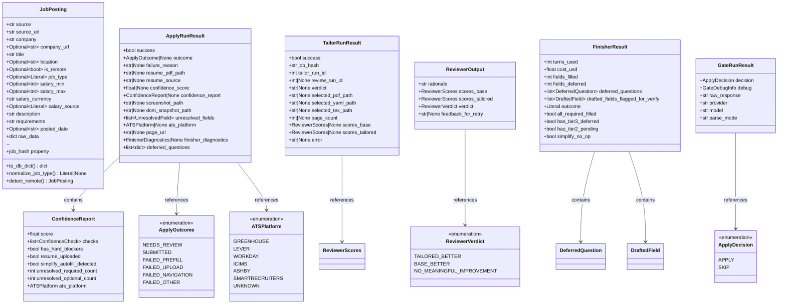

# Models Layer (`src/models/`) — Architecture Spec

**Date:** 2026-05-25  
**Subsystem:** Pydantic Models  
**Central Type:** `JobPosting` (src/models/job_posting.py)  
**Scope:** Core data models, shared agent schemas, enums across the pipeline  

---

## 1. Purpose: Boundary Between Models and Schemas

### `src/models/`—Normalized Domain Objects
The `src/models/` directory owns **single-responsibility Pydantic models** that represent the normalized state of the system's primary entities:
- **`JobPosting`** — the canonical job listing shape after fetcher transformation (src/models/job_posting.py:48).
  - Designed for **persistence** (to `job_postings` via `to_db_dict()`) and **consumption** by agents.
  - Validators ensure normalization at construction time (job_type, remote detection).
  - Carries the deterministic `job_hash` property used for deduplication and database identity.

### `src/agents/*/schemas.py`—Transient Agent Contracts
Agent-specific schemas live in each agent's directory and model **temporary, intermediate states** specific to that agent:
- **`src/agents/apply_worker/schemas.py`** — browser automation diagnostics (`ApplyRunResult`, `ConfidenceReport`, `UnresolvedField`).
- **`src/agents/resume_tailor/pipeline_schemas.py`** — tailor/reviewer LLM outputs (`TailorOutput`, `ReviewerOutput`, `TailorRunResult`).
- **`src/agents/root_apply_decider/schemas.py`** — gate-agent decision payloads (`GateRunResult`, `ApplyDecision`).
- **`src/agents/apply_finisher/schemas.py`** — finisher agent state (`FinisherResult`, `FinisherDeps`, `DeferredQuestion`).

### The Distinction
- **Models** (`src/models/`) → **persistent, reusable, low-churn**.
- **Schemas** (`src/agents/*/`) → **ephemeral, agent-specific, high-churn**.

This separation allows agents to emit nested, diagnostic-rich payloads without polluting the core domain model. `JobPosting` remains stable while agent contracts evolve independently.

---

## 2. Model-by-Model Breakdown

### 2.1 `JobPosting` (src/models/job_posting.py:48–241)

#### Purpose
The single normalized shape for all job listings across the system. Fetchers emit raw payloads; `JobPosting` is the canonical normalized form that databases, agents, and deduplicators understand.

#### Fields

| Field | Type | Default | Notes |
|-------|------|---------|-------|
| `source` | `str` | **required** | Source identifier (e.g., `ashby_acme`, `linkedin`, `greenhouse_jobs`). Set by `fetcher.get_source_name()` |
| `source_url` | `str` | **required** | Direct link to the job posting (often the apply form URL to skip redirects). Canonicalized in `job_hash` computation. |
| `company` | `str` | **required** | Company or entity name as provided by the fetcher. |
| `company_url` | `Optional[str]` | `None` | Company website or job board. Nullable; not all sources provide this. |
| `title` | `str` | **required** | Job title. Normalized to lowercase in `job_hash`. |
| `location` | `Optional[str]` | `None` | Geographic location string. May trigger `is_remote` inference via `detect_remote()` validator. |
| `is_remote` | `Optional[bool]` | `None` | Nullable tri-state: `True`/`False`/`None`. Inferred from location if not set (e.g., "Remote" → `True`). |
| `job_type` | `Optional[Literal["Full-time", "Part-time", "Contract", "Internship"]]` | `None` | Normalized via `normalize_job_type()` field validator using `map_job_type()` helper. |
| `salary_min` | `Optional[int]` | `None` | Annual salary in **cents** (to avoid float precision issues). |
| `salary_max` | `Optional[int]` | `None` | Annual salary in **cents**. |
| `salary_currency` | `str` | `"USD"` | ISO 4217 code. Defaults to USD; rarely overridden in current fetchers. |
| `salary_source` | `Optional[Literal["direct", "parsed", "not_listed"]]` | `"not_listed"` | Provenance of compensation: extracted directly from source, heuristically parsed, or absent. |
| `description` | `str` | `""` | Job description HTML-stripped. Hashed (SHA-256) in dedup fingerprint. |
| `requirements` | `str` | `""` | Requirements section. Hashed (SHA-256) in dedup fingerprint. Default is empty string to avoid None. |
| `posted_date` | `Optional[str]` | `None` | ISO 8601 datetime string when available from source. |
| `raw_data` | `dict[str, object]` | `{}` (empty dict) | Opaque source payload preserved for debugging. Serialized to JSON in `to_db_dict()`. |

#### Validators

##### `@field_validator("job_type", mode="before")` — `normalize_job_type()` (lines 183–201)
- **Trigger:** Before field type coercion.
- **Action:** Maps raw employment-type strings (e.g., "full time", "FT", "freelance") to the canonical Literal set via `map_job_type()`.
- **Returns:** One of `["Full-time", "Part-time", "Contract", "Internship"]` or `None`.
- **Mapping logic** (map_job_type, lines 18–45):
  - `"full"` or `"ft"` → `"Full-time"`
  - `"part"` or `"pt"` → `"Part-time"`
  - `"contract"` or `"freelance"` → `"Contract"`
  - `"intern"` → `"Internship"`
  - Anything else → `None`

##### `@model_validator(mode="after")` — `detect_remote()` (lines 161–181)
- **Trigger:** After all field validators and type coercion.
- **Action:** Infers `is_remote` from location keywords if `is_remote` is still `None`.
- **Keywords:** `["remote", "anywhere", "work from home", "wfh", "distributed"]` (case-insensitive).
- **Idempotent:** Only fills `is_remote` when it is `None`; respects explicit values.

#### Properties & Methods

##### `job_hash` Property (lines 82–108)
**Purpose:** Generates a **stable, deterministic SHA-256 hash** for deduplication.

**Identity fields hashed:**
1. Source (lowercased, stripped)
2. Company (lowercased, stripped)
3. Title (lowercased, stripped)
4. Location (normalized text)
5. Posted date (normalized text)
6. Source URL (canonicalized)
7. Description SHA-256 (prevents identical-boilerplate collisions)
8. Requirements SHA-256 (prevents identical-boilerplate collisions)

**Algorithm:**
```
identity_parts = [
  source.lower().strip(),
  company.lower().strip(),
  title.lower().strip(),
  _normalize_text(location),
  _normalize_text(posted_date),
  _canonicalize_url(source_url),
  hashlib.sha256(_normalize_text(description).encode()).hexdigest(),
  hashlib.sha256(_normalize_text(requirements).encode()).hexdigest(),
]
SHA256("|".join(identity_parts))
```

**URL canonicalization** (lines 127–159):
- Strips trailing slashes from path.
- **Drops tracking query params:** Any param starting with `utm_`, plus `gh_src` and `gh_jid`.
- Sorts remaining params alphabetically.
- Normalizes scheme and netloc to lowercase.
- Fragment always set to empty string (not included in identity).

**Why this hash is canonical:**
- **Consumed by deduplicator** (src/utils/deduplicator.py:47, 54, 96): Checks against existing hashes before insertion.
- **Database primary key** (src/database/_mixins/jobs.py:44): `job_hash` is UNIQUE in `job_postings`.
- **Used across pipeline:** Gate, tailor, apply workers all reference jobs by `job_hash`.

##### `_normalize_text()` Static Method (lines 110–125)
- Collapses whitespace and lowercases.
- Returns `""` for `None` inputs.
- Used to normalize `location`, `posted_date`, and before hashing `description`/`requirements`.

##### `_canonicalize_url()` Static Method (lines 127–159)
- Parses URL, strips tracking params, re-encodes query string sorted.
- Ensures same job posting with different tracking UTM params hashes identically.

##### `to_db_dict()` Method (lines 203–236)
**Purpose:** Convert Pydantic model to database-insert dict.

**Returns:** Dictionary with keys matching the `job_postings` table schema:
```python
{
  "job_hash": self.job_hash,
  "source": self.source,
  "source_url": self.source_url,
  "company": self.company,
  "company_url": self.company_url,
  "title": self.title,
  "location": self.location,
  "is_remote": self.is_remote,
  "job_type": self.job_type,
  "salary_min": self.salary_min,
  "salary_max": self.salary_max,
  "salary_currency": self.salary_currency,
  "salary_source": self.salary_source,
  "description": self.description,
  "requirements": self.requirements,
  "posted_date": self.posted_date,
  "raw_data": json.dumps(self.raw_data),  # JSON serialization happens here
}
```

**Called by:** src/orchestrator/insert_pipeline.py:79 (every insert flow).

#### Pydantic Config
- **`model_config = ConfigDict(extra="ignore")`** (line 240): Allows fetchers to pass heterogeneous payloads without schema drift. Unknown keys are silently dropped.

---

### 2.2 Shared Agent Schemas (src/agents/*/schemas.py)

#### 2.2.1 Apply Worker Schemas (src/agents/apply_worker/schemas.py:1–307)

##### `ApplyOutcome` Enum (lines 47–62)
**Represents application-level result separate from run success/failure.**

| Value | Meaning |
|-------|---------|
| `NEEDS_REVIEW` | Form filled; needs human verification before submit. |
| `SUBMITTED` | Auto-submitted (confidence score met gate). |
| `FAILED_PREFILL` | Could not fill form fields (browser interaction error). |
| `FAILED_UPLOAD` | Resume upload failed. |
| `FAILED_NAVIGATION` | Could not navigate to or load the job application page. |
| `FAILED_OTHER` | Generic other error. |

**Used by:** `ApplyRunResult.outcome` (line 278), persisted to `apply_runs.apply_outcome`.

##### `ATSPlatform` Enum (lines 85–99)
**Classifies the applicant tracking system hosting the job.**

| Value | Platform |
|-------|----------|
| `GREENHOUSE` | Greenhouse (most common) |
| `LEVER` | Lever |
| `WORKDAY` | Workday |
| `ICIMS` | iCIMS |
| `ASHBY` | Ashby |
| `SMARTRECRUITERS` | SmartRecruiters |
| `UNKNOWN` | Could not detect |

**Purpose:** Diagnostic classification; may drive platform-specific heuristics in future versions.

##### `UnresolvedField` Model (lines 107–136)
**Captures rich metadata for form fields left empty after fill attempt.**

| Field | Type | Purpose |
|-------|------|---------|
| `field_id` | `str \| None` | CSS id or element identifier. |
| `label` | `str \| None` | Human-readable form label. |
| `field_type` | `str` | HTML input type (`text`, `select`, `radio`, `checkbox`, etc.). |
| `is_required` | `bool` | Whether the field is marked required in HTML. |
| `current_value` | `str` | Current field value (empty if unfilled). |
| `validation_error` | `str \| None` | Visible error message near the field. |
| `options` | `list[str] \| None` | Choices for select/radio/checkbox. |
| `selector` | `str` | CSS selector uniquely identifying this field. |
| `parent_form_selector` | `str \| None` | Enclosing form's CSS selector. |
| `placeholder` | `str \| None` | Placeholder text hint. |

**Purpose:** Captured by browser agent; persisted to `apply_runs.unresolved_fields_json` for finisher-repair passes.

##### `ConfidenceCheck` Model (lines 144–161)
**One deterministic confidence signal.**

| Field | Type | Purpose |
|-------|------|---------|
| `name` | `str` | Check identifier (e.g., `"resume_uploaded"`, `"all_required_filled"`). |
| `passed` | `bool` | Whether this check passed. |
| `weight` | `float` | Contribution to overall score (e.g., 0.3 = 30% of final score). |
| `detail` | `str \| None` | Human-readable context (e.g., "Resume uploaded in 2.1s"). |

##### `ConfidenceReport` Model (lines 164–190)
**Aggregates all confidence signals for an apply attempt.**

| Field | Type | Default | Purpose |
|-------|------|---------|---------|
| `score` | `float` | — | Overall [0.0, 1.0] score (Pydantic validation: `ge=0.0, le=1.0`). |
| `checks` | `list[ConfidenceCheck]` | `[]` | Ordered list of all checks contributing to score. |
| `has_hard_blockers` | `bool` | `False` | True if any hard-blocker condition (e.g., form failed to load). |
| `resume_uploaded` | `bool` | `False` | Resume successfully uploaded to form. |
| `simplify_autofill_detected` | `bool` | `False` | Simplify extension UI markers detected. |
| `unresolved_required_count` | `int` | `0` | Number of required fields left empty. |
| `unresolved_optional_count` | `int` | `0` | Number of optional fields left empty. |
| `ats_platform` | `ATSPlatform` | `ATSPlatform.UNKNOWN` | Detected ATS (enum). |

**Used by:** `ApplyRunResult.confidence_report` (line 283).

##### `FinisherDiagnostics` Model (lines 198–241)
**Finisher-specific telemetry persisted to `apply_handoffs.finisher_diagnostics_json`.**

| Field | Type | Default | Purpose |
|-------|------|---------|---------|
| `finisher_outcome` | `str` | `"SKIPPED"` | Terminal state: `COMPLETE`, `AGENT_GAVE_UP`, `USAGE_LIMIT_HIT`, `RUNTIME_ERROR`, `SKIPPED` (when not invoked). |
| `turns_used` | `int` | `0` | Agent iteration count. |
| `cost_usd` | `float` | `0.0` | USD cost via litellm.cost_per_token. |
| `fields_filled` | `int` | `0` | Tier-1 fills (auto-confident). |
| `fields_deferred` | `int` | `0` | Tier-3 deferred fields. |
| `all_required_filled` | `bool` | `False` | Every required field filled or drafted. |
| `has_tier3_deferred` | `bool` | `False` | Mirror of `len(deferred_questions) > 0`. |
| `has_tier2_pending` | `bool` | `False` | Any Tier-2 draft awaiting review. |
| `drafted_fields` | `list[dict[str, Any]]` | `[]` | Tier-2 drafts with confidence scores. |
| `simplify_no_op` | `bool` | `False` | Post-Simplify verify detected all known fields empty (telemetry). |
| `submit_errors` | `list[str]` | `[]` | Error toast text scraped after submit attempt. |
| `gate_decision` | `str` | `"skipped"` | Gate decision: `"auto_submit"`, `"dry_run"`, or `"skipped"`. |

##### `ApplyRunResult` Model (lines 249–290)
**Final output payload from one browser apply attempt.**

| Field | Type | Default | Purpose |
|-------|------|---------|---------|
| `success` | `bool` | — | Run completed without fatal errors. |
| `outcome` | `ApplyOutcome \| None` | `None` | Application-level result. |
| `failure_reason` | `str \| None` | `None` | Error explanation when `success=False`. |
| `resume_pdf_path` | `str \| None` | `None` | Absolute path to uploaded resume PDF. |
| `resume_source` | `str \| None` | `None` | `"TAILORED"` or `"BASE"`. |
| `confidence_score` | `float \| None` | `None` | Overall confidence [0.0, 1.0]. |
| `confidence_report` | `ConfidenceReport \| None` | `None` | Full breakdown of checks. |
| `screenshot_path` | `str \| None` | `None` | Pre-submit form screenshot. |
| `dom_snapshot_path` | `str \| None` | `None` | Saved page HTML for debugging. |
| `unresolved_fields` | `list[UnresolvedField]` | `[]` | All unresolved form fields. |
| `ats_platform` | `ATSPlatform \| None` | `None` | Detected ATS. |
| `page_url` | `str \| None` | `None` | Final URL after redirects. |
| `finisher_diagnostics` | `FinisherDiagnostics \| None` | `None` | Finisher telemetry (None if not invoked). |
| `deferred_questions` | `list[dict[str, Any]]` | `[]` | Tier-3 questions (persisted to `apply_handoffs.deferred_questions_json`). |

---

#### 2.2.2 Resume Tailor Pipeline Schemas (src/agents/resume_tailor/pipeline_schemas.py:1–184)

##### `ReviewerVerdict` Enum (lines 24–34)
**LLM-emitted verdict (lowercase).**

| Value | Meaning |
|-------|---------|
| `TAILORED_BETTER` | Tailored resume scores higher on rubric. |
| `BASE_BETTER` | Base resume scores higher (veto: unsupported claims in tailored). |
| `NO_MEANINGFUL_IMPROVEMENT` | Tailored and base are equivalent. |

**Distinct from** `DBReviewVerdict` (see §3.2.3), which captures the *stored* state.

##### `BulletPatchProposal` Model (lines 37–64)
**One bullet-level edit from tailor LLM.**

| Field | Type | Purpose |
|-------|------|---------|
| `id` | `str` | Exact bullet ID from manifest (e.g., `"section_1.bullet_0"`). |
| `rationale` | `str` | Why bullet should be kept or rewritten (reasoning-first by design). |
| `action` | `Literal["keep", "rewrite"]` | Decision. |
| `new_text` | `str` | Replacement text (empty when `action="keep"`). May contain LaTeX macros. |

**Design note:** Field order intentional — `rationale` before `action` to keep LMSF-safe ordering for strict JSON schema generation.

##### `SkippedBulletNote` Model (lines 67–78)
**Acknowledgment of a bullet not touched by tailor.**

| Field | Type | Purpose |
|-------|------|---------|
| `id` | `str` | Manifest bullet ID. |
| `reason` | `str` | Why the bullet was skipped. |

##### `TailorOutput` Model (lines 81–99)
**Strict-JSON output shape from tailor LLM.**

| Field | Type | Purpose |
|-------|------|---------|
| `rewrite_plan` | `str` | High-level strategy (which bullets and why). |
| `bullets` | `list[BulletPatchProposal]` | Per-bullet decisions. |
| `skipped_bullets` | `list[SkippedBulletNote]` | Bullets intentionally left alone. |

##### `ReviewerScores` Model (lines 102–125)
**Rubric scores (0–5 each).**

| Field | Type | Veto? | Purpose |
|-------|------|-------|---------|
| `keyword_fit` | `int` (0–5) | No | JD keyword/skill alignment. |
| `specificity` | `int` (0–5) | No | Concreteness, action verbs, measurable impact. |
| `factuality` | `int` (0–5) | **YES** | Zero invented claims. Any unsupported claim forces `base_better`. |

##### `ReviewerOutput` Model (lines 128–150)
**Reviewer LLM response.**

| Field | Type | Required? | Purpose |
|-------|------|-----------|---------|
| `rationale` | `str` | Yes | 2–3 sentence justification (field-1 by design). |
| `scores_base` | `ReviewerScores` | Yes | Rubric for base resume. |
| `scores_tailored` | `ReviewerScores` | Yes | Rubric for tailored resume. |
| `verdict` | `ReviewerVerdict` | Yes | Final pick. |
| `feedback_for_retry` | `str \| None` | When `verdict=base_better` | Critique for retry pass. |

##### `TailorRunResult` Model (lines 153–173)
**Final return payload from `run_tailor_review_pipeline`.**

| Field | Type | Purpose |
|-------|------|---------|
| `success` | `bool` | Pipeline completed. |
| `job_hash` | `str` | Job being tailored. |
| `tailor_run_id` | `int` | Database tailor_runs PK. |
| `review_run_id` | `int \| None` | Database review_runs PK (None if no reviewer). |
| `verdict` | `str \| None` | Final verdict string (mapped from `ReviewerVerdict`). |
| `selected_pdf_path` | `str \| None` | Path to selected resume PDF. |
| `selected_yaml_path` | `str \| None` | Path to selected YAML metadata. |
| `selected_tex_path` | `str \| None` | Path to selected LaTeX source. |
| `page_count` | `int \| None` | Generated PDF page count. |
| `scores_base` | `ReviewerScores \| None` | Base resume scores. |
| `scores_tailored` | `ReviewerScores \| None` | Tailored resume scores. |
| `error` | `str \| None` | Error message if `success=False`. |

---

#### 2.2.3 Root Apply Decider Schemas (src/agents/root_apply_decider/schemas.py:1–50)

##### `ApplyDecision` Enum (lines 11–15)
**Gate agent outcome.**

| Value | Meaning |
|-------|---------|
| `APPLY` | Candidate should apply. |
| `SKIP` | Skip this job. |

##### `GateDebugInfo` Model (lines 18–38)
**Optional metadata from gate run.**

| Field | Type | Purpose |
|-------|------|---------|
| `confidence` | `float \| None` | Model confidence [0.0, 1.0]. |
| `explanation` | `str \| None` | Short reason for APPLY/SKIP. |
| `preference_matches` | `list[str]` | Matching preferences/strengths. |
| `preference_conflicts` | `list[str]` | Conflicts with preferences/filters. |

##### `GateRunResult` Model (lines 41–50)
**Persisted result from one gate run.**

| Field | Type | Purpose |
|-------|------|---------|
| `decision` | `ApplyDecision` | APPLY or SKIP. |
| `debug` | `GateDebugInfo` | Metadata (default factory creates empty). |
| `raw_response` | `str` | Full LLM response (for debugging). |
| `provider` | `str` | LLM provider (e.g., `"openai"`). |
| `model` | `str` | Model name (e.g., `"gpt-4-turbo"`). |
| `parse_mode` | `str` | Parsing mode (e.g., `"json"`). |

---

#### 2.2.4 Apply Finisher Schemas (src/agents/apply_finisher/schemas.py:1–151)

##### `SupportedAts` Type Alias (line 22)
```python
SupportedAts = Literal["greenhouse", "ashby"]
```

##### `DeferredQuestion` Model (lines 25–41)
**Tier-3 question the finisher declined to answer.**

| Field | Type | Purpose |
|-------|------|---------|
| `field_id` | `str` | `aria-ref` field identifier (e.g., `"e5"`). |
| `label` | `str` | Visible label text. |
| `field_type` | `str` | Input type (`select`, `textarea`, `checkbox`, etc.). |
| `category` | `str` | Defer category (`sponsorship`, `eeo`, `salary`, `start_date`, `other`). |
| `reason` | `str` | Human-readable reason. |

##### `DraftedField` Model (lines 44–63)
**Tier-2 draft flagged for human review.**

| Field | Type | Purpose |
|-------|------|---------|
| `field_id` | `str` | `aria-ref` identifier. |
| `label` | `str` | Visible label. |
| `drafted_value` | `str` | Text the agent wrote. |
| `confidence` | `float` | Self-reported confidence [0.0, 1.0] (Pydantic: `ge=0.0, le=1.0`). |
| `reasoning` | `str` | Justification produced before scoring. |

##### `FinisherResult` Model (lines 66–107)
**Final structured output from finisher loop.**

| Field | Type | Default | Purpose |
|-------|------|---------|---------|
| `turns_used` | `int` | `0` | Agent iteration count. |
| `cost_usd` | `float` | `0.0` | Accumulated USD cost. |
| `fields_filled` | `int` | `0` | Tier-1 (confident) fills. |
| `fields_deferred` | `int` | `0` | Tier-3 deferrals. |
| `deferred_questions` | `list[DeferredQuestion]` | `[]` | All Tier-3 records. |
| `drafted_fields_flagged_for_verify` | `list[DraftedField]` | `[]` | All Tier-2 drafts. |
| `outcome` | `Literal[...]` | `"COMPLETE"` | Terminal state: `COMPLETE`, `AGENT_GAVE_UP`, `USAGE_LIMIT_HIT`, `RUNTIME_ERROR`. |
| `all_required_filled` | `bool` | `False` | Every required field filled or drafted. |
| `has_tier3_deferred` | `bool` | `False` | Convenience: `len(deferred_questions) > 0`. |
| `has_tier2_pending` | `bool` | `False` | Convenience: `len(drafted_fields_flagged_for_verify) > 0`. |
| `simplify_no_op` | `bool` | `False` | Telemetry: post-Simplify verify saw all fields empty. |

##### `FinisherDeps` Dataclass (lines 110–142)
**Runtime dependencies passed to finisher tools via `RunContext.deps`.**

| Field | Type | Purpose |
|-------|------|---------|
| `ats` | `SupportedAts` | ATS dialect (used for system prompt). |
| `target_company` | `str` | Company name for `$COMPANY` substitution in answer cache. |
| `defer_rules` | `DeferRules` | Compiled defer-rule classifier. |
| `cache` | `AnswerCache` | Loaded answer cache. |
| `profile_yaml` | `str` | Pre-serialized candidate profile YAML. |
| `recorded_deferrals` | `list[DeferredQuestion]` | Per-run accumulator (default `[]`). |
| `drafted_fields` | `list[DraftedField]` | Per-run accumulator (default `[]`). |
| `fields_filled_count` | `int` | Counter for Tier-1 fills (default `0`). |

---

### 2.3 Enum Cross-Section (All Status/Verdict Types)

#### Database-Stored Status Enums

##### Job Status (implicit in job_postings.status column)
- **`FETCHED`** — Inserted, awaiting gate.
- **`QUALIFIED`** — Gate auto-qualified (soft filter).
- **`FILTERED`** — Soft-filtered out.
- **`DECLINED`** — Gate agent declined.
- **`APPROVED`** — Gate approved.
- **`TAILORED`** — Resume tailor completed.
- **`APPLIED`** — Application submitted.
- **`IN_PROGRESS`** — Currently processing.

##### Apply Outcome (persisted to apply_runs.apply_outcome) → `ApplyOutcome` Enum
- `NEEDS_REVIEW`, `SUBMITTED`, `FAILED_PREFILL`, `FAILED_UPLOAD`, `FAILED_NAVIGATION`, `FAILED_OTHER`

##### Review Verdict (persisted to review_runs.verdict) → `DBReviewVerdict` Enum (§2.2.3)
- `PASS`, `TAILORED`, `BASE`, `FAIL`, `NO_IMPROVEMENT`, `PAGE_FIT_FAILED`

##### Gate Decision (implicit in job_postings.gate_decision) → `ApplyDecision` Enum
- `APPLY`, `SKIP`

##### ATS Platform (diagnostic, stored in apply_runs.ats_platform) → `ATSPlatform` Enum
- `GREENHOUSE`, `LEVER`, `WORKDAY`, `ICIMS`, `ASHBY`, `SMARTRECRUITERS`, `UNKNOWN`

---

## 3. `JobPosting` Deep-Dive: Field-by-Field Source Mapping

### Fetcher → JobPosting Transformation

Each fetcher reads its source payload and maps fields to `JobPosting`. Example: **Ashby** (src/fetchers/ashby_fetcher.py:114–164):

| Fetcher Field | JobPosting Field | Normalization | Example |
|---------------|------------------|----------------|---------|
| `posting.id` + `board_id` | `source_url` | Fallback: `https://jobs.ashbyhq.com/{board_id}/{posting.id}/application` | Direct apply link |
| `board_id` (constructor) | `company_url` | Transformed: `https://jobs.ashbyhq.com/{board_id}` | — |
| `posting.title` | `title` | Direct copy (lowercased in hash) | "Senior Engineer" |
| `posting.location.name` or `posting.location` | `location` | Direct copy | "San Francisco, CA" or "Remote" |
| `posting.employmentType` | `job_type` | `_map_employment_type()` → normalized Literal | "full time" → `"Full-time"` |
| `posting.compensation.min/max` | `salary_min/max` | Converted to cents (float × 100) | `150000.0` → `15000000` cents |
| — | `salary_source` | Hardcoded or heuristic | `"direct"` or `"not_listed"` |
| `posting.descriptionHtml` or `descriptionPlain` | `description` | HTML-stripped | Cleaned text |
| — | `requirements` | Empty string (Ashby doesn't separate) | `""` |
| — | `posted_date` | Not set by Ashby | `None` |
| `self.company_name` | `company` | Constructor parameter | "Anthropic" |
| `self.get_source_name()` | `source` | `f"ashby_{company_name.lower().replace(' ', '_')}"` | `"ashby_anthropic"` |
| Entire `posting` dict | `raw_data` | `dict(posting)` | Original payload preserved |

### Nullable Field Handling

| Field | Nullable? | Default | Rationale |
|-------|-----------|---------|-----------|
| `source` | No | Required | Every job must identify its source. |
| `source_url` | No | Required | Apply link required for automation. |
| `company` | No | Required | Company name is fundamental. |
| `company_url` | **Yes** | `None` | Not all sources provide company URL. |
| `title` | No | Required | Job title is fundamental. |
| `location` | **Yes** | `None` | Remote jobs may have no location. |
| `is_remote` | **Yes** | `None` → inferred | Tri-state; inferred from location if unclear. |
| `job_type` | **Yes** | `None` | Not always specified. |
| `salary_min/max` | **Yes** | `None` | Salary rarely disclosed. |
| `salary_currency` | No | `"USD"` | Default assumes USD; rarely overridden. |
| `salary_source` | **Yes** | `"not_listed"` | Default when salary not found. |
| `description` | No | `""` | Always present; empty if unknown. |
| `requirements` | No | `""` | Always present; empty if unknown. |
| `posted_date` | **Yes** | `None` | Not all sources timestamp. |
| `raw_data` | No | `{}` | Always present; empty dict if unused. |

### Nullability Subtlety: `is_remote`

The `is_remote` field is **not Optional in Pydantic's sense** — it's `Optional[bool]`, a tri-state:
- `True` — Remote/hybrid confirmed.
- `False` — On-site confirmed.
- `None` — Unknown (inferred attempt made; still uncertain).

The `detect_remote()` model validator (lines 161–181) **only fills `None`** with inferred state, preserving explicit `True`/`False` from fetchers.

---

## 4. Job Hash: Deterministic Deduplication

### Canonical Hash Computation

**Purpose:** Create a stable, collision-resistant fingerprint so the same job from multiple sources (or re-crawled) is recognized as duplicate.

**Algorithm (src/models/job_posting.py:82–108):**

```python
identity_parts = [
  source.lower().strip(),                              # Source identifier
  company.lower().strip(),                              # Company name
  title.lower().strip(),                                # Job title
  _normalize_text(location),                            # Location (whitespace-collapsed, lowercased)
  _normalize_text(posted_date),                         # Posted timestamp
  _canonicalize_url(source_url),                        # URL with UTM params stripped
  hashlib.sha256(_normalize_text(description).encode()).hexdigest(),    # Description digest
  hashlib.sha256(_normalize_text(requirements).encode()).hexdigest(),    # Requirements digest
]
final_hash = hashlib.sha256("|".join(identity_parts).encode()).hexdigest()
```

### Why Two Content Hashes (description + requirements)?

Including the **digest** of description and requirements (not their full text) prevents:
1. **Boilerplate collisions:** Two different jobs with identical boilerplate company preambles.
2. **Hash explosion:** Avoids unbounded input length to the final SHA-256.
3. **Tracking-param variance:** Hashing the digests means minor edits don't flip the hash.

### URL Canonicalization (lines 127–159)

**Goal:** Normalize URLs so same job with different UTM/tracking params still deduplicates.

**Steps:**
1. Parse URL into components.
2. **Drop tracking params:** Any param `key.lower().startswith("utm_")` or key in `{"gh_src", "gh_jid"}`.
3. Sort remaining params alphabetically.
4. Rebuild URL with normalized scheme/netloc (lowercase) and no fragment.

**Example:**
```
Input:  https://jobs.Anthropic.com/job?title=eng&utm_source=linkedin&utm_campaign=2026-05
Output: https://jobs.anthropic.com/job?title=eng
```

### Database Identity

- **Primary Key:** `job_postings.job_hash` is UNIQUE.
- **Insertion:** `DatabaseManager.insert_job()` (src/database/_mixins/jobs.py:25–70) rejects duplicates with `IntegrityError` (caught and returned as `False`).
- **Deduplication:** `Deduplicator` (src/utils/deduplicator.py) checks `job_hash` against existing rows before fetcher output is inserted.

---

## 5. Status Enums Across the Pipeline

### Job Posting Status Lifecycle

| Status | Meaning | Set By | Advance Condition |
|--------|---------|--------|-------------------|
| `FETCHED` | Inserted by fetcher; awaiting gate. | `insert_pipeline.py` (default) | Gate decision |
| `QUALIFIED` | Soft filter auto-qualified. | `insert_pipeline.py` (FilterAction.ACCEPT_QUALIFIED) | Auto-advance to apply |
| `FILTERED` | Soft filter rejected. | `insert_pipeline.py` (FilterAction.REJECT_FILTERED) | Terminal (no advance) |
| `APPROVED` | Gate approved job. | Gate agent via DB method | Tailor or apply |
| `DECLINED` | Gate declined job. | Gate agent via DB method | Terminal (no advance) |
| `IN_PROGRESS` | Currently processing (tailor/apply/etc.). | Stage agent claims job | Stage completion |
| `TAILORED` | Resume tailor completed. | Tailor pipeline | Apply worker |
| `APPLIED` | Application submitted. | Apply worker | Finisher review (if needed) |

### Apply Outcome Enum (`ApplyOutcome`)

Separate from run success/failure. Captured at end of browser automation:

| Outcome | Means | Next Step |
|---------|-------|-----------|
| `NEEDS_REVIEW` | Form filled, needs human verification. | Human review required. |
| `SUBMITTED` | Auto-submitted by confident gate. | Monitoring/follow-up. |
| `FAILED_PREFILL` | Could not fill form. | Finisher repair attempt. |
| `FAILED_UPLOAD` | Resume upload failed. | Finisher retry or manual. |
| `FAILED_NAVIGATION` | Could not load apply page. | Manual check / retry. |
| `FAILED_OTHER` | Generic error. | Investigate logs. |

### Review Verdict Enums

**`ReviewerVerdict` (LLM output, lowercase):**
- `TAILORED_BETTER`, `BASE_BETTER`, `NO_MEANINGFUL_IMPROVEMENT`

**`DBReviewVerdict` (stored in database):**
- `PASS`, `TAILORED`, `BASE`, `FAIL`, `NO_IMPROVEMENT`, `PAGE_FIT_FAILED`

**Mapping:** Pipeline maps `ReviewerVerdict` → `DBReviewVerdict` before storage.

---

## 6. Shared Agent Schemas: `src/agents/shared/`

### Content

File: **src/agents/shared/model.py** (lines 1–38)

**Single function:** `build_openai_litellm_model(*, model_name: str) → Any`

**Purpose:** Centralize OpenAI credential validation and LiteLLM instantiation for ADK agents.

**Behavior:**
1. Checks `OPENAI_API_KEY` env var; fails fast if missing.
2. Imports `google.adk.models.lite_llm.LiteLlm`.
3. Returns configured LiteLLM instance with the given model name.

**Used by:** Root apply decider, tailor, reviewer, finisher agents (any agent that needs OpenAI access).

### Distinction from Agent-Specific Schemas

`src/agents/shared/model.py` contains **only helpers** (functions, not Pydantic models). Agent-specific Pydantic schemas live in their own `schemas.py` files (see §2.2).

---

## 7. Pydantic Version & Feature Notes

### Version
**Pydantic 2.12.5** (pyproject.toml:27) — Pydantic v2 stable.

### Key v2 Features Used

#### 1. **Field Validators with Mode** (src/models/job_posting.py:183–201)
```python
@field_validator("job_type", mode="before")
@classmethod
def normalize_job_type(cls, v: str | None) -> ...:
    return map_job_type(v)
```
- **`mode="before"`:** Run before type coercion (receives raw input).
- Pydantic v2 syntax; v1 used `@validator`.

#### 2. **Model Validators** (src/models/job_posting.py:161–181)
```python
@model_validator(mode="after")
def detect_remote(self) -> "JobPosting":
    ...
    return self
```
- **`mode="after"`:** Run after all field validators and type coercion.
- Used for cross-field logic (infer `is_remote` from `location`).

#### 3. **ConfigDict** (src/models/job_posting.py:240)
```python
model_config = ConfigDict(extra="ignore")
```
- Pydantic v2 config class. `extra="ignore"` allows heterogeneous fetcher payloads without schema drift.

#### 4. **Typed Field Defaults**
```python
raw_data: dict[str, object] = Field(default_factory=dict)
checks: list[ConfidenceCheck] = Field(default_factory=list)
```
- Modern Python type hints; `Field(default_factory=...)` for mutable defaults.

#### 5. **Optional Type Hints**
```python
from typing import Optional
company_url: Optional[str] = None
```
- Explicit `Optional[T]` (equivalent to `T | None` in Python 3.10+).

---

## 8. Risks & Gotchas

### Risk 1: Field-Defaults vs Database-Defaults Divergence

**Issue:** A Pydantic field's default value is **not the same as** the database column default.

**Example:**
```python
salary_source: Optional[Literal["direct", "parsed", "not_listed"]] = "not_listed"
```

- **Pydantic side:** If `salary_source` is omitted, it defaults to `"not_listed"`.
- **Database side:** The column may have a different default (or none).

**Mitigation:**
- Always set Pydantic defaults to match database column defaults.
- Document in both places if they diverge.
- Use `to_db_dict()` to catch discrepancies (it captures Pydantic's state, not database defaults).

### Risk 2: Optional vs Nullable Confusion

**Issue:** `Optional[T]` means "can be None," but doesn't specify whether the database column is `NULL`-able.

**Example:**
```python
is_remote: Optional[bool] = None
```

- **Pydantic:** Can be `True`, `False`, or `None`.
- **Database:** Column is `NULLABLE BOOLEAN DEFAULT NULL`.

**Mitigation:**
- Treat `Optional[T]` as "tri-state" (for booleans) or "can be absent" (for others).
- Validate that `to_db_dict()` output aligns with database schema.
- Document tri-state semantics (e.g., `is_remote` can be inferred at insertion time).

### Risk 3: raw_data Serialization

**Issue:** `raw_data: dict[str, object]` contains arbitrary payloads (from API responses).

**Gotcha:** The comment (line 79) warns:
> Pydantic serializes this correctly at runtime via json.dumps in to_db_dict.

- **Not** serialized by Pydantic's `.model_dump_json()` — raw_data stays as dict.
- **Explicitly** serialized in `to_db_dict()` (line 235) via `json.dumps(self.raw_data)`.

**Risk:** If code calls `JobPosting.model_dump_json()` directly (bypassing `to_db_dict()`), raw_data will fail to serialize if it contains non-JSON types.

**Mitigation:** Always use `to_db_dict()` for database persistence; never call `model_dump_json()` directly.

### Risk 4: Hash Stability Across Versions

**Issue:** The `job_hash` computation includes a SHA-256 of description and requirements.

**Gotcha:** If the `_normalize_text()` logic changes (e.g., extra whitespace collapsing, case handling), the hash will change for existing jobs, breaking deduplication.

**Mitigation:**
- Treat `job_hash` as immutable once deployed.
- If normalization must change, create a migration that recomputes all hashes.
- Document the hash algorithm as part of the DB schema.

### Risk 5: Validator Ordering & Side Effects

**Issue:** Field validators run **before** model validators. Order matters for dependent fields.

**Example:**
- `@field_validator("job_type")` normalizes the job type.
- `@model_validator(mode="after")` infers `is_remote`.
- If `job_type` depends on `location`, but `location` hasn't been set yet, it won't work.

**Mitigation:** Use `mode="after"` model validators for cross-field logic; keep field validators focused on single fields.

### Risk 6: Config `extra="ignore"` Hides Mistakes

**Issue:** With `extra="ignore"`, typos in fetcher field names silently drop data.

**Example:**
```python
JobPosting(
    source="test",
    source_url="...",
    # ... other fields
    sallary_min=100000,  # Typo: should be "salary_min"
)
```

- The `sallary_min` key is silently ignored; `salary_min` remains `None`.

**Mitigation:**
- Use type checkers (mypy, pyright) in strict mode.
- Test fetchers with known payloads to catch field name drifts.
- Consider adding a post-validator that warns on common typos.

---

## 9. Mermaid Class Diagram



---

## 10. Summary & Key Findings

### Finding 1: `JobPosting` is the Immutable Domain Model; Agents Emit Ephemeral Schemas
The codebase separates **persistent, normalized models** (`src/models/`) from **transient, agent-specific schemas** (`src/agents/*/schemas.py`). This allows fetchers, databases, and agents to work with a stable `JobPosting` contract while agents independently emit rich, diagnostic-heavy payloads (e.g., `ApplyRunResult`, `TailorRunResult`). The boundary is clear: only `JobPosting` is persisted directly; agent results are either aggregated into database summary fields (e.g., `apply_handoffs.finisher_diagnostics_json`) or dropped after use.

### Finding 2: `job_hash` is the Deterministic Canonical Key
The `job_hash` property is not just a deduplication aid — it's the **single source of truth for job identity** across the pipeline. It incorporates source, company, title, location, URL (with UTM params stripped), and SHA-256 digests of description and requirements. This design prevents duplicate crawls, allows agents to reference jobs consistently, and provides a stable FK for related tables (tailor_runs, apply_runs, etc.). The hash computation is baked into the model; changing it requires a migration to recalculate all hashes.

### Finding 3: Nullability and Defaults Diverge Between Pydantic and Database
Fields like `salary_source` have Pydantic defaults (`"not_listed"`) but are also nullable in the database. This duality is intentional but fragile: if database defaults change (or Pydantic defaults change), insertion behavior silently diverges. Mitigation requires explicit documentation, test coverage of boundary cases, and careful use of `to_db_dict()` to ensure Pydantic state matches what's persisted.

---

**End of Spec**
