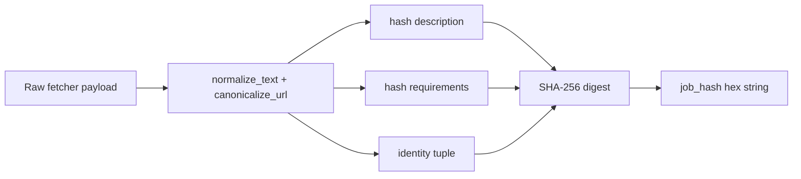
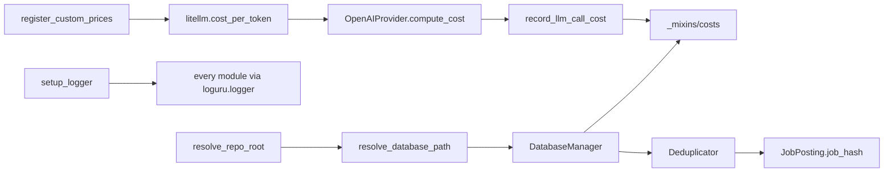

# 14 — Shared Utilities (`src/utils/`)

## Purpose

The `src/utils/` directory provides cross-cutting helpers that abstract common operational concerns across the discovery orchestrator, agent workers (gate, tailor, review, apply), and operational scripts. These utilities handle structured logging with file rotation, deterministic job deduplication using SHA-256 hashing, per-LLM-call cost tracking with provider-agnostic persistence, operational alerting via ntfy.sh, filesystem path resolution for Docker-mount and relative-path environments, shared JSON type aliases for API and database boundaries, and startup-time custom-pricing registration for litellm.

## Module Inventory

| Module | Public surface | Primary consumers |
|---|---|---|
| `logger.py` | `setup_logger`, `log_crawl_summary`, `log_cycle_summary` | every orchestrator, fetcher, and agent (via loguru's global `logger`) |
| `deduplicator.py` | `Deduplicator.filter_new_jobs`, `Deduplicator.get_stats` | all fetcher orchestration wrappers, `_family_tasks.py` |
| `cost_tracking.py` | `record_llm_call_cost`, `record_apply_browser_stub`, `record_stage_cost_event`, `check_budget_before_claim` | tailor pipeline, apply_finisher runner, apply worker |
| `notifications.py` | `is_ntfy_enabled`, `send_ntfy_notification` | (intended) terminal-failure paths in worker loops |
| `paths.py` | `resolve_repo_root`, `resolve_database_path` | discovery orchestrator, every worker subprocess, API startup |
| `json_types.py` | `JSONScalar`, `JSONValue`, `JSONObject`, `JSONArray`, `get_str`, `get_str_opt`, `get_dict`, `get_list_of_dicts`, `get_float_opt` | cost mixin budget reads, generic safe-accessor consumers |
| `llm_pricing.py` | `register_custom_prices` | `api/main.py` startup, `scripts/process_apply_jobs.py:__main__` |

`job_hash` is logically a utility but lives as a `@property` on `src/models/job_posting.py:JobPosting`. It is documented here because it is the central deduplication primitive; the model file is owned by the models subsystem (file 13).

## `logger.py` — structured logging

`setup_logger(log_file, level, rotation, retention)` (`src/utils/logger.py:9-66`) bootstraps loguru with two sinks: a colorized stderr sink and a plain-ASCII file sink with auto-created parent directory. Default rotation is 10 MB with 1-week retention, but both are tunable via env (`LOG_FILE`, `LOG_LEVEL`).

`log_crawl_summary(source, company, jobs_found, jobs_new, duration_seconds)` (`src/utils/logger.py:69-94`) emits a per-source completion line consumed by every fetcher orchestration wrapper.

`log_cycle_summary(total_discovered, total_new, total_duplicate, sources_success, sources_failed, duration_seconds)` (`src/utils/logger.py:97-130`) emits the banner that closes each discovery cycle.

The console format is `<timestamp> | <level> | <module>:<function>:<line> - <message>`; the file sink uses the same fields without ANSI color so log shippers can ingest them unmodified.

## `deduplicator.py` — exact-hash dedup against the DB

The `Deduplicator` class (`src/utils/deduplicator.py:12-108`) is constructed with a `DatabaseManager` reference. Its two public methods both take a `list[JobPosting]`:

- `filter_new_jobs` (`src/utils/deduplicator.py:26-68`) returns only postings whose `job_hash` is not already in the DB. It applies two optimizations: an **in-batch dedup pass** that removes repeated hashes within a single fetcher response before any DB call (`:43-51`), and a **single batched hash lookup** that calls `db.get_existing_job_hashes(hashes)` once and intersects in Python (`:53-55`).
- `get_stats` (`src/utils/deduplicator.py:70-108`) returns `{total, new, duplicate}` without filtering, using the same in-batch + batch-lookup path so reported counts match what filter would produce.

The dedup is **exact only** — fuzzy matching lives elsewhere (in `src/fetchers/fuzzy_dedup.py`, which is fetcher-internal). The exact-hash path relies on the stability of `JobPosting.job_hash`; see "Job Hash" below.

Test coverage in `tests/test_dedup_guardrails.py:84-186` pins the in-batch behavior and the single-call DB optimization.

## `cost_tracking.py` — provider-agnostic cost persistence

The cost tracker is a thin recorder; pricing math lives in the provider layer (`src/providers/openai_provider.py:compute_cost` → `litellm.cost_per_token`).

`record_llm_call_cost(db, stage, run_id, phase, response, job_hash, extra_metadata)` (`src/utils/cost_tracking.py:36-103`) takes a `CompletionResponse` containing populated `usage` (input/output/cached tokens) and `cost` (`CostBreakdown` with `source`, `cost_usd`, optional `breakdown`). It calls `db.record_cost_event(stage, cost_usd, provider, model, ...)` with both billable and cached token counts stored separately so cache-discount reporting is preserved.

`record_apply_browser_stub(db, job_hash, run_id, metadata)` (`src/utils/cost_tracking.py:106-153`) records zero-cost browser-ops events tagged `cost_source="internal"` so per-stage dashboards still show event counts for the apply browser phase even though no LLM call happened.

`record_stage_cost_event(db, stage, job_hash, run_id, metadata)` (`src/utils/cost_tracking.py:156-190`) is a compatibility shim for callers that do not yet route through a provider client.

`check_budget_before_claim(db, stage)` (`src/utils/cost_tracking.py:193-213`) queries `is_budget_exceeded()` from `_mixins/costs.py` and returns `False` if `remaining_usd <= 0.0`. **Important**: this is a soft gate — it prevents new claims, but in-flight work is allowed to complete (intentional, to avoid losing partial state).

Pipeline stage constants (`GATE`, `TAILOR`, `REVIEW`, `APPLY`, `DISCOVERY`) are declared at `src/utils/cost_tracking.py:29-33`. Cost-source enum (`provider`, `computed`, `internal`, `unknown`) is enforced by a SQLite `CHECK` constraint on `cost_events.cost_source`; typos surface as `IntegrityError` at runtime.

## `notifications.py` — fire-and-forget ntfy.sh alerts

`is_ntfy_enabled()` (`src/utils/notifications.py:21-33`) checks `NTFY_TOPIC`; if unset the publisher is a no-op.

`send_ntfy_notification(title, message, tags, priority)` (`src/utils/notifications.py:54-115`) POSTs to `{NTFY_SERVER|https://ntfy.sh}/{topic}` with a 10-second `httpx.AsyncClient` timeout. Headers carry `Title`, `Priority`, optional comma-separated `Tags`, and optional `Authorization: Bearer {NTFY_TOKEN}`. **All exceptions are caught and logged at WARNING**; callers must check the return value if they want to react.

The function is currently exported in `__all__` but call sites are sparse — the wiring for terminal worker failures noted in `AGENTS.md` is partly TODO. Operators see ntfy alerts today only from explicitly-instrumented failure paths (gate retry exhaustion is the main user).

## `paths.py` — Docker-mount-aware path resolution

`resolve_repo_root()` (`src/utils/paths.py:11-29`) walks upward from `__file__` until it finds one of `pyproject.toml`, `.git`, or `AGENTS.md`; raises `RuntimeError` if none found (prevents pathological filesystem traversal). Refactor-safe because no depth or relative path is hard-coded.

`resolve_database_path()` (`src/utils/paths.py:32-54`) loads `repo_root/.env` via `dotenv.load_dotenv`, reads `DATABASE_PATH`, expands `~`, and resolves relative paths against the repo root. Defaults to `data/jobs.db` when unset. The function does not auto-create parent directories — that is the caller's responsibility.

This is what makes both deployment paths work uniformly: `DATABASE_PATH=/app/data/jobs.db` (Docker bind mount) and `DATABASE_PATH=data/jobs.db` (repo-relative dev) both resolve correctly without code changes.

## `json_types.py` — typed JSON access helpers

Type aliases (`src/utils/json_types.py`):
- `JSONScalar = str | int | float | bool | None`
- `JSONValue = JSONScalar | dict[str, "JSONValue"] | list["JSONValue"]`
- `JSONObject = dict[str, JSONValue]`
- `JSONArray = list[JSONValue]`

Safe accessors:
- `get_str(data, key, default="")` (`src/utils/json_types.py:19-22`)
- `get_str_opt(data, key)` (`:25-28`)
- `get_dict(data, key)` (`:31-34`)
- `get_list_of_dicts(data, key)` (`:37-44`) — filters non-dict items out so downstream consumers don't have to defensively type-check
- `get_float_opt(data, key)` (`:47-54`) — accepts `int` or `float` but rejects `bool` (Python's `bool` is an `int` subclass, which would otherwise leak through)

Used by `src/database/_mixins/costs.py:302` for budget lookups and by API payload normalizers.

## `llm_pricing.py` — startup-time litellm override

`register_custom_prices()` (`src/utils/llm_pricing.py:43-68`) overlays the codebase's known model prices on litellm's bundled cost map. Registered as of the spec write-up:
- `gpt-5-mini`: $0.25/1M input · $2.00/1M output · $0.025/1M cache
- `gpt-5.4`: $2.50/1M input · $15.00/1M output · $0.25/1M cache
- `gpt-5.4-mini`: $0.75/1M input · $4.50/1M output · $0.075/1M cache

Each is also registered with the `openai/` prefix because some call sites use the provider-qualified ID.

Wrapped in `try/except ImportError`: if litellm is not installed, the function logs a warning and returns without raising. Idempotent — safe to call from multiple entry points; the two call sites today are `api/main.py` (web service startup) and `scripts/process_apply_jobs.py:__main__` (worker script bootstrap).

## Job hash (in `src/models/job_posting.py`)

`JobPosting.job_hash` (`src/models/job_posting.py:83-108`) computes a SHA-256 hex digest from canonicalized identity fields and content digests. Inputs in canonical form:

```
source        — lowercased, stripped
company       — lowercased, stripped
title         — lowercased, stripped
location      — normalized text (lowercase + whitespace collapse)
posted_date   — normalized text
source_url    — canonical URL: lowercase scheme/netloc, sorted query params,
                utm_*/gh_src/gh_jid stripped, trailing slash removed
description   — SHA-256 of normalized text
requirements  — SHA-256 of normalized text
```

Normalization helpers: `_normalize_text` (`src/models/job_posting.py:111-125`) and `_canonicalize_url` (`:128-159`).



**Stability contract**: same data ⇒ same hash. Cosmetic changes to whitespace, URL ordering, or tracking parameters do not break dedup. **Backwards compatibility is NOT guaranteed**: if the identity field set changes (e.g., adding a new normalized field), every existing hash becomes stale. Tests in `tests/test_dedup_guardrails.py:16-48` pin hash distinguishability across URL/location/posted_date.

## Cross-utility integration



## Risks and gotchas

1. **Hash is not backwards-compatible**: changing the identity field set silently turns every existing posting into a "new" posting on the next discovery cycle. Treat schema changes as breaking; require a manual rebuild or migration.
2. **In-batch dedup hides upstream bugs**: if a fetcher accidentally yields the same posting twice in one response, the deduplicator removes the second copy before DB lookup. The behavior is correct, but a developer chasing "why is this posting only inserted once" needs to look at the deduplicator's debug log, not just the DB.
3. **Budget guard is a soft limit**: `check_budget_before_claim` blocks new claims but does not abort in-flight work. A claim that wins the race just before budget exhaustion finishes its LLM call, potentially overspending the budget by one job.
4. **Notification failures are silent**: `send_ntfy_notification` returns `False` and logs a warning; it never raises. Operators relying on push alerts must monitor logs as a backstop.
5. **`.env` reload behavior**: `resolve_database_path` calls `load_dotenv` every invocation. Shell-exported `DATABASE_PATH` always wins over the file; if a deploy script forgets to export and the `.env` file is wrong, the path quietly falls back without a hard error.
6. **Log rotation is per-sink**: console and file sinks have independent rotation policies. Misconfiguring file rotation (or omitting it) can let log files grow unbounded while the console looks fine.
7. **Cost-source enum is DB-enforced**: passing an unrecognized `cost_source` string raises `IntegrityError` at the SQL layer, not a clean Pydantic error. Any new provider integration must add the new enum value to the schema before recording costs.
