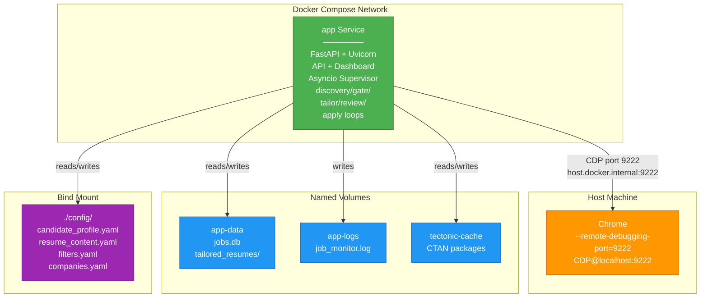
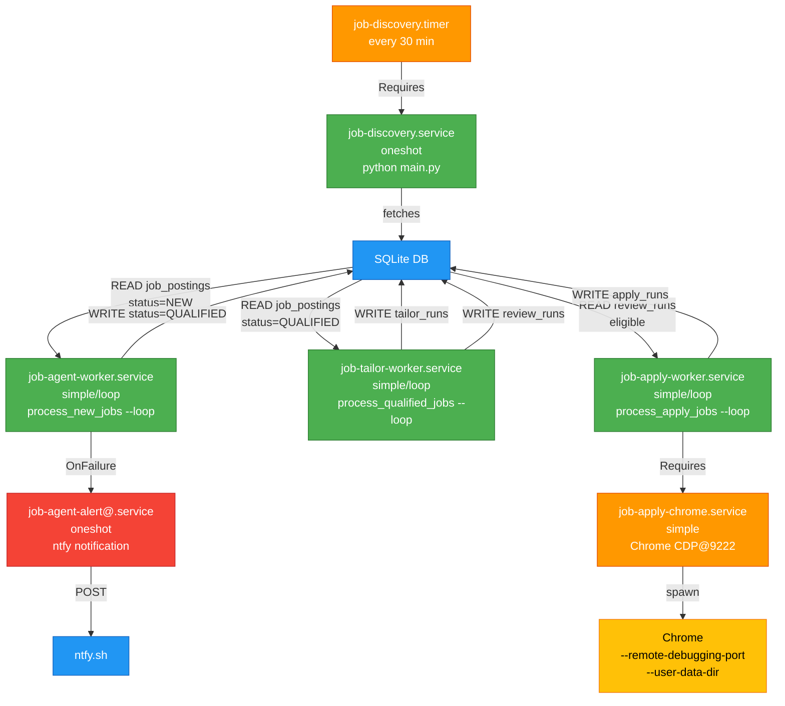

# Deployment & Ops Subsystem Specification

## Executive Summary

The Agentic Job Applier ships two distinct deployment paths: **(1) Docker Compose** (recommended, single-service, development and production) and **(2) Linux systemd** (long-running homeserver, without Docker). Both paths converge on the same core: discovery triggers every 30 minutes, gate/tailor/review/apply workers drain a SQLite queue continuously, and observability routes logs to journald (systemd) or stdout-to-compose (Docker). The architecture decouples the LaTeX compiler (tectonic, multi-arch prebuilt binaries) and the browser-automation client (agent-browser Rust CDP CLI) from the main Python runtime, reducing image size and avoiding in-container Chromium. Host Chrome runs out-of-container, connected via Chrome DevTools Protocol (CDP) at `host.docker.internal:9222` (Docker) or `localhost:9222` (systemd).

---

## 1. Purpose: Two Deployment Paths

### Docker Path (Recommended)

**When to use:** Development, staging, and single-machine production. Avoids host Python setup, manages volumes and networking automatically, ships a reproducible multi-arch image (linux/amd64, linux/arm64).

**How it works:** `docker compose up -d` starts one `app` service. The API, dashboard, and asyncio supervisor live inside the container. Volumes bind mount `./config/` for user YAML, and named volumes persist data and logs. The container is stateless except for the database—destroy and recreate the container anytime without losing state (volumes survive `docker compose down`).

**Volumes:**
- `app-data:/app/data` — SQLite database (`jobs.db`), tailored resume artifacts
- `app-logs:/app/logs` — rolling log file (`job_monitor.log`)
- `tectonic-cache:/tectonic-cache` — tectonic CTAN package cache (survives compiles)
- `./config:/app/config` (bind) — user-editable YAML files (candidate profile, resume, filters)

**Single image, single service, no workers spawned separately.** All discovery/gate/tailor/review/apply loops run as asyncio tasks inside the FastAPI application process. The command is:

```bash
uv run --no-dev uvicorn api.main:app --host 0.0.0.0 --port 8000
```

### Systemd Path (Long-Running Homeserver)

**When to use:** Unattended Linux deployments (e.g., Raspberry Pi, VPS, homeserver without Docker). Requires manual Python environment setup but offers fine-grained per-stage control and traditional sysadmin tooling.

**How it works:** Five systemd units orchestrate the pipeline:

1. **`job-discovery.timer`** — runs `job-discovery.service` every 30 minutes
2. **`job-discovery.service`** — oneshot, fetches new job postings
3. **`job-agent-worker.service`** — loop, continuously drains `NEW` jobs through the gate
4. **`job-tailor-worker.service`** — loop, continuously drains `QUALIFIED` jobs through tailor+review
5. **`job-apply-worker.service`** — loop, continuously drains eligible review runs through apply
6. **`job-apply-chrome.service`** — long-running, hosts Chrome with CDP for apply automation
7. **`job-agent-alert@.service`** — optional, sends ntfy alerts on worker failure

SQLite is the queue backbone. No Docker, no orchestration layer—just systemd managing process lifecycle, resource limits (memory, CPU quota), and logging to journald.

---

## 2. Docker Path — Dockerfile

Multi-stage build. Stage 1 (`dashboard-build`) compiles React; stage 2 (`app`) is the runtime. Both support multi-arch via `TARGETARCH` (set by BuildKit during `docker buildx build --platform` runs).

### Stage 1: Dashboard Build

**Lines 2–9** (`Dockerfile:2-9`). Node 22 slim base, install npm deps, build production bundle.

```dockerfile
FROM node:22-slim AS dashboard-build
WORKDIR /app/dashboard
COPY dashboard/package.json dashboard/package-lock.json ./
RUN npm install
COPY dashboard/ ./
RUN npm run build
```

**Purpose:** Separate build context so the React bundle is compiled once and COPYed into stage 2. Changes to application code do not invalidate the dashboard layer (Docker layer caching).

### Stage 2: App (Runtime)

**Lines 11–105** (`Dockerfile:11-105`). Python 3.11 slim, multi-arch support, tectonic, agent-browser, application code.

#### Base and Build Args

**Lines 27–35** (`Dockerfile:27-35`).

```dockerfile
FROM python:3.11-slim-bookworm AS app
ARG TARGETARCH
```

`python:3.11-slim-bookworm` brings glibc 2.36 (satisfies agent-browser dynamic deps: libc, libm, libpthread, libdl) and curl for diagnostics.

`TARGETARCH` is a BuildKit-supplied argument (amd64 or arm64) used later for multi-arch binary selection.

#### APT Dependencies

**Lines 37–40** (`Dockerfile:37-40`).

```dockerfile
RUN apt-get update && apt-get install -y --no-install-recommends \
    curl \
    poppler-utils \
    && rm -rf /var/lib/apt/lists/*
```

**curl** — healthcheck probes, diagnostics. **poppler-utils** — PDF extraction utilities (unused currently, planned for resume parsing). Aggressive cache cleanup (`rm -rf /var/lib/apt/lists/*`) reduces layer size.

#### `uv` Fast Python Installer

**Lines 42–43** (`Dockerfile:42-43`).

```dockerfile
COPY --from=ghcr.io/astral-sh/uv:0.9.18 /uv /usr/local/bin/uv
```

COPY the uv binary from the official upstream image. Pinned to 0.9.18 for reproducibility. `uv` replaces pip + venv for faster, deterministic installs.

#### Python Dependencies

**Lines 45–49** (`Dockerfile:45-49`).

```dockerfile
WORKDIR /app
COPY pyproject.toml uv.lock ./
RUN uv sync --frozen --no-dev
```

`--frozen` rejects any version changes from lockfile; if pyproject.toml changes but uv.lock is stale, build fails. `--no-dev` omits test dependencies, shrinking the runtime image.

**Layer ordering rationale:** Copy dependencies *before* source code. Code changes don't invalidate the dep layer (Docker build cache). If dependencies don't change, `docker build` skips this step entirely on rebuild.

#### Tectonic Multi-Arch Installation

**Lines 51–59** (`Dockerfile:51-59`).

```dockerfile
COPY deploy/tectonic/tectonic-${TARGETARCH}.tar.gz /tmp/tectonic.tar.gz
RUN tar -xzf /tmp/tectonic.tar.gz -C /usr/local/bin tectonic \
    && chmod +x /usr/local/bin/tectonic \
    && rm /tmp/tectonic.tar.gz \
    && /usr/local/bin/tectonic --version
```

**Why a prebuilt tarball instead of `apt` install or building from source?**

1. **No upstream container image.** Tectonic doesn't publish a ghcr.io or Docker Hub image. (Verified during issue #61 design phase.)
2. **No build-time network flakiness.** BuildKit DNS to `deb.debian.org` was unreliable on Docker Desktop for macOS during #60/#61. COPYing a tarball (fetched once over a healthy network, committed to the repo) avoids the entire issue.
3. **Determinism.** Every build gets the exact same binary. Bumping tectonic is explicit: run `deploy/tectonic/fetch.sh` (`fetch.sh:19-36`), commit the updated tarballs, and rebuild.

**Multi-arch handling:** The Dockerfile uses `${TARGETARCH}` (set by BuildKit) to select the right tarball:
- BuildKit passes `TARGETARCH=amd64` → COPY `tectonic-amd64.tar.gz` (x86_64-unknown-linux-musl triple)
- BuildKit passes `TARGETARCH=arm64` → COPY `tectonic-arm64.tar.gz` (aarch64-unknown-linux-musl triple)

Both tarballs are committed to the repo under `deploy/tectonic/` (`Dockerfile:35`, `Dockerfile:30-31` comment).

**Verification:** `tectonic --version` at the end ensures the binary is executable and not corrupted.

#### Tectonic Cache Prewarm

**Lines 61–72** (`Dockerfile:61-72`).

```dockerfile
ENV XDG_CACHE_HOME=/tectonic-cache
RUN mkdir -p /tectonic-cache && chmod 0777 /tectonic-cache
COPY deploy/tectonic-prewarm.tex /tmp/prewarm.tex
RUN cd /tmp \
    && tectonic -X compile --outdir /tmp prewarm.tex \
    && rm -f /tmp/prewarm.tex /tmp/prewarm.pdf /tmp/prewarm.log /tmp/prewarm.aux
```

`XDG_CACHE_HOME` points to a directory (later mounted as a named Docker volume) where tectonic stores its on-demand CTAN package cache.

**prewarm.tex** (`deploy/tectonic-prewarm.tex:1-19`) imports every LaTeX package used by the 10 curated resume templates (geometry, titlesec, enumitem, fancyhdr, babel, newtxtext, newtxmath, hyperref, color, xcolor, tabularx, fullpage). Compiling it once during the build downloads and caches every package. Subsequent tailor compiles skip the fetch round trip.

**Purpose:** Cold-cache compiles would otherwise hit the CTAN network on first user tailor, adding 30–60 seconds. Prewarm amortizes that cost to build time.

#### Tectonic Timeout

**Lines 74–76** (`Dockerfile:74-76`).

```dockerfile
ENV TECTONIC_TIMEOUT_SECONDS=240
```

Tailor compiles can exceed the tectonic default (60 seconds) when the CTAN cache is empty or the template is complex. 240 seconds (4 minutes) is a reasonable upper bound. Operators override via `TECTONIC_TIMEOUT_SECONDS` env on a per-deployment basis.

#### agent-browser Rust CDP CLI

**Lines 78–84** (`Dockerfile:78-84`).

```dockerfile
COPY deploy/agent-browser/agent-browser-${TARGETARCH} /usr/local/bin/agent-browser
RUN chmod +x /usr/local/bin/agent-browser && /usr/local/bin/agent-browser --version
```

Prebuilt per-arch Rust binary (amd64 and arm64 variants under `deploy/agent-browser/`). The CLI is an out-of-process Chrome DevTools Protocol automation tool used by the apply loop. Prebuilt avoids the Rust build toolchain and Chrome download during image build.

**glibc compatibility:** python:3.11-slim-bookworm provides glibc 2.36, which satisfies the binary's dynamic library requirements.

**Why separate from the image build?** The agent-browser CLI can spawn Chrome with `--remote-debugging-port` and drive it. In Docker, we *don't* do this—we connect to the host Chrome instead (see "Host Chrome Prerequisite" section). The binary is included for consistency and future flexibility (e.g., fallback to spawning Chrome in the container if the host probe fails).

#### Application Source

**Lines 86–94** (`Dockerfile:86-94`).

```dockerfile
COPY src/ ./src/
COPY api/ ./api/
COPY scripts/ ./scripts/
COPY main.py ./
COPY deploy/ ./deploy/
COPY --from=dashboard-build /app/dashboard/dist ./dashboard/dist
```

Source code (agents, database, scripts), entry point (main.py), deploy helpers (systemd units, tectonic tarballs), and the pre-built React dashboard.

**Layer rationale:** source and deploy/ are copied after dependencies so iterating on code does not invalidate the Python install layer.

#### Codex Home and Volumes

**Lines 96–99** (`Dockerfile:96-99`).

```dockerfile
ENV CODEX_HOME=/app/data/codex
VOLUME ["/app/data", "/app/logs", "/app/config"]
EXPOSE 8000
```

`CODEX_HOME` is where Claude Code integration stores artifacts (unused in current MVP but reserved for future use).

`VOLUME` directives declare expected mount points (Docker Compose overrides these with explicit volume specs). Operator sees `/app/data`, `/app/logs`, `/app/config` and knows those need persistence.

`EXPOSE 8000` documents the API port.

#### Default Command

**Lines 101–104** (`Dockerfile:101-104`).

```dockerfile
CMD ["uv", "run", "--no-dev", "uvicorn", "api.main:app", "--host", "0.0.0.0", "--port", "8000"]
```

Runs FastAPI on 0.0.0.0:8000 (accepting connections from any network interface). The API's lifespan event spawns the asyncio supervisor and discovery/gate/tailor/apply loops as background tasks. No separate worker containers; single process owns everything.

---

## 3. Docker Path — docker-compose.yml

Single-service compose file. One `app` service, four named volumes, healthcheck.

### Service Definition

**Lines 22–26** (`docker-compose.yml:22-26`).

```yaml
services:
  app:
    build:
      context: .
      target: app
    command: uv run --no-dev uvicorn api.main:app --host 0.0.0.0 --port 8000
```

Build from the repo root (`context: .`), targeting the `app` stage in Dockerfile. Command overrides the Dockerfile default (both are identical here, but the explicit command allows operators to change start behavior without editing the image).

### Port Mapping

**Lines 27–28** (`docker-compose.yml:27-28`).

```yaml
ports:
  - "${API_PORT:-8000}:8000"
```

Expose the API on `$API_PORT` (from `.env`), defaulting to 8000. Operator can set `API_PORT=9000` in `.env` to bind to a different host port.

### Environment

**Lines 29–34** (`docker-compose.yml:29-34`).

```yaml
env_file: .env
environment:
  CHROME_CDP_URL: ${CHROME_CDP_URL:-http://host.docker.internal:9222}
```

Load `.env` file (user-provided, .gitignored). Then set `CHROME_CDP_URL` to either the env's explicit value or the Docker Desktop default (`host.docker.internal:9222`).

**Why the default?** Docker Desktop automatically resolves `host.docker.internal` to the host's gateway (on Mac and Windows). Linux doesn't, so the compose file maps it via `extra_hosts`.

### Linux Host Mapping

**Lines 35–40** (`docker-compose.yml:35-40`).

```yaml
extra_hosts:
  - "host.docker.internal:host-gateway"
```

On Linux, Docker doesn't natively resolve `host.docker.internal`. The special `host-gateway` keyword (Docker Compose v1.24+) resolves to the host's default gateway IP. Inside the container, `host.docker.internal` now points to the host machine, so the apply loop can reach host Chrome at `host.docker.internal:9222`.

**On Mac/Windows:** Docker Desktop handles `host.docker.internal` natively, so this mapping is a no-op (but harmless).

### Volumes

**Lines 41–45** (`docker-compose.yml:41-45`).

```yaml
volumes:
  - ./config:/app/config
  - app-data:/app/data
  - app-logs:/app/logs
  - tectonic-cache:/tectonic-cache
```

- **`./config:/app/config`** (bind mount) — User-edited YAML files. The bind mount ensures edits on the host are visible inside the container and survive container destruction. Operator sees `./config/candidate_profile.yaml`, `./config/resume_content.yaml`, `./config/filters.yaml` in the repo root.

- **`app-data:/app/data`** (named volume) — SQLite database, tailored resume artifacts. Named volume survives `docker compose down` (and is not automatically garbage-collected). Operator can inspect with `docker volume ls`, backup with `docker run --rm -v app-data:/data -v backup:/backup alpine tar czf /backup/app-data.tar.gz -C /data .`.

- **`app-logs:/app/logs`** (named volume) — Rolling log file. Survives restarts, persisted separately from stdout (which goes to `docker compose logs`).

- **`tectonic-cache:/tectonic-cache`** (named volume) — CTAN package cache. Survives restarts so the expensive package fetch happens only once across rebuilds.

### Restart Policy

**Lines 46** (`docker-compose.yml:46`).

```yaml
restart: unless-stopped
```

Restart the container if it exits unexpectedly, *unless* the operator explicitly runs `docker compose down` or `docker compose stop`. Resilient to transient network failures or OOM kills.

### Healthcheck

**Lines 47–52** (`docker-compose.yml:47-52`).

```yaml
healthcheck:
  test: ["CMD", "curl", "-f", "http://localhost:8000/api/health"]
  interval: 5s
  timeout: 3s
  retries: 6
  start_period: 60s
```

Every 5 seconds, curl `http://localhost:8000/api/health` inside the container. The endpoint (`api/routers/health.py:12-28`) returns `{"ok": true, "status": "healthy", "polling_seconds": ...}`.

- **timeout: 3s** — fail the check if curl hangs longer than 3 seconds.
- **retries: 6** — mark the container `unhealthy` after 6 consecutive failures (≈30 seconds).
- **start_period: 60s** — don't run the first healthcheck until 60 seconds after container start (the API needs time to initialize, build tables, and spawn the supervisor).

`docker compose ps` shows the container's health status. Operators can gate automation on `docker ps --filter health=healthy`.

### Volumes Definition

**Lines 54–57** (`docker-compose.yml:54-57`).

```yaml
volumes:
  app-data:
  app-logs:
  tectonic-cache:
```

Define the three named volumes with default driver (local). `docker compose down` doesn't delete them (use `docker compose down -v` to purge). This is intentional—operator data should never auto-delete.

---

## 4. Tectonic Shipping: Multi-Arch Prebuilt Binaries

### Problem Statement

Tectonic is a statically-linked TeX engine that resolves CTAN packages on demand. The project replaced `latexmk + texlive-full` (800MB+ of APT packages) with tectonic to shrink the image and improve CI/CD speed. However, tectonic doesn't publish a container image.

### Solution: Repo-Shipped Tarballs

**Design decision (issue #61):** Ship prebuilt tectonic binaries in the repo under `deploy/tectonic/` as gzip'd tarballs (one per architecture). The Dockerfile COPYs the tarball matching `TARGETARCH` and extracts it.

**Files** (`deploy/tectonic/README.md:19-24`):

```
tectonic-amd64.tar.gz       → x86_64-unknown-linux-musl triple (linux/amd64 builds)
tectonic-arm64.tar.gz       → aarch64-unknown-linux-musl triple (linux/arm64 builds)
```

### fetch.sh Script

**`deploy/tectonic/fetch.sh:1-36`** — Downloads both tarballs from upstream GitHub releases.

```bash
TECTONIC_VERSION="${TECTONIC_VERSION:-0.15.0}"
for arch in "${!ARCH_TO_TRIPLE[@]}"; do
    triple="${ARCH_TO_TRIPLE[$arch]}"
    out="${DEST_DIR}/tectonic-${arch}.tar.gz"
    url="https://github.com/tectonic-typesetting/tectonic/releases/download/tectonic%40${TECTONIC_VERSION}/tectonic-${TECTONIC_VERSION}-${triple}.tar.gz"
    curl -fsSL -o "${out}" "${url}"
done
```

**Usage:**

```bash
deploy/tectonic/fetch.sh                  # uses default 0.15.0
TECTONIC_VERSION=0.15.0 deploy/tectonic/fetch.sh  # pin to specific version
```

**Workflow:**
1. Operator decides to bump tectonic (e.g., from 0.15.0 to 0.16.0).
2. Run `TECTONIC_VERSION=0.16.0 deploy/tectonic/fetch.sh`.
3. Tarballs are updated in place under `deploy/tectonic/`.
4. Commit both tarballs (`.gitignore` does not exclude them).
5. Next `docker buildx build` uses the new binaries for all platforms.

**Why commit tarballs?** Once committed, every dev machine and CI runner builds with identical tectonic binaries—reproducibility. Fetch happens once by whoever bumps the version; downstream builds don't re-download.

### Cache Prewarm

**`deploy/tectonic-prewarm.tex:1-19`** — Minimal LaTeX file that imports all packages used by the 10 resume templates.

**Lines 6–14** of prewarm.tex:

```latex
\usepackage[margin=0.5in]{geometry}
\usepackage{titlesec}
\usepackage{enumitem}
\usepackage{fancyhdr}
\usepackage[english]{babel}
\usepackage{newtxtext,newtxmath}
\usepackage[hidelinks]{hyperref}
\usepackage[usenames,dvipsnames]{color}
\usepackage{xcolor}
\usepackage{tabularx}
\usepackage{fullpage}
```

**Build-time compile** (`Dockerfile:70-72`):

```dockerfile
RUN cd /tmp \
    && tectonic -X compile --outdir /tmp prewarm.tex \
    && rm -f /tmp/prewarm.tex /tmp/prewarm.pdf /tmp/prewarm.log /tmp/prewarm.aux
```

Tectonic downloads and caches each package into the `tectonic-cache` volume. The PDF is discarded; only the cache persists to the image's `tectonic-cache:/tectonic-cache` mount point.

**Benefit:** First user tailor compile hits a warm cache. Package downloads are amortized to build time (not user-facing latency).

---

## 5. agent-browser Shipping: Rust CDP CLI per Architecture

### What is agent-browser?

A Rust CLI (`github.com/vercel/agent-browser`) that automates Chrome over the Chrome DevTools Protocol (CDP). It can spawn Chrome with custom flags and user-data-dir, or connect to a running instance.

**In the Docker context:** The apply loop uses the Python Playwright SDK to drive host Chrome. The agent-browser binary is shipped in the image but *not currently used in Docker deployments* (it's available for future fallback or experimentation).

**In the systemd context:** `job-apply-chrome.service` runs a Chrome instance with `--remote-debugging-port=9222`; the apply worker connects to it over CDP.

### Prebuilt Per-Arch

**Dockerfile lines 78–84** (`Dockerfile:78-84`):

```dockerfile
COPY deploy/agent-browser/agent-browser-${TARGETARCH} /usr/local/bin/agent-browser
RUN chmod +x /usr/local/bin/agent-browser && /usr/local/bin/agent-browser --version
```

Binaries are prebuilt and committed under `deploy/agent-browser/`:

```
agent-browser-amd64    → Linux x86_64
agent-browser-arm64    → Linux ARM64
```

**Why prebuilt?** Building the agent-browser Rust CLI in the Docker build would require the Rust toolchain (80MB+) and the Chrome download (300MB+). Prebuilt avoids both, keeping the build fast and the image small.

**glibc requirement:** The binaries are linked against glibc 2.36 (provided by python:3.11-slim-bookworm). On a system with glibc < 2.36, the binary would fail at runtime—but our base image guarantees 2.36+.

---

## 6. Host Chrome Prerequisite: Chrome DevTools Protocol

### The Setup

Before enabling autonomous mode or the apply loop, the user starts Chrome on the host with the debug port open:

```bash
# macOS
open -a "Google Chrome" --args --remote-debugging-port=9222

# Linux
google-chrome --remote-debugging-port=9222 &

# Windows
"C:\Program Files\Google\Chrome\Application\chrome.exe" --remote-debugging-port=9222
```

Chrome listens on `localhost:9222` (by default) for CDP connections.

### Why No In-Container Chromium?

1. **Size.** Chromium inside the image adds 300–400MB. With tectonic and agent-browser already shipped as prebuilts, keeping Chromium out drops the final image to ~600MB.

2. **Headless complexity.** Running an X11/Wayland display server inside a container requires Xvfb, dbus, and fontconfig libraries. Complexity and overhead.

3. **User interaction.** Applying to a job form may require handling unexpected dialogs, JavaScript quirks, or Cloudflare challenges. A real Chrome instance on the user's actual machine (with their cookies, saved passwords, and extensions) handles these edge cases better than a headless sandbox.

4. **Network.** Some job boards throttle or soft-block requests from VPN/proxy IPs. Using the user's real host Chrome avoids Docker Desktop's vpnkit NAT IP (e.g., `172.66.0.243` observed on Mac).

### Docker → Host Chrome: `host.docker.internal:9222`

Inside the container, the apply loop connects to `host.docker.internal:9222`:

```python
# api/routers/status.py:248
return os.getenv("CHROME_CDP_URL", "http://host.docker.internal:9222").strip()
```

- **On Mac/Windows:** Docker Desktop automatically resolves `host.docker.internal` to the host gateway.
- **On Linux:** The compose file maps it explicitly via `extra_hosts` (`docker-compose.yml:35-40`).

### Chrome 148+ Host Header Workaround

**Problem:** Chrome 148+ added stricter security checks for remote debugging. The HTTP/WebSocket handshake now rejects requests whose `Host` header doesn't match `localhost` or an IP literal.

**Scenario:** Container tries to connect to `http://host.docker.internal:9222`. The system resolver returns an IP (e.g., `192.168.1.5`), but the client sends `Host: host.docker.internal:9222` in the HTTP request. Chrome's security check fails.

**Mitigation:** The apply loop's CDP probe (`src/agents/apply_worker/browser.py`) forces the `Host` header to `localhost:<port>` during the WebSocket upgrade:

```python
# Playwright handshake forces Host: localhost:<port>
# even if the URL says host.docker.internal:9222
```

**Tests confirm this works** (`tests/test_cdp_host_header_override.py`). The container probes `http://host.docker.internal:9222`, receives the correct response, and establishes a stable connection.

---

## 7. Systemd Path — deploy/ Service Units

### Architecture Overview

Five systemd units form the pipeline. Two are singletons; three are continuous workers. All log to journald; all read `.env` for secrets and config.

### job-discovery.timer and job-discovery.service

**job-discovery.timer** (`deploy/job-discovery.timer:1-14`):

```ini
[Unit]
Description=Run Job Discovery Every 30 Minutes
Requires=job-discovery.service

[Timer]
OnCalendar=*:0/30
Persistent=true
RandomizedDelaySec=300

[Install]
WantedBy=timers.target
```

- **OnCalendar=*:0/30** — Run at the top and bottom of every hour (every 30 minutes).
- **Persistent=true** — If the system is off at a scheduled time, the timer catches up and runs the job on next boot.
- **RandomizedDelaySec=300** — Stagger start by up to 5 minutes to avoid thundering herd (all timers firing at 00:00 simultaneously).

**job-discovery.service** (`deploy/job-discovery.service:1-34`):

```ini
[Unit]
Description=Job Discovery Service
After=network-online.target
Wants=network-online.target

[Service]
Type=oneshot
User=YOUR_USERNAME
WorkingDirectory=/path/to/agentic-job-applier
Environment="PATH=/path/to/agentic-job-applier/.venv/bin"
EnvironmentFile=/path/to/agentic-job-applier/.env
ExecStart=/path/to/agentic-job-applier/.venv/bin/python main.py

StandardOutput=journal
StandardError=journal

# Baseline hardening
NoNewPrivileges=true
PrivateTmp=true
ProtectSystem=strict
ProtectHome=true
...
```

- **Type=oneshot** — The service runs once and exits; systemd considers the unit "successful" if the exit code is 0.
- **EnvironmentFile** — Load `.env` (user secrets, API keys).
- **ExecStart** — Run `python main.py` (discovery entrypoint).
- **StandardOutput=journal** — Log to journald (queryable via `journalctl -u job-discovery.service`).

**Hardening:**
- **NoNewPrivileges=true** — Disable setuid/setgid in forked processes.
- **PrivateTmp=true** — Private `/tmp` for this service (temp files don't leak to other units).
- **ProtectSystem=strict** — Filesystem is read-only except for explicit paths.
- **ProtectHome=true** — Home directory is inaccessible.
- **ReadWritePaths** — Whitelist only `/path/to/agentic-job-applier/data` and `/path/to/agentic-job-applier/logs` for writes.

### job-agent-worker.service

**Lines 1–35** (`deploy/job-agent-worker.service:1-35`):

```ini
[Unit]
Description=Job Agent Worker Service
After=network-online.target
OnFailure=job-agent-alert@%n.service

[Service]
Type=simple
...
ExecStart=/path/to/agentic-job-applier/.venv/bin/python -m scripts.process_new_jobs --loop

Restart=always
RestartSec=15
```

- **Type=simple** — Process runs in foreground; systemd tracks it.
- **--loop** — Worker continuously drains the `NEW` queue, sleeping briefly between batches.
- **OnFailure=job-agent-alert@%n.service** — If the service crashes, trigger the alert unit with the service name (`%n`) as a parameter.
- **Restart=always** — Restart on any exit (nonzero or zero exit code; `Type=simple` doesn't distinguish).
- **RestartSec=15** — Wait 15 seconds before restart (prevents CPU thrashing if there's a repeating bug).

### job-tailor-worker.service

**Lines 1–37** (`deploy/job-tailor-worker.service:1-37`):

```ini
[Unit]
Description=Job Tailor Worker Service

[Service]
...
ExecStart=/path/to/.venv/bin/python -m scripts.process_qualified_jobs --loop

Restart=always
RestartSec=30
MemoryMax=4G
CPUQuota=200%
TasksMax=64
```

- **MemoryMax=4G** — Kill the service if it exceeds 4 GB resident memory (LaTeX compile runaway protection).
- **CPUQuota=200%** — Limit to 2 CPU cores worth of scheduling.
- **TasksMax=64** — Max 64 threads/processes in this cgroup.
- **RestartSec=30** — Longer restart delay than gate (tailor is heavier).

### job-apply-worker.service

**Lines 1–38** (`deploy/job-apply-worker.service:1-38`):

```ini
[Unit]
Description=Job Apply Worker Service (Browser Automation)
After=network-online.target job-apply-chrome.service
Requires=job-apply-chrome.service

[Service]
Type=simple
...
Environment="DISPLAY=:99"
Environment="CHROME_CDP_URL=http://localhost:9222"
...
ExecStart=...python -m scripts.process_apply_jobs --loop

Restart=always
RestartSec=60
MemoryMax=4G
CPUQuota=200%
TasksMax=64
```

- **After=...job-apply-chrome.service** and **Requires=job-apply-chrome.service** — Don't start the apply worker until Chrome is running.
- **DISPLAY=:99** — X11 display variable (for Xvfb or the host's X session if on a traditional Linux desktop).
- **CHROME_CDP_URL=http://localhost:9222** — Hard-coded to localhost (Chrome runs on the same host under systemd; no `host.docker.internal` needed).

### job-apply-chrome.service

**Lines 1–33** (`deploy/job-apply-chrome.service:1-33`):

```ini
[Unit]
Description=Chrome with CDP for Apply Worker

[Service]
Type=simple
User=YOUR_USERNAME
Environment="DISPLAY=:99"
Environment="CDP_PORT=9222"
ExecStart=/path/to/agentic-job-applier/deploy/start-chrome-cdp.sh

Restart=always
RestartSec=10
MemoryMax=4G
CPUQuota=200%
TasksMax=128

ReadWritePaths=/tmp/.X11-unix /home/YOUR_USERNAME/.config/google-chrome /home/YOUR_USERNAME/.cache
```

- **ExecStart=./deploy/start-chrome-cdp.sh** — Runs a helper script (not included in this spec read, but implied to be something like `google-chrome --remote-debugging-port=9222 --user-data-dir=...`).
- **ReadWritePaths=/tmp/.X11-unix** — Allow X11 socket access (needed for display).
- **ReadWritePaths=.../.config/google-chrome** — Chrome profile (cookies, history, preferences).
- **TasksMax=128** — Chrome spawns many threads; higher than gate/tailor workers.

### job-agent-alert@.service

**Lines 1–18** (`deploy/job-agent-alert@.service:1-18`):

```ini
[Unit]
Description=Send ntfy alert for failed unit %i

[Service]
Type=oneshot
...
ExecStart=/bin/sh -c '
  if [ -z "$NTFY_TOPIC" ]; then exit 0; fi
  if [ -n "$NTFY_TOKEN" ]; then
    curl ... -H "Authorization: Bearer $NTFY_TOKEN" ...
  else
    curl ...
  fi
'
```

- **%i** — Systemd substitution for the instance name (e.g., if triggered by `OnFailure=job-agent-alert@%n.service`, `%i` becomes `job-agent-worker.service`).
- **NTFY_TOPIC** — ntfy.sh topic (optional; if unset, the alert is silently skipped).
- **NTFY_TOKEN** — Authentication token for ntfy (if set, adds Bearer auth; otherwise public post).

**Curl to ntfy** — sends a message to the user's ntfy topic with priority=high, subject=unit name, body=hostname.

---

## 8. Operational Scripts

### scripts/docker/start_stack.sh

**Lines 1–13** (`scripts/docker/start_stack.sh:1-13`):

```bash
#!/usr/bin/env bash
set -euo pipefail

SCRIPT_DIR="$(cd "$(dirname "${BASH_SOURCE[0]}")" && pwd)"
REPO_ROOT="$(cd "${SCRIPT_DIR}/../.." && pwd)"

cd "${REPO_ROOT}"

echo "[stack] Starting docker compose stack from ${REPO_ROOT}"
docker compose up -d

echo "[stack] Start complete"
```

**Purpose:** Non-technical entrypoint. Operator runs `./scripts/docker/start_stack.sh` instead of remembering `docker compose up -d`.

**Contract tests** (`tests/test_docker_stack_scripts.py:28-42`):
- Verify the script includes `set -euo pipefail` (fail fast on error).
- Verify it calls `docker compose up -d` (detached mode).

### scripts/docker/stop_stack.sh

**Lines 1–13** (`scripts/docker/stop_stack.sh:1-13`):

```bash
#!/usr/bin/env bash
set -euo pipefail

SCRIPT_DIR="$(cd "$(dirname "${BASH_SOURCE[0]}")" && pwd)"
REPO_ROOT="$(cd "${SCRIPT_DIR}/../.." && pwd)"

cd "${REPO_ROOT}"

echo "[stack] Stopping docker compose stack from ${REPO_ROOT}"
docker compose down

echo "[stack] Stop complete"
```

**Purpose:** Stop the stack while preserving volumes (data persists).

**Contract tests** (`tests/test_docker_stack_scripts.py:45-60`):
- Verify `docker compose down` (not `docker compose down -v`, which would erase volumes).

### scripts/docker/restart_stack.sh

**Lines 1–16** (`scripts/docker/restart_stack.sh:1-16`):

```bash
#!/usr/bin/env bash
set -euo pipefail

SCRIPT_DIR="$(cd "$(dirname "${BASH_SOURCE[0]}")" && pwd)"
REPO_ROOT="$(cd "${SCRIPT_DIR}/../.." && pwd)"

cd "${REPO_ROOT}"

echo "[stack] Restarting docker compose stack from ${REPO_ROOT}"
docker compose down

echo "[stack] Stack stopped, starting again"
docker compose up -d

echo "[stack] Restart complete"
```

**Purpose:** Clean restart (down, then up). Used when config or image changes need to be picked up.

**Contract tests** (`tests/test_docker_stack_scripts.py:63-78`):
- Verify both `docker compose down` and `docker compose up -d` are called in order.

---

## 9. Health & Observability in Production

### Health Endpoint

**GET /api/health** (`api/routers/health.py:12-28`):

```python
@router.get("/health")
async def health_check() -> dict[str, object]:
    return {
        "ok": True,
        "status": "healthy",
        "polling_seconds": DEFAULT_POLLING_SECONDS,
    }
```

**Docker:** Healthcheck interval is 5 seconds. After 60-second startup grace period, container is marked `unhealthy` if 6 consecutive probes fail.

**Systemd:** No built-in healthcheck, but the apply loop has a chrome reachability probe (`src/agents/apply_worker/browser.py`). The apply worker logs connection failures; monitor via `journalctl -u job-apply-worker.service`.

### Logging

**Docker:** `docker compose logs -f app` streams stdout/stderr from the container. Rotate logs via the Docker logging driver (configure in docker-compose.yml or daemon.json).

**Systemd:** All services log to journald (`StandardOutput=journal`). Query via:

```bash
journalctl -u job-discovery.service -f        # tail discovery
journalctl -u job-agent-worker.service -f     # tail gate
journalctl -u job-tailor-worker.service -f    # tail tailor
journalctl -u job-apply-worker.service -f     # tail apply
journalctl -u job-apply-chrome.service -f     # tail Chrome
```

Persist journal to disk (usually `/var/log/journal/`). By default, systemd-journald logs only in RAM; configure `Storage=persistent` in `/etc/systemd/journald.conf` for production.

### ntfy Alerts

Systemd includes an optional alerting unit (`job-agent-alert@.service`) that sends ntfy notifications on worker failure.

**Setup:**
1. Create a topic at https://ntfy.sh (free).
2. Set `NTFY_TOPIC=my-app-alerts` in `.env` on the systemd host.
3. Optionally set `NTFY_TOKEN=xyz` for authentication (if the topic is private).
4. Copy the alert unit to `/etc/systemd/system/` and enable it.
5. When a worker (e.g., `job-agent-worker.service`) crashes, systemd triggers the alert unit, which posts a message to your ntfy topic.
6. Subscribe to the topic in the ntfy web UI or via push notifications on your phone.

### Database Inspection

SQLite database lives in the volume (`/app/data/jobs.db` in Docker, `/path/to/agentic-job-applier/data/jobs.db` on systemd).

```bash
# Docker: inspect from inside the container
docker compose exec app sqlite3 /app/data/jobs.db "SELECT COUNT(*) FROM job_postings;"

# Systemd: inspect on the host
sqlite3 /path/to/agentic-job-applier/data/jobs.db "SELECT COUNT(*) FROM job_postings;"
```

### Monitoring & Alerts (Optional)

For production, operators typically forward Docker container logs to a log aggregator (e.g., Datadog, CloudWatch, Splunk) or export Prometheus metrics via the FastAPI middleware. This spec does not cover those integrations, but the architecture is ready: the API runs on a stable port (8000 by default) and exposes `/api/health`, `/api/dashboard/stats`, and other endpoints that can be scraped or polled.

---

## 10. Risks & Gotchas

### 1. Image-Baked React Dashboard

**The problem:** The React dashboard (`dashboard/dist/`) is built at image-build time and baked into the image. Live code changes to the dashboard require rebuilding the image.

**Workaround (from project memory):**

```bash
npm --prefix dashboard run build
docker cp dist/. agentic-job-applier-app-1:/app/dashboard/dist/
# Now refresh the browser to see the new bundle
```

This copies the freshly-built dist/ into the running container, bypassing the rebuild step. It's a dev convenience, not supported for production.

**Mitigation:** For active development, run the Vite dev server on the host (`npm --prefix dashboard run dev`) and configure the FastAPI fallback to reverse-proxy to `localhost:5173` instead of serving static files.

### 2. Docker Desktop Mac/Windows: vpnkit NAT IP

**The problem:** On Docker Desktop for Mac/Windows, traffic from the host → container goes through the vpnkit NAT layer. The source IP inside the container shows as an internal gateway IP (observed: `172.66.0.243`), not the actual host IP.

**Impact:** Job boards that throttle by IP may incorrectly detect "unusual location" if the user typically browses from a residential IP but the container's outbound CDP connection shows the Docker gateway IP.

**Mitigation:** The apply loop *doesn't run inside the container*; it runs on the host via host Chrome. The browser automation itself uses the user's real host IP, avoiding the Docker NAT issue. Only the API/dashboard runs in Docker.

**For systemd deployments:** No Docker NAT. Chrome runs on the host, and outbound connections use the host's IP directly.

### 3. Multi-Arch Tarball Drift

**The problem:** If `deploy/tectonic/tectonic-amd64.tar.gz` is updated but `deploy/tectonic/tectonic-arm64.tar.gz` is not, then `docker buildx build --platform linux/amd64,linux/arm64 .` will succeed but produce inconsistent binaries across architectures.

**Mitigation:** The `deploy/tectonic/fetch.sh` script updates *both* tarballs in one run. Always commit both together.

**Best practice:** Before bumping tectonic, run:

```bash
docker buildx build --platform linux/amd64,linux/arm64 . --progress=plain
```

to verify both arches build successfully and produce images of similar size. If one arch is significantly smaller, a tarball likely wasn't updated.

### 4. Tectonic Cache Prewarm Miss

**The problem:** If `deploy/tectonic-prewarm.tex` is missing a LaTeX package used by an active resume template, the first tailor compile will fetch that package on-demand and stall the user (30–60 seconds).

**Mitigation:** After adding a new resume template with additional packages, update `deploy/tectonic-prewarm.tex` to include the new packages, rebuild the image, and the prewarm step will cache them.

**Detection:** Monitor tailor job duration. Sudden spikes in compile time suggest a new package is being fetched.

### 5. Chrome CDP Timeout on Slow Networks

**The problem:** The apply loop probes host Chrome at the start of each job. If the network is slow or Chrome is unresponsive, the probe may timeout and the job is deferred.

**Timeout:** The probe uses a 5-second timeout (`src/agents/apply_worker/browser.py`). If Chrome is not reachable within 5 seconds, the apply loop skips the job and moves to the next one in the queue.

**Mitigation:** Ensure host Chrome is started *before* enabling autonomous apply mode. The dashboard's "Chrome" chip shows reachability in real-time.

### 6. Systemd Path: Manual Environment Setup

**The problem:** Unlike Docker Compose, systemd units require manual Python environment setup (`uv sync`, `npm install`), manual TeX install (`texlive-full` or tectonic), and manual `.env` configuration.

**Mitigation:** Follow `deploy/README.md` step-by-step. Template unit files have placeholder values (`YOUR_USERNAME`, `/path/to/agentic-job-applier`) that *must* be edited before installation.

### 7. Volume Permissions (Systemd)

**The problem:** Systemd services run under a specific user (e.g., `job-applier`). If `data/` or `logs/` directories are owned by a different user, writes will fail.

**Mitigation:** After cloning the repo, ensure the user owns the data and logs directories:

```bash
chown -R job-applier:job-applier /path/to/agentic-job-applier/data /path/to/agentic-job-applier/logs
chmod -R 750 /path/to/agentic-job-applier/data /path/to/agentic-job-applier/logs
```

### 8. .dockerignore Excludes Runtime-Needed Files

**The problem:** `.dockerignore` (`lines 1-17`) excludes `.venv/`, `data/`, `logs/`, and `.env` from the Docker build context. If a file is accidentally added to `.gitignore` and the `.dockerignore` rule is overbroad, it might exclude something needed at runtime.

**Current state (`.dockerignore:1-17`):**
- Excludes: `.git/`, `.venv/`, `__pycache__/`, `*.pyc`, `data/`, `logs/`, `node_modules/`, `.codex-review-artifacts/`, `.claude/`, `*.log`, `*.pid`, `.env`, `.env.*`
- Preserves: `.env.docker.example` (kept for reference).

**Mitigation:** This is carefully curated. Don't add blanket exclusions like `.env*` unless you intend to exclude all .env variants.

---

## Topology Diagrams

### Docker Compose Service Graph



### Systemd Unit Dependency Graph



---

## Deployment Checklist

### Docker Path (Quickstart)

- [ ] Clone repo
- [ ] `cp .env.example .env` and set `OPENAI_API_KEY`
- [ ] Start host Chrome: `open -a "Google Chrome" --args --remote-debugging-port=9222` (macOS)
- [ ] `docker compose up -d`
- [ ] Wait 60 seconds for API startup
- [ ] `docker compose ps` — verify `app` is `healthy`
- [ ] Open `http://localhost:8000` — onboarding wizard loads
- [ ] Complete onboarding (profile, resume, filters, API key)
- [ ] Flip "AUTONOMOUS" toggle in top bar to ON

### Systemd Path (Linux Homeserver)

- [ ] Clone to `/opt/agentic-job-applier`
- [ ] `uv sync` and `npm --prefix dashboard install`
- [ ] `cp .env.example .env` and edit (at minimum: `OPENAI_API_KEY`)
- [ ] Run preflight checks: `uv run python -m scripts.process_new_jobs --once --limit 1`
- [ ] Edit all `.service` files: replace `YOUR_USERNAME` and `/path/to/agentic-job-applier`
- [ ] `sudo cp deploy/*.service deploy/*.timer /etc/systemd/system/`
- [ ] `sudo systemctl daemon-reload`
- [ ] `sudo systemctl enable --now job-discovery.timer job-agent-worker.service job-tailor-worker.service job-apply-chrome.service job-apply-worker.service`
- [ ] Verify: `systemctl status job-discovery.timer` (should be "enabled, active (waiting)")
- [ ] Tail logs: `journalctl -u job-discovery.service -f` to see discovery run

---

*Spec written 2026-05-25. Files inspected: Dockerfile, docker-compose.yml, .dockerignore, deploy/*, scripts/docker/*, tests/test_docker_stack_scripts.py, api/routers/health.py.*
