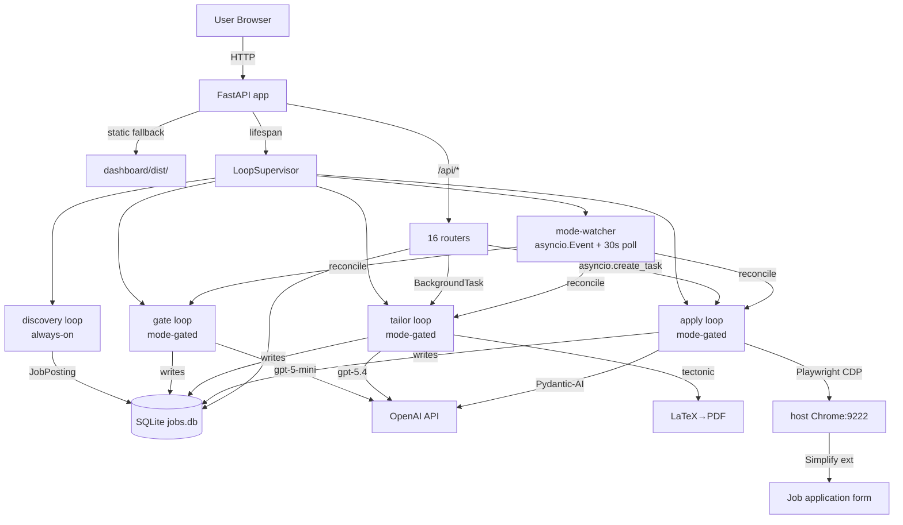
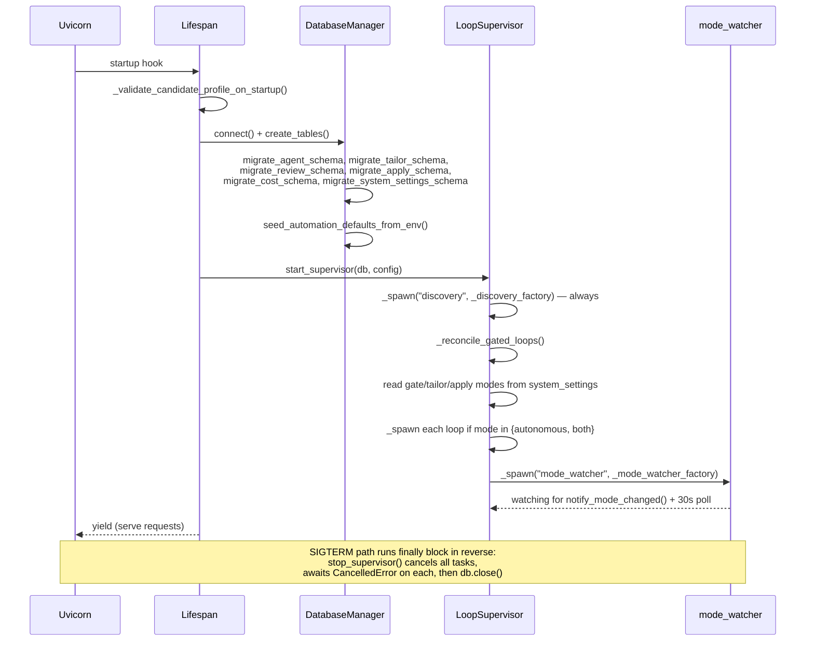

# Architecture

## Architecture Summary

Agentic Job Applier is organized as a single FastAPI process with five coupled planes:

1. **Discovery plane** — `main.run_discovery_loop` + fetcher families crawl 14+ sources on a 30-minute interval, normalize via `JobPosting`, deduplicate by SHA-256 `job_hash`, and persist new rows. No LLM spend; always runs (`main.py:58-86`, `src/orchestrator/discovery.py:100-287`).
2. **Agent plane** — Gate (`gpt-5-mini`), tailor + reviewer (`openai/gpt-5.4` + `openai/gpt-5-mini`), and apply-finisher (Pydantic-AI on `openai-responses:gpt-5.4`) execute LLM work. Each stage is gated by its own per-stage automation mode (`autonomous|opt_in|both`).
3. **Persistence plane** — `DatabaseManager` (aiosqlite + 9 mixins) owns every table; atomic claim-and-lease via `BEGIN IMMEDIATE` transactions and random claim tokens keeps the pipeline race-safe (`src/database/db_manager.py:73-244`, `src/database/_mixins/*.py`).
4. **HTTP/API plane** — ~60 endpoints across 16 routers serve the React dashboard and user-triggered tailor/apply. Background work runs via FastAPI `BackgroundTasks` (tailor) or detached `asyncio.create_task` (apply, so the browser flow starts immediately instead of waiting for the autonomous poll cycle) (`api/main.py:62-148`, `api/routers/apply_runs.py:48-115`).
5. **Browser plane** — Apply worker connects Playwright over CDP to the user's **host Chrome** at `host.docker.internal:9222` (Docker) or `localhost:9222` (systemd). No in-container Chromium. Host header is forced to `localhost:<port>` to defeat Chrome 148+'s host check (`src/agents/apply_worker/browser.py:158-199,385-410`).

These planes are wired by `api/main.py:_lifespan()`, which calls `_run_startup_migrations()` then `start_supervisor()`. The supervisor (`api/services/supervisor.py:LoopSupervisor`) owns four task lifecycles (discovery + gate + tailor + apply) plus a mode-watcher that reconciles state when the dashboard toggle flips.

## Runtime Topology



Evidence: `api/main.py:62-85`, `api/services/supervisor.py:276-299,461-488`, `src/agents/apply_worker/browser.py:385-410`, `api/routers/tailor_runs.py:306-314`, `api/routers/apply_runs.py:48-115`.

## Startup and Lifespan Composition

The FastAPI lifespan hook (`api/services/migrations.py:_lifespan`) orchestrates boot in strict order:



Evidence: `api/services/migrations.py:67-113`, `api/services/supervisor.py:276-299,604-626`.

## Per-Stage Run Topology

Each worker loop owns one asyncio task and runs continuously when its mode is `autonomous` or `both`. Every cycle re-reads `system_settings.automation.<stage>_mode`, so the dashboard's autonomous toggle takes effect within ~1.5 seconds (the mode-watcher's `asyncio.wait_for` timeout).

### Discovery loop (always-on)

`main.py:58-86` → `run_discovery_loop(interval_minutes=30)`:

```
forever:
  try: await run_job_discovery()
  except CancelledError: raise
  except: log + continue
  await asyncio.sleep(interval_seconds)
```

`run_job_discovery()` (`src/orchestrator/discovery.py:100-287`):
1. Load `companies.yaml` (required), `search_criteria.yaml` + `candidate_profile.yaml` + `filters.yaml` (optional)
2. Resolve user domains; filter the watchlist via `domains.py` (untagged companies always match)
3. Build family tasks: per-company Greenhouse/Workday/Taleo/iCIMS/Lever/Ashby, per-board Adzuna/JobSpy/LinkedIn, per-repo GitHub, per-page watched pages
4. `asyncio.gather(..., return_exceptions=True)` — one slow family doesn't block others (`discovery.py:237-256`)
5. Each family: fetch → `filter_by_title_patterns` → `Deduplicator.filter_new_jobs` → `insert_with_filters`
6. Rollup: `update_daily_stats`, `log_cycle_summary`

### Gate, tailor, apply loops (mode-gated)

```mermaid
flowchart TD
  POLL[loop tick] --> MODE{mode in<br/>autonomous|both?}
  MODE -->|opt_in| IDLE[sleep poll_interval]
  MODE -->|yes| BUDGET{budget OK?}
  BUDGET -->|no| IDLE
  BUDGET -->|yes| CLAIM[BEGIN IMMEDIATE<br/>SELECT + INSERT PENDING<br/>with claim_token]
  CLAIM -->|none| IDLE
  CLAIM -->|got one| EXEC[execute stage]
  EXEC --> PERSIST[record_*_success or<br/>record_*_failure with<br/>claim_token check]
  PERSIST --> POLL

  STALE[every cycle:<br/>mark_stale_*_runs_failed<br/>lease_seconds threshold] -.-> POLL
```

Lease defaults (`api/services/supervisor.py:_*_factory` + envs):
- **Agent (gate):** 900s (15 min), env `AGENT_CLAIM_LEASE_SECONDS`
- **Tailor:** 7200s (2 hr), env `TAILOR_CLAIM_LEASE_SECONDS`
- **Apply:** 1800s (30 min), env `APPLY_CLAIM_LEASE_SECONDS` — browser ops are slower than agent cycles

Apply has one extra preflight: `check_chrome_reachable(cdp_url)` returns 200 from `/json/version` or the loop sleeps without claiming. This prevents FAILED rows when Chrome is offline (`scripts/process_apply_jobs.py:803-823`).

## Queue + Background-Task Topology

Two parallel paths can insert work rows; the database's per-job single-slot constraint resolves races.

**Autonomous path:** Worker loop calls `claim_next_*_job()` which inserts PENDING + claim token in one `BEGIN IMMEDIATE` transaction.

**User-triggered path:** Dashboard buttons hit POST endpoints which insert PENDING then enqueue a background task:

- `POST /api/jobs/{hash}/tailor` → `BackgroundTasks.add_task(_run_pipeline_background, ...)` runs after HTTP 202 response with its own `DatabaseManager` (`api/routers/tailor_runs.py:306-314,63-125`).
- `POST /api/jobs/{hash}/apply` → `asyncio.create_task(_spawn_user_apply_task, ...)` — detached, fires immediately so the browser flow starts without waiting for the autonomous poll cycle (`api/routers/apply_runs.py:48-115`).

```mermaid
sequenceDiagram
  participant Dash as Dashboard
  participant Tailor as POST /tailor
  participant Apply as POST /apply
  participant DB
  participant BG as BackgroundTask
  participant Loop as worker loop
  participant Det as detached task

  Dash->>Tailor: { apply_after: true }
  Tailor->>DB: validate mode != AUTONOMOUS<br/>check budget<br/>INSERT PENDING tailor_runs<br/>with apply_after_completion=true
  Tailor-->>Dash: 202 { run_id, status: PENDING }
  Tailor->>BG: add_task(_run_pipeline_background)
  BG->>DB: open own DatabaseManager
  BG->>BG: run_tailor_review_pipeline()
  BG->>DB: record_tailor_success + insert_pipeline_review_run
  alt apply_after = true and success
    BG->>DB: enqueue_apply_run_for_job
  end

  Dash->>Apply: { resume_mode: "base" }
  Apply->>DB: compile_base_resume_pdf (content-hash cached)
  Apply->>DB: enqueue_apply_run_with_base_resume<br/>(synthesizes tailor + review SUCCESS rows<br/>with verdict=BASE)
  Apply->>Det: asyncio.create_task(_spawn_user_apply_task)
  Apply-->>Dash: 200 { run_id, status }
  Det->>DB: open own DatabaseManager
  Det->>Det: _process_apply_row() — full browser flow

  Note over Loop: Autonomous loop polling PENDING rows<br/>races for same job — single-slot per_job<br/>constraint at insert time prevents duplicate
```

## Concurrency Model

- **Atomic claim-and-lease:** Every stage uses `BEGIN IMMEDIATE` transactions to SELECT-then-INSERT a PENDING row carrying a random claim_token (12 hex bytes for agent, 32 for tailor/review/apply). Workers must present the same token to write completion or `ClaimOwnershipError` is raised and the write is dropped with a warning (`src/database/_mixins/jobs.py:299-384`, `src/database/_mixins/tailor.py:229-340`, `src/database/_mixins/apply.py:178-307`).
- **Lease expiry:** Every poll cycle the workers call `mark_stale_*_runs_failed(lease_seconds)` to convert PENDING rows older than the lease into FAILED, reaping crashed/killed processes (`src/database/_mixins/tailor.py:610-643`, `src/database/_mixins/apply.py:mark_stale_apply_runs_failed`).
- **Soft-deletes free slots:** `tailor_runs.deleted_at` and `apply_runs.deleted_at` exclude rows from claim queries while preserving audit history. User-triggered "delete & retry" soft-deletes the old row in the same transaction as the new insert (`src/database/_mixins/tailor.py:461-489`, `api/routers/tailor_runs.py:_retry_tailor_run`).
- **Per-job single-slot:** Any active (non-deleted, PENDING/RUNNING) tailor_run or apply_run blocks new inserts for the same job_hash, returning 409 `RUN_ALREADY_EXISTS` / `APPLY_RUN_IN_FLIGHT` at the router layer (`api/routers/tailor_runs.py:289-302`, `api/routers/apply_runs.py:_enqueue`).

## Tool/Plane Coupling

| Plane | Reads from | Writes to | Side effects |
|---|---|---|---|
| Discovery | `companies.yaml`, network (fetchers) | `job_postings`, `crawl_history`, `daily_stats` | none |
| Gate | `job_postings` (NEW), `candidate_profile.yaml`, OpenAI | `job_postings.status` + `agent_*` columns, `cost_events` | ntfy on terminal failure |
| Tailor + Review | `tailor_runs`, `job_postings`, `config/resume.tex`, OpenAI, tectonic | `tailor_runs`, `review_runs`, `cost_events`, `data/tailored_resumes/<hash>/...` | none |
| Apply worker | `apply_runs` (claim), host Chrome CDP, `data/tailored_resumes/...` or `data/base_resume/<sha>.pdf` | `apply_runs`, `apply_handoffs`, screenshots/DOM snapshots, `cost_events` | invokes finisher; clicks Submit when gate passes |
| Apply finisher | `defer_rules.yaml`, `data/answer_cache.yaml`, `candidate_profile.yaml`, host Chrome | `data/answer_cache.yaml` (append), `cost_events` (phase=finisher) | none |
| Onboarding wizard | dashboard React state | `config/candidate_profile.yaml`, `config/resume.tex`, `config/filters.yaml`, `config/companies.yaml`, `.env` | wizard backups |
| Human review | `apply_handoffs` | `apply_handoffs.handoff_status`, `apply_handoffs.user_answers_json`, `job_postings.status` | optionally enqueues new apply_run |

## Architectural Constraints and Near-term Drawbacks

1. **Multi-provider BYOK is a partial reality.** Gate uses the `AIProvider` protocol (`src/agents/root_apply_decider/unified_runtime.py:49-100`); tailor + reviewer hardcode `OpenAI()` + `instructor.from_openai(...)` and ignore the abstraction (`src/agents/resume_tailor/llm.py:152-184`). Onboarding's `StepProvider` is narrowed to OpenAI only. Switching to Anthropic requires an `AnthropicProvider` class, an `instructor.from_anthropic()` branch, and Anthropic's 10%-cache-discount math.
2. **Apply-finisher ATS scope is locked to Greenhouse + Ashby.** `supported_finisher_ats()` returns None for Lever/Workday/iCIMS/SmartRecruiters; those land NEEDS_REVIEW with `finisher_outcome="SKIPPED"` (`src/agents/apply_worker/ats_detection.py:188-201`).
3. **React-Select v4 picks require a manual PointerEvent sequence.** Bare `click` events do not commit. The 8-tool `fill_combobox` helper dispatches `PointerEvent(pointerdown) + MouseEvent(mousedown) + PointerEvent(pointerup) + MouseEvent(mouseup) + click` and verifies `.select__single-value` after (`src/agents/apply_finisher/tools.py:44-127`).
4. **Image-baked dashboard.** `dashboard/dist/` is COPYed into the image at build time. Live UI updates need `docker cp dashboard/dist/. agentic-job-applier-app-1:/app/dashboard/dist/` (memory: `project_dashboard_served_from_dist`).
5. **Single-writer SQLite.** Heavy parallel writes serialize on `BEGIN IMMEDIATE`. Acceptable for single-user local; horizontal scale requires PostgreSQL or a queue.
6. **Tectonic CTAN cache fragility.** First user tailor without prewarm pays a 30-60s package fetch. Prewarm at image build amortizes this; cache lives in a dedicated `tectonic-cache` volume (`Dockerfile:61-72`).
7. **Chrome 148+ host check.** Container connections to `host.docker.internal:9222` fail without the `Host: localhost:<port>` override applied at the probe and the Playwright handshake (`src/agents/apply_worker/browser.py:158-199`, `tests/test_cdp_host_header_override.py`).
8. **Legacy `*_yaml_path` columns** on `tailor_runs` and `review_runs` are still written but semantically dead post-Phase-3 (`.tex` is the source of truth). Planned cleanup; no consumers today.

These constraints are tracked in `review_notes.md` with severity and follow-up order.
