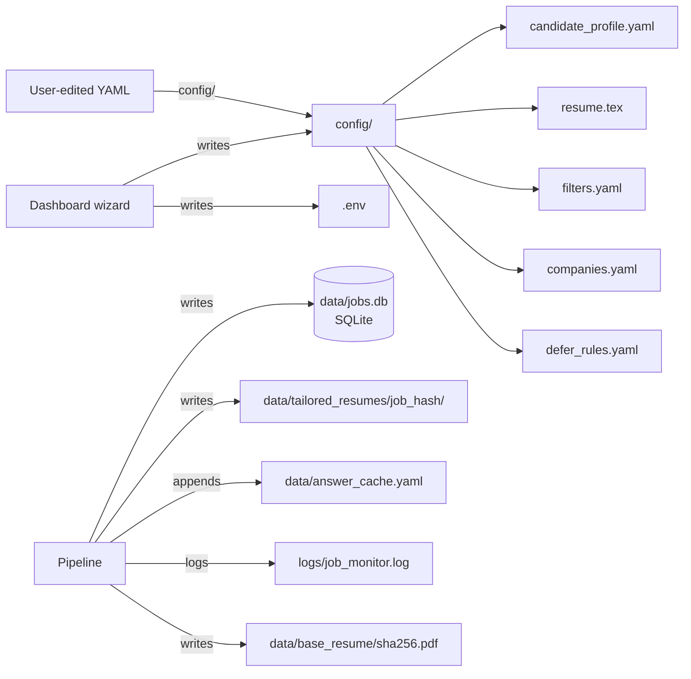

# Codebase Info

## Executive Snapshot

Agentic Job Applier is a self-hosted Python + TypeScript application that crawls 14+ job sources, qualifies postings with an LLM gate, generates job-specific LaTeX resumes via a tailor + review pipeline, and drives the user's host Chrome over CDP to fill (and conditionally submit) applications. The pipeline is one FastAPI process: lifespan boots an in-process asyncio supervisor that runs discovery + per-stage worker loops, state lives in a local SQLite database, and the React dashboard is image-baked and served as a static fallback (`AGENTS.md:3-12`, `README.md:1-72`, `api/main.py:62`, `docker-compose.yml:22-46`).

## Technology Profile

### Primary stack

- **Backend runtime:** Python 3.11+ (`pyproject.toml:7`)
- **Backend framework:** FastAPI 0.123.10 + Uvicorn 0.40.0 (`pyproject.toml:15,36`)
- **Database:** SQLite via aiosqlite 0.22.1 (`pyproject.toml:10`, `src/database/db_manager.py:25`)
- **LLM SDK:** openai 2.38.0, instructor 1.15.1, pydantic-ai-slim 1.102.0, litellm 1.82.1 (`pyproject.toml:24,20,28,21`)
- **LaTeX engine:** tectonic (multi-arch musl binary, vendored under `deploy/tectonic/`)
- **Browser automation:** playwright 1.60.0 + agent-browser (Rust CDP CLI, vendored under `deploy/agent-browser/`)
- **Frontend runtime:** Node.js 22+ (`Dockerfile:4`)
- **Frontend framework:** React 19 + Vite 8 + TypeScript 5.9 + TanStack Query 5.90 + Tailwind 4.2 + Monaco editor (`dashboard/package.json`)
- **Job-board client:** python-jobspy 1.1.82 (Indeed/LinkedIn/Glassdoor aggregator), curl-cffi 0.15.0 (TLS fingerprint bypass for LinkedIn) (`pyproject.toml:33,18`)
- **Dependency pinning:** Strict `==` only (memory: `feedback_dependency_pinning`)

### Supported vs. utility languages

- **Primary implementation/runtime:** Python 3.11+ for the API, supervisor, agents, fetchers, database layer, and worker scripts; TypeScript 5.9 for the dashboard SPA.
- **Utility/support languages:**
  - Shell scripts under `scripts/docker/` (start/stop/restart) and `deploy/` (systemd helpers)
  - LaTeX (`config/resume.tex`, `deploy/tectonic-prewarm.tex`) — user-edited template + build-time cache warmer
  - YAML (`config/*.yaml`, `data/answer_cache.yaml`) — user-facing config
- **Rust binary (vendored):** agent-browser is a Rust CDP CLI; AJA does not build it, only ships prebuilt per-arch binaries (`Dockerfile:78-84`, `deploy/agent-browser/`).

## Repository Layout (High-level)

```mermaid
graph TD
  ROOT[repo root] --> SRC[src]
  ROOT --> API[api]
  ROOT --> DASH[dashboard]
  ROOT --> SCRIPTS[scripts]
  ROOT --> TESTS[tests]
  ROOT --> CONFIG[config]
  ROOT --> DEPLOY[deploy]
  ROOT --> DOCS[docs]
  ROOT --> DATA[data]
  ROOT --> LOGS[logs]

  SRC --> FETCHERS[src/fetchers]
  SRC --> ORCH[src/orchestrator]
  SRC --> AGENTS[src/agents]
  SRC --> DB[src/database]
  SRC --> MODELS[src/models]
  SRC --> PROVIDERS[src/providers]
  SRC --> FILTERS[src/filters]
  SRC --> CONFIGPKG[src/config]
  SRC --> UTILS[src/utils]

  API --> ROUTERS[api/routers]
  API --> SERVICES[api/services]
  API --> SCHEMAS[api/schemas]

  DASH --> PAGES[dashboard/src/pages]
  DASH --> COMP[dashboard/src/components]
  DASH --> LIB[dashboard/src/lib]

  AGENTS --> RTA[root_apply_decider — gate]
  AGENTS --> RT[resume_tailor — tailor+review pipeline]
  AGENTS --> AW[apply_worker — browser orchestrator]
  AGENTS --> AF[apply_finisher — Pydantic-AI form filler]

  DB --> MIXINS[src/database/_mixins]
```

Core runtime source lives under `src/` (Python) and `dashboard/src/` (TypeScript). The boundary is clean: `src/agents/` owns all LLM and browser work, `src/database/` owns persistence, `api/` translates HTTP requests into DB operations and background tasks, and `dashboard/` is a pure consumer of the HTTP API.

## Major Runtime Subsystems

| Subsystem | Responsibility | Primary Evidence |
|---|---|---|
| **Discovery / fetchers** | Crawl 14+ job sources, normalize to `JobPosting`, deduplicate, pre-filter, insert | `main.py:58-86`, `src/fetchers/*.py`, `src/orchestrator/discovery.py:100-287`, `src/orchestrator/insert_pipeline.py:41-127` |
| **Gate / decider agent** | LLM-driven NEW → QUALIFIED|FILTERED decision via `gpt-5-mini` | `scripts/process_new_jobs.py:410-466`, `src/agents/root_apply_decider/unified_runtime.py:49-100`, `src/agents/root_apply_decider/prompts.py:16-180` |
| **Resume tailor + review** | LaTeX-native pipeline: locator → tailor LLM → patcher → tectonic compile → reviewer → (optional retry+3-way) → DB row | `scripts/process_qualified_jobs.py:362-416`, `src/agents/resume_tailor/pipeline.py:535-964`, `src/agents/resume_tailor/locator.py:67-200`, `src/agents/resume_tailor/patcher.py:52-100`, `src/agents/resume_tailor/compiler.py:45-290`, `src/agents/resume_tailor/base_compile.py:31-87` |
| **Apply worker** | Claim review run, navigate host Chrome, trigger Simplify autofill, upload resume, optionally invoke finisher, evaluate submit gate, persist outcome + handoff | `scripts/process_apply_jobs.py:826-907`, `src/agents/apply_worker/browser.py:385-815`, `src/agents/apply_worker/finisher_integration.py:204-353` |
| **Apply finisher** | Pydantic-AI agent + 8 typed Playwright tools that fill Greenhouse/Ashby forms post-Simplify; classifies fields into Tier 1/2/3 | `src/agents/apply_finisher/agent.py:76-119`, `src/agents/apply_finisher/tools.py`, `src/agents/apply_finisher/prompts.py`, `src/agents/apply_finisher/defer_rules.py:60-149`, `src/agents/apply_finisher/answer_cache.py:195-358` |
| **In-process supervisor** | Lifespan-owned `LoopSupervisor` runs discovery + (mode-gated) gate/tailor/apply; mode-watcher reconciles loops on toggle | `api/services/supervisor.py:198-641`, `api/services/migrations.py:67-113` |
| **HTTP API** | ~60 endpoints across 16 routers; dashboard backend; user-triggered tailor/apply via BackgroundTask / `asyncio.create_task` | `api/main.py:62-148`, `api/routers/*.py`, `api/errors.py:18-69` |
| **React dashboard** | SPA at `/` with TanStack Query polling; JobsPage, HumanReviewPage, CostTrackingPage, FailuresPage, Settings, Onboarding wizard | `dashboard/src/App.tsx:32-59`, `dashboard/src/pages/*.tsx`, `dashboard/src/lib/api/client.ts` |
| **Database layer** | 9 mixins composed onto `DatabaseManager`; race-safe `BEGIN IMMEDIATE` claim-and-lease; idempotent ALTER migrations | `src/database/db_manager.py:73-244`, `src/database/_mixins/*.py` |
| **Provider abstraction** | `AIProvider` protocol + `OpenAIProvider` (current sole implementation); litellm-backed cost computation | `src/providers/factory.py:1-92`, `src/providers/openai_provider.py:182-250` |
| **Filters + config** | Hard/soft pre-gate filters; Pydantic v2 validation of `candidate_profile.yaml`; defer-rule classifier; answer cache | `src/filters/job_filter.py:51-459`, `src/config/schema.py:20-290`, `src/agents/apply_finisher/defer_rules.py`, `src/agents/apply_finisher/answer_cache.py` |
| **Utilities** | logger (loguru), deduplicator, cost_tracking, notifications (ntfy), paths, json_types, llm_pricing | `src/utils/*.py` |
| **Deployment** | Two paths: Docker Compose (single service) + Linux systemd (5 service units + timer) | `Dockerfile`, `docker-compose.yml`, `deploy/*.service`, `deploy/*.timer`, `scripts/docker/*.sh` |

## Run and Artifact Topology

State and artifacts live in repo-relative or volume-mounted locations:

- **Database:** `data/jobs.db` — single SQLite file; the `app-data` Docker named volume persists it across container restarts. Schema in `src/database/schema.sql` + per-mixin idempotent migrations.
- **Tailor artifacts:** `data/tailored_resumes/<job_hash>/{base,tailored_v1,tailored_v2}/{*.tex,*.pdf,*.log,*.plan.json}` (`src/agents/resume_tailor/pipeline.py:626-746`).
- **Base-resume PDF cache:** `data/base_resume/<sha256-of-resume-tex>.pdf` — compiled on demand by `compile_base_resume_pdf` for the `resume_mode='base'` apply path (`src/agents/resume_tailor/base_compile.py:31-87`).
- **Answer cache:** `data/answer_cache.yaml` — machine-mutable, schema_version 1, atomic-rename writes (`src/agents/apply_finisher/answer_cache.py:313-358`).
- **Logs:** `logs/job_monitor.log` — loguru with 10MB rotation, 1-week retention (`src/utils/logger.py:9-66`).
- **User config (read-only from app):** `config/candidate_profile.yaml`, `config/filters.yaml`, `config/companies.yaml`, `config/defer_rules.yaml`, `config/resume.tex`. Wizard writes backups under `config/backups/*_YYYYMMDD_HHMMSS.yaml`.

## Current context

This spec was authored against the working tree as a snapshot. The most recent committed change (`857d886`) wires `NotTailoredModal` flow: `POST /api/jobs/{hash}/apply` accepts `{resume_mode: "base"}` (compiles `config/resume.tex` on demand, cached by content hash) and `POST /api/jobs/{hash}/tailor` accepts `{apply_after: true}` (persists on the new `tailor_runs.apply_after_completion` column; BackgroundTask enqueues an apply on pipeline success). Uncommitted edits beyond that — `config/defer_rules.yaml`, `config/resume.tex`, `deploy/tectonic-prewarm.tex` — are user-side tweaks and are assumed to be in-spec per direction.
