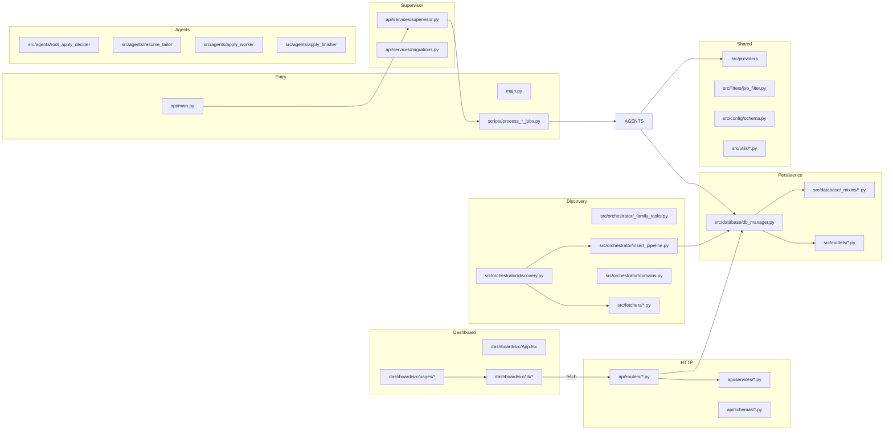

# Components

Every major module, what it owns, what it reads, what it writes. Organized by layer.

## Layer map

## Entry points

| Component | Role | Evidence |
|---|---|---|
| `main.py` | Sync entrypoint for `python main.py`; `run_discovery_loop()` is the importable async entry called by the supervisor | `main.py:58-86,89-121` |
| `api/main.py` | FastAPI app construction, lifespan binding, router registration, static dashboard fallback, error handler | `api/main.py:62-148` |
| `scripts/process_new_jobs.py` | Gate worker — standalone CLI (`--once`, `--loop`) and the function the supervisor imports for the gate task | `scripts/process_new_jobs.py:410-466,480-557` |
| `scripts/process_qualified_jobs.py` | Tailor + review worker — same CLI/supervisor dual mode | `scripts/process_qualified_jobs.py:362-416` |
| `scripts/process_apply_jobs.py` | Apply worker — same dual mode, plus Chrome reachability preflight | `scripts/process_apply_jobs.py:826-907` |

The dual mode (CLI + importable) is what makes the single-container Docker design and the multi-unit systemd design share the same code. Each worker script exposes a `run_*_loop()` function; the supervisor calls it directly, and the systemd unit invokes the script with `--loop`.

## Supervisor & lifespan

| Component | Role | Evidence |
|---|---|---|
| `api/services/supervisor.py:LoopSupervisor` | Owns four asyncio tasks (discovery + gate + tailor + apply) plus a mode-watcher. Restart-with-backoff on crashes (5s→300s cap). `notify_mode_changed()` reconciles gated loops within ~1.5s | `api/services/supervisor.py:198-641` |
| `api/services/supervisor.py:start_supervisor` / `stop_supervisor` | Module-level handles used by `api/main.py` lifespan and routers that need the active supervisor's config | `api/services/supervisor.py:566-626` |
| `api/services/migrations.py:_lifespan` | FastAPI lifespan: validates candidate profile, runs all stage migrations, starts the supervisor, awaits shutdown to stop it cleanly | `api/services/migrations.py:67-113` |
| `api/services/migrations.py:_run_startup_migrations` | Idempotent ALTERs across every mixin; called once per process start before the supervisor spawns | `api/services/migrations.py:24-65,89-113` |

## Discovery

| Component | Role | Evidence |
|---|---|---|
| `src/orchestrator/discovery.py:run_job_discovery` | One discovery cycle: load YAML config, filter watchlist by domain, build family tasks, gather with exception isolation, roll up daily stats | `src/orchestrator/discovery.py:100-287` |
| `src/orchestrator/_family_tasks.py:build_family_tasks` | Per-family coroutine factory: enumerates configured companies/boards/repos/pages, late-binds fetcher classes via `main.<Fetcher>` for monkeypatch-friendly testing | `src/orchestrator/_family_tasks.py:64-232` |
| `src/orchestrator/fetchers/*.py` | One file per fetcher family wrapping its concrete `Fetcher` class with `start_crawl` / `complete_crawl` bookkeeping and per-company `log_crawl_summary` | `src/orchestrator/fetchers/{adzuna,ashby,career_pages,github_repos,greenhouse,icims,jobspy,lever,linkedin,taleo,workday}.py` |
| `src/orchestrator/insert_pipeline.py:insert_with_filters` | Per-job: run `JobFilter.filter_job` → branch on `FilterAction` (REJECT / REJECT_FILTERED / ACCEPT_QUALIFIED / ACCEPT_NEW) → insert with appropriate status, increment counters | `src/orchestrator/insert_pipeline.py:41-127` |
| `src/orchestrator/domains.py` | Two-level domain taxonomy: 8 user-facing domains in `candidate_profile.yaml:profile.domains`, expanded to granular industry tags via `DOMAIN_TO_INDUSTRIES`. Untagged companies always pass (no silent data loss) | `src/orchestrator/domains.py:1-395` |
| `src/orchestrator/config_loader.py` | YAML loaders, list/int normalizers, Workday `searchText` derivation from `target_roles` | `src/orchestrator/config_loader.py:1-200+` |

### Fetchers (`src/fetchers/`)

| Fetcher | Source | Notes |
|---|---|---|
| `greenhouse_fetcher.py` | Greenhouse public boards | Direct API; zero-cost |
| `workday_fetcher.py` | Workday CXS anonymous endpoint | Per-tenant; `searchText` derived from `candidate_profile.yaml:target_roles` (intern/co-op/new grad/junior/early career priority) to bust the ~40-row default limit |
| `lever_fetcher.py` | Lever public job board | Direct API |
| `ashby_fetcher.py` | Ashby public job board | Direct API |
| `icims_fetcher.py` | iCIMS JSON listing | Pagination handling |
| `taleo_fetcher.py` | Oracle Taleo OData | Per-tenant |
| `adzuna_fetcher.py` | Adzuna aggregator | API-key gated; structured salary; user adds keys in onboarding Step 5 |
| `jobspy_fetcher.py` | python-jobspy → Indeed/LinkedIn/Glassdoor | Aggregator; rate-sensitive |
| `linkedin_fetcher.py` | LinkedIn guest jobs | curl-cffi for TLS fingerprinting; 8–20s random delays; exponential backoff on 429; mutmut-instrumented |
| `github_repo_fetcher.py` | curated GitHub repos (e.g., SimplifyJobs internships) | Per-repo |
| `career_page_watcher.py` | generic career pages | HTTP scraper for non-ATS sites |
| `himalayas_fetcher.py`, `remotive_fetcher.py`, `themuse_fetcher.py`, `startup_jobs_fetcher.py`, `working_nomads_fetcher.py` | Remote-only and aggregator boards | Direct APIs where available |
| `ats_scanner.py` | Zero-token ATS auto-detection | `detect_ats_provider(url)` → routes to Greenhouse/Ashby/Lever/BambooHR-specific extraction. Used by `career_page_watcher` |
| `base_fetcher.py` | Abstract base | Async context manager; `fetch_jobs()` + `get_source_name()` |
| `fuzzy_dedup.py` | RapidFuzz-backed fuzzy company/role matching | Not wired into the main dedup path (which is exact-hash); available for fetcher-internal use |
| `liveness_checker.py` | Expired-posting detection | Built but not currently invoked in discovery |
| `errors.py` | `FetchError` typed exception | Lets orchestrators distinguish crawl failures from empty results in metrics |

## Agents

### Gate (`src/agents/root_apply_decider/`)

| Component | Role | Evidence |
|---|---|---|
| `unified_runtime.py:run_gate_with_provider` | Provider-agnostic entry: builds `CompletionRequest`, calls `provider.complete()`, parses to `GateRunOutcome` carrying `ApplyDecision` + raw `CompletionResponse` for cost recording | `src/agents/root_apply_decider/unified_runtime.py:49-100` |
| `prompts.py:ROOT_APPLY_DECIDER_INSTRUCTION` | System prompt: bias toward APPLY for borderline-aligned roles, hard filters (internship/co-op only, no frontend/IT/embedded/low-code/defense), salary threshold, posting-age cutoff | `src/agents/root_apply_decider/prompts.py:16-180` |
| `prompts.py:build_gate_payload` + `load_candidate_context` | Renders the user message: candidate context (cached via `@lru_cache(maxsize=1)`), prompt-safety preamble, untrusted-data XML tags around job text | `src/agents/root_apply_decider/prompts.py:351-507` |
| `schemas.py` | `ApplyDecision`, `GateDebugInfo`, `GateRunResult` | `src/agents/root_apply_decider/schemas.py:1-50` |

### Tailor + reviewer (`src/agents/resume_tailor/`)

| Component | Role | Evidence |
|---|---|---|
| `pipeline.py:run_tailor_review_pipeline` | The whole pipeline in one async function: mark RUNNING → load + revalidate `.tex` → compile base → build manifest → call tailor LLM → apply patches → compile v1 → trim if >1 page → call reviewer → optionally call retry tailor + 3-way reviewer → select winner → write DB rows | `src/agents/resume_tailor/pipeline.py:535-964` |
| `validator.py:validate_resume_tex` | Enforces `docs/resume-tex-contract.md`: tailorable section allowlist, six entry-header macro forms + two fallbacks, `\resumeItem` / `\cvline` / `\item` bullets, balanced braces. Halts on first failure with structured error code | `src/agents/resume_tailor/validator.py` |
| `locator.py:build_bullet_manifest` | Pure function: walks `.tex`, returns `BulletManifest` with stable IDs (`exp.<slug>.b1`, etc.) and byte offsets pointing to body bytes only (not wrapping macros) | `src/agents/resume_tailor/locator.py:67-200` |
| `patcher.py:apply_patches` + `write_patched_tex_atomically` | Dumb byte splicer: validates non-overlap, sorts patches descending by `byte_start`, splices, runs `latex_safe()` over each `new_text`. Atomic temp-file + `os.replace` write | `src/agents/resume_tailor/patcher.py:52-100,190` |
| `latex_sanitize.py:latex_safe` | Escapes the 8 reserved LaTeX chars (`\ { } $ % # _ &`); intentionally narrow so existing `\textbf{}` / `\textit{}` macros in LLM output survive | `src/agents/resume_tailor/latex_sanitize.py:1-50` |
| `compiler.py:compile_resume_tex` | Tectonic by default, latexmk fallback when `RESUME_COMPILER=latexmk`. Default timeout 240s via `TECTONIC_TIMEOUT_SECONDS` | `src/agents/resume_tailor/compiler.py:45-88` |
| `compiler.py:get_pdf_page_count` | Parses `.log` for "Output written on … (N pages)"; used to enforce 1-page limit | `src/agents/resume_tailor/compiler.py:250-290` |
| `base_compile.py:compile_base_resume_pdf` | New (commit `857d886`): SHA-256-cached compile of `config/resume.tex` to `data/base_resume/<digest>.pdf`. Backs the `resume_mode='base'` apply path | `src/agents/resume_tailor/base_compile.py:31-87` |
| `llm.py:call_tailor` / `call_trim` / `call_reviewer` | Instructor-wrapped OpenAI calls with `Mode.RESPONSES_TOOLS`. `INSTRUCTOR_MAX_RETRIES=3` for JSON/Pydantic validation re-asks | `src/agents/resume_tailor/llm.py:152-184,330-391` |
| `prompts.py` (tailor + reviewer) | Tailor prompt: 4–8 rewrites, ±15% character budget, preserve `\textbf{}` macros verbatim, factuality is a reviewer veto. Reviewer prompt: 3-axis rubric (`keyword_fit` / `specificity` / `factuality`), 2-way vs 3-way logic | `src/agents/resume_tailor/prompts.py:25-180,400-600` |
| `pipeline_schemas.py` | `TailorOutput`, `BulletPatchProposal`, `ReviewerOutput`, `ReviewerScores`, `ReviewerVerdict`, `TailorRunResult` | `src/agents/resume_tailor/pipeline_schemas.py:1-184` |
| `db_verdict.py` | Maps LLM `ReviewerVerdict` to DB-stored verdicts (`PASS`, `TAILORED`, `BASE`, `FAIL`, `NO_IMPROVEMENT`, `PAGE_FIT_FAILED`). The DB CHECK constraint is built from this module so adding a verdict is a one-place change | `src/agents/resume_tailor/db_verdict.py` |

### Apply worker (`src/agents/apply_worker/`)

| Component | Role | Evidence |
|---|---|---|
| `browser.py:apply_to_job` | Top-level browser flow per claimed apply_run: connect over CDP, open new page, run `_run_application_flow`, close page in finally | `src/agents/apply_worker/browser.py:385-410` |
| `browser.py:_cdp_localhost_host_header` | Builds `Host: localhost:<port>` override unless URL already uses localhost or an IP literal. Applied to both the httpx CDP probe and the Playwright handshake | `src/agents/apply_worker/browser.py:158-199` |
| `browser.py:check_chrome_reachable` | 5-second GET on `/json/version` with host-header override. Returns False on any exception; loop sleeps without claiming when False | `src/agents/apply_worker/browser.py:314-333` |
| `browser.py:_wait_for_simplify_to_settle` | Polls form's filled-field count every 500ms; returns when count stabilizes for 2s or 30s elapses. Replaced fixed sleeps that under- or over-shot | `src/agents/apply_worker/browser.py:567-625` |
| `browser.py:_run_application_flow` | Body of the apply: navigate → detect Simplify → upload resume (before click) → click autofill → wait for settle → re-upload resume → snapshot unresolved fields → optionally call finisher → evaluate gate → submit or hand off | `src/agents/apply_worker/browser.py:_run_application_flow` |
| `finisher_integration.py:evaluate_submit_gate` | Binary gate: returns `(can_auto_submit, decision_label)`. Decision labels: `auto_submit`, `dry_run`, `safe_mode`, `finisher_incomplete`, `tier3_deferred`, `tier2_pending` | `src/agents/apply_worker/finisher_integration.py:204-253` |
| `finisher_integration.py:try_submit_and_classify` | Clicks submit (ATS-specific selector), waits 5s for URL change → SUBMITTED. On timeout, scrapes error toasts → NEEDS_REVIEW with toast list, or FAILED_OTHER if no toasts | `src/agents/apply_worker/finisher_integration.py:279-353` |
| `finisher_integration.py:synthesize_diagnostics` | Builds `FinisherDiagnostics` from the finisher result + submit outcome; persisted to `apply_handoffs.finisher_diagnostics_json` | `src/agents/apply_worker/finisher_integration.py:356-410` |
| `finisher_integration.py:safe_mode_from_env` | Parses `SAFE_MODE` env (`true`/`1`/`yes`/`on`) | `src/agents/apply_worker/finisher_integration.py:256-276` |
| `field_scanner.py:scan_unresolved_fields` | JS-eval'd form snapshot: reads `.select__single-value` for React-Select, `el.checked` for checkboxes, plain `el.value` otherwise. Returns rich `UnresolvedField` records with label, type, required flag, options, selector, parent form, validation error | `src/agents/apply_worker/field_scanner.py:228-266` |
| `ats_detection.py:detect_ats_platform` + `supported_finisher_ats` | URL pattern match then DOM marker fallback; finisher routing returns `"greenhouse"` / `"ashby"` or None (everything else skips finisher) | `src/agents/apply_worker/ats_detection.py:14-60,188-201` |
| `schemas.py` | `ApplyOutcome`, `ATSPlatform`, `UnresolvedField`, `ConfidenceCheck`, `ConfidenceReport`, `FinisherDiagnostics`, `ApplyRunResult` | `src/agents/apply_worker/schemas.py:1-307` |

### Apply finisher (`src/agents/apply_finisher/`)

| Component | Role | Evidence |
|---|---|---|
| `agent.py` | Pydantic-AI agent config: `FINISHER_MODEL_NAME = "openai-responses:gpt-5.4"`, `openai_reasoning_effort="medium"`, `parallel_tool_calls=False`, `openai_previous_response_id="auto"` (chained via Responses API), `openai_prompt_cache_key="apply_finisher_v4"` | `src/agents/apply_finisher/agent.py:63-119` |
| `prompts.py` | System prompt split into BASE (universal) + Greenhouse + Ashby fragments. BASE encodes the one-tool-per-turn contract, the React-Select step pattern, and the verify-before-complete-apply rule | `src/agents/apply_finisher/prompts.py:22-198` |
| `tools.py` | 8 typed Playwright tools: `agent_browser` (generic escape hatch), `fill_combobox` (React-Select pick with PointerEvent sequence), `pick_option` (listbox click), `verify_combobox_filled` (read `.select__single-value`), `dispatch_async_typeahead_query` (native input setter + event for React-Select Async), `lookup_cached_answer`, `defer`, `flag_for_verify` | `src/agents/apply_finisher/tools.py:234-634` |
| `tools.py:_FILL_COMBOBOX_JS_TEMPLATE` | The PointerEvent sequence verified live against Cloudflare Greenhouse (2026-05-26): `PointerEvent(pointerdown) + MouseEvent(mousedown) + PointerEvent(pointerup) + MouseEvent(mouseup) + click` on control to open, same on option to commit, then check `.select__single-value` | `src/agents/apply_finisher/tools.py:44-127` |
| `defer_rules.py:DeferRules.classify` | Tier classifier: priority is `always_defer_patterns` (Tier 3) unless overridden by `never_defer_overrides`, then `draft_and_flag_patterns` (Tier 2), else Tier 1 | `src/agents/apply_finisher/defer_rules.py:60-89,121-149` |
| `answer_cache.py:AnswerCache.lookup` | Two-pass fuzzy match (RapidFuzz `token_set_ratio` ≥ 85%): per-company entries first, then anonymized (with `$COMPANY` substitution at retrieval). Per-company beats anonymized at equal scores | `src/agents/apply_finisher/answer_cache.py:195-237` |
| `answer_cache.py:AnswerCache.persist` | Atomic temp-file + `os.replace` write to `data/answer_cache.yaml` (schema_version 1) | `src/agents/apply_finisher/answer_cache.py:313-358` |
| `browser_cli.py:invoke_agent_browser_cli` | Subprocess wrapper around the vendored Rust CLI; includes a per-process lock as a runtime backstop in case `parallel_tool_calls=True` ever sneaks in | `src/agents/apply_finisher/browser_cli.py:47` |
| `runner.py:run_finisher` | Agent loop with `UsageLimits(request_limit=50, tool_calls_limit=250)`, soft cost cap `$0.20/run` (log-only), per-call cost computation via `litellm.cost_per_token`, optional cost-event recording when `apply_run_id` is provided | `src/agents/apply_finisher/runner.py:53-54,60,187-270,529-532` |
| `schemas.py` | `SupportedAts`, `DeferredQuestion`, `DraftedField`, `FinisherResult`, `FinisherDeps` | `src/agents/apply_finisher/schemas.py:1-151` |

## Persistence

| Component | Role | Evidence |
|---|---|---|
| `src/database/db_manager.py:DatabaseManager` | Async aiosqlite manager composing 9 mixins via MRO; `WAL` journal mode by default; per-mixin schema-ready guards for backward compat | `src/database/db_manager.py:25,73-244` |
| `src/database/_mixins/jobs.py` | `job_postings` table; `insert_job` (dedup on hash, returns False on collision), `get_existing_job_hashes` (chunked IN queries, 900-item chunks), `get_jobs_pending_agent_processing` (atomic claim with random 12-byte hex token, 900s default lease) | `src/database/_mixins/jobs.py:22-432` |
| `src/database/_mixins/agent_gate.py` | Agent-processing columns on `job_postings` + lifecycle methods (`record_agent_decision`, `record_agent_retry`, `mark_job_agent_terminal_failed`). Idempotent ALTER migrations | `src/database/_mixins/agent_gate.py:15-323` |
| `src/database/_mixins/tailor.py` | `tailor_runs` table; `claim_next_tailor_job`, `record_tailor_success/failure`, `soft_delete_tailor_run`, `insert_user_triggered_tailor_run` (with `apply_after_completion`), `mark_stale_tailor_runs_failed` | `src/database/_mixins/tailor.py:32-691` |
| `src/database/_mixins/review.py` | `review_runs` table; `claim_next_review_job`, `record_review_success/failure`, `insert_pipeline_review_run` (direct-SUCCESS path used by the integrated tailor pipeline). Verdict CHECK constraint built dynamically from `db_verdict.py:db_verdict_check_sql()` so adding verdicts requires only a `_widen_verdict_check_if_needed()` migration | `src/database/_mixins/review.py:26-593` |
| `src/database/_mixins/apply.py` | `apply_runs` and `apply_handoffs` tables; `claim_next_apply_job` (guards against re-claiming PENDING rows with non-NULL claim_token — those belong to a user-triggered detached task), `record_apply_success/failure`, `record_apply_handoff`, `transition_handoff_status` (atomic handoff + `job_postings.status` flip), `enqueue_apply_run_for_job`, `enqueue_apply_run_with_base_resume` (synthesizes tailor + review SUCCESS rows for the `resume_mode='base'` path) | `src/database/_mixins/apply.py:45-1148` |
| `src/database/_mixins/costs.py` | `cost_events` (forward-only telemetry: stage, cost_usd, provider, model, token counts, cached_input_tokens, reasoning_tokens, phase, cost_source), `budget_settings`, `app_settings`. `is_budget_exceeded` rolls up current-month spend via `strftime('%Y-%m', recorded_at)` | `src/database/_mixins/costs.py:36-387` |
| `src/database/_mixins/system_settings.py` | Key/value `system_settings` table holding `automation.{gate,tailor,apply}_mode`. `seed_automation_defaults_from_env()` writes once on first boot only; existing rows survive restart | `src/database/_mixins/system_settings.py:62-261` |
| `src/database/_mixins/failure_resets.py` | Operator requeue helpers: `reset_agent_failure_state`, `reset_tailor_failure_state`, `reset_review_failure_state`, `reset_apply_failure_state`. Used by the dashboard's failures page | `src/database/_mixins/failure_resets.py:14-125` |
| `src/database/_mixins/telemetry.py` | `crawl_history` (per-source crawl bookkeeping), `daily_stats` (per-day rollup, upserted on conflict) | `src/database/_mixins/telemetry.py:14-136` |
| `src/database/schema.sql` | Baseline schema executed once on `create_tables()` before per-mixin migrations | `src/database/schema.sql:1-294` |

## HTTP API

| Component | Role | Evidence |
|---|---|---|
| `api/main.py` | App construction, lifespan binding, router registration, `_http_exception_handler` for the deterministic error envelope, static dashboard mount | `api/main.py:62-148` |
| `api/config.py` | Constants: `DASHBOARD_ASSETS_DIR`, `SETTINGS_PROFILE_PATH`, `SETTINGS_RESUME_PATH`, `SETTINGS_BACKUP_FILE_LIMIT=10`, `ALLOWED_API_KEY_NAMES = {OPENAI_API_KEY, ADZUNA_APP_ID, ADZUNA_APP_KEY}` | `api/config.py:16-92` |
| `api/errors.py` | `_error_response`, `_raise_api_error` — every error response is `{ok: false, code, message, details}` | `api/errors.py:18-69` |
| `api/routers/health.py` | `GET /api/health` — used by Docker healthcheck | `api/routers/health.py:12-28` |
| `api/routers/system.py` | `GET /api/system/health` (openai_key_configured), `POST /api/system/stop|restart|fetch-jobs` (dispatches shell scripts) | `api/routers/system.py:63-81` |
| `api/routers/status.py` | `GET /api/status/autonomous-readiness` (requirement matrix), `GET /api/status/chrome` (CDP probe + OS-specific command hint), `GET/POST /api/settings/autonomous-mode` (flips all three stage modes atomically, calls `supervisor.notify_mode_changed()`) | `api/routers/status.py:251-383` |
| `api/routers/jobs.py` | `GET /api/jobs` (filterable, paginated), `GET /api/jobs/{hash}/resume` (FileResponse, no auth — single-user assumption), `POST /api/jobs/import` (manual import) | `api/routers/jobs.py:66-457` |
| `api/routers/tailor_runs.py` | `POST /api/jobs/{hash}/tailor` (validates mode, budget, single-slot, accepts `{apply_after}`, enqueues `BackgroundTask`), `GET /api/tailor-runs/{id}`, `GET /api/tailor-runs/{id}/plan`, `DELETE /api/tailor-runs/{id}` (soft-delete + artifact cleanup), `POST /api/tailor-runs/{id}/retry` (atomic delete + re-enqueue) | `api/routers/tailor_runs.py:63-619` |
| `api/routers/apply_runs.py` | `POST /api/jobs/{hash}/apply` (accepts `{resume_mode: 'base' | 'tailored'}`; base mode compiles `config/resume.tex` on demand and synthesizes tailor+review rows; spawns detached `asyncio.create_task` for the browser flow), `GET /api/apply-runs/{id}`, `DELETE /api/apply-runs/{id}` | `api/routers/apply_runs.py:48-359` |
| `api/routers/human_review.py` | Handoff queue + actions: list, complete (→ job status APPLIED), dismiss (→ REJECTED), save answers (`POST .../answers` + seeds the durable answer cache), relaunch apply (both by handoff_id and by_job/{hash}) | `api/routers/human_review.py:80-658` |
| `api/routers/failures.py` | Unified failures feed across gate/tailor/review/apply, per-row retry via stage-specific reset methods | `api/routers/failures.py` |
| `api/routers/dashboard.py` | `GET /api/dashboard/stats` (KPIs + funnel + source breakdown), `GET /api/dashboard/discovery-trend?range=7d|30d` | `api/routers/dashboard.py` |
| `api/routers/costs.py` | `GET /api/costs/stats`, `GET /api/costs/daily-trend`, `GET /api/costs/by-stage` | `api/routers/costs.py` |
| `api/routers/settings_*` | One router per settings concern: `profile`, `resume`, `api_keys`, `budget`, `filters`, `provider`, `files`. Profile and resume routers `_backup_settings_file` before overwriting + `cache_clear()` the prompt LRU | `api/routers/settings_profile.py:72-76`, others under `api/routers/` |
| `api/routers/system_settings.py` | `GET/PATCH /api/system-settings/automation` — per-stage modes | `api/routers/system_settings.py` |
| `api/routers/pipeline.py` | `GET /api/pipeline/progress` — SSE stub (initial idle frame + 30s heartbeats); placeholder for live progress | `api/routers/pipeline.py:15-44` |
| `api/services/yaml_files.py` | Generic YAML read/write/backup/metadata; consumed by filters/sources/profile routers | `api/services/yaml_files.py` |
| `api/services/env_keys.py` | `.env` file mutator: parses preserving comments and order; placeholder values (`""`, `your_openai_api_key_here`, …) reported as not-configured | `api/services/env_keys.py:24-118` |
| `api/services/tailored_resume.py` | Resolves latest tailored resume PDF path from `tailor_runs` for `/api/jobs/{hash}/resume` | `api/services/tailored_resume.py` |
| `api/services/answer_cache_seeding.py` | `POST /human-review/{id}/answers` writes reviewer answers and appends them to `data/answer_cache.yaml` so the finisher reuses them next time | `api/services/answer_cache_seeding.py` |
| `api/services/system_scripts.py` | Subprocess dispatch for `stop_stack.sh` / `restart_stack.sh` / `restart_discovery.sh` | `api/services/system_scripts.py` |
| `api/schemas/*` | Cross-cutting Pydantic models (`ReviewerActionRequest`, `BudgetUpdateRequest`, `YamlTextUpdateRequest`, etc.); profile-specific structured update | `api/schemas/common.py`, `api/schemas/candidate.py` |

## Dashboard

| Component | Role | Evidence |
|---|---|---|
| `dashboard/src/App.tsx` | Routes between `/onboarding` (no shell) and the authenticated shell (`<OnboardingGate>` → `<AppLayout>` → page). Sidebar nav + sticky TopBar with sync chip + Chrome chip | `dashboard/src/App.tsx:32-59` |
| `dashboard/src/components/OnboardingGate.tsx` | Queries `/api/settings/onboarding-status` (`staleTime: 60_000`); redirects to `/onboarding` if incomplete | `dashboard/src/components/OnboardingGate.tsx` |
| `dashboard/src/components/layout/TopBar.tsx` | Sync status (uses `useIsFetching` + `useIsMutating`), Chrome status chip with OS-specific launch hint popover (`navigator.platform` detection) | `dashboard/src/components/layout/TopBar.tsx:90-284` |
| `dashboard/src/pages/DashboardPage.tsx` | KPI cards, source pie chart, pipeline funnel, applications-over-time, discovery trend with `7d`/`30d` toggle | `dashboard/src/pages/DashboardPage.tsx` |
| `dashboard/src/pages/JobsPage.tsx` | The big one. Multi-dimensional filtering (status, source, search, hasTailorRun); 25-row pagination; keyboard nav; **dynamic refetchInterval that polls 5s if any visible row has a tailor PENDING/RUNNING, else off**; expandable rows; ApplyButton state machine; NotTailoredModal chain | `dashboard/src/pages/JobsPage.tsx:214-900` |
| `dashboard/src/pages/jobs/NotTailoredModal.tsx` | "No, skip tailoring" → `POST /apply { resume_mode: 'base' }`; "Yes, tailor my resume" → `POST /tailor { apply_after: true }`. Single mutation per path — no client-side chaining (the 857d886 commit fix) | `dashboard/src/pages/jobs/NotTailoredModal.tsx:6-212` |
| `dashboard/src/pages/HumanReviewPage.tsx` | Handoff queue with per-row deferred-question textareas pre-filled from `user_answers_json`; save / complete / dismiss / relaunch buttons | `dashboard/src/pages/HumanReviewPage.tsx` |
| `dashboard/src/pages/FailuresPage.tsx` | Unified failures feed with per-row retry | `dashboard/src/pages/FailuresPage.tsx` |
| `dashboard/src/pages/CostTrackingPage.tsx` | KPIs + spend trend + by-stage breakdown + budget input | `dashboard/src/pages/CostTrackingPage.tsx` |
| `dashboard/src/pages/SettingsPage.tsx` | Tab shell aggregating dirty/error state across sub-sections; blocks tab switch when any section is dirty | `dashboard/src/pages/SettingsPage.tsx:42-54` |
| `dashboard/src/pages/settings/*` | Per-tab editors: `GeneralSettings`, `ApiKeysSettings`, `ProfileSettings` (+ guided view), `FiltersAndSourcesSettings`, `BudgetSettings`, `AutomationSettings` | `dashboard/src/pages/settings/*.tsx` |
| `dashboard/src/pages/OnboardingPage.tsx` + `dashboard/src/pages/onboarding/Step*.tsx` | 8-step wizard: About You → Education → Roles → Resume → Filters → AI Provider → Apply Prefs → Watchlist. All state is ephemeral React `useState`; reload = restart | `dashboard/src/pages/OnboardingPage.tsx:71-265` |
| `dashboard/src/lib/onboarding/finish-onboarding.ts` | The finish orchestration: 7 API calls in strict order, ends with `refetchOnboardingStatus` so the gate sees fresh completion before `navigate("/")` | `dashboard/src/lib/onboarding/finish-onboarding.ts:82-142` |
| `dashboard/src/lib/onboarding/watchlist.ts` | Two-layer Greenhouse slug resolution: bundled `greenhouse_known_slugs.json` first, then multi-pattern API probing. Outcomes partition into verified / unverified (404) / network_error / not_on_greenhouse | `dashboard/src/lib/onboarding/watchlist.ts:44-224` |
| `dashboard/src/lib/api/client.ts` | All HTTP wrappers; typed `ApiError` with `code` + `details`; handlers for stable 409 codes (`MODE_AUTONOMOUS`, `RUN_ALREADY_EXISTS`, `APPLY_RUN_IN_FLIGHT`, `BUDGET_EXCEEDED`, `AUTONOMOUS_REQUIREMENTS_NOT_MET`, `HANDOFF_ALREADY_RESOLVED`) | `dashboard/src/lib/api/client.ts:46-799` |
| `dashboard/src/lib/query-client.ts` | TanStack defaults: `staleTime: 5_000`, `refetchInterval: 30_000`, `refetchOnWindowFocus: true`, `retry: 1` | `dashboard/src/lib/query-client.ts` |
| `dashboard/src/lib/monaco/setup-workers.ts` | Monaco editor worker registration; imported in `main.tsx` | `dashboard/src/lib/monaco/setup-workers.ts` |
| `dashboard/src/data/greenhouse_known_slugs.json` | Bundled lookup table for fast watchlist resolution | `dashboard/src/data/greenhouse_known_slugs.json` |

## Shared

### Provider abstraction (`src/providers/`)

| Component | Role | Evidence |
|---|---|---|
| `factory.py:build_provider` / `build_provider_from_env` | Sole entry point. Currently returns only `OpenAIProvider`; the Anthropic / Gemini / Codex branches were removed during the single-container refactor | `src/providers/factory.py:1-92` |
| `openai_provider.py:OpenAIProvider` | Wraps the `openai` SDK; `complete()` maps SDK exceptions to provider-agnostic ones (`ProviderAuthError`, `ProviderRateLimitError`, `ProviderConnectionError`, `ProviderResponseError`); `compute_cost()` calls `litellm.cost_per_token` with cache-discount math (`OPENAI_CACHED_INPUT_DISCOUNT = 0.5`) | `src/providers/openai_provider.py:136-250` |
| `types.py` | Protocol + dataclasses: `AIProvider`, `ProviderType`, `CompletionRequest`, `CompletionResponse`, `TokenUsage`, `CostBreakdown` | `src/providers/types.py` |
| `errors.py` | Provider exception hierarchy | `src/providers/errors.py` |

Note: tailor and reviewer in `src/agents/resume_tailor/llm.py` bypass this abstraction and directly instantiate `OpenAI()` + `instructor.from_openai(...)`. Widening provider support is a known follow-up.

### Filters & config (`src/filters/`, `src/config/`)

| Component | Role | Evidence |
|---|---|---|
| `src/filters/job_filter.py:JobFilter` | Hard filters (job_type / title exclude / title require / location / require_remote / company blocklist / max_days_old / salary bounds) run first; soft filters (negative_keywords, max_experience_years, positive_keywords) decide between REJECT_FILTERED / ACCEPT_QUALIFIED / ACCEPT_NEW. **Positive keywords use `any()` semantics** (fixed; tests pin this) | `src/filters/job_filter.py:51-459`, `tests/test_job_filter_positive_keywords.py:113-126` |
| `src/config/schema.py` | Pydantic v2 validation of `candidate_profile.yaml`: `CandidateProfile`, `ProfileSection`, `ApplyPrefs`, `LocationPrefs`, `EeoDefaults`, `CompensationPrefs`, `AvailabilityPrefs`, `ApplicationDefaults`, `LanguageEntry`. Tri-state literals (`yes`/`no`/`unknown`), bounded floats, `extra='allow'` on every model. Legacy boolean `willing_to_relocate` coerced via field_validator (False→"no", True→"yes") | `src/config/schema.py:20-290` |

### Utilities (`src/utils/`)

| Module | Public surface | Notes |
|---|---|---|
| `logger.py` | `setup_logger`, `log_crawl_summary`, `log_cycle_summary` | loguru with stderr + file sinks, 10MB rotation, 1-week retention |
| `deduplicator.py` | `Deduplicator.filter_new_jobs`, `get_stats` | In-batch dedup pass + single batched DB lookup; exact-hash only |
| `cost_tracking.py` | `record_llm_call_cost`, `record_apply_browser_stub`, `check_budget_before_claim` | Thin recorder; pricing math lives in the provider; budget guard is a soft gate |
| `notifications.py` | `is_ntfy_enabled`, `send_ntfy_notification` | Fire-and-forget; failures logged at WARNING and never raised |
| `paths.py` | `resolve_repo_root`, `resolve_database_path` | Walks up for project markers; `.env`-aware; supports both Docker bind mounts and repo-relative dev |
| `json_types.py` | `JSONScalar`, `JSONValue`, `JSONObject`, `JSONArray`, typed accessors (`get_str`, `get_str_opt`, `get_dict`, `get_list_of_dicts`, `get_float_opt`) | `get_float_opt` rejects `bool` even though it's an int subclass |
| `llm_pricing.py` | `register_custom_prices` | Idempotent litellm overlay registering `gpt-5-mini`, `gpt-5.4`, `gpt-5.4-mini` (both bare and `openai/` prefixed) at startup |

## Extensibility hotspots

- **New fetcher:** Subclass `BaseFetcher`, add an orchestrator wrapper in `src/orchestrator/fetchers/`, wire into `_family_tasks.py` via the late-bound `main.<Fetcher>` lookup so tests can monkeypatch (`src/orchestrator/_family_tasks.py:36-62`).
- **New LLM provider:** Add `src/providers/<name>_provider.py` implementing `AIProvider`, route it in `factory.py`, add an `instructor.from_<name>(...)` branch to `src/agents/resume_tailor/llm.py:_build_client()`, add the provider's cache-discount math to `compute_cost()`, expand `api/routers/settings_provider.py:UNSUPPORTED_PROVIDERS`.
- **New finisher tool:** Add an `@agent.tool` in `src/agents/apply_finisher/tools.py` with a typed signature; document it in `prompts.py:BASE`; constrain it with `parallel_tool_calls=False` already in effect.
- **New tier-classifier rule:** Append a regex to `config/defer_rules.yaml` under `always_defer_labels` / `draft_and_flag_labels`; the classifier picks it up next run.
- **New dashboard page:** Add a route under `dashboard/src/pages/`, register it in `App.tsx`, add the API call to `dashboard/src/lib/api/client.ts`. Wrap data with a TanStack `useQuery` for automatic polling.
