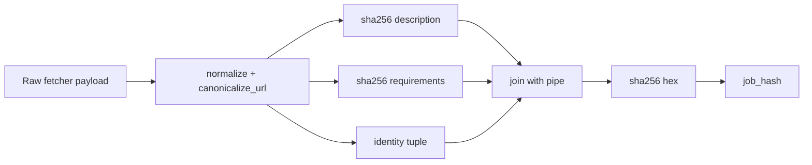
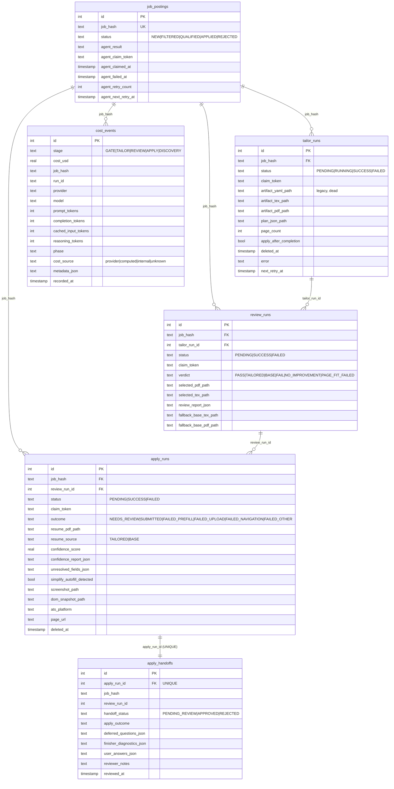
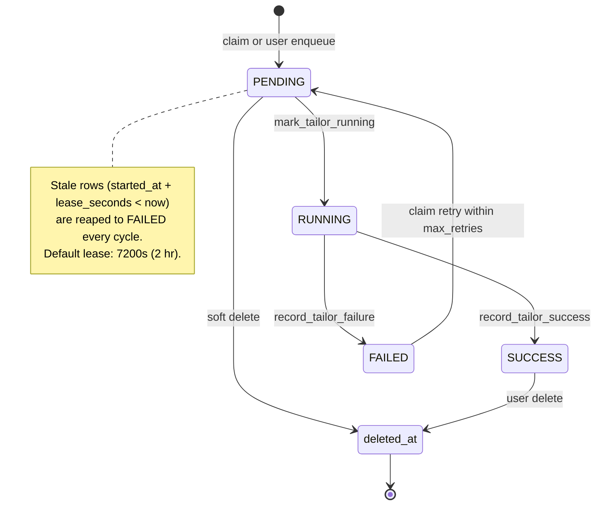
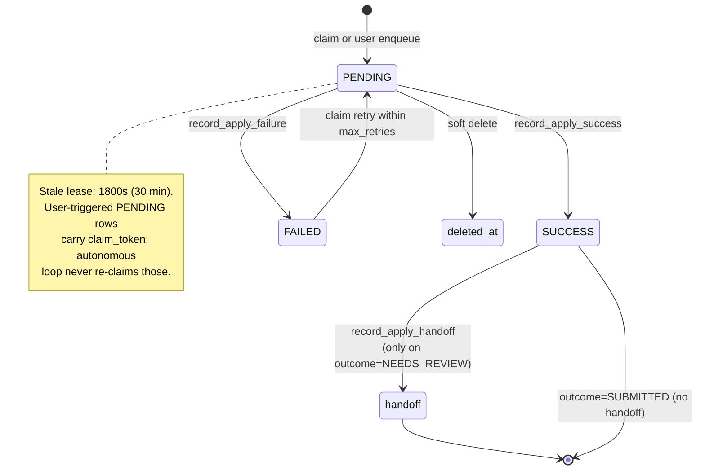
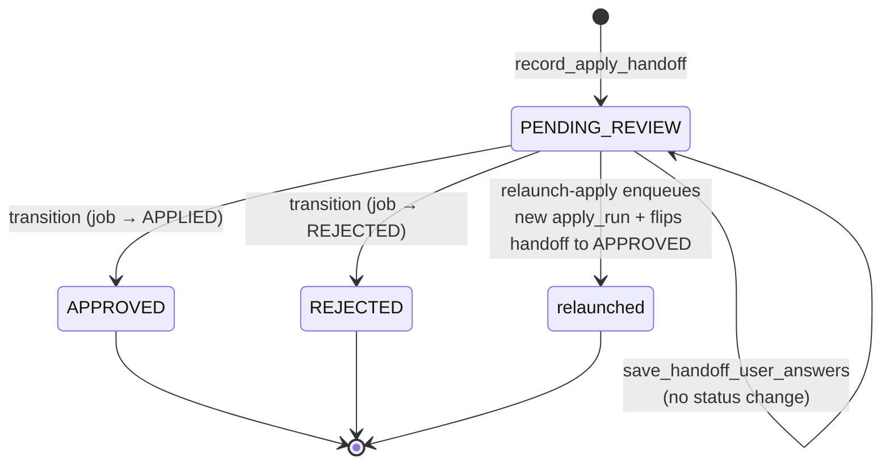

# Data Models

Two layers: persistent domain models (`src/models/`) and ephemeral agent schemas (`src/agents/*/schemas.py`). The boundary is intentional — `JobPosting` is the only Pydantic model that gets serialized to the database, so it stays stable; agent results carry rich diagnostic shape that the agents own and the database flattens into JSON columns.

## `JobPosting` — the canonical normalized posting

`src/models/job_posting.py:48-241`. Every fetcher returns `list[JobPosting]`; every database insert and dedup path treats it as the source of truth.

### Fields

| Field | Type | Default | Notes |
|---|---|---|---|
| `source` | `str` | required | Source identifier set by `fetcher.get_source_name()` (e.g., `greenhouse_anthropic`, `linkedin`) |
| `source_url` | `str` | required | Direct apply link where available; canonicalized in `job_hash` |
| `company` | `str` | required | Company name as provided by the fetcher |
| `company_url` | `str \| None` | None | Company website / job board URL; not all sources provide it |
| `title` | `str` | required | Job title; lowercased in `job_hash` |
| `location` | `str \| None` | None | Free-form location string; feeds `detect_remote()` |
| `is_remote` | `bool \| None` | None | Tri-state: `True` / `False` / `None`. Inferred from location keywords if unset |
| `job_type` | `Literal["Full-time", "Part-time", "Contract", "Internship"] \| None` | None | Normalized by `normalize_job_type` field validator via `map_job_type()` |
| `salary_min` / `salary_max` | `int \| None` | None | Annual salary in **cents** (avoids float drift) |
| `salary_currency` | `str` | `"USD"` | ISO 4217; rarely overridden |
| `salary_source` | `Literal["direct", "parsed", "not_listed"] \| None` | `"not_listed"` | Provenance |
| `description` | `str` | `""` | HTML-stripped body; SHA-256 of normalized form feeds the hash |
| `requirements` | `str` | `""` | Separate from description for sources that split them; SHA-256 in the hash too |
| `posted_date` | `str \| None` | None | ISO 8601 when available |
| `raw_data` | `dict[str, object]` | `{}` | Opaque source payload; JSON-serialized in `to_db_dict()` |

### Validators

- **`normalize_job_type(v, mode="before")`** (`src/models/job_posting.py:183-201`) maps raw employment-type strings (`"full time"`, `"FT"`, `"freelance"`, `"intern"`, …) to the canonical Literal set via `map_job_type()`. Anything else becomes `None`.
- **`detect_remote(self, mode="after")`** (`src/models/job_posting.py:161-181`) fills `is_remote` from location keywords (`remote`, `anywhere`, `work from home`, `wfh`, `distributed`) only when it is `None`. Explicit `True`/`False` is preserved.

### `model_config = ConfigDict(extra="ignore")`

Fetchers pass heterogeneous payloads — unknown keys are silently dropped. The tradeoff is that typos (`sallary_min` instead of `salary_min`) silently drop data; mypy strict mode in the test layer is the backstop.

### `to_db_dict()` — Pydantic → SQLite row

`src/models/job_posting.py:203-236`. Returns a flat dict matching the `job_postings` schema, including `json.dumps(self.raw_data)`. **Always use this for persistence** — calling `model_dump_json()` directly will fail to serialize non-JSON values inside `raw_data`.

## `job_hash` — deterministic canonical key

`src/models/job_posting.py:82-159`. SHA-256 hex digest computed at access time (no caching, no mutation). The hash is the unique key in `job_postings` and the foreign-key by-value across `tailor_runs` / `review_runs` / `apply_runs` / `cost_events`.

```
sha256("|".join([
  source.lower().strip(),
  company.lower().strip(),
  title.lower().strip(),
  _normalize_text(location),
  _normalize_text(posted_date),
  _canonicalize_url(source_url),
  sha256(_normalize_text(description)).hexdigest(),
  sha256(_normalize_text(requirements)).hexdigest(),
]))
```

- **`_normalize_text`** collapses whitespace, lowercases, returns `""` for None.
- **`_canonicalize_url`** lowercases scheme + netloc, strips trailing slash from path, drops any param starting with `utm_` plus `gh_src` / `gh_jid`, sorts remaining params, blanks the fragment.



**Stability contract:** same data ⇒ same hash. Cosmetic changes to whitespace, tracking params, or URL casing do not break dedup. **The hash is not backwards-compatible** — adding or removing an identity field invalidates every existing row's identity, which would make every posting appear new on the next discovery cycle. Treat any change here as a schema migration.

## SQLite schema

The database lives at `data/jobs.db` (`SQLITE_JOURNAL_MODE=WAL` by default). Schema = baseline in `src/database/schema.sql` + per-mixin idempotent ALTERs run at startup via `create_tables()`.

### Entity-relationship overview



There are no hard foreign-key constraints — the application enforces referential integrity, and the absence of cascades makes soft-delete and audit cleanup simpler.

### Table-by-table

#### `job_postings`

Identity column is `job_hash` (UNIQUE). `status` is a free-form text column with values `NEW`, `FILTERED`, `QUALIFIED`, `APPLIED`, `REJECTED`. Gate-processing state lives in side columns rather than expanding the enum: `agent_processed_at`, `agent_result` (serialized `GateRunResult`), `agent_failed_at`, `agent_error`, `agent_retry_count`, `agent_next_retry_at`, `agent_claim_token`, `agent_claimed_at`. Indexes cover `(job_hash)`, `(status)`, `(company)`, `(fetched_at)`, `(source)`, `(agent_processed_at)`, `(agent_failed_at)`, the composite `(status, agent_failed_at, agent_processed_at, agent_next_retry_at)` for the agent claim query, and `(agent_claimed_at)` for stale-claim reaping (`src/database/_mixins/jobs.py:22-432`).

#### `tailor_runs`

One row per tailor attempt (autonomous or user-triggered). Status transitions `PENDING → RUNNING → SUCCESS | FAILED`. Artifact columns: `artifact_yaml_path` is legacy and written as `""` post-Phase-3, `artifact_tex_path` / `artifact_pdf_path` point to the selected variant under `data/tailored_resumes/<job_hash>/`, `plan_json_path` points to the planner-rationale JSON next to the v1 artifacts. `apply_after_completion` is a boolean flag: when true, the tailor background task enqueues an apply run on success. `deleted_at` is soft-delete (frees the per-job slot, preserves audit). Retry is driven by `error` + `next_retry_at` + the loop's `max_retries` ceiling (`src/database/_mixins/tailor.py:32-691`).

#### `review_runs`

One row per reviewer attempt. The status enum is `PENDING | SUCCESS | FAILED`, but verdicts are the meaningful axis: `PASS`, `TAILORED`, `BASE`, `FAIL`, `NO_IMPROVEMENT`, `PAGE_FIT_FAILED`. The `verdict` CHECK constraint is generated by `src/agents/resume_tailor/db_verdict.py:db_verdict_check_sql()`, so adding a verdict requires only updating that helper and bumping the migration. The integrated tailor pipeline writes review rows directly with status=SUCCESS via `insert_pipeline_review_run` (no claim path); the legacy standalone-reviewer path uses `claim_next_review_job` + `record_review_success/failure`. `fallback_base_*` columns let the apply stage use the base resume if the reviewer rejects every tailored variant (`src/database/_mixins/review.py:26-593`).

#### `apply_runs`

One row per apply attempt. `status` (`PENDING | SUCCESS | FAILED`) is separate from `outcome` (`NEEDS_REVIEW | SUBMITTED | FAILED_PREFILL | FAILED_UPLOAD | FAILED_NAVIGATION | FAILED_OTHER`) — the common end state is `status=SUCCESS, outcome=NEEDS_REVIEW` (browser flow finished, form filled, submit gate withheld). `resume_source` is `TAILORED` or `BASE`; on `BASE`, the row was created by `enqueue_apply_run_with_base_resume` which also synthesizes a tailor and review row tagged `status=SUCCESS, verdict=BASE` so the apply worker's existing code paths run unchanged. Browser diagnostics: `screenshot_path`, `dom_snapshot_path`, `confidence_report_json` (a serialized `ConfidenceReport`), `unresolved_fields_json` (a list of `UnresolvedField`), `simplify_autofill_detected`. `ats_platform` records the detected platform for analytics. `deleted_at` is soft-delete (`src/database/_mixins/apply.py:45-1148`).

#### `apply_handoffs`

One row per `outcome=NEEDS_REVIEW` apply run. `apply_run_id` is UNIQUE — `record_apply_handoff` upserts on conflict so finisher retries are idempotent. `handoff_status` transitions `PENDING_REVIEW → APPROVED | REJECTED` and the transition (`transition_handoff_status`) atomically flips `job_postings.status` to APPLIED or REJECTED in the same `BEGIN IMMEDIATE` block. `deferred_questions_json` carries Tier-3 questions the finisher refused to answer; `finisher_diagnostics_json` carries `FinisherDiagnostics` (outcome label, turns, cost, drafted fields, gate decision); `user_answers_json` carries answers the reviewer typed into the dashboard textareas. The relaunch-apply endpoint reads `user_answers_json` and enqueues a fresh apply run.

#### `cost_events`

Forward-only telemetry. Every LLM call writes one row through `src/utils/cost_tracking.py:record_llm_call_cost`, which pulls `cost_usd` from the provider's `CostBreakdown` and persists per-component token counts (billable prompt, completion, cached, reasoning) alongside `provider`, `model`, `phase`, and `cost_source`. The cost-source enum (`provider`, `computed`, `internal`, `unknown`) is enforced by a SQLite CHECK; typos surface as `IntegrityError`. Apply browser ops emit a zero-cost row with `cost_source="internal"` so per-stage event counts on the dashboard match reality. Budget checks roll up via `strftime('%Y-%m', recorded_at)` — there is no pre-aggregated daily/monthly table (`src/database/_mixins/costs.py:36-387`).

#### `system_settings`, `budget_settings`, `app_settings`

Key/value stores. `system_settings` holds `automation.gate_mode`, `automation.tailor_mode`, `automation.apply_mode` (each `autonomous` / `opt_in` / `both`). `budget_settings` row 1 carries `monthly_budget_usd`. `app_settings` is a generic bag (currently `service_tier`). The supervisor reads automation modes every cycle; `seed_automation_defaults_from_env` only writes on first boot to avoid clobbering user choices on restart (`src/database/_mixins/system_settings.py:62-261`).

#### `crawl_history`, `daily_stats`

Discovery telemetry. `crawl_history` records per-fetch `(source, company, started_at, completed_at, status, jobs_found, jobs_new, error_message)`. `daily_stats` is upserted with `ON CONFLICT DO UPDATE` so multiple discovery cycles on the same day accumulate.

## State machines

### Job-posting lifecycle

```mermaid
stateDiagram-v2
  [*] --> NEW: fetcher insert
  NEW --> QUALIFIED: gate APPLY decision
  NEW --> FILTERED: gate SKIP or soft-filter REJECT_FILTERED
  NEW --> NEW: gate transient failure<br/>(agent_next_retry_at set)
  QUALIFIED --> APPLIED: apply_handoffs.transition → APPROVED<br/>or autonomous SUBMITTED
  QUALIFIED --> REJECTED: apply_handoffs.transition → REJECTED
  APPLIED --> [*]
  REJECTED --> [*]
  FILTERED --> [*]
  NEW --> NEW: agent_failed_at set<br/>(terminal; operator must reset)
```



The status enum does not include intermediate states like `PROCESSING`. Mid-flight work is tracked in the per-run tables (`tailor_runs`, `review_runs`, `apply_runs`) and the operator-visible representation comes from joins, not state.

### Tailor run



### Apply run



### Apply handoff



## Claim-and-lease invariants

Every claim mutation runs inside `BEGIN IMMEDIATE` and writes a random claim token:

| Stage | Token width | Default lease | Env override |
|---|---|---|---|
| Agent (gate) | 12 bytes hex | 900s | `AGENT_CLAIM_LEASE_SECONDS` |
| Tailor | 32 bytes hex | 7200s | `TAILOR_CLAIM_LEASE_SECONDS` |
| Review (standalone) | 32 bytes hex | 7200s | `REVIEW_CLAIM_LEASE_SECONDS` |
| Apply | 32 bytes hex | 1800s | `APPLY_CLAIM_LEASE_SECONDS` |

On completion the worker must present the same token. Mismatches raise `ClaimOwnershipError`, which the caller catches, logs, and treats as "skip — another worker handled it" rather than crashing. Stale-claim reapers run every cycle (`mark_stale_*_runs_failed(lease_seconds)`) and flip PENDING rows older than the lease to FAILED so crashed workers eventually release their slots.

## Agent schemas (`src/agents/*/schemas.py`)

These don't get persisted as rows — they're consumed by the agents at runtime and either flattened into JSON columns (`apply_runs.confidence_report_json`, `apply_handoffs.finisher_diagnostics_json`, `tailor_runs.plan_json_path`) or discarded after use.

### Gate (`src/agents/root_apply_decider/schemas.py`)

```python
class ApplyDecision(str, Enum):
    APPLY = "APPLY"
    SKIP = "SKIP"

class GateDebugInfo(BaseModel):
    confidence: float | None
    explanation: str | None
    preference_matches: list[str]
    preference_conflicts: list[str]

class GateRunResult(BaseModel):
    decision: ApplyDecision
    debug: GateDebugInfo
    raw_response: str
    provider: str
    model: str
    parse_mode: str
```

`record_agent_decision` serializes the full `GateRunResult` into `job_postings.agent_result`.

### Tailor + reviewer (`src/agents/resume_tailor/pipeline_schemas.py`)

```python
class BulletPatchProposal(BaseModel):
    id: str         # matches a manifest bullet id
    rationale: str  # reasoning-first by design (LMSF-safe)
    action: Literal["keep", "rewrite"]
    new_text: str   # empty when action="keep"

class SkippedBulletNote(BaseModel):
    id: str
    reason: str

class TailorOutput(BaseModel):
    rewrite_plan: str
    bullets: list[BulletPatchProposal]
    skipped_bullets: list[SkippedBulletNote]

class ReviewerScores(BaseModel):
    keyword_fit: int     # 0-5
    specificity: int     # 0-5
    factuality: int      # 0-5; veto axis

class ReviewerVerdict(str, Enum):
    TAILORED_BETTER = "tailored_better"
    BASE_BETTER = "base_better"
    NO_MEANINGFUL_IMPROVEMENT = "no_meaningful_improvement"

class ReviewerOutput(BaseModel):
    rationale: str
    scores_base: ReviewerScores
    scores_tailored: ReviewerScores
    verdict: ReviewerVerdict
    feedback_for_retry: str | None  # required when verdict=base_better

class TailorRunResult(BaseModel):
    success: bool
    job_hash: str
    tailor_run_id: int
    review_run_id: int | None
    verdict: str | None
    selected_pdf_path: str | None
    selected_tex_path: str | None
    page_count: int | None
    scores_base: ReviewerScores | None
    scores_tailored: ReviewerScores | None
    error: str | None
```

`ReviewerVerdict` (LLM-emitted, lowercase) is mapped via `db_verdict.py` to the database verdict (uppercase). The planner artifact (`tailor_runs.plan_json_path` → JSON file) bundles `TailorOutput` plus model name and timestamp so the dashboard can show "why these edits" without re-running the model.

### Bullet manifest (`src/agents/resume_tailor/locator.py`)

Not persisted; rebuilt deterministically each pipeline run.

```python
class BulletManifest:
    sections: list[BulletSection]

class BulletSection:
    id: str              # "experience" / "experience_2" / "projects" / ...
    kind: str            # "experience" | "projects"
    heading: str         # original \section{...} text
    entries: list[BulletEntry]

class BulletEntry:
    id: str              # "experience.checkout_platform_team"
    role_context: str    # literal entry-header line
    header_byte_start: int
    bullets: list[BulletItem]

class BulletItem:
    id: str              # "experience.checkout_platform_team.b1"
    text: str            # original body text
    byte_start: int      # inclusive
    byte_end: int        # exclusive — body only, not wrapping macro
```

Byte offsets are body-only so the patcher can splice without parsing LaTeX.

### Apply worker (`src/agents/apply_worker/schemas.py`)

```python
class ApplyOutcome(str, Enum):
    NEEDS_REVIEW = "NEEDS_REVIEW"
    SUBMITTED = "SUBMITTED"
    FAILED_PREFILL = "FAILED_PREFILL"
    FAILED_UPLOAD = "FAILED_UPLOAD"
    FAILED_NAVIGATION = "FAILED_NAVIGATION"
    FAILED_OTHER = "FAILED_OTHER"

class ATSPlatform(str, Enum):
    GREENHOUSE = "greenhouse"
    LEVER = "lever"
    WORKDAY = "workday"
    ICIMS = "icims"
    ASHBY = "ashby"
    SMARTRECRUITERS = "smartrecruiters"
    UNKNOWN = "unknown"

class UnresolvedField(BaseModel):
    field_id: str | None
    label: str | None
    field_type: str
    is_required: bool
    current_value: str
    validation_error: str | None
    options: list[str] | None
    selector: str
    parent_form_selector: str | None
    placeholder: str | None

class ConfidenceCheck(BaseModel):
    name: str
    passed: bool
    weight: float
    detail: str | None

class ConfidenceReport(BaseModel):
    score: float        # [0.0, 1.0]
    checks: list[ConfidenceCheck]
    has_hard_blockers: bool
    resume_uploaded: bool
    simplify_autofill_detected: bool
    unresolved_required_count: int
    unresolved_optional_count: int
    ats_platform: ATSPlatform

class FinisherDiagnostics(BaseModel):
    finisher_outcome: str   # COMPLETE | AGENT_GAVE_UP | USAGE_LIMIT_HIT | RUNTIME_ERROR | SKIPPED
    turns_used: int
    cost_usd: float
    fields_filled: int
    fields_deferred: int
    all_required_filled: bool
    has_tier2_pending: bool
    has_tier3_deferred: bool
    simplify_no_op: bool
    drafted_fields: list[dict]
    submit_errors: list[str]
    gate_decision: str      # auto_submit | dry_run | safe_mode | finisher_incomplete | tier3_deferred | tier2_pending | skipped

class ApplyRunResult(BaseModel):
    success: bool
    outcome: ApplyOutcome | None
    failure_reason: str | None
    resume_pdf_path: str | None
    resume_source: str | None  # "TAILORED" | "BASE"
    confidence_score: float | None
    confidence_report: ConfidenceReport | None
    screenshot_path: str | None
    dom_snapshot_path: str | None
    unresolved_fields: list[UnresolvedField]
    ats_platform: ATSPlatform | None
    page_url: str | None
    finisher_diagnostics: FinisherDiagnostics | None
    deferred_questions: list[dict]
```

### Apply finisher (`src/agents/apply_finisher/schemas.py`)

```python
SupportedAts = Literal["greenhouse", "ashby"]

class DeferredQuestion(BaseModel):
    field_id: str       # agent-browser ref, normalized to "eN"
    label: str
    field_type: str
    category: str       # sponsorship | salary | other
    reason: str

class DraftedField(BaseModel):
    field_id: str
    label: str
    drafted_value: str
    confidence: float   # [0.0, 1.0]
    reasoning: str

class FinisherResult(BaseModel):
    turns_used: int
    cost_usd: float
    fields_filled: int
    fields_deferred: int
    deferred_questions: list[DeferredQuestion]
    drafted_fields_flagged_for_verify: list[DraftedField]
    outcome: Literal["COMPLETE", "AGENT_GAVE_UP", "USAGE_LIMIT_HIT", "RUNTIME_ERROR"]
    all_required_filled: bool
    has_tier3_deferred: bool
    has_tier2_pending: bool
    simplify_no_op: bool

@dataclass
class FinisherDeps:
    ats: SupportedAts
    target_company: str
    defer_rules: DeferRules
    cache: AnswerCache
    profile_yaml: str
    recorded_deferrals: list[DeferredQuestion]
    drafted_fields: list[DraftedField]
    fields_filled_count: int
```

`FinisherDeps` is passed to every tool via Pydantic-AI's `RunContext.deps`. The tools mutate `recorded_deferrals` / `drafted_fields` / `fields_filled_count` as side effects; the runner reads those at the end of the loop to build `FinisherResult`.

## Migrations & schema evolution

There's no Alembic. Every mixin owns its own migration method (`migrate_tailor_schema`, `migrate_review_schema`, `migrate_apply_schema`, `migrate_cost_schema`, `migrate_system_settings_schema`, `migrate_agent_schema`) that uses `PRAGMA table_info` to inspect existing columns and ALTER TABLE for missing ones. CHECK-constraint widening (e.g., adding a verdict) uses the standard SQLite table-rebuild pattern: rename the old table, create the new one with the wider CHECK, copy rows, drop the old.

Stale-row recovery is part of every cycle: `mark_stale_*_runs_failed(lease_seconds)` converts orphaned PENDING claims to FAILED so crash recovery is automatic on restart.

## Soft-delete & retention

Soft-delete columns: `tailor_runs.deleted_at`, `apply_runs.deleted_at`. Soft-deleted rows are excluded from every claim query, the per-job single-slot check, and every listing endpoint, but rows are kept indefinitely for audit. There is no hard-delete code path in the codebase. Operators who want to purge can do so via direct SQL.

Cost events and crawl history are append-only; no automatic archiving. Budget queries scan the current-month slice, so cost row growth doesn't degrade those queries quickly.

## Known data-layer risks

1. **Legacy `*_yaml_path` columns** on `tailor_runs` and `review_runs` are still written but unused post-Phase-3. Harmless; deferred cleanup.
2. **No FK constraints.** Application code enforces referential integrity; orphaned rows are theoretically possible if a future delete path skips a parent. Today's code only soft-deletes, so this hasn't materialized.
3. **Cost CHECK on `cost_source`** rejects unknown values at the SQL layer with `IntegrityError`. Adding a new provider requires bumping the enum + a migration before the first `record_cost_event` call.
4. **Hash backwards-compat.** Any change to identity fields or normalization in `JobPosting.job_hash` makes every existing posting look new. Document the algorithm as part of any schema migration.
5. **System settings has no schema validation** — generic key/value. Typos in keys (`automation.tailr_mode`) are silently ignored; the typed getters (`get_automation_mode`) fall back to defaults. Mitigation: only mutate through the typed setters.
