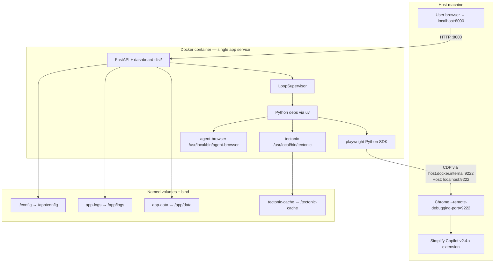

# Dependencies

Three layers: Python (`pyproject.toml`), Node (`dashboard/package.json`), and host binaries (tectonic, agent-browser, host Chrome). Two deployment paths: Docker (recommended, single service) and Linux systemd (homeserver). All Python dependencies pin with `==` only.

## Python runtime dependencies (`pyproject.toml`)

| Package | Why | Where |
|---|---|---|
| `fastapi==0.123.10` | HTTP API + dashboard server | `api/main.py:62` |
| `uvicorn==0.40.0` | ASGI server | `Dockerfile:104`, `docker-compose.yml:26` |
| `aiosqlite==0.22.1` | Async SQLite driver | `src/database/db_manager.py:25` |
| `aiohttp==3.13.3` | Async HTTP client used by fetchers | `src/fetchers/*` |
| `httpx==0.28.1` | Sync/async HTTP client (CDP probe, Adzuna validation) | `src/agents/apply_worker/browser.py`, `api/routers/settings_api_keys.py` |
| `curl-cffi==0.15.0` | TLS-fingerprint-bypassing HTTP client for LinkedIn fetcher | `src/fetchers/linkedin_fetcher.py` |
| `openai==2.38.0` | OpenAI SDK — used by `OpenAIProvider` and directly by tailor/reviewer | `src/providers/openai_provider.py`, `src/agents/resume_tailor/llm.py:152-184` |
| `anthropic==0.96.0` | Declared dependency; not used at runtime today | (reserved for future provider work) |
| `google-genai==1.60.0` | Declared dependency; not used at runtime today | (reserved) |
| `google-adk==1.23.0` | Google Agent Dev Kit; declared for legacy compatibility | (reserved) |
| `instructor==1.15.1` | Structured-output wrapper around OpenAI for tailor + reviewer | `src/agents/resume_tailor/llm.py` |
| `pydantic-ai-slim[openai]==1.102.0` | Apply finisher's agent framework | `src/agents/apply_finisher/agent.py:76-119` |
| `pydantic==2.12.5` | Models + validators throughout | everywhere |
| `litellm==1.82.1` | Cost-per-token tables for every supported provider | `src/providers/openai_provider.py:182-250`, `src/utils/llm_pricing.py:43-68` |
| `genai-prices==0.0.61` | Additional pricing fallback for newer models | (used by litellm fallback) |
| `playwright==1.60.0` | Browser automation over CDP for apply worker | `src/agents/apply_worker/browser.py:385-410` |
| `apscheduler==3.11.2` | Reserved scheduler library | (not in active use) |
| `authlib==1.6.9` | Reserved auth library | (not in active use; single-user local) |
| `cryptography==46.0.6` | Declared but currently unused — no key encryption at rest | — |
| `loguru==0.7.3` | Logger | `src/utils/logger.py` |
| `markdownify==1.2.2` | HTML → markdown for job description normalization | `src/fetchers/*` |
| `protobuf==6.33.5` | Transitive (google-adk / pi-mono) | — |
| `python-jobspy==1.1.82` | Indeed/LinkedIn/Glassdoor aggregator client | `src/fetchers/jobspy_fetcher.py` |
| `python-dotenv==1.2.1` | `.env` loader | `main.py:105`, `src/utils/paths.py:32-54` |
| `python-multipart==0.0.22` | FastAPI multipart parsing (resume upload) | `api/routers/settings_resume.py` |
| `pyyaml==6.0.3` | YAML reads/writes throughout | `src/orchestrator/config_loader.py`, `api/services/yaml_files.py` |
| `rapidfuzz==3.13.0` | Fuzzy matching for answer-cache lookup and fuzzy_dedup | `src/agents/apply_finisher/answer_cache.py:195-237`, `src/fetchers/fuzzy_dedup.py` |
| `pypdf==4.3.1` | PDF text extraction (used by resume parsing helpers) | — |
| `texsoup==0.3.3` | LaTeX parsing — reserved for future locator/contract extensions | — |

The `markdownify` override in `[tool.uv]` pins `>=0.14.1` because `python-jobspy` pins `<0.14`; the override keeps the lockfile current while upstream catches up.

### Dev dependencies (`[dependency-groups.dev]`)

| Package | Why |
|---|---|
| `pytest==9.0.2` | Backend test runner |
| `pytest-asyncio==1.3.0` | Async test support |
| `hypothesis==6.135.4` | Property-based tests (`tests/test_*_property.py`, `tests/test_*_properties.py`) |
| `mutmut==2.5.1` | Mutation testing, scoped to `src/fetchers/linkedin_fetcher.py` (`[tool.mutmut]`) |
| `mypy==1.19.1` | Type checking; `strict=true` across `api/`, `src/`, `scripts/`, `tests/` |
| `pip-audit==2.10.0` | Dependency-vulnerability scanner |
| `types-pyyaml==6.0.12.20250915` | Type stubs for PyYAML |

## Node runtime dependencies (`dashboard/package.json`)

| Package | Why |
|---|---|
| `react==^19.2.4`, `react-dom==^19.2.4` | UI framework |
| `react-router-dom==^7.13.2` | SPA routing |
| `@tanstack/react-query==^5.90.6` | API caching, polling, mutations — only state library in the app |
| `@base-ui-components/react==^1.3.0` | Headless components with heavy custom styling |
| `tailwindcss==^4.2.2`, `@tailwindcss/vite==^4.2.2` | Styling |
| `recharts==^3.8.1` | Charts on Dashboard + CostTracking |
| `@monaco-editor/react==^4.7.0` + workers | YAML editor in Settings |
| `lucide-react==^1.7.0` | Icons |
| `@fontsource-variable/plus-jakarta-sans==^5.x` | Font |

### Dev / build

| Package | Why |
|---|---|
| `vite==^8.0.1` + `@vitejs/plugin-react==^x` | Bundler + dev server |
| `typescript==~5.9.3` | Type checker (`tsc --noEmit` in CI) |
| `vitest==^4.1.2` + `@vitest/coverage-v8==^4.1.2` | Test runner |
| `@testing-library/react==^16.3.2`, `@testing-library/user-event==^x` | Component testing |
| `eslint==^x`, `@typescript-eslint/*`, `prettier==^x` | Lint + format |

## Host binaries

### tectonic

Statically-linked TeX engine. Multi-arch musl tarballs vendored under `deploy/tectonic/`:
- `tectonic-amd64.tar.gz` (x86_64-unknown-linux-musl)
- `tectonic-arm64.tar.gz` (aarch64-unknown-linux-musl)

`Dockerfile:51-59` COPYs the tarball matching `${TARGETARCH}` (set by BuildKit during multi-platform builds) and extracts it to `/usr/local/bin/tectonic`. The build verifies with `tectonic --version`.

`deploy/tectonic/fetch.sh` (`fetch.sh:1-36`) downloads both arches from upstream GitHub releases in one shot. Operators bump tectonic with `TECTONIC_VERSION=0.16.0 deploy/tectonic/fetch.sh` then commit the new tarballs. The rationale for vendoring rather than `apt`-installing: tectonic doesn't publish a container image, and BuildKit DNS to `deb.debian.org` has been flaky on Docker Desktop for Mac during multi-platform builds.

CTAN package cache lives at `XDG_CACHE_HOME=/tectonic-cache`, mapped to the `tectonic-cache` Docker named volume so it survives container restarts. Build-time prewarm compiles `deploy/tectonic-prewarm.tex` (which imports geometry/titlesec/enumitem/fancyhdr/babel/newtxtext/newtxmath/hyperref/color/xcolor/tabularx/fullpage) so the first user tailor doesn't pay a 30-60s CTAN fetch (`Dockerfile:61-72`).

Default per-compile timeout is 240s via `TECTONIC_TIMEOUT_SECONDS`. The compiler wrapper supports a `latexmk` fallback if `RESUME_COMPILER=latexmk` is set (`src/agents/resume_tailor/compiler.py:45-88`).

### agent-browser

Rust CDP CLI vendored under `deploy/agent-browser/`:
- `agent-browser-amd64` (Linux x86_64)
- `agent-browser-arm64` (Linux ARM64)

`Dockerfile:78-84` COPYs the matching binary and verifies with `--version`. python:3.11-slim-bookworm provides glibc 2.36, which satisfies the binary's dynamic library requirements (libc, libm, libpthread, libdl).

Vendored prebuilt (rather than building from source in the image) because the Rust toolchain (~80MB) and Chrome download (~300MB) would inflate the image substantially. The CLI can spawn Chrome with `--remote-debugging-port` (used by the systemd `job-apply-chrome.service`) or attach to a running instance (used by the apply finisher inside Docker).

### Host Chrome

The apply worker connects Playwright over CDP to **the user's host Chrome**, not in-container Chromium. Users start Chrome with:

```bash
# macOS
open -a "Google Chrome" --args --remote-debugging-port=9222
# Linux
google-chrome --remote-debugging-port=9222 &
# Windows
"C:\Program Files\Google\Chrome\Application\chrome.exe" --remote-debugging-port=9222
```

The dashboard's top-bar Chrome chip detects OS via `navigator.platform` and shows the OS-specific command in a copy-paste popover.

Why no in-container Chromium:
1. ~400MB image bloat plus an Xvfb/dbus/fontconfig stack
2. Job boards throttle non-residential IPs; using the user's real Chrome avoids vpnkit NAT showing as `172.66.0.243` on Docker Desktop
3. Simplify Copilot lives in the user's host Chrome — running headless in-container would lose that

Chrome 148+ host-check workaround: connections to `host.docker.internal:9222` get rejected if the HTTP `Host` header doesn't match `localhost` or an IP literal. The apply worker forces `Host: localhost:<port>` on both the `/json/version` probe (httpx) and the Playwright WebSocket handshake (`src/agents/apply_worker/browser.py:158-199`).

### Simplify Copilot (browser extension)

The apply worker assumes the user has Simplify v2.4.x installed in their host Chrome. Detection polls for `<div class="simplify-jobs-shadow-root">` with one of the labeled buttons (`Autofill`, `Autofill all fields with AI`, `Fill`, `Continue filling`). Hardcoded against v2.4.x DOM structure — future major versions could change aria-labels or shadow-root layout.

### Topology



## Docker path

`Dockerfile` is a two-stage multi-arch build.

**Stage 1 — `dashboard-build`** (`Dockerfile:2-9`): `node:22-slim`, `npm install`, `npm run build` produces `/app/dashboard/dist`. Separate stage so dashboard rebuilds don't invalidate the Python dep layer.

**Stage 2 — `app`** (`Dockerfile:27-104`):
- Base: `python:3.11-slim-bookworm` (glibc 2.36)
- APT: `curl`, `poppler-utils` (for future resume-parsing helpers); aggressive list cleanup
- `uv 0.9.18` copied from the upstream image
- `uv sync --frozen --no-dev` — fails build if `uv.lock` is stale
- Tectonic tarball + extract + `--version` check
- `XDG_CACHE_HOME=/tectonic-cache` + prewarm compile of `deploy/tectonic-prewarm.tex`
- `TECTONIC_TIMEOUT_SECONDS=240`
- agent-browser binary + `--version` check
- `COPY src/`, `api/`, `scripts/`, `main.py`, `deploy/`
- `COPY --from=dashboard-build /app/dashboard/dist ./dashboard/dist`
- `ENV CODEX_HOME=/app/data/codex` (reserved)
- `VOLUME ["/app/data", "/app/logs", "/app/config"]`, `EXPOSE 8000`
- `CMD ["uv", "run", "--no-dev", "uvicorn", "api.main:app", "--host", "0.0.0.0", "--port", "8000"]`

`docker-compose.yml` (`docker-compose.yml:22-57`):
- One service `app`
- Port `${API_PORT:-8000}:8000`
- `env_file: .env`
- `CHROME_CDP_URL: ${CHROME_CDP_URL:-http://host.docker.internal:9222}`
- `extra_hosts: "host.docker.internal:host-gateway"` so Linux Docker resolves the same hostname Mac/Windows Docker Desktop resolves natively
- Volumes: `./config:/app/config` (bind), `app-data:/app/data`, `app-logs:/app/logs`, `tectonic-cache:/tectonic-cache`
- `restart: unless-stopped`
- Healthcheck: `curl -f http://localhost:8000/api/health`, 5s interval, 3s timeout, 6 retries, 60s start period

Operator wrappers in `scripts/docker/`:
- `start_stack.sh` — `set -euo pipefail; docker compose up -d`
- `stop_stack.sh` — `docker compose down` (preserves volumes)
- `restart_stack.sh` — `down` then `up -d`

Tests in `tests/test_docker_stack_scripts.py` assert these scripts use `set -euo pipefail`, don't accidentally pass `-v` to `down` (which would wipe volumes), and call commands in the correct order.

### Image-baked dashboard

The dashboard `dist/` is COPYed into the image at build time. Code changes need a Docker rebuild — running container won't pick them up. Quick workaround for dev iteration:

```bash
npm --prefix dashboard run build
docker cp dashboard/dist/. agentic-job-applier-app-1:/app/dashboard/dist/
# refresh browser
```

The persistent fix is to rebuild the image. For local dev with HMR, run `npm --prefix dashboard run dev` on the host (Vite dev server) and proxy `/api/*` to `localhost:8000`.

## Linux systemd path

Six unit files under `deploy/`, designed for long-running homeserver deployments where Docker isn't available or isn't wanted.

| Unit | Type | Purpose |
|---|---|---|
| `job-discovery.timer` | timer | Every 30 minutes via `OnCalendar=*:0/30`, `Persistent=true`, `RandomizedDelaySec=300` |
| `job-discovery.service` | oneshot | Runs `python main.py` once per timer fire |
| `job-agent-worker.service` | simple | `python -m scripts.process_new_jobs --loop`; gate worker |
| `job-tailor-worker.service` | simple | `python -m scripts.process_qualified_jobs --loop`; tailor + review |
| `job-apply-worker.service` | simple | `python -m scripts.process_apply_jobs --loop`; requires `job-apply-chrome.service` |
| `job-apply-chrome.service` | simple | Runs Chrome with `--remote-debugging-port=9222`; `Requires=` keeps it running for the apply worker |
| `job-agent-alert@.service` | oneshot | Templated alert sender; triggered by other units' `OnFailure=job-agent-alert@%n.service`; posts to ntfy if `NTFY_TOPIC` is set |

All worker units share hardening defaults: `NoNewPrivileges=true`, `PrivateTmp=true`, `ProtectSystem=strict`, `ProtectHome=true`, explicit `ReadWritePaths` for the project's `data/` and `logs/` directories. Apply units add `MemoryMax=4G`, `CPUQuota=200%`, `TasksMax=64` (or 128 for Chrome) to prevent runaway resource use.

All units log to journald (`StandardOutput=journal`); `journalctl -u <unit>.service -f` tails each. Production deployments should set `Storage=persistent` in `/etc/systemd/journald.conf`.

Operators copy `.service` and `.timer` files to `/etc/systemd/system/` after substituting `YOUR_USERNAME` and `/path/to/agentic-job-applier`, then `systemctl daemon-reload` + `systemctl enable --now <unit>`. The deploy README has the step-by-step checklist.

## Dependency risk surface

- **Greenhouse / Ashby form variability.** Apply finisher prompts are tuned against specific real forms; different companies on the same ATS may have radically different custom-question sets. Mitigation: log ATS + custom-question signatures so failures correlate.
- **Chrome major-version drift.** The CDP host-check fix targets Chrome 148+; future versions could change again. Document the tested Chrome major in the apply worker's startup banner.
- **Simplify Copilot drift.** v2.4.x shadow-root structure is hardcoded. v2.5+ could change selectors. Mitigation: pin Simplify version expectations in the user-facing docs; add detection to fail loudly if the shadow-root layout changes.
- **agent-browser version drift.** The React-Select PointerEvent fix interacts with a known aria-labelledby resolution behavior in a specific agent-browser version. Pin the vendored binary version and add a CI smoke test that opens a Greenhouse combobox.
- **LinkedIn rate limiting.** The fetcher uses curl-cffi for TLS fingerprinting plus 8-20s random delays and exponential backoff on 429s, but LinkedIn is the most fragile source. Mutmut testing is scoped to this fetcher precisely because parsing logic drift would damage discovery quality silently.
- **Tectonic CTAN cache staleness.** Network timeouts during package fetch could leave the cache half-populated; subsequent compiles would silently fall back to fetching every time. Mitigation: build-time prewarm + a long timeout (240s).
- **LiteLLM pricing-table staleness.** `litellm.cost_per_token` uses a bundled table. New models or price changes need a litellm upgrade or a `src/utils/llm_pricing.py:register_custom_prices` entry. Unknown models return `source="unknown"` and zero cost — visible on the dashboard but not fatal.
- **API keys are plaintext in `.env`.** `cryptography` is a declared dep but unused for storage. Single-user local deployments accept this; production should layer a secrets manager.
