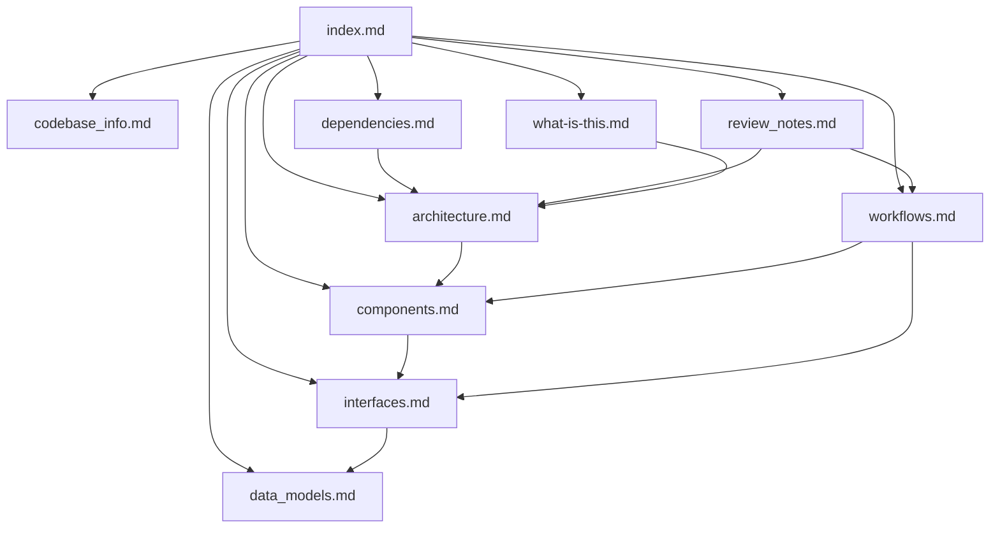

# Agentic Job Applier — Spec Index

Start here. This file is the entry point for AI agents (and humans) reading the spec; it explains what every other doc covers and where to look first for any given question.

## What this project is

Agentic Job Applier is a self-hosted application that runs the entire "find a job, decide if it's worth applying, write a tailored resume, and submit the application" loop on the user's own machine. It crawls 14+ ATSes and aggregators on a 30-minute interval, uses an LLM to qualify or reject each posting against the user's profile, generates a job-specific LaTeX resume via a deterministic tailor+review pipeline, and drives the user's host Chrome over CDP to fill the application form. A binary gate decides whether to auto-submit or hand off to human review. Everything runs in one FastAPI process; the React dashboard ships baked into the same Docker image (`README.md:1-72`, `AGENTS.md:3-12`, `api/main.py:62`, `docker-compose.yml:22-46`).

## How to use this spec

1. Read this index.
2. Pick one or two focused docs from the routing table below.
3. Cite evidence with `path:line` form (every claim in this spec is anchored to code or config).
4. Cross-check `review_notes.md` before promising anything about the apply-finisher, base-resume compile path, or multi-provider support — those are the active edges.

## Routing table

| If you need to answer… | Open first | Then open |
|---|---|---|
| What this is and how the repo is laid out | `codebase_info.md` | `architecture.md`, `components.md` |
| End-to-end pipeline (discovery → gate → tailor → review → apply) | `architecture.md` | `workflows.md`, `components.md` |
| What a specific module does and which other modules touch it | `components.md` | `architecture.md` |
| SQLite schema, claim/lease semantics, state machines, Pydantic models | `data_models.md` | `components.md` |
| HTTP API contract, CLI scripts, YAML schemas, env vars, artifact paths | `interfaces.md` | `components.md`, `data_models.md` |
| How a stage actually runs at runtime (sequence + decisions) | `workflows.md` | `architecture.md`, `interfaces.md` |
| pip/npm dependencies, host binaries, Docker vs systemd | `dependencies.md` | `architecture.md` |
| Known risks, in-flight uncommitted work, open issues, follow-ups | `review_notes.md` | the source files it cites |
| Why the project exists, design choices, what's intentionally out of scope | `what-is-this.md` | `review_notes.md` |

## Document catalog

- **`codebase_info.md`** — Languages, runtimes, repo layout, subsystem map, state/artifact topology.
- **`architecture.md`** — Five runtime planes (discovery, agents, persistence, HTTP, browser), lifespan boot order, supervisor topology, sequence + flowchart diagrams.
- **`components.md`** — Module-by-module breakdown: fetchers, agents (gate, tailor, review, apply worker, apply finisher), database mixins, API routers, dashboard pages, supervisor, utils.
- **`data_models.md`** — `JobPosting` and every Pydantic schema, all SQLite tables with key columns + indexes, state machines for `tailor_runs` / `review_runs` / `apply_runs` / `apply_handoffs`, the `job_hash` algorithm.
- **`interfaces.md`** — Full HTTP endpoint table (~60 routes across 16 routers), CLI worker scripts, YAML config schemas (`candidate_profile.yaml`, `filters.yaml`, `companies.yaml`, `defer_rules.yaml`, `data/answer_cache.yaml`), `.env` contract, artifact directory layouts.
- **`workflows.md`** — Discovery cycle, gate decision, tailor+review pipeline (base/v1/v2 + optional 3-way reviewer), apply lifecycle (CDP probe + Simplify + finisher + submit gate), human-review flow, onboarding wizard.
- **`dependencies.md`** — pip + npm runtime/dev deps, host binaries (tectonic, agent-browser, host Chrome), Docker vs systemd, multi-arch shipping for vendored binaries.
- **`review_notes.md`** — Known risks ranked by impact × probability, in-flight uncommitted work, recent commit trajectory, prioritized follow-ups.
- **`what-is-this.md`** — Manifesto: why this exists, what's intentionally not in scope, design choices worth knowing about.

## Relationship map

## Runtime facts worth remembering

- **One process owns everything.** FastAPI's lifespan boots an in-process `LoopSupervisor` that runs discovery + (mode-gated) gate + tailor + apply loops as asyncio tasks. No separate worker containers (`api/main.py:62`, `api/services/supervisor.py:276-299`, `docker-compose.yml:22-46`).
- **Discovery never gates on the autonomous toggle** because it makes no LLM calls. Gate, tailor, and apply read `system_settings.automation.<stage>_mode` (`autonomous|opt_in|both`) on every poll cycle; the dashboard toggle wakes the mode-watcher within ~1.5s via `notify_mode_changed()` (`api/services/supervisor.py:461-488`, `main.py:58-86`).
- **Apply runs against the user's host Chrome over CDP**, never in-container Chromium. The container forces `Host: localhost:<port>` on both the `/json/version` probe and the Playwright handshake to defeat Chrome 148+'s host check on `host.docker.internal:9222` (`src/agents/apply_worker/browser.py:158-199`, `docker-compose.yml:35-40`).
- **The submit gate is binary:** `all_required_filled AND no_tier3_deferred AND (no_tier2_pending OR all_tier2_drafts >= tier2_confidence_threshold) AND NOT safe_mode AND NOT dry_run`. Anything else lands `outcome=NEEDS_REVIEW` and writes an `apply_handoffs` row (`src/agents/apply_worker/finisher_integration.py:204-253`, `AGENTS.md:55-58`).
- **`SAFE_MODE=true` is the kill switch.** With it set the gate always returns `(False, "safe_mode")`; no apply submits regardless of finisher result (`src/agents/apply_worker/finisher_integration.py:256-276`).
- **The dashboard `dist/` is image-baked.** Live UI changes against a running container require `docker cp dashboard/dist/. agentic-job-applier-app-1:/app/dashboard/dist/`; rebuild the image for permanence.
- **`job_hash` is the canonical key.** SHA-256 over normalized `(source, company, title, location, posted_date, canonical_url, sha256(description), sha256(requirements))`. UTM/`gh_src`/`gh_jid` params are stripped before hashing (`src/models/job_posting.py:82-159`).
- **Database is SQLite + mixins.** `DatabaseManager` composes 9 mixins (jobs, telemetry, agent_gate, tailor, review, apply, costs, system_settings, failure_resets) and uses `BEGIN IMMEDIATE` transactions plus random claim tokens for race-safe claim-and-lease (`src/database/db_manager.py:73-99`).
- **Resume contract is `.tex` source-of-truth.** Phase 3 retired the YAML resume; `config/resume.tex` is validated against `docs/resume-tex-contract.md` at upload and on every tailor run (`src/agents/resume_tailor/validator.py`, `scripts/migrate_yaml_to_tex.py`).
- **Onboarding is a React 8-step wizard at `/onboarding`,** not a SKILL.md file (`dashboard/src/pages/OnboardingPage.tsx:71-265`).

## Suggested context strategy for AI assistants

For most implementation questions, load:
1. `index.md`
2. The single most relevant focused doc
3. `review_notes.md` if the question depends on reliability claims or in-flight work

For UI-only changes, `components.md` + `interfaces.md` is usually enough. For pipeline-behavior questions, `workflows.md` + `data_models.md` is the right pair. For debugging a flaky stage, `review_notes.md` + the relevant subsystem doc beats reading the code cold.
