# Agentic Job Applier — Specification

A self-hosted application that crawls 14+ job sources on a 30-minute interval, qualifies new postings with an LLM gate, generates job-specific LaTeX resumes via a deterministic tailor + review pipeline, and drives the user's host Chrome over CDP to fill (and conditionally submit) the application — all under a binary gate that refuses to auto-submit anything the user hasn't implicitly approved.

This is the complete spec in one file. For AI-agent context windows, prefer the focused files under `spec/` (start at `spec/index.md`).

---

## Table of contents

1. [Codebase profile](#1-codebase-profile)
2. [Architecture](#2-architecture)
3. [Components](#3-components)
4. [Data models](#4-data-models)
5. [Interfaces](#5-interfaces)
6. [Workflows](#6-workflows)
7. [Dependencies](#7-dependencies)
8. [Review notes](#8-review-notes)
9. [What this is and why](#9-what-this-is-and-why)

---

## 1. Codebase profile

### Stack

- **Backend:** Python 3.11+, FastAPI 0.123.10, Uvicorn 0.40.0
- **Database:** SQLite via aiosqlite 0.22.1, WAL journal mode
- **LLM SDK:** openai 2.38.0, instructor 1.15.1, pydantic-ai-slim 1.102.0, litellm 1.82.1
- **LaTeX:** tectonic (multi-arch musl binary vendored under `deploy/tectonic/`)
- **Browser:** playwright 1.60.0 + agent-browser Rust CDP CLI (vendored under `deploy/agent-browser/`)
- **Frontend:** Node.js 22+, React 19, Vite 8, TypeScript 5.9, TanStack Query 5.90, Tailwind 4.2, Monaco editor

Dependency pinning is strict `==` only.

### Repository layout

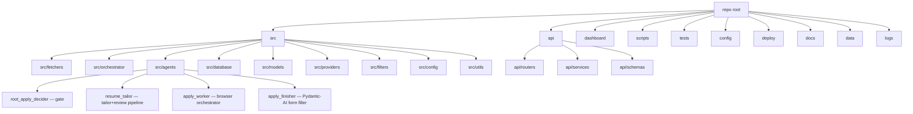
```mermaid
graph TD
  ROOT[repo root] --> SRC[src]
  ROOT --> API[api]
  ROOT --> DASH[dashboard]
  ROOT --> SCRIPTS[scripts]
  ROOT --> TESTS[tests]
  ROOT --> CONFIG[config]
  ROOT --> DEPLOY[deploy]
  ROOT --> DOCS[docs]
  ROOT --> DATA[data]
  ROOT --> LOGS[logs]

  SRC --> FETCHERS[src/fetchers]
  SRC --> ORCH[src/orchestrator]
  SRC --> AGENTS[src/agents]
  SRC --> DB[src/database]
  SRC --> MODELS[src/models]
  SRC --> PROVIDERS[src/providers]
  SRC --> FILTERS[src/filters]
  SRC --> CONFIGPKG[src/config]
  SRC --> UTILS[src/utils]

  API --> ROUTERS[api/routers]
  API --> SERVICES[api/services]
  API --> SCHEMAS[api/schemas]

  AGENTS --> RTA[root_apply_decider — gate]
  AGENTS --> RT[resume_tailor — tailor+review pipeline]
  AGENTS --> AW[apply_worker — browser orchestrator]
  AGENTS --> AF[apply_finisher — Pydantic-AI form filler]
```

The boundary is clean: `src/agents/` owns LLM and browser work, `src/database/` owns persistence, `api/` translates HTTP into database operations and background tasks, `dashboard/` is a pure HTTP-API consumer.

### Subsystem map

| Subsystem | What it does | Key code |
|---|---|---|
| Discovery / fetchers | Crawl 14+ sources, normalize to `JobPosting`, dedup, pre-filter, insert | `main.py`, `src/fetchers/*.py`, `src/orchestrator/discovery.py` |
| Gate (decider agent) | LLM-driven NEW → QUALIFIED \| FILTERED via `gpt-5-mini` | `scripts/process_new_jobs.py`, `src/agents/root_apply_decider/` |
| Tailor + review | Locator → tailor LLM → patcher → tectonic → reviewer → 3-way pick | `scripts/process_qualified_jobs.py`, `src/agents/resume_tailor/` |
| Apply worker | Claim review row, CDP-drive Chrome, trigger Simplify, optionally invoke finisher, evaluate submit gate | `scripts/process_apply_jobs.py`, `src/agents/apply_worker/` |
| Apply finisher | Pydantic-AI agent + 8 typed Playwright tools for Greenhouse/Ashby long-tail questions | `src/agents/apply_finisher/` |
| Supervisor | Lifespan-owned `WLoopSupervisor` running all worker loops in one process | `api/services/supervisor.py`, `api/services/migrations.py` |
| HTTP API | ~60 endpoints across 16 routers | `api/main.py`, `api/routers/*.py` |
| Dashboard | React SPA with TanStack Query polling | `dashboard/src/` |
| Database | 9 mixins composed onto `DatabaseManager`; `BEGIN IMMEDIATE` claim-and-lease | `src/database/db_manager.py`, `src/database/_mixins/*.py` |
| Provider abstraction | `AIProvider` protocol + `OpenAIProvider`; litellm cost computation | `src/providers/` |
| Filters & config | Hard/soft pre-gate filters; Pydantic v2 validation of `candidate_profile.yaml`; defer-rule classifier; answer cache | `src/filters/`, `src/config/`, `src/agents/apply_finisher/defer_rules.py`, `answer_cache.py` |
| Utilities | logger (loguru), deduplicator, cost_tracking, notifications (ntfy), paths, json_types, llm_pricing | `src/utils/*.py` |
| Deployment | Docker Compose (single service) + Linux systemd (5 units + timer) | `Dockerfile`, `docker-compose.yml`, `deploy/`, `scripts/docker/` |

### State and artifact topology

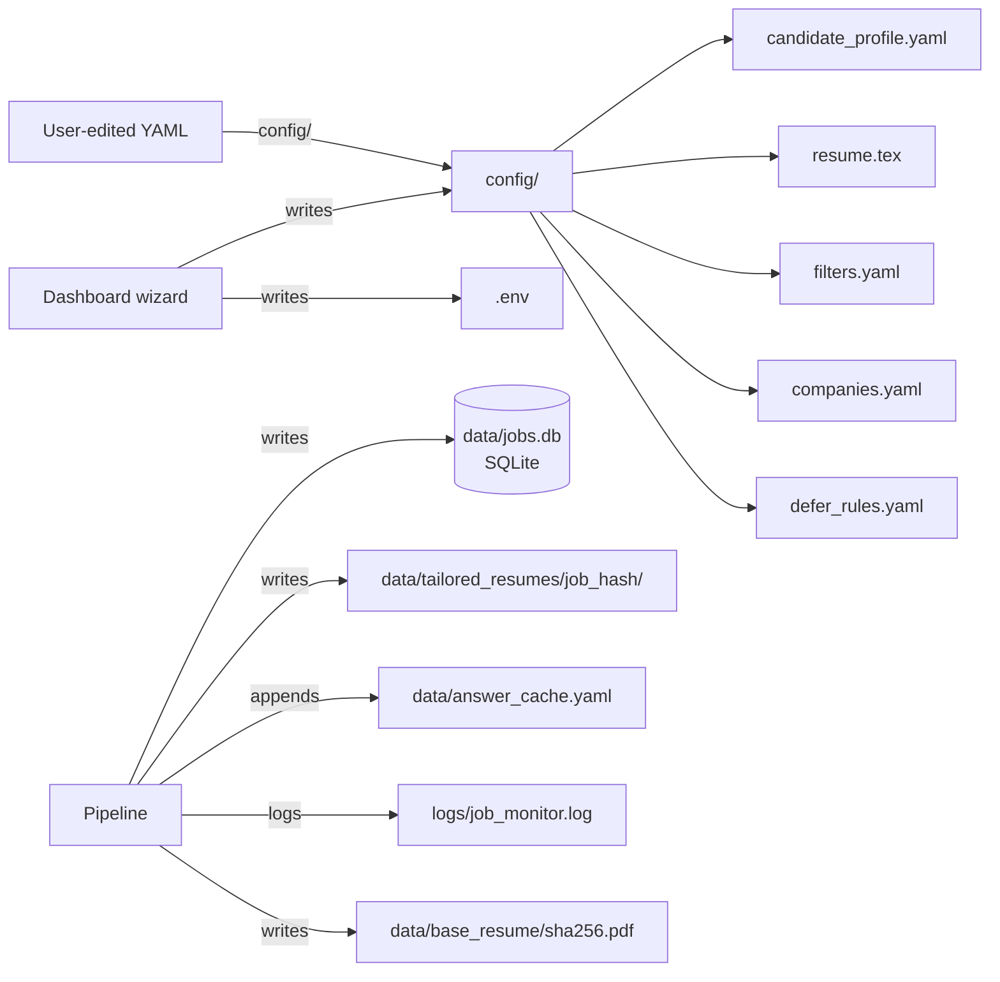
```mermaid
graph LR
  USER[User-edited YAML] -->|config/| CFGDIR[config/]
  DASH[Dashboard wizard] -->|writes| CFGDIR
  DASH -->|writes| ENV[.env]

  RUN[Pipeline] -->|writes| DB[(data/jobs.db<br/>SQLite)]
  RUN -->|writes| ART[data/tailored_resumes/job_hash/]
  RUN -->|appends| AC[data/answer_cache.yaml]
  RUN -->|logs| LOGS[logs/job_monitor.log]
  RUN -->|writes| BASEPDF[data/base_resume/sha256.pdf]

  CFGDIR --> CP[candidate_profile.yaml]
  CFGDIR --> RESUME[resume.tex]
  CFGDIR --> FILTERS[filters.yaml]
  CFGDIR --> COMPANIES[companies.yaml]
  CFGDIR --> DEFER[defer_rules.yaml]
```

Docker named volumes: `app-data` (everything under `/app/data`), `app-logs`, `tectonic-cache`. `./config:/app/config` is a host bind mount so users edit YAML directly.

---

## 2. Architecture

Single FastAPI process with five coupled planes:

1. **Discovery plane** — fetchers crawl, normalize to `JobPosting`, dedup by SHA-256 `job_hash`, persist. No LLM spend; always runs.
2. **Agent plane** — gate (`gpt-5-mini`), tailor + reviewer (`openai/gpt-5.4` + `openai/gpt-5-mini`), apply finisher (Pydantic-AI on `openai-responses:gpt-5.4`). Each stage gated by its own `automation.<stage>_mode` ∈ `{autonomous, opt_in, both}`.
3. **Persistence plane** — `DatabaseManager` + 9 mixins. `BEGIN IMMEDIATE` transactions and random claim tokens keep claims race-safe.
4. **HTTP/API plane** — ~60 endpoints. User-triggered tailor uses FastAPI `BackgroundTasks`; user-triggered apply uses detached `asyncio.create_task` so the browser flow fires immediately.
5. **Browser plane** — Playwright connects over CDP to the user's host Chrome at `host.docker.internal:9222` (Docker) or `localhost:9222` (systemd). No in-container Chromium.

### Runtime topology

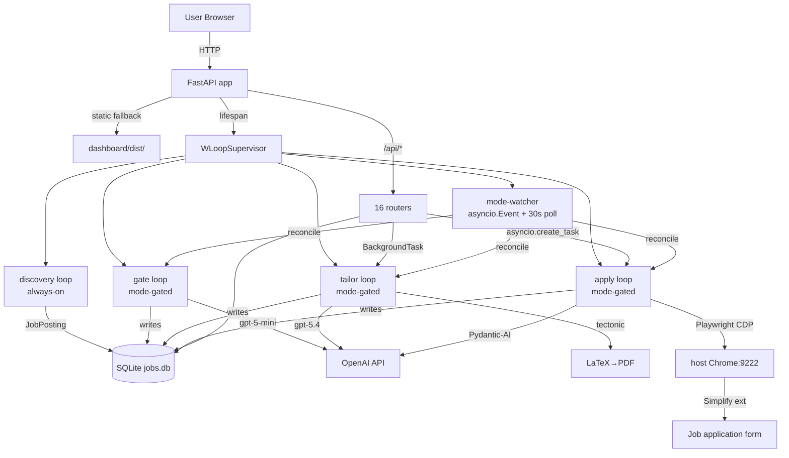
```mermaid
graph TB
  USER[User Browser] -->|HTTP| API[FastAPI app]
  API -->|static fallback| DIST[dashboard/dist/]
  API -->|/api/*| ROUTERS[16 routers]
  API -->|lifespan| SUP[WLoopSupervisor]

  SUP --> DISC[discovery loop<br/>always-on]
  SUP --> GATE[gate loop<br/>mode-gated]
  SUP --> TAILOR[tailor loop<br/>mode-gated]
  SUP --> APPLY[apply loop<br/>mode-gated]
  SUP --> WATCH[mode-watcher<br/>asyncio.Event + 30s poll]

  DISC -->|JobPosting| DB[(SQLite jobs.db)]
  GATE -->|gpt-5-mini| OAI[OpenAI API]
  GATE -->|writes| DB
  TAILOR -->|gpt-5.4| OAI
  TAILOR -->|tectonic| TEX[LaTeX→PDF]
  TAILOR -->|writes| DB
  APPLY -->|Playwright CDP| CHROME[host Chrome:9222]
  APPLY -->|Pydantic-AI| OAI
  APPLY -->|writes| DB
  CHROME -->|Simplify ext| FORM[Job application form]

  ROUTERS -->|BackgroundTask| TAILOR
  ROUTERS -->|asyncio.create_task| APPLY
  ROUTERS --> DB
  WATCH -->|reconcile| GATE
  WATCH -->|reconcile| TAILOR
  WATCH -->|reconcile| APPLY
```

### Lifespan boot

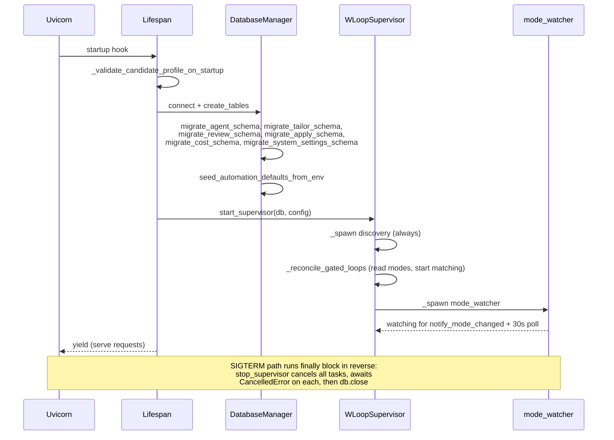
```mermaid
sequenceDiagram
  participant Uvicorn
  participant Lifespan
  participant DB as DatabaseManager
  participant Sup as WLoopSupervisor
  participant Watch as mode_watcher

  Uvicorn->>Lifespan: startup hook
  Lifespan->>Lifespan: _validate_candidate_profile_on_startup
  Lifespan->>DB: connect + create_tables
  DB->>DB: migrate_agent_schema, migrate_tailor_schema,<br/>migrate_review_schema, migrate_apply_schema,<br/>migrate_cost_schema, migrate_system_settings_schema
  DB->>DB: seed_automation_defaults_from_env
  Lifespan->>Sup: start_supervisor(db, config)
  Sup->>Sup: _spawn discovery (always)
  Sup->>Sup: _reconcile_gated_loops (read modes, start matching)
  Sup->>Watch: _spawn mode_watcher
  Watch-->>Sup: watching for notify_mode_changed + 30s poll
  Lifespan-->>Uvicorn: yield (serve requests)

  Note over Uvicorn,Watch: SIGTERM path runs finally block in reverse:<br/>stop_supervisor cancels all tasks, awaits<br/>CancelledError on each, then db.close
```

### Background-task topology

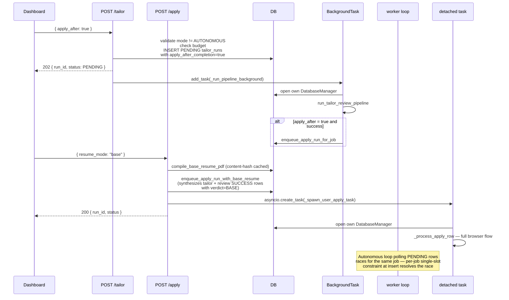
```mermaid
sequenceDiagram
  participant Dash as Dashboard
  participant Tailor as POST /tailor
  participant Apply as POST /apply
  participant DB
  participant BG as BackgroundTask
  participant WLoop as worker loop
  participant Det as detached task

  Dash->>Tailor: { apply_after: true }
  Tailor->>DB: validate mode != AUTONOMOUS<br/>check budget<br/>INSERT PENDING tailor_runs<br/>with apply_after_completion=true
  Tailor-->>Dash: 202 { run_id, status: PENDING }
  Tailor->>BG: add_task(_run_pipeline_background)
  BG->>DB: open own DatabaseManager
  BG->>BG: run_tailor_review_pipeline
  alt apply_after = true and success
    BG->>DB: enqueue_apply_run_for_job
  end

  Dash->>Apply: { resume_mode: "base" }
  Apply->>DB: compile_base_resume_pdf (content-hash cached)
  Apply->>DB: enqueue_apply_run_with_base_resume<br/>(synthesizes tailor + review SUCCESS rows<br/>with verdict=BASE)
  Apply->>Det: asyncio.create_task(_spawn_user_apply_task)
  Apply-->>Dash: 200 { run_id, status }
  Det->>DB: open own DatabaseManager
  Det->>Det: _process_apply_row — full browser flow

  Note over WLoop: Autonomous loop polling PENDING rows<br/>races for the same job — per-job single-slot<br/>constraint at insert resolves the race
```

### Concurrency model

- **Atomic claim-and-lease.** Every stage SELECT-then-INSERTs a PENDING row inside `BEGIN IMMEDIATE`, with a random claim token. Workers present the same token to write completion; mismatch → `ClaimOwnershipError`, logged and dropped.
- **Lease expiry.** Every cycle calls `mark_stale_*_runs_failed(lease_seconds)` to flip orphan PENDING rows older than the lease to FAILED. Defaults: agent 900s, tailor 7200s, review 7200s, apply 1800s.
- **Soft-delete frees the slot.** `tailor_runs.deleted_at` and `apply_runs.deleted_at` exclude rows from claim queries; the row stays for audit.
- **Per-job single-slot.** Any non-deleted PENDING/RUNNING tailor or apply row for a `job_hash` blocks new inserts; the router returns 409 `RUN_ALREADY_EXISTS` or `APPLY_RUN_IN_FLIGHT`.

### Known constraints

1. **Multi-provider BYOK is partial.** Gate uses the `AIProvider` protocol; tailor + reviewer + finisher hardcode OpenAI. Provider settings API rejects everything but OpenAI.
2. **Apply finisher is locked to Greenhouse + Ashby.** Other ATSes skip the finisher and land `NEEDS_REVIEW` with `finisher_outcome=SKIPPED`.
3. **React-Select v4 picks require a manual PointerEvent sequence.** Bare clicks don't commit.
4. **The dashboard `dist/` is image-baked.** Live UI updates need `docker cp dashboard/dist/. agentic-job-applier-app-1:/app/dashboard/dist/`.
5. **Single-writer SQLite.** Acceptable for single-user local; horizontal scale needs PostgreSQL.
6. **Tectonic CTAN cache fragility.** First user tailor without prewarm pays 30–60s package fetch.
7. **Chrome 148+ host check.** Container connections to `host.docker.internal:9222` need `Host: localhost:<port>` override.
8. **Legacy `*_yaml_path` columns** on `tailor_runs` and `review_runs` written as `""` but unused post-Phase-3.

---

## 3. Components

(High level — see `spec/components.md` for the full table per layer.)

### Entry points

- `main.py:run_discovery_loop` — async entry the supervisor calls; CLI `python main.py` for local one-shot.
- `api/main.py` — FastAPI app construction + lifespan + router registration + static fallback + error handler.
- `scripts/process_new_jobs.py`, `process_qualified_jobs.py`, `process_apply_jobs.py` — dual-mode worker scripts: standalone CLI (`--once` / `--loop`) and the importable function the supervisor calls. This dual mode is what lets Docker (one process) and systemd (separate units) share the same code.

### Supervisor

- `api/services/supervisor.py:WLoopSupervisor` — four asyncio tasks (discovery + gate + tailor + apply) plus a mode-watcher. Crash recovery via exponential restart-with-backoff (5s → 300s cap). `notify_mode_changed()` reconciles gated loops within ~1.5s.
- `api/services/migrations.py:_lifespan` — startup: validates candidate profile, runs all mixin migrations, starts the supervisor. Shutdown: stops the supervisor cleanly.

### Discovery

- `src/orchestrator/discovery.py:run_job_discovery` — one cycle: load YAML, filter watchlist by user domain, build family tasks, gather with exception isolation, roll up.
- `src/orchestrator/_family_tasks.py:build_family_tasks` — per-family coroutine factory. Late-binds fetcher classes via `main.<Fetcher>` so tests can monkeypatch without changing imports.
- `src/orchestrator/insert_pipeline.py:insert_with_filters` — per-job: `JobFilter.filter_job` → branch on `FilterAction` → insert with the right status.
- `src/orchestrator/domains.py` — two-level domain taxonomy. Untagged companies always pass (catch-all prevents silent data loss).
- `src/fetchers/` — 14+ source-specific fetchers + `ats_scanner` (zero-token ATS detection) + `base_fetcher` + `fuzzy_dedup` (not wired into the main path) + `liveness_checker` (not currently invoked).

### Agents

#### Gate (`src/agents/root_apply_decider/`)

- `unified_runtime.py:run_gate_with_provider` — provider-agnostic entry; builds `CompletionRequest`, parses to `GateRunOutcome`.
- `prompts.py` — system prompt + `build_gate_payload` + `load_candidate_context` (`@lru_cache(maxsize=1)` cleared on profile writes).
- `schemas.py` — `ApplyDecision`, `GateDebugInfo`, `GateRunResult`.

#### Tailor + reviewer (`src/agents/resume_tailor/`)

- `pipeline.py:run_tailor_review_pipeline` — the whole pipeline in one async function (~900 lines): mark RUNNING → revalidate `.tex` → compile base → build manifest → call tailor → apply patches → compile v1 → trim if >1 page → call reviewer → optionally call retry tailor + 3-way reviewer → select winner → write rows.
- `validator.py:validate_resume_tex` — enforces `docs/resume-tex-contract.md`; halts on first failure with structured error code.
- `locator.py:build_bullet_manifest` — pure function: walks `.tex`, returns `BulletManifest` with stable IDs and **byte offsets pointing to body bytes only** (not wrapping macros).
- `patcher.py:apply_patches` — dumb byte splicer: validates non-overlap, sorts patches descending by `byte_start`, splices, sanitizes via `latex_safe()`.
- `compiler.py` — tectonic by default; `latexmk` fallback via `RESUME_COMPILER`; `TECTONIC_TIMEOUT_SECONDS=240`.
- `base_compile.py:compile_base_resume_pdf` — SHA-256-cached compile of `config/resume.tex` to `data/base_resume/<digest>.pdf` for the `resume_mode='base'` apply path.
- `llm.py:call_tailor` / `call_trim` / `call_reviewer` — Instructor-wrapped OpenAI calls with `Mode.RESPONSES_TOOLS`; `INSTRUCTOR_MAX_RETRIES=3`.
- `prompts.py` — tailor: 4–8 rewrites, ±15% character budget, preserve `\textbf{}` verbatim. Reviewer: 3-axis rubric (`keyword_fit` / `specificity` / `factuality`), factuality is a veto axis, 2-way vs 3-way logic.
- `db_verdict.py` — maps `ReviewerVerdict` (LLM-emitted, lowercase) to DB verdicts (uppercase). DB CHECK constraint generated from this module.

#### Apply worker (`src/agents/apply_worker/`)

- `browser.py:apply_to_job` — connect Playwright over CDP, open new page, run `_run_application_flow`, close in finally.
- `browser.py:_cdp_localhost_host_header` — builds `Host: localhost:<port>` override unless URL already uses localhost or an IP literal. Applied to httpx probe and Playwright handshake.
- `browser.py:check_chrome_reachable` — 5s GET on `/json/version` with host-header override; loop sleeps without claiming on False.
- `browser.py:_wait_for_simplify_to_settle` — polls filled-field count every 500ms; returns when stable for 2s or 30s elapses.
- `finisher_integration.py:evaluate_submit_gate` — binary gate returning `(can_auto_submit, decision_label)`.
- `finisher_integration.py:try_submit_and_classify` — clicks submit, waits 5s for URL change → `SUBMITTED`; toasts → `NEEDS_REVIEW`; no toasts → `FAILED_OTHER`.
- `field_scanner.py:scan_unresolved_fields` — JS-eval'd form snapshot; reads `.select__single-value` for React-Select, `el.checked` for checkboxes.
- `ats_detection.py` — URL pattern → DOM marker fallback; `supported_finisher_ats` returns `"greenhouse"` / `"ashby"` / None.

#### Apply finisher (`src/agents/apply_finisher/`)

- `agent.py` — `FINISHER_MODEL_NAME = "openai-responses:gpt-5.4"`, `openai_reasoning_effort="medium"`, `parallel_tool_calls=False`, `openai_previous_response_id="auto"`, `openai_prompt_cache_key="apply_finisher_v4"`.
- `prompts.py` — BASE (universal contract) + Greenhouse fragment + Ashby fragment.
- `tools.py` — 8 typed Playwright tools:
  1. `agent_browser` — generic CLI escape hatch
  2. `fill_combobox` — React-Select pick with the PointerEvent sequence
  3. `pick_option` — listbox option click (for typeahead flows)
  4. `verify_combobox_filled` — reads `.select__single-value` directly
  5. `dispatch_async_typeahead_query` — native input setter + input event for React-Select Async
  6. `lookup_cached_answer` — answer-cache fuzzy lookup
  7. `defer` — record Tier-3 deferral
  8. `flag_for_verify` — record Tier-2 draft with confidence
- `defer_rules.py:DeferRules.classify` — Tier 3 if `always_defer_patterns` match (unless overridden) → Tier 2 if `draft_and_flag_patterns` match → else Tier 1.
- `answer_cache.py:AnswerCache.lookup` — two-pass fuzzy (RapidFuzz `token_set_ratio >= 85`): per-company entries first, then anonymized with `$COMPANY` substitution.
- `runner.py:run_finisher` — agent loop with `UsageLimits(request_limit=50, tool_calls_limit=250)`, soft cost cap `$0.20`/run.

### Database (`src/database/_mixins/`)

| Mixin | Tables |
|---|---|
| `jobs` | `job_postings` |
| `agent_gate` | `job_postings.agent_*` columns |
| `tailor` | `tailor_runs` |
| `review` | `review_runs` |
| `apply` | `apply_runs`, `apply_handoffs` |
| `costs` | `cost_events`, `budget_settings`, `app_settings` |
| `system_settings` | `system_settings` |
| `telemetry` | `crawl_history`, `daily_stats` |
| `failure_resets` | (operator helpers; no dedicated table) |

### HTTP API

- `api/main.py` — app + lifespan + 16 routers + error handler + static dashboard fallback.
- `api/routers/` — health, system, status, jobs, tailor_runs, apply_runs, human_review, failures, dashboard, costs, pipeline (SSE stub), settings_profile, settings_resume, settings_api_keys, settings_budget, settings_filters, settings_provider, settings_files, system_settings.
- `api/services/` — supervisor lifecycle, lifespan/migrations, env-keys, yaml-files, sources, salary, failure-records, answer-cache seeding, tailored-resume path resolution, system-script dispatch.
- `api/errors.py` — deterministic envelope `{ok, code, message, details}`; stable 409 codes for race semantics.

### Dashboard (`dashboard/src/`)

- `App.tsx` — routing between `/onboarding` (no shell) and the authenticated shell (`<OnboardingGate>` → `<AppLayout>` → page).
- Pages: Dashboard, Jobs (40K-line JobsPage with state machine ApplyButton + NotTailoredModal), TailoredResumes (filtered Jobs variant), HumanReview, Failures, CostTracking, Settings, OnboardingPage.
- `lib/api/client.ts` — typed HTTP wrappers; `ApiError` with stable `code` field.
- `lib/onboarding/` — wizard state + `finishOnboarding` (7 API calls in strict order, ending with `refetchOnboardingStatus` before `navigate("/")`) + Greenhouse slug resolution (`watchlist.ts`).
- `lib/query-client.ts` — TanStack defaults (`staleTime: 5_000`, `refetchInterval: 30_000`).

### Provider abstraction (`src/providers/`)

- `factory.py:build_provider` — sole entry; currently only returns `OpenAIProvider`.
- `openai_provider.py` — wraps the `openai` SDK; `compute_cost()` uses `litellm.cost_per_token` with `OPENAI_CACHED_INPUT_DISCOUNT = 0.5`.
- `types.py` — `AIProvider` protocol, `CompletionRequest`, `CompletionResponse`, `TokenUsage`, `CostBreakdown`.

### Filters & config (`src/filters/`, `src/config/`)

- `src/filters/job_filter.py:JobFilter` — hard filters first, then soft filters. **Positive keywords use `any()` semantics** (not `all()`); tests pin this.
- `src/config/schema.py` — Pydantic v2 validation of `candidate_profile.yaml`. Tri-state literals (`yes`/`no`/`unknown`), bounded floats, `extra='allow'` on every model. Legacy boolean `willing_to_relocate` coerced via field_validator.

### Utilities (`src/utils/`)

- `logger.py`, `deduplicator.py`, `cost_tracking.py`, `notifications.py` (ntfy), `paths.py`, `json_types.py`, `llm_pricing.py` (idempotent litellm overlay registering custom-model prices at startup).

---

## 4. Data models

### `JobPosting` — the canonical normalized posting

The single Pydantic model that gets persisted. Fetchers return `list[JobPosting]`; the database treats it as source of truth.

Validators:
- `normalize_job_type(mode="before")` — maps raw employment-type strings to the Literal `{"Full-time", "Part-time", "Contract", "Internship"}` via `map_job_type()`.
- `detect_remote(mode="after")` — fills `is_remote` from location keywords (remote / anywhere / wfh / work from home / distributed) only when None.

`model_config = ConfigDict(extra="ignore")` so unknown fetcher keys are silently dropped. `to_db_dict()` is the only safe path to a database row — `model_dump_json()` directly will fail on non-JSON values in `raw_data`.

### `job_hash` — deterministic canonical key

SHA-256 hex digest over normalized `(source, company, title, location, posted_date, canonical_url, sha256(description), sha256(requirements))`. UTM / `gh_src` / `gh_jid` params stripped before hashing.

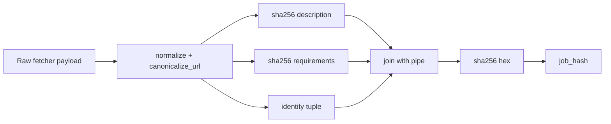
```mermaid
flowchart LR
  RAW[Raw fetcher payload] --> NORM[normalize + canonicalize_url]
  NORM --> H1[sha256 description]
  NORM --> H2[sha256 requirements]
  NORM --> ID[identity tuple]
  H1 --> JOIN[join with pipe]
  H2 --> JOIN
  ID --> JOIN
  JOIN --> SHA[sha256 hex] --> HASH[job_hash]
```

Same data ⇒ same hash. Adding or removing an identity field invalidates every existing hash and would treat every posting as new — schema migration discipline applies.

### Schema (entity-relationship)

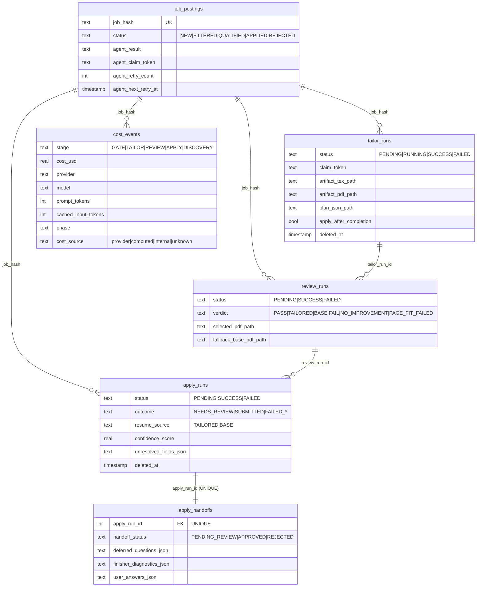
```mermaid
erDiagram
  job_postings ||--o{ tailor_runs : "job_hash"
  job_postings ||--o{ review_runs : "job_hash"
  job_postings ||--o{ apply_runs : "job_hash"
  job_postings ||--o{ cost_events : "job_hash"

  tailor_runs ||--o{ review_runs : "tailor_run_id"
  review_runs ||--o{ apply_runs : "review_run_id"
  apply_runs ||--|| apply_handoffs : "apply_run_id (UNIQUE)"

  job_postings {
    text job_hash UK
    text status "NEW|FILTERED|QUALIFIED|APPLIED|REJECTED"
    text agent_result
    text agent_claim_token
    int agent_retry_count
    timestamp agent_next_retry_at
  }
  tailor_runs {
    text status "PENDING|RUNNING|SUCCESS|FAILED"
    text claim_token
    text artifact_tex_path
    text artifact_pdf_path
    text plan_json_path
    bool apply_after_completion
    timestamp deleted_at
  }
  review_runs {
    text status "PENDING|SUCCESS|FAILED"
    text verdict "PASS|TAILORED|BASE|FAIL|NO_IMPROVEMENT|PAGE_FIT_FAILED"
    text selected_pdf_path
    text fallback_base_pdf_path
  }
  apply_runs {
    text status "PENDING|SUCCESS|FAILED"
    text outcome "NEEDS_REVIEW|SUBMITTED|FAILED_*"
    text resume_source "TAILORED|BASE"
    real confidence_score
    text unresolved_fields_json
    timestamp deleted_at
  }
  apply_handoffs {
    int apply_run_id FK "UNIQUE"
    text handoff_status "PENDING_REVIEW|APPROVED|REJECTED"
    text deferred_questions_json
    text finisher_diagnostics_json
    text user_answers_json
  }
  cost_events {
    text stage "GATE|TAILOR|REVIEW|APPLY|DISCOVERY"
    real cost_usd
    text provider
    text model
    int prompt_tokens
    int cached_input_tokens
    text phase
    text cost_source "provider|computed|internal|unknown"
  }
```

No hard foreign-key constraints. Application code enforces referential integrity. Absence of cascades makes soft-delete and audit cleanup simpler.

### State machines

#### Job posting

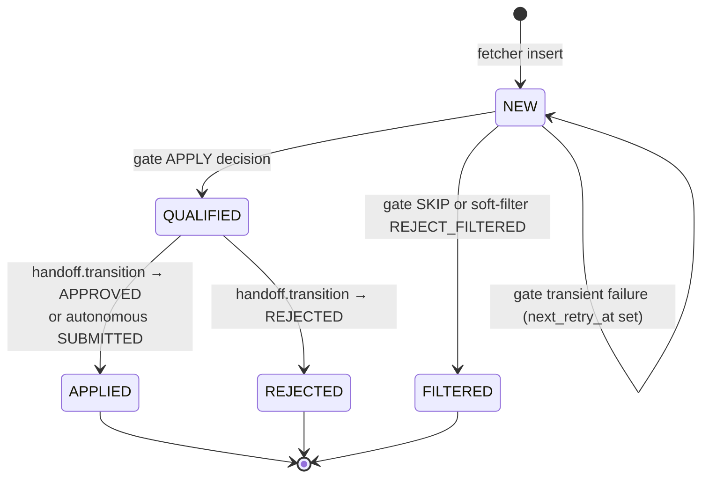
```mermaid
stateDiagram-v2
  [*] --> NEW: fetcher insert
  NEW --> QUALIFIED: gate APPLY decision
  NEW --> FILTERED: gate SKIP or soft-filter REJECT_FILTERED
  NEW --> NEW: gate transient failure (next_retry_at set)
  QUALIFIED --> APPLIED: handoff.transition → APPROVED<br/>or autonomous SUBMITTED
  QUALIFIED --> REJECTED: handoff.transition → REJECTED
  APPLIED --> [*]
  REJECTED --> [*]
  FILTERED --> [*]
```

#### Tailor run

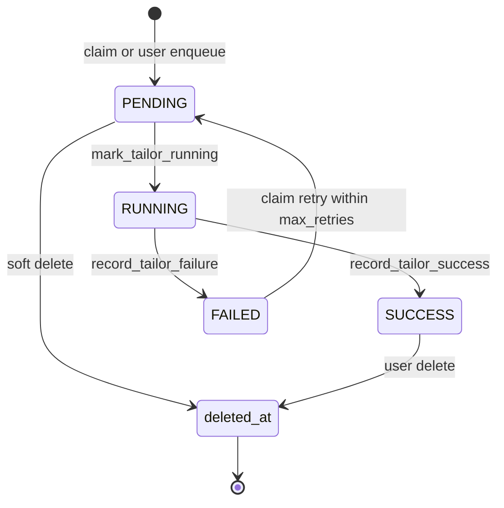
```mermaid
stateDiagram-v2
  [*] --> PENDING: claim or user enqueue
  PENDING --> RUNNING: mark_tailor_running
  RUNNING --> SUCCESS: record_tailor_success
  RUNNING --> FAILED: record_tailor_failure
  FAILED --> PENDING: claim retry within max_retries
  PENDING --> deleted_at: soft delete
  SUCCESS --> deleted_at: user delete
  deleted_at --> [*]
```

#### Apply run

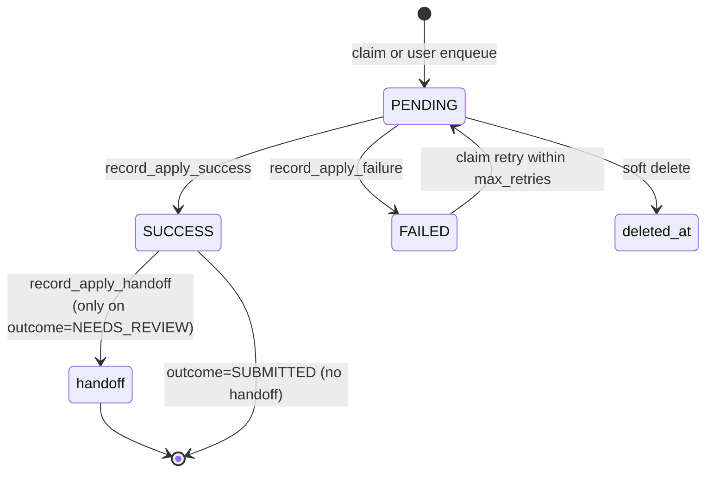
```mermaid
stateDiagram-v2
  [*] --> PENDING: claim or user enqueue
  PENDING --> SUCCESS: record_apply_success
  PENDING --> FAILED: record_apply_failure
  SUCCESS --> handoff: record_apply_handoff<br/>(only on outcome=NEEDS_REVIEW)
  FAILED --> PENDING: claim retry within max_retries
  PENDING --> deleted_at: soft delete
  handoff --> [*]
  SUCCESS --> [*]: outcome=SUBMITTED (no handoff)
```

#### Apply handoff

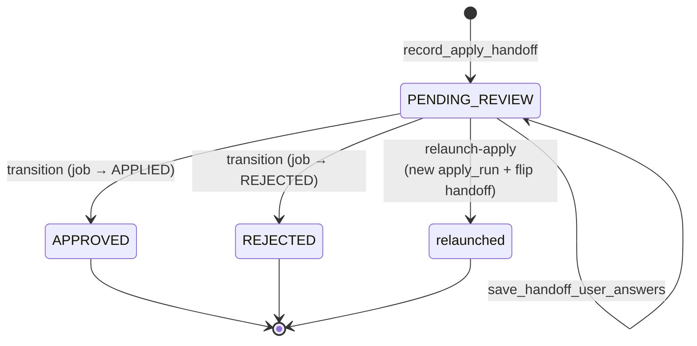
```mermaid
stateDiagram-v2
  [*] --> PENDING_REVIEW: record_apply_handoff
  PENDING_REVIEW --> APPROVED: transition (job → APPLIED)
  PENDING_REVIEW --> REJECTED: transition (job → REJECTED)
  PENDING_REVIEW --> PENDING_REVIEW: save_handoff_user_answers
  PENDING_REVIEW --> relaunched: relaunch-apply<br/>(new apply_run + flip handoff)
  APPROVED --> [*]
  REJECTED --> [*]
  relaunched --> [*]
```

### Claim-and-lease invariants

| Stage | Token width | Default lease | Env override |
|---|---|---|---|
| Agent (gate) | 12 bytes hex | 900s | `AGENT_CLAIM_LEASE_SECONDS` |
| Tailor | 32 bytes hex | 7200s | `TAILOR_CLAIM_LEASE_SECONDS` |
| Review (standalone) | 32 bytes hex | 7200s | `REVIEW_CLAIM_LEASE_SECONDS` |
| Apply | 32 bytes hex | 1800s | `APPLY_CLAIM_LEASE_SECONDS` |

Mismatched claim tokens at write time raise `ClaimOwnershipError`, which the caller catches, logs, and treats as "skip — another worker handled it." Stale-claim reapers run every cycle.

### Migrations

No Alembic. Each mixin owns its own migration method using `PRAGMA table_info` + ALTER TABLE for missing columns. CHECK-constraint widening uses standard SQLite table-rebuild. Stale-row recovery (`mark_stale_*_runs_failed`) runs every cycle so crashed workers eventually release their slots.

---

## 5. Interfaces

### HTTP API

~60 endpoints across 16 routers. All errors follow `{ok: false, code, message, details}`. All success bodies are JSON with `{ok: true, ...}`.

Key endpoints by area:

**Health & lifecycle**
- `GET /api/health` — used by Docker healthcheck
- `GET /api/system/health` — reports `openai_key_configured`
- `POST /api/system/{stop,restart,fetch-jobs}` — dispatches shell scripts

**Status**
- `GET /api/status/autonomous-readiness` — hard-requirement matrix for the toggle
- `GET /api/status/chrome?os=mac|linux|windows` — CDP reachability + launch hint
- `GET /api/settings/autonomous-mode` — derived global toggle state
- `POST /api/settings/autonomous-mode` — flips all three stage modes atomically

**Jobs & discovery**
- `GET /api/jobs?search=&page=&status=&source=&has_tailor_run=`
- `GET /api/jobs/{job_hash}/resume` — FileResponse (PDF)
- `POST /api/jobs/import` — manual import

**Tailor runs**
- `POST /api/jobs/{hash}/tailor` — body `{apply_after: bool}`; 202; queues `BackgroundTask`
- `GET /api/tailor-runs/{id}` — poll one
- `GET /api/tailor-runs/{id}/plan` — planner-rationale JSON
- `DELETE /api/tailor-runs/{id}` — soft-delete + artifact cleanup
- `POST /api/tailor-runs/{id}/retry` — atomic delete + re-enqueue

**Apply runs**
- `POST /api/jobs/{hash}/apply` — body `{resume_mode: "base"|"tailored"}`; on `"base"` compiles base resume and synthesizes tailor + review rows; spawns detached `asyncio.create_task`
- `GET /api/apply-runs/{id}` — poll
- `DELETE /api/apply-runs/{id}` — soft-delete

**Human review**
- `GET /api/human-review?search=&confidence=&page=`
- `POST /api/human-review/{id}/{complete,dismiss}` — atomic handoff + job_postings update
- `POST /api/human-review/{id}/answers` — saves user_answers_json + appends to data/answer_cache.yaml
- `POST /api/human-review/{id}/relaunch-apply` and `POST /api/human-review/by-job/{hash}/relaunch-apply`

**Failures**
- `GET /api/failures?search=&stage=&status=&page=`
- `POST /api/failures/{id}/retry`

**Dashboard & costs**
- `GET /api/dashboard/stats`, `GET /api/dashboard/discovery-trend?range=7d|30d`
- `GET /api/costs/{stats,daily-trend,by-stage}`

**Settings**
- Profile / resume / api-keys / budget / filters / sources / provider / files / onboarding-status / automation

### Error codes (stable)

| Code | Status | Where |
|---|---|---|
| `INVALID_YAML`, `MISSING_API_KEY`, `UNSUPPORTED_PROVIDER` | 400 | settings + provider |
| `JOB_NOT_FOUND`, `FILE_NOT_FOUND`, `TAILOR_RUN_NOT_FOUND`, `APPLY_RUN_NOT_FOUND` | 404 | lookups |
| `MODE_AUTONOMOUS` | 409 | user-triggered tailor while `tailor_mode=autonomous` |
| `RUN_ALREADY_EXISTS` / `APPLY_RUN_IN_FLIGHT` | 409 | per-job single-slot violated |
| `BUDGET_EXCEEDED` | 409 | monthly cost rollup hit budget |
| `AUTONOMOUS_REQUIREMENTS_NOT_MET` | 409 | toggle ON without OpenAI key/profile/resume |
| `HANDOFF_ALREADY_RESOLVED` | 409 | action on a non-PENDING_REVIEW handoff |
| `ENDPOINT_REMOVED` | 410 | deprecated resume PUT/POST |
| `NO_REVIEW_RUN` | 422 | apply enqueue without review run (and `resume_mode != base`) |
| `INVALID_RESUME_TEX` | 422 | resume upload failed contract validation |
| `BASE_COMPILE_FAILED` | 422 | `resume_mode=base` apply when base `.tex` compile failed |
| `ADZUNA_AUTH_FAILED`, `ADZUNA_UNREACHABLE`, `ADZUNA_ERROR` | 401 / 502 | live Adzuna probe |
| `SYSTEM_ACTION_DISPATCH_FAILED`, `ANSWER_CACHE_SEED_FAILED` | 500 | infra |

### CLI worker scripts

Each supports `--once`, `--loop`, `--limit N` flags and is importable.

- `python main.py` — one discovery cycle
- `python -m scripts.process_new_jobs` — gate worker
- `python -m scripts.process_qualified_jobs` — tailor + review worker
- `python -m scripts.process_apply_jobs` — apply worker (preflights Chrome reachability)

Operator helpers: `scripts/run_pipeline_once.py`, `scripts/status.py`, `scripts/query_jobs.py`, `scripts/migrate_yaml_to_tex.py`, `scripts/build_greenhouse_slug_table.py`, `scripts/docker/{start,stop,restart}_stack.sh`.

### YAML configs (under `config/`)

- `candidate_profile.yaml` — mandatory. Validated by `src/config/schema.py:CandidateProfile` at startup.
- `filters.yaml` — optional. Hard + soft filters consumed by `src/filters/job_filter.py`.
- `companies.yaml` — mandatory for discovery. Watchlist by ATS + per-board enabled flags + curated GitHub repos + watched career pages.
- `defer_rules.yaml` — Tier-3 always-defer regexes + Tier-2 draft-and-flag regexes + bypass field types + never-defer overrides.
- `resume.tex` — mandatory for tailor / autonomous. LaTeX source-of-truth; validated against `docs/resume-tex-contract.md`.
- `data/answer_cache.yaml` — machine-mutable, schema_version 1.

### `.env` contract

Canonical template in `.env.example`. Key knobs: `OPENAI_API_KEY` (required), `ADZUNA_APP_ID` / `ADZUNA_APP_KEY` (optional pair), `RUN_INTERVAL_MINUTES` (30), `API_PORT` (8000), `CHROME_CDP_URL` (`http://host.docker.internal:9222`), `SAFE_MODE` (false — kill switch), `LITELLM_LOCAL_MODEL_COST_MAP` (true), per-stage worker knobs (poll interval / max retries / lease / backoff), model overrides (`RESUME_TAILOR_MODEL`, `RESUME_REVIEWER_MODEL`), `TECTONIC_TIMEOUT_SECONDS` (240).

### Artifact paths

```
data/
├── jobs.db                                  # SQLite
├── tailored_resumes/<job_hash>/
│   ├── base/{base.tex, base.pdf, base.log}
│   ├── tailored_v1/{*.tex, *.pdf, *.log, *.plan.json}
│   └── tailored_v2/{*.tex, *.pdf, *.log}     # optional
├── base_resume/<sha256>.pdf                  # cached for resume_mode=base
├── apply_runs/<id>/{screenshot_pre_submit.png, dom_snapshot.html}
└── answer_cache.yaml

logs/job_monitor.log                         # loguru, 10MB rotation, 1-week retention

config/
├── candidate_profile.yaml
├── resume.tex
├── filters.yaml
├── companies.yaml
├── defer_rules.yaml
└── backups/<name>_YYYYMMDD_HHMMSS.yaml
```

### External-process interfaces

- **Tectonic** — invoked as `tectonic -X compile --outdir <dir> <file>.tex`. `XDG_CACHE_HOME=/tectonic-cache` for CTAN persistence.
- **agent-browser** — Rust CDP CLI subprocess wrapped by `browser_cli.py:invoke_agent_browser_cli` with a per-process lock.
- **Host Chrome CDP** — `host.docker.internal:9222` (Docker) or `localhost:9222` (systemd); `Host: localhost:<port>` override on probe + Playwright handshake.
- **Simplify Copilot v2.4.x** — detected via shadow-root with labeled autofill button; resume re-uploaded after autofill because Simplify clobbers the file input.
- **ntfy.sh (optional)** — fire-and-forget POSTs; failed POST logs WARNING and never raises.

---

## 6. Workflows

### Discovery cycle (always-on)

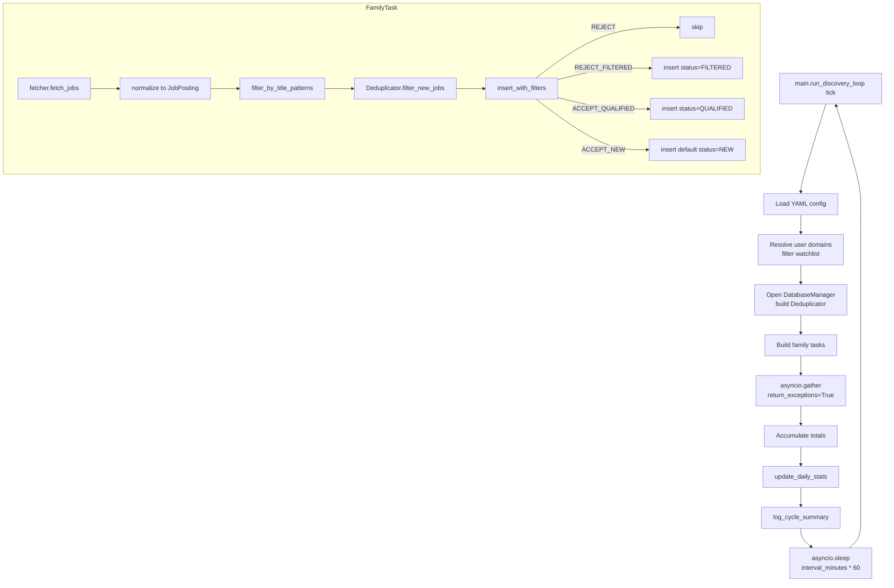
```mermaid
flowchart TD
  TICK[main.run_discovery_loop tick] --> CFG[Load YAML config]
  CFG --> DOM[Resolve user domains<br/>filter watchlist]
  DOM --> SETUP[Open DatabaseManager<br/>build Deduplicator]
  SETUP --> FAM[Build family tasks]
  FAM --> GATHER[asyncio.gather<br/>return_exceptions=True]

  subgraph FamilyTask
    FETCH[fetcher.fetch_jobs] --> NORM[normalize to JobPosting]
    NORM --> TPF[filter_by_title_patterns]
    TPF --> DEDUP[Deduplicator.filter_new_jobs]
    DEDUP --> INS[insert_with_filters]
    INS -->|REJECT| DROP[skip]
    INS -->|REJECT_FILTERED| INSF[insert status=FILTERED]
    INS -->|ACCEPT_QUALIFIED| INSQ[insert status=QUALIFIED]
    INS -->|ACCEPT_NEW| INSN[insert default status=NEW]
  end

  GATHER --> ROLL[Accumulate totals]
  ROLL --> STATS[update_daily_stats]
  STATS --> LOG[log_cycle_summary]
  LOG --> SLEEP[asyncio.sleep<br/>interval_minutes * 60]
  SLEEP --> TICK
```

### Gate decision

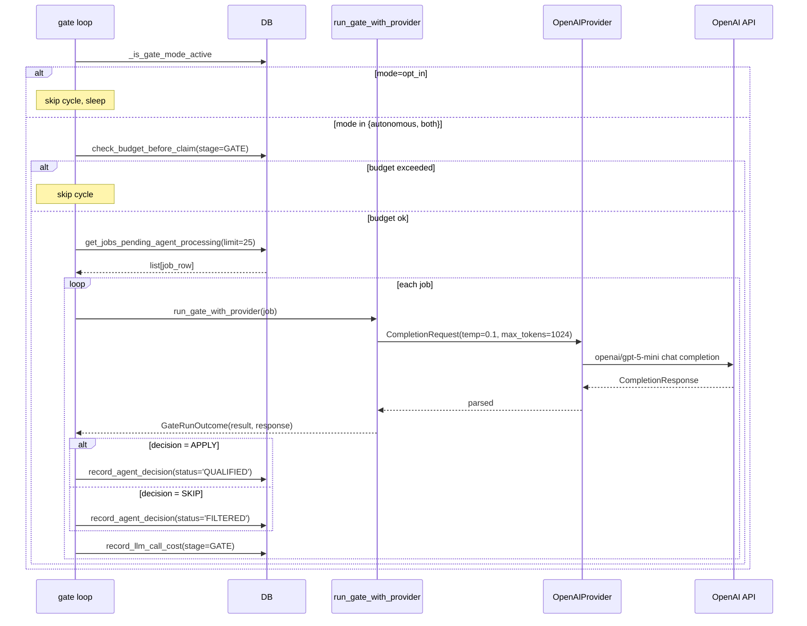
```mermaid
sequenceDiagram
  participant WLoop as gate loop
  participant DB
  participant Gate as run_gate_with_provider
  participant Prov as OpenAIProvider
  participant OAI as OpenAI API

  WLoop->>DB: _is_gate_mode_active
  alt mode=opt_in
    Note over WLoop: skip cycle, sleep
  else mode in {autonomous, both}
    WLoop->>DB: check_budget_before_claim(stage=GATE)
    alt budget exceeded
      Note over WLoop: skip cycle
    else budget ok
      WLoop->>DB: get_jobs_pending_agent_processing(limit=25)
      DB-->>WLoop: list[job_row]
      loop each job
        WLoop->>Gate: run_gate_with_provider(job)
        Gate->>Prov: CompletionRequest(temp=0.1, max_tokens=1024)
        Prov->>OAI: openai/gpt-5-mini chat completion
        OAI-->>Prov: CompletionResponse
        Prov-->>Gate: parsed
        Gate-->>WLoop: GateRunOutcome(result, response)
        alt decision = APPLY
          WLoop->>DB: record_agent_decision(status='QUALIFIED')
        else decision = SKIP
          WLoop->>DB: record_agent_decision(status='FILTERED')
        end
        WLoop->>DB: record_llm_call_cost(stage=GATE)
      end
    end
  end
```

Backoff is exponential ×3 (300s → 900s → 2700s) capped at `AGENT_MAX_RETRIES=3`. Terminal failure sets `agent_failed_at`; operator clears from the failures page.

### Tailor + review pipeline

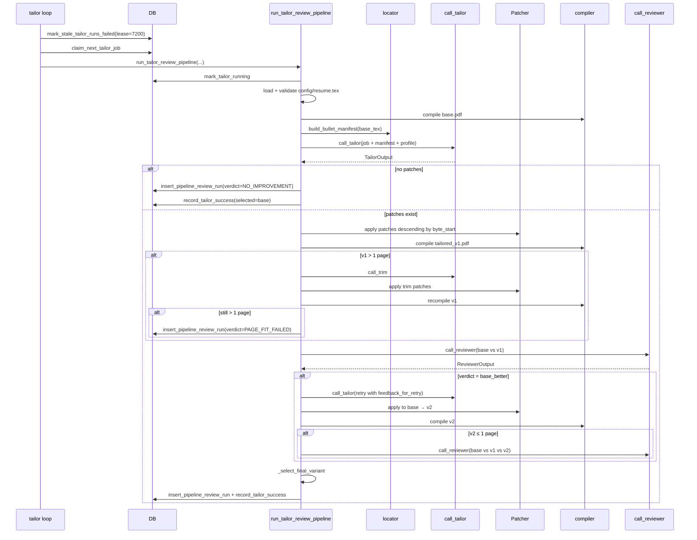
```mermaid
sequenceDiagram
  participant WLoop as tailor loop
  participant DB
  participant Pipeline as run_tailor_review_pipeline
  participant Loc as locator
  participant Tailor as call_tailor
  participant Patcher
  participant Comp as compiler
  participant Reviewer as call_reviewer

  WLoop->>DB: mark_stale_tailor_runs_failed(lease=7200)
  WLoop->>DB: claim_next_tailor_job
  WLoop->>Pipeline: run_tailor_review_pipeline(...)
  Pipeline->>DB: mark_tailor_running
  Pipeline->>Pipeline: load + validate config/resume.tex
  Pipeline->>Comp: compile base.pdf
  Pipeline->>Loc: build_bullet_manifest(base_tex)
  Pipeline->>Tailor: call_tailor(job + manifest + profile)
  Tailor-->>Pipeline: TailorOutput

  alt no patches
    Pipeline->>DB: insert_pipeline_review_run(verdict=NO_IMPROVEMENT)
    Pipeline->>DB: record_tailor_success(selected=base)
  else patches exist
    Pipeline->>Patcher: apply patches descending by byte_start
    Pipeline->>Comp: compile tailored_v1.pdf
    alt v1 > 1 page
      Pipeline->>Tailor: call_trim
      Pipeline->>Patcher: apply trim patches
      Pipeline->>Comp: recompile v1
      alt still > 1 page
        Pipeline->>DB: insert_pipeline_review_run(verdict=PAGE_FIT_FAILED)
      end
    end
    Pipeline->>Reviewer: call_reviewer(base vs v1)
    Reviewer-->>Pipeline: ReviewerOutput
    alt verdict = base_better
      Pipeline->>Tailor: call_tailor(retry with feedback_for_retry)
      Pipeline->>Patcher: apply to base → v2
      Pipeline->>Comp: compile v2
      alt v2 ≤ 1 page
        Pipeline->>Reviewer: call_reviewer(base vs v1 vs v2)
      end
    end
    Pipeline->>Pipeline: _select_final_variant
    Pipeline->>DB: insert_pipeline_review_run + record_tailor_success
  end
```

Key invariants:
- Compile-once, patch-many. Base PDF compiles once at the top; variants are built by splicing patches into the original `.tex` bytes.
- Reviewer sees the full `.tex` source (not PDF extraction), giving it macro-level access for factuality checks.
- Factuality is a veto axis — invented claims force `verdict=base_better` regardless of other scores.
- Trim is one-shot. If v1 is still over after trim, ship base with `verdict=PAGE_FIT_FAILED`.
- Retry produces v2 only on `verdict=base_better`. The 3-way reviewer cannot return `base_better`; it must pick the strongest.

### Apply lifecycle

```mermaid
flowchart TD
  TICK[apply loop tick] --> MODE{mode in<br/>autonomous|both?}
  MODE -->|opt_in| SLEEP[sleep]
  MODE -->|yes| CHROME{check_chrome_reachable<br/>Host: localhost:port}
  CHROME -->|false| SLEEP
  CHROME -->|true| CLAIM[BEGIN IMMEDIATE<br/>claim review SUCCESS rows<br/>insert PENDING apply_runs<br/>with claim_token]
  CLAIM -->|none| SLEEP
  CLAIM -->|got one| GO[apply_to_job]

  GO --> CDP[Playwright connect_over_cdp<br/>Host: localhost:port]
  CDP --> CTX[browser.contexts 0<br/>open new_page]
  CTX --> NAV[goto source_url]
  NAV --> DETECT[poll for Simplify shadow-root<br/>500ms interval, 45s timeout]

  DETECT --> UP1[upload tailored resume<br/>before Simplify click]
  UP1 --> CLICK[click Simplify autofill button]
  CLICK --> SETTLE[_wait_for_simplify_to_settle<br/>stable 2s or 30s max]
  SETTLE --> UP2[re-upload tailored resume<br/>Simplify clobbered it]

  UP2 --> SCAN[scan_unresolved_fields<br/>reads .select__single-value<br/>and checkbox.checked]
  SCAN --> CONF[compute confidence checks]

  CONF --> ATS{supported_finisher_ats?}
  ATS -->|no| OUT_NR[outcome = NEEDS_REVIEW<br/>diagnostics.finisher_outcome=SKIPPED]
  ATS -->|yes| FIN[run_finisher<br/>Pydantic-AI loop with 8 tools]

  FIN --> GATE[evaluate_submit_gate]
  GATE -->|true: auto_submit| SUBMIT[try_submit_and_classify<br/>click submit, wait 5s for URL change]
  GATE -->|false| OUT_NR

  SUBMIT -->|URL changed| OUT_S[outcome = SUBMITTED]
  SUBMIT -->|timeout + toasts| OUT_NR2[outcome = NEEDS_REVIEW<br/>submit_errors = toast_texts]
  SUBMIT -->|timeout no toasts| OUT_F[outcome = FAILED_OTHER]

  OUT_NR --> PERSIST[record_apply_success]
  OUT_NR2 --> PERSIST
  OUT_S --> PERSIST
  OUT_F --> PERSIST_FAIL[record_apply_failure]

  PERSIST --> HANDOFF{outcome == NEEDS_REVIEW?}
  HANDOFF -->|yes| RECH[record_apply_handoff<br/>writes deferred_questions_json<br/>and finisher_diagnostics_json]
  HANDOFF -->|no| LOG[log + record cost]
```

### Submit gate decision tree

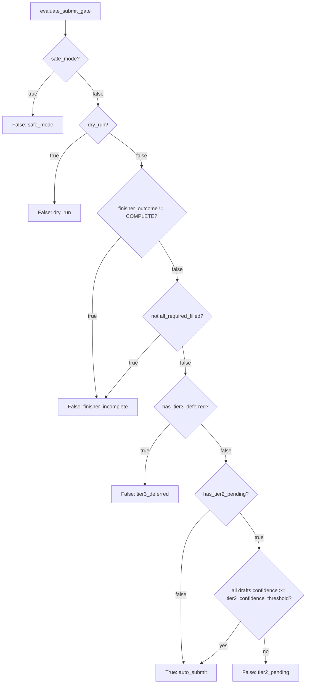
```mermaid
flowchart TD
  START[evaluate_submit_gate] --> SM{safe_mode?}
  SM -->|true| F1[False: safe_mode]
  SM -->|false| DR{dry_run?}
  DR -->|true| F2[False: dry_run]
  DR -->|false| OC{finisher_outcome != COMPLETE?}
  OC -->|true| F3[False: finisher_incomplete]
  OC -->|false| ARF{not all_required_filled?}
  ARF -->|true| F3
  ARF -->|false| T3{has_tier3_deferred?}
  T3 -->|true| F4[False: tier3_deferred]
  T3 -->|false| T2{has_tier2_pending?}
  T2 -->|false| TRUE[True: auto_submit]
  T2 -->|true| CONF{all drafts.confidence >= tier2_confidence_threshold?}
  CONF -->|no| F5[False: tier2_pending]
  CONF -->|yes| TRUE
```

The threshold defaults to 1.0 (require perfect confidence). Users lower it in `candidate_profile.yaml:apply_prefs.application_defaults.tier2_confidence_threshold`.

### Apply finisher loop

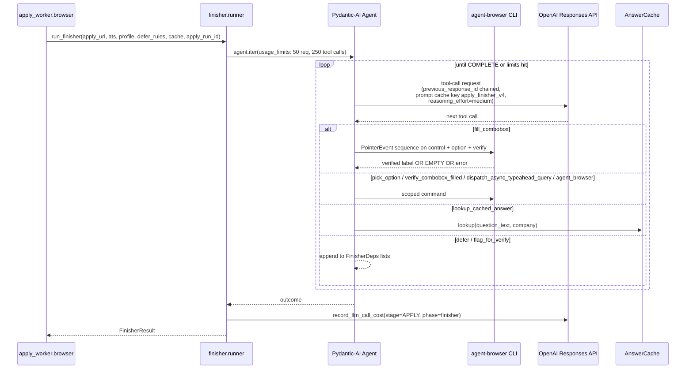
```mermaid
sequenceDiagram
  participant Worker as apply_worker.browser
  participant Runner as finisher.runner
  participant Agent as Pydantic-AI Agent
  participant CLI as agent-browser CLI
  participant OAI as OpenAI Responses API
  participant Cache as AnswerCache

  Worker->>Runner: run_finisher(apply_url, ats, profile, defer_rules, cache, apply_run_id)
  Runner->>Agent: agent.iter(usage_limits: 50 req, 250 tool calls)

  loop until COMPLETE or limits hit
    Agent->>OAI: tool-call request<br/>(previous_response_id chained,<br/>prompt cache key apply_finisher_v4,<br/>reasoning_effort=medium)
    OAI-->>Agent: next tool call
    alt fill_combobox
      Agent->>CLI: PointerEvent sequence on control + option + verify
      CLI-->>Agent: verified label OR EMPTY OR error
    else pick_option / verify_combobox_filled / dispatch_async_typeahead_query / agent_browser
      Agent->>CLI: scoped command
    else lookup_cached_answer
      Agent->>Cache: lookup(question_text, company)
    else defer / flag_for_verify
      Agent-->>Agent: append to FinisherDeps lists
    end
  end

  Agent-->>Runner: outcome
  Runner->>OAI: record_llm_call_cost(stage=APPLY, phase=finisher)
  Runner-->>Worker: FinisherResult
```

Token discipline: `openai_previous_response_id="auto"` chains via server-side context, `openai_prompt_cache_key` caches the prompt prefix, `parallel_tool_calls=False` prevents stale-DOM mistakes.

### Human review

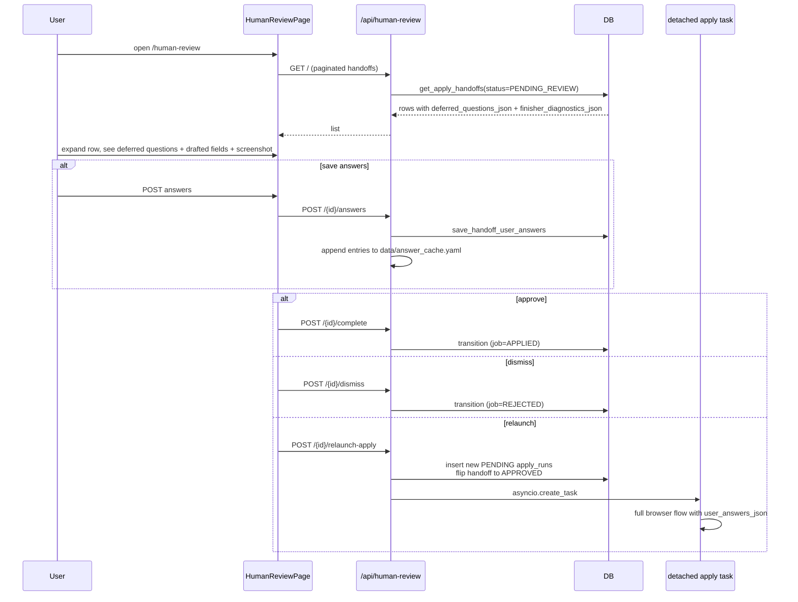
```mermaid
sequenceDiagram
  participant User
  participant UI as HumanReviewPage
  participant API as /api/human-review
  participant DB
  participant Det as detached apply task

  User->>UI: open /human-review
  UI->>API: GET / (paginated handoffs)
  API->>DB: get_apply_handoffs(status=PENDING_REVIEW)
  DB-->>API: rows with deferred_questions_json + finisher_diagnostics_json
  API-->>UI: list

  User->>UI: expand row, see deferred questions + drafted fields + screenshot
  alt save answers
    User->>UI: POST answers
    UI->>API: POST /{id}/answers
    API->>DB: save_handoff_user_answers
    API->>API: append entries to data/answer_cache.yaml
  end

  alt approve
    UI->>API: POST /{id}/complete
    API->>DB: transition (job=APPLIED)
  else dismiss
    UI->>API: POST /{id}/dismiss
    API->>DB: transition (job=REJECTED)
  else relaunch
    UI->>API: POST /{id}/relaunch-apply
    API->>DB: insert new PENDING apply_runs<br/>flip handoff to APPROVED
    API->>Det: asyncio.create_task
    Det->>Det: full browser flow with user_answers_json
  end
```

### Onboarding wizard

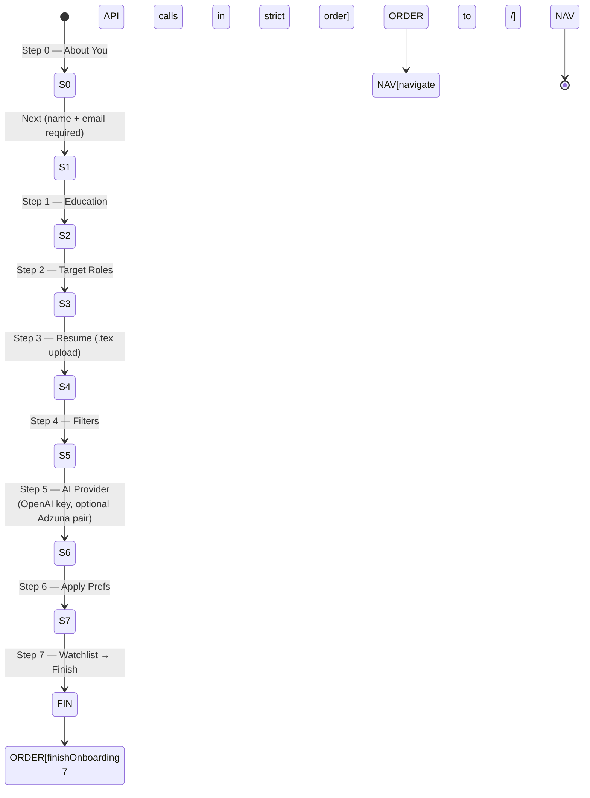
```mermaid
stateDiagram-v2
  [*] --> S0: Step 0 — About You
  S0 --> S1: Next (name + email required)
  S1 --> S2: Step 1 — Education
  S2 --> S3: Step 2 — Target Roles
  S3 --> S4: Step 3 — Resume (.tex upload)
  S4 --> S5: Step 4 — Filters
  S5 --> S6: Step 5 — AI Provider<br/>(OpenAI key, optional Adzuna pair)
  S6 --> S7: Step 6 — Apply Prefs
  S7 --> FIN: Step 7 — Watchlist → Finish
  FIN --> ORDER[finishOnboarding<br/>7 API calls in strict order]
  ORDER --> NAV[navigate to /]
  NAV --> [*]
```

All wizard state is React `useState` — reload = restart. The final `await refetchOnboardingStatus` before `navigate("/")` is load-bearing — without it `OnboardingGate` sees stale data and bounces the user back to `/onboarding`.

---

## 7. Dependencies

### Python (`pyproject.toml`)

Strict `==` pinning. Runtime highlights:

- **HTTP/API:** fastapi 0.123.10, uvicorn 0.40.0, httpx 0.28.1, aiohttp 3.13.3, curl-cffi 0.15.0
- **DB:** aiosqlite 0.22.1
- **LLM:** openai 2.38.0, instructor 1.15.1, pydantic-ai-slim 1.102.0, litellm 1.82.1
- **Validation:** pydantic 2.12.5, pyyaml 6.0.3
- **Resume pipeline:** playwright 1.60.0, pypdf 4.3.1, texsoup 0.3.3, markdownify 1.2.2
- **Fetchers:** python-jobspy 1.1.82, rapidfuzz 3.13.0
- **Utilities:** loguru 0.7.3, python-dotenv 1.2.1, cryptography 46.0.6 (declared but unused for storage)

`anthropic`, `google-genai`, `google-adk` are declared but currently not used at runtime — reserved for future provider work.

Dev: pytest 9.0.2, pytest-asyncio 1.3.0, hypothesis 6.135.4, mutmut 2.5.1 (scoped to `src/fetchers/linkedin_fetcher.py`), mypy 1.19.1 (strict on `api/`, `src/`, `scripts/`, `tests/`), pip-audit 2.10.0.

### Node (`dashboard/package.json`)

react 19, react-router-dom 7, @tanstack/react-query 5.90, @base-ui-components/react 1.3, tailwindcss 4.2, recharts 3.8, @monaco-editor/react 4.7, lucide-react 1.7, vite 8, typescript 5.9, vitest 4.1.

### Host binaries

- **tectonic** — vendored multi-arch musl tarballs at `deploy/tectonic/tectonic-{amd64,arm64}.tar.gz`. Refreshed via `deploy/tectonic/fetch.sh`. CTAN cache survives in the `tectonic-cache` Docker volume.
- **agent-browser** — vendored Rust CDP CLI at `deploy/agent-browser/agent-browser-{amd64,arm64}`. glibc 2.36+ required (python:3.11-slim-bookworm provides it).
- **Host Chrome** — user-started with `--remote-debugging-port=9222`. Not in-container.
- **Simplify Copilot v2.4.x** — browser extension on host Chrome.

### Docker path

Single service via `docker compose up -d`. Two-stage build (`dashboard-build` → `app`), multi-arch via BuildKit `TARGETARCH`. Volumes: `app-data`, `app-logs`, `tectonic-cache` (named) + `./config:/app/config` (bind). Healthcheck on `/api/health` with 60s start period. Operator wrappers: `scripts/docker/{start,stop,restart}_stack.sh`.

### Linux systemd path

Six unit files under `deploy/`: discovery timer + service (oneshot every 30 minutes), agent/tailor/apply worker services (long-running loops), apply-chrome service (hosts Chrome with debug port), templated alert service (ntfy on `OnFailure=`). Hardening defaults across all units (`NoNewPrivileges`, `PrivateTmp`, `ProtectSystem=strict`, `ProtectHome=true`, explicit `ReadWritePaths`). Memory + CPU + Tasks caps on workers. All log to journald.

### Topology

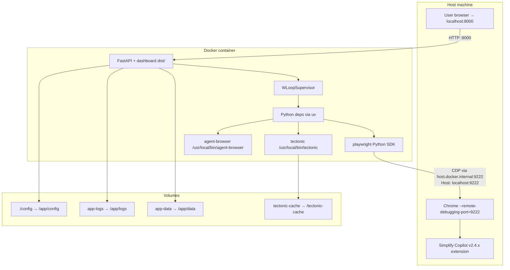
```mermaid
graph TB
  subgraph Host[Host machine]
    HCHROME[Chrome --remote-debugging-port=9222]
    SIMPLIFY[Simplify Copilot v2.4.x extension]
    HCHROME --> SIMPLIFY
    USER[User browser → localhost:8000]
  end

  subgraph Container[Docker container]
    API[FastAPI + dashboard dist/]
    SUP[WLoopSupervisor]
    PYDEPS[Python deps via uv]
    TECT[tectonic /usr/local/bin/tectonic]
    AGENTBR[agent-browser /usr/local/bin/agent-browser]
    PLAYWRIGHT[playwright Python SDK]
  end

  subgraph Volumes
    APPDATA[app-data → /app/data]
    APPLOGS[app-logs → /app/logs]
    TECTCACHE[tectonic-cache → /tectonic-cache]
    CFGBIND[./config → /app/config]
  end

  USER -->|HTTP :8000| API
  API --> SUP
  SUP --> PYDEPS
  PYDEPS --> PLAYWRIGHT
  PLAYWRIGHT -->|CDP via host.docker.internal:9222<br/>Host: localhost:9222| HCHROME
  PYDEPS --> TECT
  PYDEPS --> AGENTBR
  API --> APPDATA
  API --> APPLOGS
  TECT --> TECTCACHE
  API --> CFGBIND
```

---

## 8. Review notes

### Consistency check

- **`README.md`** still lists multi-provider support; reality is OpenAI-only. Needs a refresh.
- **`AGENTS.md`** has accurate scope but doesn't enumerate finisher tools or Tier-1/2/3 semantics.
- **Docker compose is single-service.** Older docs referencing `--profile tailor` / `--profile full` are stale.
- **Provider abstraction is half-implemented.** Tailor + reviewer skip the abstraction entirely.
- **Legacy `*_yaml_path` columns** written as `""` post-Phase-3 but still in schema.

### Architectural risks

1. **Apply-finisher form variability.** Hardened against specific real forms; different companies on the same ATS may have radically different custom-question sets. Worst case is `NEEDS_REVIEW` rather than a wrong submit, but coverage isn't systematic.
2. **React-Select / agent-browser version fragility.** PointerEvent workaround targets specific versions. Pin the vendored binary; add a smoke test.
3. **Image-baked dashboard.** Live UI updates need `docker cp` or rebuild. Acceptable for v1.
4. **Docker Desktop vpnkit gateway IP.** Documented; threat model unchanged but the security posture is worth surfacing in `SECURITY.md`.
5. **LaTeX compile silent failures.** First-tailor CTAN-fetch timeouts can produce truncated PDFs. Surface tectonic stderr verbatim on failure.
6. **Single-writer SQLite under load.** Fine for single-user local; horizontal scale would need PostgreSQL.

### Operational risks

- **Host Chrome major drift** — document tested range; warn on out-of-range.
- **Simplify Copilot drift** — v2.4.x hardcoded; document version requirement.
- **Network-dependent fetchers** — silent zero-result fetchers won't trigger failure paths. Add per-fetcher anomaly check.
- **curl-cffi quirks** — log version at startup so version-correlated bugs are debuggable.

### Security

- Auto-submit gate is conservative by default (`tier2_confidence_threshold=1.0`).
- `SAFE_MODE=true` is the global kill switch — should be documented in `.env.example`.
- Finisher scope enforced at runtime, not at the router. Tightening that would clarify the contract.
- API keys plaintext in `.env`. Single-user local model. Production needs a secrets manager.
- Resume download endpoint is unauthenticated. Single-user local; operators on shared LANs should layer auth.

### In-flight uncommitted work (snapshot)

`resume_mode=base` + `apply_after=true` + `NotTailoredModal` wiring, including `src/agents/resume_tailor/base_compile.py` (content-hash-cached base resume compile), `tailor_runs.apply_after_completion`, the synthetic-rows enqueue path on `apply_runs`, and the dashboard `NotTailoredModal`. Plus `config/defer_rules.yaml` narrowed to sponsor + salary as Tier 3 only.

### Top risks ranked (impact × probability)

1. Greenhouse form variability (high × medium)
2. Finisher model availability / price drift (high × medium)
3. Simplify Copilot version drift (medium × medium)
4. React-Select / agent-browser version interaction (medium × medium)
5. CTAN cache stale / LaTeX silent failures (medium × low)

### Recommended follow-up order

**Tier 1 — finish in-flight work**
1. Land the `resume_mode=base` + `apply_after` + `NotTailoredModal` flow on main with its contract tests.
2. README refresh: drop multi-provider claim; document single-provider scope honestly.
3. Add `SAFE_MODE` to `.env.example` with explanation.

**Tier 2 — close the test gap**
4. Add the missing dashboard test suites.
5. End-to-end integration test for `apply_after=true` through BackgroundTask + detached apply task chain.
6. CTAN-timeout integration test for `base_compile.py`.

**Tier 3 — operational hardening**
7. Dry-run smoke against 5+ real Greenhouse organizations.
8. Document Chrome and Simplify version expectations; startup warning when out of range.
9. Tighten apply-router unsupported-ATS handling.

**Tier 4 — future scope**
10. Multi-provider BYOK across tailor + reviewer + finisher.
11. Drop the legacy `*_yaml_path` columns via clean migration.
12. Local-dev mode that proxies the dashboard via Vite to remove the image-baked friction.

---

## 9. What this is and why

The one-line pitch: crawl job boards, decide which are worth pursuing, write a tailored resume per posting, drive the user's real Chrome to fill the application form — all on the user's own machine, all under a binary gate that refuses to auto-submit anything the user hasn't implicitly approved.

### Why the design landed where it did

- **The submit click is the riskiest action.** Wrong resume, wrong work-auth answer, wrong sponsorship status — all visible to the recruiter forever. Bugs in an auto-applier are bugs visible to every company the user might want to work for. So: a strict binary gate, conservative defaults, human-review queue with screenshots/DOM snapshots, and `SAFE_MODE` as a global kill switch.
- **Forms vary.** Greenhouse, Ashby, Workday, iCIMS, Lever, Taleo, SmartRecruiters, and a long tail of one-off career pages all have different DOM structures, question wording, consent checkboxes. The autonomous apply path is locked to Greenhouse and Ashby; everything else lands `NEEDS_REVIEW` for human review.
- **The interesting judgment is per-posting.** Per-user context (profile, preferences, hard filters, education status, work auth, salary expectations) feeds the gate, tailor, and finisher from the same canonical YAML.
- **Single FastAPI process** — earlier iterations had separate worker containers. Painful deployment and slow autonomous toggle. Collapsing into one process with a `WLoopSupervisor` that reads modes on every cycle is much better operationally.
- **Host Chrome over CDP** — in-container Chromium would add ~400MB, lose the user's Simplify extension, and route through Docker Desktop's vpnkit NAT which trips rate-limiters. Driving the user's real Chrome instead is more reliable.
- **`.tex` source-of-truth** — YAML-derived resumes lost too much template heterogeneity and broke on duplicate bullet bodies. Byte-offset patches into the user's actual LaTeX are robust to template variety; the patcher never confuses identical bullets because offsets disambiguate.
- **Pydantic-AI agent with 8 narrow tools** — driving a form is a sequence of dozens of small interactions, each mutating state the next reads. A single big plan is stale by the second click. Narrow typed tools make the agent's intent legible and constrain it from string-interpolation mistakes.

### Lessons baked into the code

A handful of details that look like over-engineering until you understand the failure they prevent:

- Random claim tokens + lease expiry on every PENDING row — without them, crashes leak slots forever.
- Soft-deletes free the per-job slot — without them, "delete and retry" can't re-enqueue immediately.
- Resume re-upload after Simplify autofill — Simplify clobbers the file input on click.
- `scan_unresolved_fields` reads `.select__single-value` for React-Select — `el.value` doesn't reflect the picked option.
- PointerEvent sequence on React-Select picks — React listens for `mousedown`, not `click`, to commit selection.
- `Host: localhost:<port>` override on CDP — Chrome 148+ rejects mismatched Host headers.
- `asyncio.gather(..., return_exceptions=True)` on discovery — one stuck Workday tenant otherwise blocks every other family.
- `previous_response_id="auto"` on the finisher — resending full message history every turn would blow the TPM ceiling within ~5 turns.

Each has a corresponding test pinning the behavior; test names are a good entry point for understanding what the codebase has learned the hard way.

### What's broken by design

- Multi-provider BYOK isn't really there. OpenAI only.
- Finisher only fires on Greenhouse and Ashby. Other ATSes drop to NEEDS_REVIEW.
- Dashboard `dist/` is image-baked.
- API keys live plaintext in `.env`.
- Apply runs failing twice land terminally failed; the operator decides whether to requeue.

These are deliberate tradeoffs for the single-user local model. `review_notes.md` ranks them with prioritized follow-ups.
