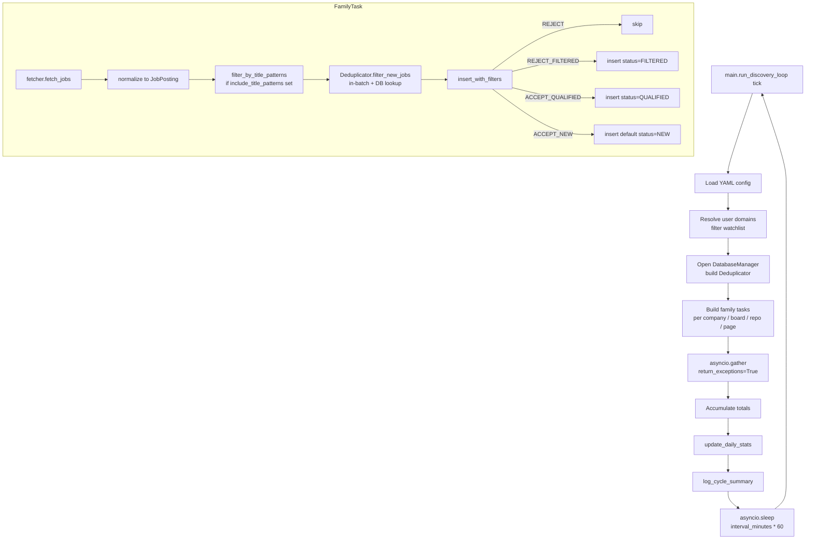
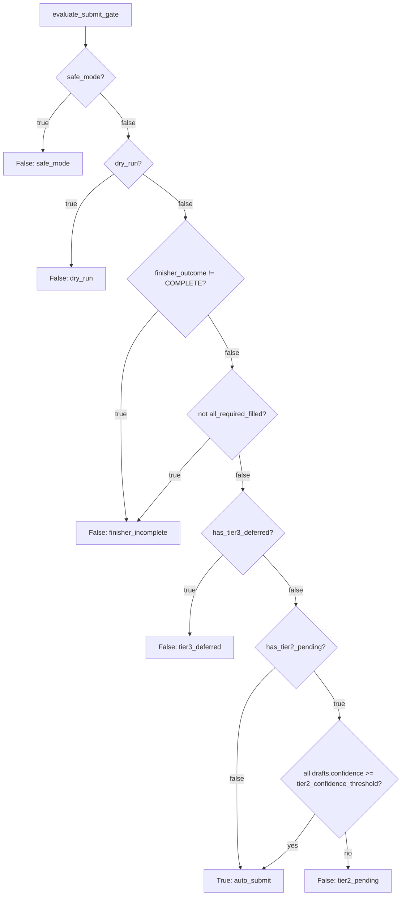
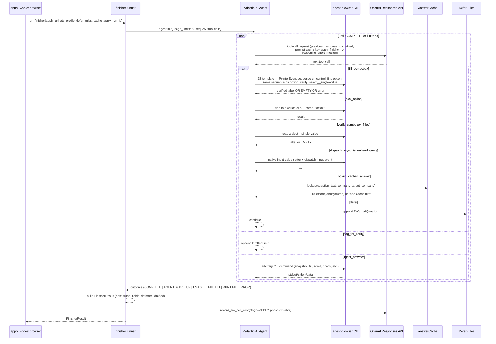
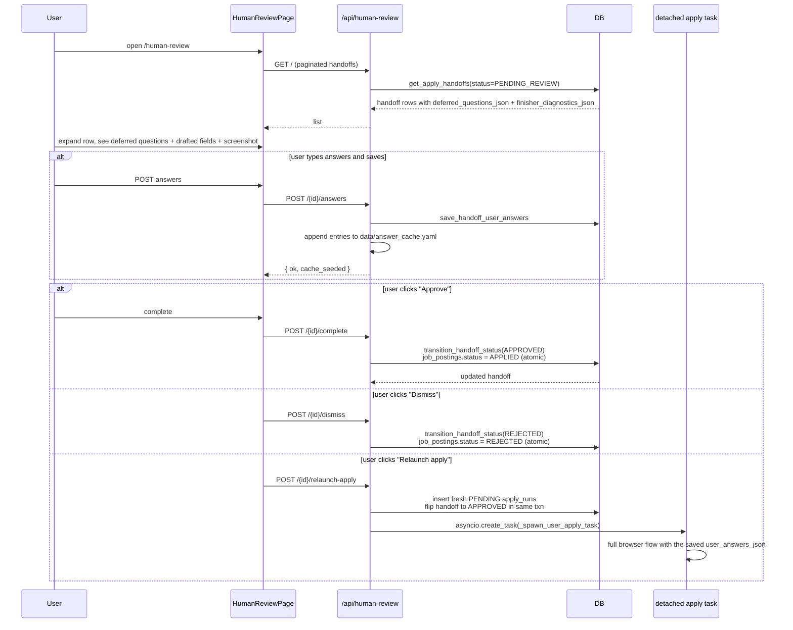

# Workflows

How each runtime workflow actually behaves end-to-end. Six flows:

1. Discovery cycle
2. Gate decision
3. Tailor + review pipeline
4. Apply lifecycle
5. Human-review workflow
6. Onboarding wizard

## 1. Discovery cycle

Always-on (no LLM spend, no autonomous-mode gating). Default interval 30 minutes via `RUN_INTERVAL_MINUTES`.



Notes worth knowing:
- One slow family doesn't block others. `asyncio.gather(..., return_exceptions=True)` catches exceptions per-family; the rollup increments `sources_failed` and the cycle continues (`src/orchestrator/discovery.py:237-256`).
- Workday is special: its CXS anonymous API caps default-sorted results at ~40 per tenant. The orchestrator derives a `searchText` from the candidate's `target_roles` using a priority list (`intern` → `co-op` → `new grad` → `junior` → `early career`), which typically expands results to 200-400 per tenant. If the user's target_roles contain none of those tokens, results stay capped — known limitation (`src/orchestrator/config_loader.py:35-41`, `src/orchestrator/fetchers/workday.py:44-65`).
- The pre-gate filter has both a strict variant and a loose variant. The loose variant relaxes title patterns for EE-friendly Workday tenants (semiconductor, aerospace, manufacturing) where "Process Engineering Intern" or "Hardware Engineering Intern" wouldn't match strict `intern` patterns post-tokenization (`src/orchestrator/fetchers/workday.py:14,43-60`).
- Dedup is exact-hash only. Fuzzy dedup (`src/fetchers/fuzzy_dedup.py`) exists but isn't wired into the main path — it normalizes company names (strip Inc/Ltd/Corp/LLC suffixes) and uses token-overlap for title similarity. Available for fetcher-internal use.

## 2. Gate decision

When `automation.gate_mode ∈ {autonomous, both}`:

```mermaid
sequenceDiagram
  participant Loop as gate loop
  participant DB
  participant Gate as run_gate_with_provider
  participant Prov as OpenAIProvider
  participant OAI as OpenAI API

  Loop->>DB: _is_gate_mode_active()
  alt mode=opt_in
    Note over Loop: skip cycle, sleep
  else mode in {autonomous, both}
    Loop->>DB: check_budget_before_claim(stage=GATE)
    alt budget exceeded
      Note over Loop: skip cycle
    else budget ok
      Loop->>DB: get_jobs_pending_agent_processing(limit=25)
      Note over DB: BEGIN IMMEDIATE<br/>SELECT NEW rows where:<br/>agent_processed_at IS NULL<br/>AND agent_failed_at IS NULL<br/>AND next_retry_at expired<br/>AND claim lease expired<br/>UPDATE claim_token + claimed_at<br/>RETURN claimed rows<br/>COMMIT
      DB-->>Loop: list[job_row]
      loop each job
        Loop->>Gate: run_gate_with_provider(job)
        Gate->>Gate: build_gate_payload<br/>(candidate context cached via lru_cache,<br/>job text wrapped in untrusted_data tags)
        Gate->>Prov: CompletionRequest(temp=0.1, max_tokens=1024)
        Prov->>OAI: openai/gpt-5-mini chat completion
        OAI-->>Prov: CompletionResponse(content, usage, cost)
        Prov-->>Gate: parsed
        Gate-->>Loop: GateRunOutcome(result, response)

        alt decision = APPLY
          Loop->>DB: record_agent_decision(status='QUALIFIED', agent_result=...)
        else decision = SKIP
          Loop->>DB: record_agent_decision(status='FILTERED', agent_result=...)
        end
        Loop->>DB: record_llm_call_cost(stage=GATE, phase='decision')

        alt provider exception
          Loop->>DB: record_agent_retry(next_retry_at = now + backoff)
          alt retry_count >= max_retries
            Loop->>DB: mark_job_agent_terminal_failed(agent_failed_at=now)
            Loop->>Loop: send_ntfy_notification
          end
        end
      end
    end
  end
```

Backoff is exponential with multiplier 3: 300s → 900s → 2700s, capped by `AGENT_MAX_RETRIES=3`. Terminal failure leaves `status=NEW` but sets `agent_failed_at`, which the operator can clear from the failures page (`api/routers/failures.py` → `reset_agent_failure_state`).

The candidate-context prompt is cached via `@lru_cache(maxsize=1)` on `load_candidate_context()`. The settings router clears this cache after profile writes (`api/routers/settings_profile.py:72-76`) so changes take effect on the next gate call.

Pre-LLM filters can short-circuit before this stage entirely:
- Positive keywords in `filters.yaml:soft_filters` route a job to `status=QUALIFIED` at insert time without any LLM call.
- Negative keywords route it to `status=FILTERED`.
- Hard filters (`exclude_*`, `min_salary_usd`, etc.) drop it before insert.

In practice ~70% of postings never reach the gate at all because soft/hard filters catch them first.

## 3. Tailor + review pipeline

When `automation.tailor_mode ∈ {autonomous, both}` (or invoked via `POST /api/jobs/{hash}/tailor`):

```mermaid
sequenceDiagram
  participant Loop as tailor loop
  participant DB
  participant Pipeline as run_tailor_review_pipeline
  participant Loc as locator
  participant Tailor as call_tailor
  participant Patcher
  participant Comp as compiler
  participant Reviewer as call_reviewer

  Loop->>DB: mark_stale_tailor_runs_failed(lease=7200)
  Loop->>DB: claim_next_tailor_job(max_retries=2, lease=7200)
  Note over DB: BEGIN IMMEDIATE<br/>find QUALIFIED job with no active SUCCESS/PENDING/RUNNING<br/>insert PENDING tailor_runs<br/>with claim_token + apply_after_completion<br/>COMMIT
  DB-->>Loop: merged job row + tailor_run_id + claim_token

  Loop->>Pipeline: run_tailor_review_pipeline(...)
  Pipeline->>DB: mark_tailor_running
  Pipeline->>Pipeline: load + validate config/resume.tex<br/>(contract check, no compile)
  Pipeline->>Comp: compile base.pdf
  Pipeline->>Loc: build_bullet_manifest(base_tex)
  Loc-->>Pipeline: BulletManifest

  Pipeline->>Tailor: call_tailor(job + manifest + profile)
  Tailor-->>Pipeline: TailorOutput(rewrite_plan, bullets[], skipped[])

  alt no patches generated
    Pipeline->>DB: insert_pipeline_review_run(verdict=NO_IMPROVEMENT)
    Pipeline->>DB: record_tailor_success(selected = base)
  else patches exist
    Pipeline->>Patcher: resolve patches via manifest, apply by descending byte_start
    Patcher-->>Pipeline: tailored_v1.tex
    Pipeline->>Comp: compile tailored_v1.pdf
    Comp-->>Pipeline: pdf + page_count

    alt v1 > 1 page
      Pipeline->>Tailor: call_trim(overflow message)
      Tailor-->>Pipeline: trim patches
      Pipeline->>Patcher: apply trim patches to v1
      Pipeline->>Comp: recompile v1

      alt still > 1 page
        Pipeline->>DB: insert_pipeline_review_run(verdict=PAGE_FIT_FAILED)
        Pipeline->>DB: record_tailor_success(selected = base)
      end
    end

    Pipeline->>Reviewer: call_reviewer(base vs v1)
    Reviewer-->>Pipeline: ReviewerOutput(verdict, scores, rationale)

    alt verdict = base_better
      Pipeline->>Tailor: call_tailor(retry with feedback_for_retry)
      Tailor-->>Pipeline: retry patches
      Pipeline->>Patcher: apply to base → v2
      Pipeline->>Comp: compile v2
      alt v2 ≤ 1 page
        Pipeline->>Reviewer: call_reviewer(base vs v1 vs v2)
        Reviewer-->>Pipeline: 3-way verdict
      end
    end

    Pipeline->>Pipeline: _select_final_variant (verdict → artifacts)
    Pipeline->>DB: insert_pipeline_review_run(verdict, paths, report_json)
    Pipeline->>DB: record_tailor_success(artifact paths, plan_json_path)
  end

  Pipeline-->>Loop: TailorRunResult

  alt apply_after_completion = true and success
    Loop->>DB: enqueue_apply_run_for_job
    Note over Loop: This spawns asyncio.create_task for the apply browser flow
  end
```

Key decisions baked into the pipeline:

- **Compile-once, patch-many.** The base PDF compiles once at the top of the pipeline. Every tailored variant is built by splicing patches into the original `.tex` bytes (not by edit history), so the patcher can splice in any order as long as offsets don't overlap — and it sorts descending by `byte_start` so earlier offsets stay valid as it mutates the tail (`src/agents/resume_tailor/patcher.py:52-100`).
- **Reviewer sees full `.tex` source**, not PDF extraction. This gives the reviewer access to bold/italic macros for factuality checking and lets it spot LaTeX malformation directly.
- **Factuality is a veto axis** in the reviewer rubric. If `scores_tailored.factuality < scores_base.factuality` due to invented claims, the prompt forces `verdict=base_better` regardless of keyword_fit or specificity scores (`src/agents/resume_tailor/pipeline_schemas.py:118-125`).
- **Trim is a one-shot.** If v1 overflows page 1, the trim LLM gets one chance to remove content. If v1 is still over after trim, the pipeline ships base with `verdict=PAGE_FIT_FAILED` — there's no iterative trim loop (deliberate simplicity tradeoff).
- **Retry produces a v2** only on `verdict=base_better`. The 3-way reviewer prompt forbids `base_better` for 3-way comparisons; it must pick the strongest of the three.
- **The planner artifact** (`tailor_runs.plan_json_path` → `tailored_v1.plan.json`) bundles the full `TailorOutput` plus model name and timestamp, so the dashboard can display "why these edits" without re-running the model.

`run_tailor_review_pipeline` is one async function (~900 lines) — not split into tailor and review workers — because the base PDF is compiled once, the reviewer needs both `.tex` sources side-by-side, and the optional retry happens within the same execution.

### User-triggered path

`POST /api/jobs/{job_hash}/tailor { apply_after: true }`:
1. Validates mode is not `autonomous` (else 409 `MODE_AUTONOMOUS`)
2. Validates budget (else 409 `BUDGET_EXCEEDED`)
3. Validates no active tailor row exists (else 409 `RUN_ALREADY_EXISTS`)
4. `insert_user_triggered_tailor_run(apply_after_completion=apply_after)` returns the merged job + run_id + claim_token
5. Returns 202 with `tailor_run_id`
6. `BackgroundTasks.add_task` runs `_run_pipeline_background` *after* the response is sent, with its own `DatabaseManager`
7. On success, if `apply_after_completion=true`, calls `_enqueue_apply_after_tailor` which itself spawns the apply flow via `asyncio.create_task`

The autonomous loop and the user-triggered BackgroundTask can race for the same PENDING row. Whichever calls `mark_tailor_running` first wins; the other gets `ClaimOwnershipError` on its completion write and skips with a warning.

## 4. Apply lifecycle

The big one. When `automation.apply_mode ∈ {autonomous, both}` and host Chrome is reachable:

```mermaid
flowchart TD
  TICK[apply loop tick] --> MODE{mode in<br/>autonomous|both?}
  MODE -->|opt_in| SLEEP[sleep]
  MODE -->|yes| CHROME{check_chrome_reachable<br/>/json/version<br/>Host: localhost:port}
  CHROME -->|false| SLEEP
  CHROME -->|true| CLAIM[BEGIN IMMEDIATE<br/>claim review SUCCESS rows<br/>insert PENDING apply_runs<br/>with claim_token<br/>COMMIT]
  CLAIM -->|none| SLEEP
  CLAIM -->|got one| GO[apply_to_job]

  GO --> CDP[Playwright connect_over_cdp<br/>Host: localhost:port]
  CDP --> CTX[browser.contexts 0<br/>open new_page]
  CTX --> NAV[goto source_url<br/>wait domcontentloaded]
  NAV --> DETECT[poll for Simplify shadow-root<br/>500ms interval, 45s timeout]

  DETECT --> UP1[upload tailored resume<br/>file input]
  UP1 --> CLICK[click Simplify autofill button<br/>via JS that pierces shadow-root]
  CLICK --> SETTLE[_wait_for_simplify_to_settle<br/>poll filled-field count<br/>stable 2s or 30s max]
  SETTLE --> UP2[re-upload tailored resume<br/>Simplify clobbered it]

  UP2 --> SCAN[scan_unresolved_fields<br/>JS reads value of every field<br/>special: .select__single-value<br/>special: checkbox.checked]
  SCAN --> CONF[compute confidence checks<br/>resume_uploaded, simplify_detected,<br/>all_required_filled, etc.]

  CONF --> ATS{supported_finisher_ats?<br/>greenhouse | ashby}
  ATS -->|no| OUT_NR[outcome = NEEDS_REVIEW<br/>diagnostics.finisher_outcome=SKIPPED]
  ATS -->|yes| FIN[run_finisher<br/>Pydantic-AI loop with 8 tools]

  FIN --> GATE[evaluate_submit_gate<br/>see decision tree below]
  GATE -->|true: auto_submit| SUBMIT[try_submit_and_classify<br/>click submit, wait 5s for URL change]
  GATE -->|false| OUT_NR

  SUBMIT -->|URL changed| OUT_S[outcome = SUBMITTED]
  SUBMIT -->|timeout + toasts| OUT_NR2[outcome = NEEDS_REVIEW<br/>submit_errors = toast_texts]
  SUBMIT -->|timeout no toasts| OUT_F[outcome = FAILED_OTHER<br/>retry path]

  OUT_NR --> PERSIST[record_apply_success]
  OUT_NR2 --> PERSIST
  OUT_S --> PERSIST
  OUT_F --> PERSIST_FAIL[record_apply_failure<br/>next_retry_at scheduled]

  PERSIST --> HANDOFF{outcome == NEEDS_REVIEW?}
  HANDOFF -->|yes| RECH[record_apply_handoff<br/>writes deferred_questions_json<br/>and finisher_diagnostics_json]
  HANDOFF -->|no| LOG[log + record cost]
  RECH --> LOG
```

### Submit gate decision tree

`src/agents/apply_worker/finisher_integration.py:204-253`:



The `tier2_confidence_threshold` is read from `candidate_profile.yaml:apply_prefs.application_defaults.tier2_confidence_threshold` (default 1.0 — require perfect confidence). Users who want looser gates lower this in their profile.

### Apply finisher loop

When the apply worker hands off to the finisher (Greenhouse or Ashby only):



Token discipline matters here. A ~40-turn form would blow the TPM ceiling if each turn resent the full message history. Three configurations make this tractable (`src/agents/apply_finisher/agent.py:76-119`):
1. **`openai_previous_response_id="auto"`** chains via the Responses API's server-side context — each turn sends only the new tool result, not the whole history.
2. **`openai_prompt_cache_key="apply_finisher_v4"`** caches the system prompt + tool catalog on the first turn so subsequent turns pay only the cache-hit price for that prefix.
3. **`parallel_tool_calls=False`** — the DOM mutates after every interaction; any plan with two calls is stale by the second one. The `browser_cli.py:47` per-process lock is a runtime backstop.

The React-Select workaround in `fill_combobox` is verified live: React-Select v4 only commits a pick when the agent dispatches the full native event sequence (`PointerEvent(pointerdown) + MouseEvent(mousedown) + PointerEvent(pointerup) + MouseEvent(mouseup) + click`). Bare clicks leave the form blank with no `.select__single-value` rendered. Option lookup is scoped to the field's own `.select-shell .select__menu` because intl-tel-input pre-renders 244 hidden `[role="option"]` country elements that would otherwise collide with text-based searches (`src/agents/apply_finisher/tools.py:44-127`).

### `resume_mode=base` short-cut

User clicks Apply on an untailored job and picks "No, skip tailoring" in `NotTailoredModal`:

1. `POST /api/jobs/{hash}/apply { resume_mode: "base" }`
2. Server calls `compile_base_resume_pdf(tex_path=config/resume.tex)` — content-hash cached under `data/base_resume/<sha256>.pdf` (`src/agents/resume_tailor/base_compile.py:31-87`)
3. `enqueue_apply_run_with_base_resume` synthesizes a tailor row (`status=SUCCESS, error='skipped_by_user'`) and a review row (`status=SUCCESS, verdict=BASE, fallback_base_pdf_path=<the cached pdf>`) so the apply worker's existing BASE-verdict code paths run unchanged (`src/database/_mixins/apply.py:944-1097`).
4. Detached `asyncio.create_task` runs the apply flow with `resume_source=BASE`.

### `apply_after=true` chain

The other modal path: user picks "Yes, tailor my resume":

1. `POST /api/jobs/{hash}/tailor { apply_after: true }` returns 202 with `tailor_run_id`
2. `tailor_runs.apply_after_completion=true` is persisted in the same row insert
3. BackgroundTask runs the tailor pipeline
4. On `pipeline_succeeded`, `_enqueue_apply_after_tailor` calls `enqueue_apply_run_for_job` which spawns the apply via `asyncio.create_task`

The dashboard sees both paths as one mutation: it does not chain `POST /tailor` → `POST /apply` client-side anymore.

## 5. Human review workflow



The answer-cache seeding closes the loop with the finisher: next time the finisher hits a similarly-worded question, its `lookup_cached_answer` tool returns the reviewer's answer, the LLM uses it, and the gate has a better chance of passing without human intervention. The cache lookup uses RapidFuzz `token_set_ratio >= 85%` and per-company entries beat anonymized at equal scores.

## 6. Onboarding wizard

First-visit gating: `OnboardingGate` queries `GET /api/settings/onboarding-status` (`staleTime: 60_000`) which checks two conditions:
- `config/candidate_profile.yaml` exists and has >50 bytes of non-whitespace content
- `config/resume.tex` exists

If either is missing, every authenticated route redirects to `/onboarding`. The dashboard becomes available immediately after the wizard's finish call completes (and refetches the status query).

```mermaid
stateDiagram-v2
  [*] --> S0: Step 0 — About You
  S0 --> S1: Next (name + email required)
  S1 --> S2: Step 1 — Education<br/>(each row: school + degree required)
  S2 --> S3: Step 2 — Target Roles<br/>(targetRoles required)
  S3 --> S4: Step 3 — Resume<br/>(.tex upload validates against contract;<br/>422 INVALID_RESUME_TEX surfaces line-numbered errors)
  S4 --> S5: Step 4 — Filters (all optional)
  S5 --> S6: Step 5 — AI Provider<br/>(OpenAI key required;<br/>Adzuna keys: both or neither)
  S6 --> S7: Step 6 — Apply Prefs<br/>(work_auth + sponsorship required, tri-state)
  S7 --> FIN: Step 7 — Watchlist (optional)<br/>Finish
  FIN --> ORDER[finishOnboarding<br/>7 API calls in strict order]
  ORDER --> PROF[POST /api/settings/profile<br/>contact + education + roles + apply_prefs]
  PROF --> KEY[POST /api/settings/provider<br/>OpenAI key]
  KEY --> ADZ{Adzuna both filled?}
  ADZ -->|yes| ADZV[POST /api/settings/api-keys/validate-adzuna<br/>live HTTP probe]
  ADZV --> ADZSAVE[upsertApiKeySetting ADZUNA_APP_ID + APP_KEY]
  ADZSAVE --> FILT
  ADZ -->|no| FILT[PUT /api/settings/filters]
  FILT --> GHB[update sources.yaml github_repos block<br/>SimplifyJobs Internships seeding]
  GHB --> KBOARDS[update sources.yaml keyless boards block]
  KBOARDS --> WATCH[saveWatchlistCompanies<br/>two-layer Greenhouse slug resolve:<br/>1) bundled greenhouse_known_slugs.json<br/>2) multi-pattern API probe]
  WATCH --> WARN{any verified/unverified/<br/>network_error/not_on_greenhouse?}
  WARN -->|yes| BANNERS[show warning banners<br/>auto-redirect in 3.5s]
  WARN -->|no| REFETCH[refetchOnboardingStatus]
  BANNERS --> REFETCH
  REFETCH --> NAV[navigate to /]
  NAV --> [*]

  S0 --> [*]: ProgressIndicator click<br/>jumps to any step<br/>(no validation enforced)
```

Things to know:
- All wizard state lives in React `useState`. Browser refresh = restart. There's no localStorage snapshot.
- Resume upload is `.tex` only. The validator runs against `docs/resume-tex-contract.md` with `run_compile_check=False` so users get fast feedback; the next tailor pipeline run validates again (with compile this time).
- Watchlist resolution writes every company to `sources.yaml` even when verification failed — the user can fix slugs later from Settings. The "not on Greenhouse" outcome is reported as a separate banner so the user knows to use Workday/Taleo/etc. for those companies.
- The final `refetchOnboardingStatus` `await` before `navigate("/")` is load-bearing — without it, `OnboardingGate` would see stale data and bounce the user right back to `/onboarding`.

Each step component is pure (takes a draft + onChange callback) and can be dropped into a Settings page later without modification, which is how re-editing any section from `/settings` works post-onboarding.
